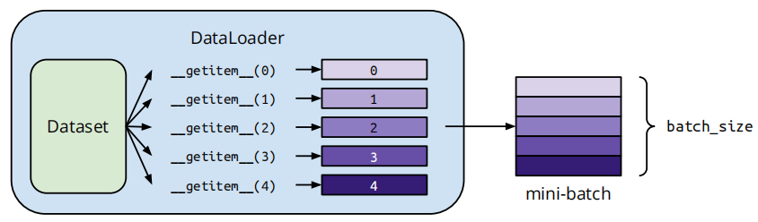

# torch

torch库专注于基础张量操作和自动微分机制

# 一. 核心张量操作

## 创造与转换

类型转换：`tensor.type(dtype)`​方法，不是`type()`​内置函数

比较技巧

```python
# 将y_hat转为和y同类型后比较，否则数据相同类型不同仍为False
cmp = y_hat.type(y.dtype) == y
```

.numpy()和.to\_numpy()区别：

- .numpy()属于PyTorch的`Tensor`​对象方法，共享内存
- .to\_numpy()属于Pandas的`DataFrame`​或`Series`​对象方法，默认不共享内存，可通过copy参数控制

## 形状与内存布局

**连续张量**：张量在内存中为**连续内存**区域**连续排布**，非连续张量只是索引方式变了

**非连续张量**：对张量做了某些操作：**转置（**​ **​`.t()`​** ​ **）** 、**切片**、**permute / transpose**，只改变了张量的“视图”（即访问方式），而没有真正移动内存中的数据

- **​`tensor.is_contiguous()`​** ​：判断是否为连续张量
- **​`tensor.contiguous()`​** ​：把非连续张量转为连续张量

### `.view()`​和`.reshape()`​区别

|特性|​`view()`​|​`reshape()`​|
| ------------------| -----------------------------------| --------------------------------------|
|是否需要连续内存|✅ 必须是连续的张量（contiguous）|✅ 会自动处理非连续张量（自动 copy）|
|是否创建新张量|❌ 返回的是原张量的视图（view）|✅ 可能返回新张量（复制数据）|
|错误处理|⚠ 非连续张量会报错|✅ 自动兼容|
|效率|✅ 更快|⭕ 稍慢（因为可能涉及复制）|

张量**底层内存布局方式（tensor layout）：即张量内部的数据在内存中怎么存放**

|Layout 类型|描述|用途/例子|
| -------------| ----------------------------------------| ------------------------------------|
|​`torch.strided`​|默认布局，行优先，支持切片、转置、广播|常规张量计算，比如卷积、线性层等|
|​`torch.sparse_coo`​|稀疏张量，压缩存储稀疏数据|大量 0 的稀疏矩阵（加速节省内存）|
|​`torch.sparse_csr`​|压缩行存储的稀疏格式|更适合稀疏矩阵乘法（如图神经网络）|
|​`torch._mkldnn`​|针对 MKL-DNN 优化的特殊格式|用于 Intel CPU 的加速|

```python
# torch.strided，内存为连续的一维数组[1, 2, 3, 4]，通过 strides(步长)决定怎么“跳”到下一个元素
a = torch.tensor([[1, 2], [3, 4]])
# a.stride()可能返回 (2, 1)，意思是：行之间隔 2 个元素，列之间隔 1 个元素
```

`tensor.reshape(-1)`​：将张量展平成一维向量

`torch.reshape(tensor, shape)`​和`tensor.reshape(shape)`​：完全等价

(n, )形状

一维张量，有n个元素，无第二个维度

## Random与概率分布

伯努利分布采样函数：

```python
a = torch.randd(3, 3)
torch.bernoulli(a)
```

对张量 `a`​ 中的每个元素 `p`​，以概率 `p`​ 输出 `1`​，以概率 `1-p`​ 输出 `0`​，相当于每个元素都是一次“带权概率的硬币抛掷”

随机种子：​`torch.manual_seed(seed)`​设置全局随机数生成器，影响所有后续的随机操作（除非中途修改了种子）

若使用了numpy或random，也要同步设置

```python
import random
import numpy as np

random.seed(42)
np.random.seed(42)
torch.manual_seed(42)
# 这样整个项目的随机行为都能得到复现
```

`torch.distributions`​

提供各种概率分布的实现

Multinomial 分布: 多项分布是离散分布的一种，用于描述在每个实验中有 ( n ) 次独立试验，每次试验有 ( k ) 个可能的结果的情况。这个分布的输出是一个向量，其中每个元素表示每个可能结果出现的次数

```python
from torch.distributions import Multinomial

probs = torch.tensor([0.2, 0.5, 0.3])	# 定义概率

n = 10  # 每次试验的总次数

multinomial_dist = Multinomial(total_count=n, probs=probs)	# 创建多项分布对象
```

主要参数:

- total\_count: 一个整数，表示每次试验的总次数 n
- probs: 一个形状为 ( (k,) ) 的张量，表示每种结果的概率，这些概率应该是非负的，并且它们的总和应该等于 1
- logits: 可选，使用 logits 而不是概率来表示结果的偏好

方法：

- `.sample()`: 从多项分布中生成样本
- `.log_prob(sample)`: 计算给定样本的对数概率

## 数学运算与数值操作

**原地操作（in-place）** ：

- torch中方法末尾的`_`​表原地操作
- +\=/-=：**优先**调用`INPLACE_ADD`​（原地加法）操作符，对**可变对象**（如列表、字典、集合）：直接修改原对象，无需创建新对象，**不可变对象**（如整数、字符串、元组）`INPLACE_ADD`​实际会创建新对象并重新赋值给变量，总之`+=`​和`-=`​不确定是否原地修改，使用`[:]`​确保原地修改
- [:]：

```python
weight.data[:] -= something 	# 使用[:]完成原地操作，实践中不推荐这么写

# 推荐写法
with torch.no_grad():
    weight -= something
```

‍

`.norm()`​：计算张量的范数，支持多种范数，默认为𝐿2范数

```python
tensor.norm(p='fro', dim=None, keepdim=False, out=None)
```

**​`p`​**: 范数的类型，常见取值：

- `p=2`​：L2范数，默认值，计算欧几里得范数
- `p=1`​：L1范数，计算元素的绝对值之和
- `p=float('inf')`​：L∞范数，计算最大绝对值元素
- `p='fro'`​：Frobenius 范数（适用于矩阵）

**​`dim`​**: 计算沿着某一维度的范数，结果不是标量

**​`keepdim`​**: 是否保持计算后结果的维度

**​`out`​**: 存放结果的张量

`torch.clamp()`​：裁剪，限制张量的数值在指定范围内

```python
torch.clamp(input, min=None, max=None, *, out=None)
# input: 要裁剪的张量
# min: 最小值，低于min则设为min
# max: 最大值，高于max则设为max
# out: 可选，指定输出张量
```

`torch.where(condition, A, B)`​：若condition为True，则取A，否则取B

|函数|类型|功能简介|行为区别|
| ------| ---------| -----------------------------------------| -------------------------------------------|
|​`torch.where(cond, A, B)`​|PyTorch|条件选择：cond为True选A，否则选B|和NumPy一致，**必须**提供 A、B|
|​`np.where(cond, A, B)`​|NumPy|条件选择：cond为True选A，否则选B|A、B 可选：不传A、B时返回索引|
|​`df.where(cond)`​|Pandas|对DataFrame中cond为False的地方替换为NaN|和上面两个不同，是“保留True，替换False”|

### `np.where(cond, A, B)`​ 和 `np.where(cond)`​

两种用法：

- 三参数：跟 PyTorch 一样
- 一参数：返回满足条件的 **索引**

```python
import numpy as np
x = np.array([10, 20, 30])
cond = x > 15
np.where(cond)        # (array([1, 2]),)
np.where(cond, 1, 0)  # array([0, 1, 1])
```

### `pandas.DataFrame.where(cond)`​

- 功能是保留 `cond=True`​ 的位置，其他位置设为 `NaN`​（是“**保留 True**”，和 `torch/np.where`​ 是“**选 True**”的思维方式不同）

```python
import pandas as pd
df = pd.DataFrame({'A': [1, 2, 3]})
cond = df['A'] > 1
df.where(cond)
#     A
# 0  NaN
# 1  2.0
# 2  3.0
```

‍

乘法：

- `torch.matmul()`: 通用矩阵乘法，推荐，支持广播，灵活
- `torch.mm()`: 局限于二维矩阵乘法，不支持广播和批量操作
- `torch.mv()`: 局限于矩阵与向量乘法，不支持广播和批量操作
- `torch.mul()`: 元素级乘法，对应位置的元素相乘

‍

# 二. 神经网络构建（torch.nn）

提供神经网络层、损失函数和模型基类

## 参数管理

- `.parameters()`​：返回所有**可训练参数**（当前模块和子模块中所有参数的扁平**迭代器**），**不按模块层级区分**，通常是 **​`torch.nn.Parameter`​**​ 类型的张量，包括权重、偏置等，用于**优化器传参**， 只包含模型中需要梯度的参数，不能直接保存/加载模型结构/状态，可对特定子模块单独调用 `.parameters()`​，分模块训练需用 `named_parameters()`​，通过字符串 `name`​ 判断参数属于哪个子模块
- `.named_parameters()`​：返回模型中**所有可训练参数**的名字和参数本身的迭代器
- `.named_children()`​：返回模块的**直接**子模块（带名字）
- `.named_modules()`​：返回模型中**所有**子模块及其名称
- `.state_dict()`​：获取所有模型的“状态信息”，返回一个 **字典（**​**​`OrderedDict`​**​ **）** ，键是参数或缓存变量的名字，值是张量，包含所有权重和偏置、有些非训练参数（如 BatchNorm 的 running\_mean 和 running\_var），常用于：
- **保存模型参数：**  `torch.save(model.state_dict(), "model.pth")`​
- **加载模型参数：**  `model.load_state_dict(torch.load("model.pth"))`​

|特性|​`.parameters()`​|​`.state_dict()`​|
| ------------------| ------------------------| -----------------------------------------|
|返回类型|迭代器，元素是`Parameter`​|有序字典，key 是名字，value 是张量|
|包含内容|可训练参数（需要梯度）|所有参数 + 缓存（如 BN 层的均值、方差）|
|用途|通常用于传给优化器|通常用于保存、加载模型状态|
|是否包含名字|❌（除非用`named_parameters()`​）|✅（key 就是参数名）|
|是否包含缓存参数|❌|✅（如`running_mean`​,`running_var`​）|

``$\tilde h_t$当前时间步候选记忆，ℎ𝑡当前时间步最终隐藏状态

获取CPU核心数量：`os.cpu_count()`​

获取GPU核心数量：`torch.cuda.device_count()`​

‍

## 损失函数

- `nn.CrossEntropyLoss()`​：输入必须是未归一化的原始logits（模型最后一层的直接输出），内部集成Softmax和对数计算（稳定性技巧）

  参数`reduction`​：决定如何对**批量（batch）中每个样本的损失值**进行汇总，共有三个选项：

  - `'mean'`​：返回所有样本损失的平均值
  - `'sum'`​：返回所有样本损失的总和
  - `'none'`​：不进行任何聚合，直接返回每个样本的独立损失值（形状为 `[batch_size]`​）
- `nn.BCEWithLogitsLoss()`​：用于二分类任务的损失函数, Binary Cross Entropy with Logits Loss，意为带有 logit 输入的二元交叉熵损失函数

  - Logits：没有经过 Sigmoid 的原始输出分数（通常是任意实数），不是概率
- `nn.MSELoss()`​：

‍

## 模型的行为模式

### **​`net.train()`​** ​ **：训练模式**

- **​`Dropout`​**​：训练时Dropout 会随机 **丢弃** 一部分神经元，防止过拟合
- **​`BatchNorm`​**​：BatchNorm 层使用 **当前批次的统计信息**（即当前批次的均值和方差）进行标准化

### **​`net.eval()`​** ​ **：评估模式/推理模式**

- **​`Dropout`​**​：在评估模式下，Dropout 层会 **不丢弃任何神经元**，即使用 **所有神经元**
- **​`BatchNorm`​**​：在评估模式下，BatchNorm 层会使用 **训练期间计算的全局均值和方差**，而不再依赖当前批次

‍

# 三. 优化器（torch.optim）

参数优化算法实现

**常用优化器**：

- `optim.SGD`​, `optim.Adam`​, `optim.RMSprop`​
- 学习率调度器：`optim.lr_scheduler.StepLR`​

‍

# 四. 自动微分（torch.autograd）

动态计算图与梯度计算

**关键方法**：

- `requires_grad=True`​ 启用梯度追踪
- `.backward()`​ 反向传播
- `torch.no_grad()`​ 禁用梯度

## Variable废弃

早期用于包装一个张量，以启用自动求导功能，现已和Tensor功能合并

## .backward()

根据某个**标量**输出，自动计算标量对所有涉及的参数的梯度

## backward()

计算当前张量的 **梯度**，并将梯度传递回模型的每一层，帮助优化参数。通常在损失函数上调用，更新网络的参数

```python
x = torch.tensor([2.0, 3.0], requires_grad=True)
y = x**2 + 2*x
loss = y.sum()
loss.backward()
print(x.grad)
```

必须在标量张量上调用

### **​`net.freeze()`​** ​ **：手动冻结层**

冻结模型的部分层（即不计算该层的梯度），避免对某些层进行更新，通常用于 **微调**

## 梯度相关上下文管理器和函数

### `torch.no_grad()`​：

用于在特定代码块中**临时**禁用梯度计算，可显著减少显存占用（避免存储中间梯度）并提升计算效率

#### **1. 工作机制**

1. 保存当前梯度状态：`torch.is_grad_enabled()`​
2. 关闭梯度计算：`torch.set_grad_enabled(False)`​
3. 执行代码块
4. 恢复原状态：通过 `finally`​ 恢复原状态

#### **2. 注意事项**

- 支持嵌套，内层上下文不会覆盖外层状态，但梯度计算始终处于关闭状态
- 通常结合 `model.eval()`​ 使用
- 退出上下文后，梯度计算自动恢复，无需手动干预
- 在上下文中，原地修改仍会执行，但不会记录梯度

#### **3. 与其他方法对比**

|**方法**|**作用范围**|**适用场景**|
| ------| ------------| ----------------------------------|
|​`torch.no_grad()`​|代码块|临时禁用梯度（推荐用于局部操作）|
|​`@torch.no_grad()`​|整个函数|装饰器形式，适用于推理函数|
|​`torch.set_grad_enabled(False)`​|全局或局部|需手动恢复状态，灵活性较低|

### `torch.enable_grad()`​

强制启用梯度计算（即使外层有 `no_grad()`​）

### `torch.autograd.grad()`​

直接计算输出对输入的梯度

参数：

- `outputs`​：待求导的目标张量
- `inputs`​：需要计算梯度的输入张量
- `grad_outputs`​：权重向量（用于调整梯度方向）

### `torch.inference_mode()`​

专用于推理场景，提供比no\_grad()更高效的运行时性能，优化了张量的内存管理和计算

Pytorch1.10版本以上优先考虑使用`torch.inference_mode()`​

# 五. **数据处理 (**​**​`torch.utils.data`​**​ **)与保存**

数据集加载与批处理

## **核心类**：

- `.Dataset`: 自定义数据集基类，继承需实现`__getitem__`​和`__len__`​方法

  - 自定义数据集示例：

    ```python
    from torch.utils.data import Dataset
    class CustomDataset(Dataset):
        def __init__(self, data, labels, transform=None):
            self.data = data
            self.labels = labels
            self.transform = transform
    
        def __getitem__(self, index):
            x = self.data[index]
            if self.transform:
                x = self.transform(x)
            return x, self.labels[index]
    
        def __len__(self):
            return len(self.data)
    ```
  - 常用派生类：

    - `TensorDataset`: 直接包装张量数据
    - `IterableDataset`: 流式数据支持
  - 与`torchvision.datasets`​：

    - 区别：

      |**特性**|**torchvision.datasets**|**torch.utils.data.Dataset**(基础类)|
      | --| --------------------------------------------------| ---------------------------------------------------|
      |**定位**|专门用于计算机视觉任务（如图像分类、目标检测）|通用数据加载抽象类，适用于任何领域（NLP、音频等）|
      |**内置数据集**|提供常见视觉数据集（如MNIST、CIFAR、ImageNet等）|无内置数据集，需用户自定义或继承实现|
      |**数据预处理**|通常配合`torchvision.transforms`​进行图像增强和归一化|需用户手动实现预处理逻辑|
      |**功能扩展**|封装了数据下载、解压、标准化等流程|仅提供数据加载的抽象接口（需实现`__getitem__`​和`__len__`​）|
    - 协作互补：`torchvision.datasets`​继承自`torch.utils.data.Dataset`​，可无缝结合

      ```python
      from torch.utils.data import DataLoader
      loader = DataLoader(dataset, batch_size=32, shuffle=True)  # 通用数据加载器
      ```

      - `DataLoader`​ 的参数（如 `batch_size`​, `shuffle`​, `num_workers`​）适用于任何 `Dataset`​ 子类

      - **互补性**：`torchvision`​ 在 `Dataset`​ 基础上添加了视觉专用功能，两者通过 `DataLoader`​ 统一调度
- `.DataLoader`: 批量加载、多线程支持

  

  - 参数：

    - `dataset`​：必须传入继承自`torch.utils.data.Dataset`​的对象，定义数据来源及单个样本的获取方式
    - `batch_size`​：每批次的样本数（默认1），需根据显存调整，过大可能导致溢出，过小影响效率
    - `shuffle`​：是否在每个epoch开始时打乱数据顺序（默认`False`​），训练集通常设为`True`​以增强泛化能力
    - `num_workers`​：子进程数（默认0，即主进程加载），增加可加速数据加载，但需避免超过CPU核心数

‍

```python
from torch.utils.data import DataLoader

train_loader = DataLoader(
    dataset=train_dataset,  # 数据集对象
    batch_size=32,         # 批次大小
    shuffle=True,          # 训练时打乱数据
    num_workers=4,         # 4个子进程加载
    pin_memory=True,       # 加速GPU传输
    drop_last=True         # 丢弃不完整批次
)
```

### 注意事项

- **GPU训练**：启用`pin_memory`​可提升性能。
- **动态数据**：使用`collate_fn`​处理变长数据。
- **资源平衡**：`num_workers`​过多可能导致竞争，建议根据CPU核心数调整。

更多细节可参考PyTorch官方文档。

## 常用方法：

- `.random_split(dataset, [train_size, test_size])`​：划分数据集
- ‍

## 模型的保存和加载：

- 保存：`torch.save(model.state_dict(), 'model.pth')`​，只保存模型的参数，加载时需要先定义模型的架构
- 加载：`model.load_state_dict(torch.load('model.pth'))`​，`torch.load()`​只加载模型参数，需用`.load_state_dict()`​将模型参数加载到模型实例中

‍

# 六. 设备管理与**GPU 加速 (**​**​`torch.cuda`​**​ **)**

- `torch.device`​

  - `device = torch.device('mps' if torch.backends.mps.is_available() else 'cpu')`​
- `torch.to(device)`​：数据迁移

  - `x = x.to('cpu' 或 'mps')`​
- `torch.cuda`​

  - `torch.cuda()`​
  - `torch.cuda.is_available()`​：检测设备
- `torch.backends.mps`​

  - `torch.backends.mps.is_available()`​：是否启用了Metal Performance Shaders（MPS）
  - `torch.backends.mps.is_built()`​：是否构建了MPS支持

## GPU相关

- `!nvdia-smi`​：检查GPU类型

‍
