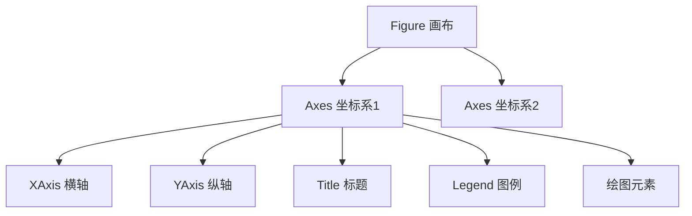
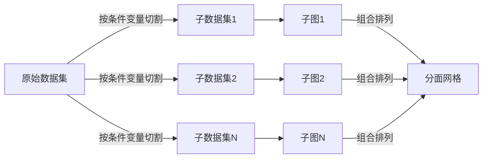
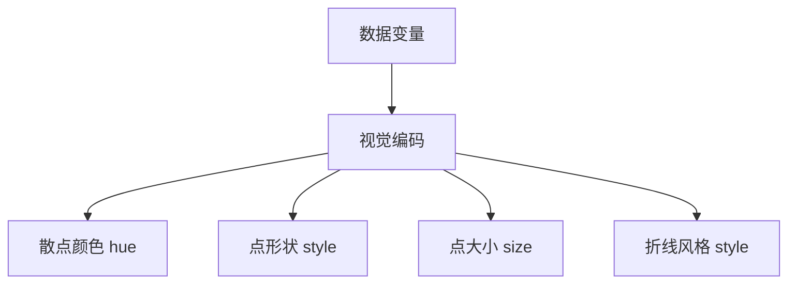
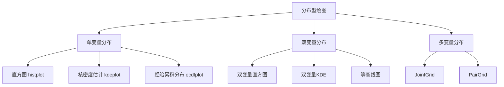
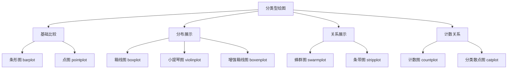
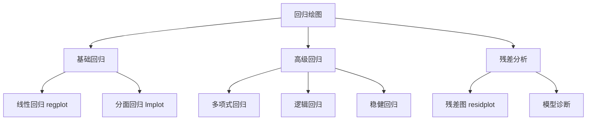
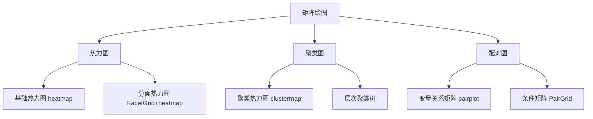
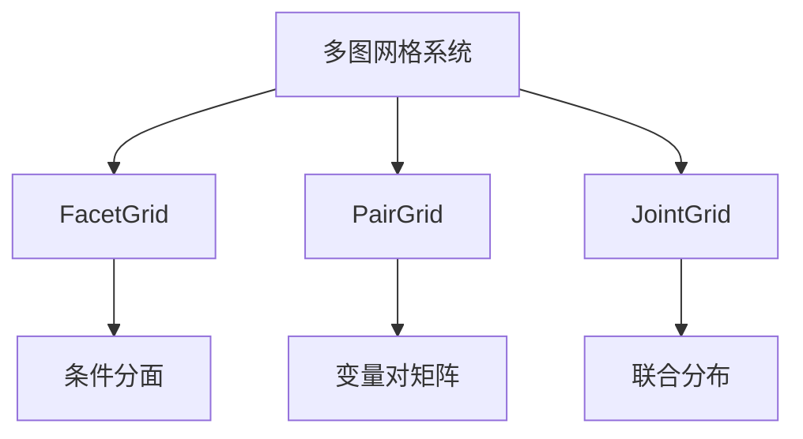

```python
import matplotlib.pyplot as plt
import seaborn as sns
```

# Matplotlib

基础绘图库，高度可定制

**两种接口：**避免混用

- 基于状态：隐式控制，`pyplot`模块提供函数并维持内部状态，自动作用于**当前的**figure和axes，无则自动创建一个，简单快捷，适合在交互式环境中进行快速绘图

    ```python
    plt.plot(...)
    ```

- 面向对象：显式控制，推荐，必须先有对象，更灵活，适用于多子图/需要精细控制的场景

    ```python
    ax1.plot(...)
    ```

**基本步骤：**

```python
# 创建画布和坐标轴
fig, ax = plt.subplots(figsize=(10, 6))

# 折线图
ax.plot(epochs, train_loss, label='Train Loss', color='blue', linestyle='-')

# 散点图
ax.scatter(feature1, feature2, alpha=0.5, c=labels, cmap='viridis')

# 配置项
ax.set_title('Training Progress')
ax.set_xlabel('Epochs')
ax.set_ylabel('Loss Value')
ax.legend()
ax.grid(True, linestyle='--', alpha=0.7)

# 保存图像
plt.savefig('trainint_plot.png', dpi=300, bbox_inches='tight')
```

## 核心容器操作

Matplotlib 采用分层对象模型：



- **Figure**: 顶层容器，代表整个图形窗口或画布
- **Axes**: **坐标系容器**（非坐标轴），是实际绘图区域
- **Axis**: 具体坐标轴对象，控制刻度和范围

### 容器创建

- 显式创建：先创建后添加

    ```python
    # 创建空画布
    fig = plt.figure(figsize=())	# 指定尺寸
    
    # 添加子图坐标系
    ax1 = fig.add_subplot(2, 2, 1)  # 指定2行2列的第1个位置
    ax2 = fig.add_axes()             # 自由定位坐标系
    ```

- 隐式创建：推荐，更灵活，一键创建全部子图，返回元组`(fig, Axes数组)`

    ```python
    fig, axs = plt.subplots()
    ```

    - `nrows`​**​ **和 `ncols`​：子图布局的**行数**和**列数**，索引从 `1`​ 开始，按从左到右、从上到下的**顺序排列**
    - **​`sharex`​**​ **和** **​`sharey`​**​：控制子图间坐标轴的共享，需要对比数据确保坐标轴范围一致时使用
    - **`squeeze`**：控制返回的 Axes 对象维度（**维度可动态变化**）
        - `squeeze=True`​（默认）：自动压缩单行/单列子图为 1D 数组，单子图时返回标量对象
        - `squeeze=False`​：始终返回 2D 数组，便于统一处理多子图
    - **​`facecolor`​**​：通过关键字参数设置子图属性，如背景颜色

- 按序创建：每次调用创建/激活**一个**子图，支持位置索引，语法简单但**管理能力弱**，返回**一个**axes对象

    ```python
    # 创建3×2网格中的第一个子图
    plt.subplot(3, 2, 1)  # 参数：行数、列数、位置索引
    plt.plot(x, y)
    
    # 在同一个Figure中创建下一个子图
    plt.subplot(3, 2, 2)  # 第二个位置
    plt.scatter(a, b)
    ```

- 删除子图：`fig.delaxes(ax[0])`删除指定子图

### 容器导航

- 获取容器：

    ```python
    # 当前对象
    current_fig = plt.gcf()  # 获取当前Figure
    current_ax = plt.gca()   # 获取当前Axes
    
    # 所有对象
    all_figures = plt.get_fignums()     # 所有图形窗口ID
    fig_obj = plt.figure(1)             # 通过ID获取Figure
    all_axes = fig_obj.axes()       # 画布中所有Axes
    ```

- 遍历容器：

    ```python
    # 遍历子图
    fig, axs = plt.subplots(2, 2)
    for ax in axs.flat:
        操作...
        
    # fig的属性
    axs = fig.axes
    ```

    - `ax.flat`：推荐，返回一个迭代器，可按行优先顺序**惰性**遍历所有元素，不会创建新数组，只提供遍历接口

    - `ax.flatten()`：返回一个按行优先展开的一维数组（副本）

- 访问容器：

    ```python
    # Axes内部组件
    x_axis = ax.xaxis        # XAxis对象
    y_axis = ax.yaxis        # YAxis对象
    title_obj = ax.title     # 标题文本对象
    fig = ax.figure		# axes所属画布
    
    spines = ax.spines  # 边界线字典 {'top','bottom','left','right'}
    spines['top'].set_visible(False)  # 隐藏顶部边界
    
    # 其他信息
    print(f"坐标系位置:  {ax.get_position()}")  # 返回Bbox对象
    print(f"坐标系宽度: 	{ax.bbox.width:.2f}英寸, "
          f"坐标系高度: 	{ax.bbox.height:.2f}英寸")
    print(ax.bbox_inches)	# 坐标系实际尺寸
    ```

### 容器生命周期

- 删除/清空容器：

    ```python
    ax.clear()  # 删除坐标系图形内容，保留框架
    axes.cla()  # 仅清除图形元素 
    fig.clf()   # 清除画布所有内容（重置为空白画布）
    
    fig.delaxes(ax2)	# 删除指定坐标系
    plt.delaxes()	# 删除当前坐标系
    
    del fig        # 删除对象引用
    ```

    - `axes.cla()`：仅清除图形元素，保留坐标轴、标签、标题、刻度、图例，用于更新数据
    - `axes.clear()`：清除所有内容，包括配置，用于完全重置

- 关系变更：

    ```python
    # 坐标系迁移
    new_fig = plt.figure()
    ax = fig.axes[0]  # 获取原画布上的Axes
    new_ax = new_fig.add_axes(ax.get_position())  # 复制位置到新画布
    
    # 坐标系克隆
    from copy import deepcopy
    ax_clone = deepcopy(ax)  # 深度复制坐标系
    ```

## 绘图函数

### 基础图表

- 折线图：

    ```python
    ax.plot(
        x, y, 
        linestyle='--', # 线型 ('-'实线, '--'虚线, '-.', ':')
        linewidth=2, 	# 线宽
        marker='o',     # 数据点标记，''无，'o'圆形，'s'方形，'^'三角
        markersize=8	# 标记大小
        color='blue', 	
        label='Trend'	# 图例标签
    )
    ```

- 阶梯图：离散数据

    ```python
    ax.step(
        x, y, 
        where='mid',  # 台阶位置: 'pre', 'post', 'mid'
        color='green'
    )
    ```

- 散点图：

    ```python
    # 基本散点图
    ax.scatter(
        x, y, 
        s=50,          	# 点大小（标量或数组）
        c=values,      	# 点颜色（标量或数组）
        cmap='viridis', 	# 颜色映射
        alpha=0.8,     	# 透明度
        edgecolors='black'  # 边界颜色
    )
    
    # 气泡图（尺寸映射）
    sizes = np.random.uniform(50, 500, len(x))
    ax.scatter(
        x, y, 
        s=sizes, 
        c=z, 
        cmap='coolwarm'
    )
    ```

- 柱状图：

    ```python
    # 垂直柱状图
    ax.bar(
        categories, values, # 类别和柱高度
        width=0.8,        # 柱宽
        color='skyblue', 
        edgecolor='black',
        label='Revenue',
        align='center'	# 对齐方式
    )
    
    # 水平柱状图
    ax.barh(
        categories, values, 
        height=0.6, 	# 柱宽
        color='salmon'
    )
    
    # 分组柱状图
    width = 0.35
    x = np.arange(len(categories))
    ax.bar(x - width/2, values1, width, label='Group 1')
    ax.bar(x + width/2, values2, width, label='Group 2')
    ```

- 饼图：

    ```python
    ax.pie(
        sizes, 
        labels=['A', 'B', 'C'], 
        autopct='%1.1f%%', 	# 百分比格式
        startangle=90,		# 起始角度
        explode=(0, 0.1, 0), # 突出某部分
        shadow=True			# 阴影效果
    )
    ```

### 统计分布图表

- 直方图：

    ```python
    ax.hist(
        data, 			# 一维数组/列表，需提前处理缺失值
        bins=30, 
        range=(-3, 3),		# 限制数据范围，超出范围则忽略
        density=True,     # 是否归一化，显示概率密度，总面积为1，默认False显示频数
        color='steelblue',
        edgecolor='steelblue',
        alpha=0.7,			# 可见度，0为透明，1为不透明
        histtype='stepfilled', 
        label='Normal Distribution')
    ```

    - `bins`：箱数，默认10，支持多种形式
        - 整数：表示等宽区间数量（如 `bins=20`​ 分为 20 个区间）
        - 序列：自定义区间边界（如 `bins=np.arange(0, 100, 5)`​ 每 5 个单位划分一个区间）
        - `'auto'`：自动优化区间数量
    - `histtpye`：样式
        - `'bar'`​：普通条形直方图（默认）
        - `'step'`​：仅绘制阶梯状边框
        - `'stepfilled'`​：填充阶梯状区域
        - `'barstacked'`​：堆叠式直方图（需配合 `stacked=True`​）
    - `orientation`​​：调整直方图方向
        - `'vertical'`​：垂直方向（默认）
        - `'horizontal'`​：水平方向

    - `weights`​​：为数据点设置权重，用于绘制加权频数或概率
    - `cumulative`​：`True`​则绘制累积直方图，显示累计频数或概率
    - `align`​：
        - `'mid'`​：区间中心对齐（默认）
        - `'left'`​ 或 `'right'`​：区间左/右边界对齐
    - `rwidth`​​：控制柱子的宽度比例（相对于区间宽度），为(0, 1)间浮点数

- 箱线图：

    ```python
    ax.boxplot([data1, data2], 
               vert=True,			# 垂直/水平
               positions=[1, 2], 	# x位置
               widths=0.6,			# 箱体宽度
               showmeans=True,		# 显示均值
               showfliers=False, 	# 显示异常值
               notch=True,        	# 显示置信区间
               patch_artist=True) 	# 填充颜色
    ```

- 小提琴图（分布密度）：

    ```python
    ax.violinplot([data1, data2],
                  positions=[0, 1],
                  showmeans=True)  # 显示均值
    ```

- 误差图：

    ```python
    ax.errorbar(
        x, y, yerr=error,	# Y误差值
        fmt='o',			# 点标记格式
        capsize=5			# 误差条末端线长度
    )
    ```

### 高级图

- 二维图像：`imshow()`将二维图像数据绘制到当前axes，但**不会**立即显示该图像，必须调用 `plt.show()` 来实际渲染并显示图形

    ```python
    # 在指定ax显示图像
    im = ax.imshow(
        data,				# 二维/三维数组
        cmap='viridis',     # 颜色映射
        interpolation='nearest',  # 插值方法，控制平滑度，'bilinear'、'none'
        origin='upper',     # 原点位置
        vmin=0.2,           # 颜色最小值
        vmax=0.8,           # 颜色最大值
        aspect='auto',		# 图像高宽比，'equal'保持原始比例，'auto'自动调整
        alpha=0.8,
        extent=(0, 10, 0, 5),	# 坐标系扩展[xmin, xmax, ymin, ymax]
        filternorm=True, 	# 滤镜标准化
        filterrad=4.0,		# 滤镜半径
        rasterized=True		# 启用光栅化
    )
    
    # 添加颜色条并绑定到特定ax
    cbar = fig.colorbar(
        im,                 # 必须传递Image对象
        ax=ax,              # 指定关联的坐标轴
        orientation='horizontal',  # 水平方向
        fraction=0.05,       # 颜色条占坐标轴的比例
        pad=0.1             # 与坐标轴的间距
    )
    ```

- 热力图：

    ```python
    # 推荐用.imshow()方法实现
    im = ax.imshow(data, 
                   cmap='RdYlGn', 	# 红黄绿渐变
                   aspect='auto', 
                   interpolation='bilinear') 
    fig.colorbar(im, ax=ax)  # 添加颜色条
    ```

    :warning: 注意：热力图处理二维数据，常规图标处理一维/离散数据，`.imshow()`是专为二维数据设计的图像渲染器，可高效处理矩阵结构

- 矢量场图/箭头图：

    ```python
    ax.quiver(x, y, u, v,  	# 位置(x,y)和方向(u,v)
              scale=50,     # 箭头缩放
              width=0.005,	# 箭杆宽度
              color='red')
    ```

- 面积图：

    ```python
    # 基础面积图（单变量）
    ax.fill_between(x, y_low, y_high,		# X轴和两条曲线 
                    color='skyblue', 	
                    alpha=0.4, 		
                    hatch='/',		# 填充图案
                    interpolate=True, 
                    where=(y_low < high))		# 填充条件
    
    # 堆叠面积图（多变量）
    ax.stackplot(
        x, y1, y2, y3,
        labels=["Sine", "Cosine", "Linear"],
        colors=["#FF9999", "#66B2FF", "#99FF99"],
        alpha=0.7
    )
    # 添加基线
    ax.axhline(0, color="black", linestyle="--", alpha=0.3)
    ```

- 六边形箱图：

    ```python
    ax.hexbin(x, y, 
              gridsize=30, 	# 网格密度
              cmap='inferno')
    ```

### 绘图技巧

- 嵌套图表：

    ```python
    # 主图
    ax_main = fig.add_axes([0.1, 0.1, 0.6, 0.8])
    ax_main.plot(x, y)
    
    # 右上角小图
    ax_inset = fig.add_axes([0.7, 0.7, 0.25, 0.25])
    ax_inset.plot(x_detail, y_detail, color='firebrick')
    ```

- 多数据层叠加：

    ```python
    ax.scatter(x1, y1, color='blue')	# 多散点图时可用label参数控制分组
    ax.plot(x2, y2, color='red', linewidth=2)
    ax.bar(x3, height=y3, color='green', alpha=0.5)
    ```

- 多子图：

    ```python
    fig, axs = plt.subplots(2, 2)
    
    axs[0,0].hist(data1, bins=20)
    axs[0,1].scatter(data_x, data_y)
    axs[1,0].boxplot([dataA, dataB])
    axs[1,1].pie([35,25,40], labels=['A','B','C'])
    ```

### pandas接口

绘图两种接口：

- **Matplotlib**原生方法：`ax.hist(...)`，优先使用，更稳定，可复用
    - 完全控制所有参数（颜色/透明度/边框等）
    - 返回图数据，如直方图的统计结果元组（频数/箱子边界）
    - 不依赖 pandas
- **Pandas**绘图方法：`df.plot(kind='hist'...)`
    - 本质是高级语法糖，最终调用matplotlib底层函数
    - 语法简洁，自动适配数据标签
    - 定制化能力弱，返回`Axes`对象，而非图数据

#### 智能分图

`df.plot(subplots=True)`，自动识别df列创建并绑定子图，自动处理多行多列布局，自动设置`sharex`/`sharey`，返回`Axes`对象数组

matplotlib均需手动配置：

```python
# 手动实现 subplots=True
fig, axes = plt.subplots(
    nrows=len(df.columns),  # 自动确定行数=列数
    ncols=1,                # 单列布局
    figsize=(8, 10),
    sharex=True             # 统一x轴
)

# 遍历列和坐标轴，绑定绘制
for col, ax in zip(df.columns, axes):
    ax.hist(df[col], bins=20, alpha=0.7)
    ax.set_title(f'Column: {col}', fontsize=10)
    
plt.tight_layout()  # 自动调整间距
```

使用技巧：Pandas自动化布局，返回值用Matplotlib精细控制

```python
axes = df.plot(kind='hist', subplots=True, figsize=(10, 8))

for ax in axes:
    ax.grid(alpha=0.2)
    ax.set_xlabel('Value', fontsize=9)
    ax.tick_params(labelsize=8)
```

#### 链式调用

```python
# 统计计算
df['price']
.pct_change()       # 计算百分比变化
.mul(100)           # 转为百分比值
.hist(
    bins=50, 
    edgecolor='w',
    title='价格波动分布'
    
# 多列对比
df[['AAPL', 'MSFT']].diff().hist(
    bins=30, 
    alpha=0.6, 
    layout=(2, 1),  # 自动创建2个子图
    figsize=(10, 6)
)
    
# 筛选+差分+滚动统计+可视化
df.query('volume > 1000000')
['close']
.diff()
.rolling(20).std()
.plot(kind='area', alpha=0.4)
```

:warning: 注意：

- 方法顺序敏感：先diff后hist
- 需精细控制时建议用原生方法
- 返回值控制：**返回Axes对象**，可继续定制，`ax = df.diff.hist(...)`

#### 双轴

`.plot(secondary_y=['A', 'B'])`，专为双Y轴时间序列分析设计

封装了matplotlib的复杂配置流程，自动匹配折线颜色，智能放置左右标签，自动适配数据范围，自动对齐刻度线

返回主次坐标轴元组

```python
ax = df.plot(
    y=['sales'], 
    secondary_y=['discount_rate'],  # 👈 魔术参数
    figsize=(10, 6)
)
```

只能处理双轴，三轴需用原生

处理图例重叠：

```python
# pandas方案（图例分离）
ax = df.plot(secondary_y=['discount'], legend=False)  # 先关自动图例

# 手动构建组合图例
lines = ax.get_lines() + ax.right_ax.get_lines()  # 获取所有线对象
ax.legend(lines, [l.get_label() for l in lines])  # 合并图例
```

## 配置项

### 画布

```python
# 修改尺寸
fig.set_size_inches(10,8)
# 分辨率
fig.set_dpi(150)

# 手动精调布局
fig.subplots_adjust(
    left=0.1,   	# 画布左边界
    right=0.95,  	# 画布右边界
    top=0.9,     	# 顶部边界
    bottom=0.15, 	# 底部边界
    wspace=0.4,  	# 水平子图间距
    hspace=0.3  	# 垂直子图间距
)
    
# 自动调整间距，紧凑布局，推荐
fig.tight_layout(
    pad=3.0, 	# 边界填充
    h_pad=0.5, 	# 水平间距
    w_pad=0.5, 	# 垂直间距
    rect=[0, 0, 1, 0.95]	# 有效区域
)
```

### 文本

```python
# 字体
plt.rcParams['font.sans-serif'] = ['SimHei']

# 全局标题
fig.suptitle(
    "Figure Title", 
    fontsize=16, 
    fontweight='bold', 
    y=0.95
)

# 子图标题
ax.set_title(
    "Title", 
    loc='left', 
    pad=20, 
    color='navy', 
    fontstyle='italic'
)

# 坐标轴标签
ax.set_xlabel(
    "X axis", 
    fontdict={'size': 14, 'color': '#333'}, 
    labelpad=15
)
ax.set_ylabel(
    "Y axis", 
    rotation=0, 
    ha='right'
)

# 刻度标签
ax.set_xticks([0, 1, 2])	# 刻度位置
ax.set_xticklabels(
    ['Low', 'Medium', 'High'], 
    rotation=45, 
    fontdict={'family': 'monospace'}
)

# 添加自定义文字
ax.text(5, 0.5, "Important Note", 
        fontsize=12, 
        transform=ax.transAxes, 	# 使用坐标系比例
        bbox={'facecolor': 'yellow', 'alpha': 0.5, 'pad': 5})	# 文字框

# 标注
ax.annotate("Peak", xy=(3, 1), 
            xytext=(4, 1.5), 
            arrowprops=dict(arrorwstyle="->"))

# 科学计数法
ax.ticklabel_format(
    axis='y', style='sci', 
    scilimits=(0, 0), 
    useMathText=True
)
```

### 线条与标记

#### 线条样式

| 参数             | 值示例                                         | 说明       |
| ---------------- | ---------------------------------------------- | ---------- |
| `linestyle`      | `'-'`实线, `'--'`虚线, `'-.'`, `':'`, `'None'` | 线型风格   |
| `linewidth`      | 0.5, 1, 2, 3.5                                 | 线宽（点） |
| `alpha`          | 0.0 ~ 1.0                                      | 透明度     |
| `solid_capstyle` | `'butt'`, `'round'`, `'projecting'`            | 线段端点   |

#### 标记样式库

```python
marker_dict = {
    'point': '.',      'circle': 'o',     'square': 's',
    'triangle_up': '^','star': '*',      'diamond': 'D',
    'plus': '+',       'x': 'x',         'hexagon': 'h'
}
```

#### 线型快速设置

```python
ax.plot(x, y, 'ro--',   # 红色圆圈 + 虚线
        dashes=(5, 2, 1, 2),  # 自定义虚线: (实线长, 空格长, ...)
        markerfacecolor='white', 
        markeredgewidth=1.5)
```

#### 网格线

```python
ax.grid(True, 
        axis='y',             # 控制方向 ('x','y','both')
        linestyle=':', 
        linewidth=0.8,
        alpha=0.7,
        color='gray',
        which='major')        # 主/次刻度 ('major'/'minor'/both')

# 精细控制次要网格
ax.minorticks_on()
ax.grid(which='minor', alpha=0.2)
```

#### 参考线

- 普通参考线：

    ```python
    # 垂直
    ax.axvline(
        x=0,             # 在x轴的位置
        ymin=0,          # 垂直起点(0-1坐标系)
        ymax=1,          # 垂直终点(0-1坐标系)
        color='k',        
        linestyle='--',   
        linewidth=1.5,   
        alpha=0.8,       
        label='reference' 
    )
    
    # 水平
    ax.axhline(
        y=0,            # 在y轴的位置
        xmin=0,         # 水平起点(0-1坐标系)
        xmax=1          # 水平终点(0-1坐标系)
    )
    ```

- 参考区域：

    ```python
    # 垂直区域
    ax.axvspan(
        xmin,           # x轴起始位置
        xmax,           # x轴结束位置
        ymin=0,         # 垂直起点(0-1)
        ymax=1,         # 垂直终点(0-1)
        alpha=0.3,      # 透明度
        color='yellow', # 填充色
        edgecolor='red' # 边界色
    )
    
    # 水平区域
    ax.axhspan(       
        ymin, ymax, 
        xmin=0, xmax=1
    )
    ```

- 通用参考线：

    ```python
    # 通过两点定义
    ax.axline(
        (x1, y1), (x2, y2), 
        color='purple', 
        linestyle='-.'
    )
    
    # 通过点斜式定义
    ax.axline(
        (x0, y0), slope=m, 
        color='blue', 
        alpha=0.7
    )
    ```

### 颜色系统

#### 命名颜色

```python
ax.plot(x, y, color='royalblue')          # CSS4命名颜色（148种）
ax.scatter(..., c='#ff3399')              # HEX格式
ax.bar(..., color=(0.1, 0.5, 0.8))        # RGB元组（0-1范围）
```

#### 背景颜色

```python
fig.set_facecolor('lightblue')
ax.set_facecolor('whitesmoke')	# 坐标系背景色
```

#### 色彩映射

Colormaps，用于将数据的数值映射到特定的颜色值，以便在图形中可视化数据的变化，常用`'viridis'`、`'plasma'`、`'RdYlBu'`，一般用参数`cmap`控制

`plt.cm`模块：提供了所有可用的 colormap

`plt.cm.RdYlBu`：全名`Red-Yellow-Blue`，表示从红到黄到蓝渐变

```python
cmap_names = ['viridis', 'plasma', 'inferno', 'magma', 'cividis']  # 连续色图
cmap_names += ['PiYG', 'PRGn', 'BrBG', 'PuOr', 'RdGy']  # 发散色图
cmap_names += ['Pastel1', 'Set3', 'tab20']  # 分类色图

# 使用示例
im = ax.imshow(data, cmap='RdBu_r',       # 带后缀'_r'表示反向色图
               vmin=0, vmax=100)           # 值域范围
# 添加颜色条
fig.colorbar(im, ax=ax, orientation='horizontal')
```

### 坐标轴

```python
# 显示轴，三种方式
ax.axis('off')		# off形式可读性更好
ax.axis(False)
ax.set_axis_off()

# 轴范围
ax.set_xlim()
ax.set_ylim()

# 比例调整
ax.set_yscale('log')            # 对数坐标 ('linear'/'log'/'symlog'/'logit')
ax.set_aspect('equal')          # 固定比例（坐标轴等刻度）

# 位置调整
ax.spines['top'].set_visible(False)     # 隐藏上边界
ax.spines['left'].set_position('center') # Y轴居中

# 轴方向反转
ax.invert_xaxis()             # X轴方向反转
ax.set_ylim(10, 0)            # Y轴值域反转

# 刻度旋转
ax.tick_params(axis='y', rotation=45)
```

#### 多轴

```python
# 1.sharex、sharey参数控制
fig, axs = plt.subplots(2, sharex=True) 	# 创建多子图并自动共享x轴

# 2.sharex()方法手动设置
axs[0].sharex(axs[1])      # 后绑定/修改共享，主动轴(axs[0])会同步被动轴(axs[1])的范围

# 3.twinx()和twiny()，创建了新子图而不是新轴，共享一轴独立另一轴，适合展示不同量纲数据
ax1 = fig.add_subplot(111)
ax2 = ax1.twinx()	# 共享x轴
ax3 = ax.twiny() 	# 共享y轴

# 4.次要坐标轴，数值范围与主轴严格一致，用于刻度位置相同但单位不同，如摄氏度和华氏度
sec_ax = ax.secondary_xaxis('top')   # 顶部次要X轴（自动复制刻度）
sec_ax.set_xlabel('Top Axis')
```

**使用建议**：

- **多子图布局**：优先用 `plt.subplots(..., sharex=True/sharey=True)`
- **双Y轴图**：用 `ax.twinx()`
- **单位转换轴**：用 `secondary_xaxis()`
- **后期修改**：用 `ax1.sharex(ax2)` 手动绑定

### 图例

调用 `ax.legend()`时会自动收集所有带 `label`的图形元素

#### 位置预设

```python
ax.legend(loc='upper right')   # 预置位置代码 (0-10)/字符串

# 合并图例
lines1, labels1 = ax1.get_legend_handles_labels()
lines2, labels2 = ax2.get_legend_handles_labels()
ax1.legend(lines1 + lines2, labels1 + labels2)
```

|  **位置字符串**  | **位置代码** |     **说明**      |
| :--------------: | :----------: | :---------------: |
|     `'best'`     |      0       | 自动选择最佳位置  |
| `'upper right'`  |      1       | 右上角 (默认位置) |
|  `'upper left'`  |      2       |      左上角       |
|  `'lower left'`  |      3       |      左下角       |
| `'lower right'`  |      4       |      右下角       |
|    `'right'`     |      5       |     右侧居中      |
| `'center left'`  |      6       |     左侧居中      |
| `'center right'` |      7       |     右侧居中      |
| `'lower center'` |      8       |     底部居中      |
| `'upper center'` |      9       |     顶部居中      |
|    `'center'`    |      10      |      正中央       |

#### 高级布局

```python
ax.legend(title='Metrics', 
          ncol=2,            # 分列显示
          framealpha=0.8,    # 背景透明度
          frameon=False,	 # 图例边框
          facecolor='ivory',
          edgecolor='gray',
          shadow=True,
          bbox_to_anchor=(1.05, 1))  # 外置图例（使用坐标系比例）
```

### 配置优先级

配置冲突时遵循以下优先级（从高到低）：

1. 函数参数 (如 `plot(color='red')`)
2. Artist对象属性 (`line.set_linewidth(3)`)
3. Axes属性 (`ax.set_title(...)`)
4. Figure属性 (`fig.suptitle(...)`)
5. rcParams全局设置
6. 预设样式 (`plt.style.use()`)

## 显示、保存与关闭

```python
%matplotlib inline	# 在notebook中绘制图形，不再需要手动调用plt.show()

# 保存，支持png、svg、pdf、jpg等格式
# 保存前始终使用 fig.tight_layout() 避免元素重叠
fig.savefig(
    'plot.png', 
    dpi=300, 		# 分辨率，默认100
    bbox_inches='tight',	# 自动裁剪空白
    pad_inches=0.1,		# 填充边距
    transparent=True, 	# 透明背景
    quality=95	# jpg时控制质量
)

plt.show()	# 阻塞显示，调用后启动图形的事件循环，渲染并显示所有绘制的图形(程序暂停直到窗口关闭)
plt.show(block=False) 	# 非阻塞显示，继续执行后续代码

# 显式释放内存
plt.close(fig)  # 关闭图形窗口
plt.close('all')	# 关闭所有图形窗口

del fig        # 删除对象引用
```

## 常见问题与优化

```python
# 问题：保存的图片空白
plt.savefig('before_show.png')  # 在plt.show()前保存

# 问题：中文乱码
plt.rcParams['font.sans-serif'] = ['SimHei']  # Windows
plt.rcParams['font.sans-serif'] = ['WenQuanYi Micro Hei']  # Linux

# 问题：LaTeX数学公式异常
plt.rcParams['text.usetex'] = False  # 禁用LaTeX引擎

# 问题：坐标轴负号显示异常
plt.rcParams['axes.unicode_minus'] = False

# 大数据集优化
plt.plot(x, y, rasterized=True)  # 对部分元素使用位图

# 批量导出关闭交互
for i in range(100):
    fig = create_figure(i)
    fig.savefig(f'batch_{i}.png')
    plt.close(fig)  # 关键：释放内存
    
# 出版级输出设置
plt.rcParams.update({
    'text.usetex': True,          # 使用LaTeX文本渲染
    'font.family': 'serif',
    'pdf.fonttype': 42,           # 保留字体（非轮廓）
    'ps.fonttype': 42,
    'savefig.format': 'pdf',      # 矢量格式首选
    'savefig.dpi': 600,           # 位图格式的高分辨率
})
```


---


# Seaborn

## 概述

### 特点

- 完全基于Matplotlib的高级封装，最终均转化为Matplotblib容器对象
- 所有函数均设计为DataFrame-First，与Pandas集成好
- 样式美观
- 通过高级封装隐藏了Matplotlib的容器细节，提供了更简洁的接口

### 统一调用接口

`sns.xxxplot()`，输入DataFrame/dict/array，**返回Axes对象**

```python
# 1.快速绘图，自动创建fig和axes
sns.boxplot(data=df, x='A', y='B')
plt.title(...)

# 2.推荐，用ax参数精准控制，指定绘图坐标轴
fig, ax = plt.subplots(figsize=(10, 6))
sns.boxplot(
	data=df, 
    x='day', y='total_bill',
    hue='sex',
    ax=ax, 			# 传入目标axes
    palette='Set2'
)
ax.set_title(...)

# 3.Grid对象控制（复杂分面）
g = sns.FacetGrid(df, col='time', row='smoker', height=4)
g.map_dataframe(sns.boxplot, x='day', y='total_bill', hue='sex')
g.set_titles(col_template="{col_name} Service", row_template="Smoker: {row_name}")
g.add_legend(title="Gender")
```

`Seaborn`所有绘图函数均支持`ax`参数，不指定则自动创建新坐标轴

**最佳实践**：sns绘图+plt精细控制

```python
fig, axs = plt.subplots(2, 1, figsize=(10, 8))

# 子图1
sns.boxplot(data=df, x='type', y='price', ax=axs[0])
axs[0].set_yscale('log') 
# 子图2
sns.violinplot(data=df, x='type', y='sales', ax=axs[1], 
               inner='quartile', palette='viridis')
axs[1].grid(axis='y', ls=':')  

plt.tight_layout()
```

### 分面机制

Faceting，一种**数据切割→分别绘图→组合布局**的可视化技术，用于展示多变量关系



**优势：**

- **揭示条件关系**：展示变量在不同条件下的差异
- **避免过度重叠**：解决多变量混合绘图的混乱问题
- **高效比较**：统一坐标系下直观对比不同分组
- 自动按数据列切割并绘图，自动统一x/y轴范围与刻度，自动统一创建图例，自动添加分组标题，继承全局主题设置，而普通多子图均需手动设置

> 当需要展示条件关系时优先使用分面，需任意布局组合时使用plt.subplots()+ax参数

**实现：**

| 容器类                    | 高级接口                                                     | 调用示例                                         |
| ------------------------- | ------------------------------------------------------------ | ------------------------------------------------ |
| `FacetGrid`矩阵条件网络   | `sns.relplot()`关系图、`sns.catplot()`分类图、`sns.displot()`分布图 | `g = sns.FaceGrid(data, col='type', row='time')` |
| `PairGrid`变量间关系矩阵  | `sns.pairplot()`关系矩阵                                     | `g = sns.PairGrid(data, vars=['A', 'B', 'C'])`   |
| `JointGrid`双变量联合分布 | `sns.jointplot()`联合分布                                    | `g = sns.JoinGrid(data, x='price', y='sales')`   |

类调用分面：

```python
# 创建分面网格 (性别×吸烟习惯)
g = sns.FacetGrid(
    tips, 
    col="sex", row="smoker", 
    margin_titles=True
)

# 映射绘图方法
g.map_dataframe(sns.scatterplot, x="total_bill", y="tip")

# 添加标题与布局调整
g.set_titles(
    row_template="{row_name} Smoker", 
    col_template="{col_name} Gender"
)
g.fig.subplots_adjust(top=0.9)
g.fig.suptitle("Tipping Behavior Analysis")
```

函数调用：

```python
# 分类
sns.catplot(
    data=tips,
    x="day", 
    y="total_bill", 
    hue="sex", 
    col="time",           # 列分面条件
    kind="violin",        # 绘图类型
    split=True,           # 小提琴图分半
    height=4, 
    aspect=0.7
)

# 矩阵分面
sns.pairplot(
    iris, 
    hue="species", 
    diag_kind="kde",      # 对角线绘图类型
    plot_kws=dict(alpha=0.8), 
    diag_kws=dict(fill=True)
)
```

**分面布局控制技巧：**

| 参数/方法                 | 用途             | 示例值/方法                   |
| ------------------------- | ---------------- | ----------------------------- |
| `col_wrap`                | 列分面换行控制   | `col_wrap=3`                  |
| `height/aspect`           | 子图尺寸与宽高比 | `height=4, aspect=1.2`        |
| `g.set_titles()`          | 自定义分面标题   | `template="{col_name} Sales"` |
| `g.set_axis_labels()`     | 批量设置轴标签   | `x_var="Total Price (USD)"`   |
| `g.tight_layout()`        | 自动调整子图间距 | 在`g.savefig()`前调用         |
| `g.fig.subplots_adjust()` | 精确控制子图位置 | `top=0.9, hspace=0.3`         |

### 基础配置与环境

```python
# 主题风格
sns.set_style()		# 5种预设主题，darkgrid/whitegrid/dark/white/ticks
sns.set_context()	# 4种场景缩放，paper/notebook/talk/poster

# 颜色系统
sns.color_palette()	# 调色板，Seaborn灵魂，分类/连续/发散数据使用对应调色板
sns.set_palette()	# 全局配色设置，'pastel'、'Blues_r'、'magma'
# 或在绘图函数中用palette参数/cmap参数控制

# 图表修饰
sns.despine()		# 边框控制

# 一次性配置全部
sns.set_theme(
	style='whitegrid',
    context='paper'
    palette='muted',
    rc={'figure.figsize': (12, 8)}		# 支持完整rcParams
)

# 绘图后端引擎
pd.set_option("plotting.backend", "plotly")		# 修改为plotly
```

Seaborn会覆盖Matplotlib全局样式，若要配置，推荐放在sns配置后

## 关系型绘图

揭示变量间的关联模式，数据探索的核心工具

**语义映射维度：**



### `scatterplot()`散点关系分析

```python
# 基础散点
ax = sns.scatterplot(data=penguins, x="bill_length_mm", y="bill_depth_mm")

# 多语义散点
sns.scatterplot(
    data=None, *, 
    x=None, y=None, 
    hue=None,         # 颜色分组
    size=None,        # 大小分组
    style=None,       # 形状分组
    palette=None,     # 色彩方案
    hue_order=None,   # 分组顺序控制
    sizes=None,       # 尺寸范围 (min, max)
    markers=True,     # 形状映射，是否自动匹配形状
    # 或 markers={"Male": "s", "Female": "o"}
    alpha=0.8,        # 点透明度，默认0.8
    # 或 alpha={"Male": 0.5, "Female": 0.9}
    ax=None,
    edgecolor=None,
    legend="auto",		# 图例策略，"full"强制全部显示，"brief"简化
    linewidth=0			# 边界宽度
)
```

### `lineplot()`连续趋势分析

```python
# 多重语义折线
sns.lineplot(
    data=None, *,
    x=None, y=None, 
    hue=None,
    size=None,
    sizes=(1, 3),		# 线宽范围
    style="event",		# 事件类型线型
    estimator='mean',   # 聚合函数 (None表示不聚合)
    ci=95,              # 置信区间范围
    err_style='band',   # 误差带形式: 'band'、'bars'、None禁用误差带
    sort=True,          # 自动排序x轴
    dashes=True,        # 线型自动匹配
    units=None,         # 抽样单元标识
    palette="viridis",
    estimator=None,		# 原始数据点
    drawstyle="steps-post"	# 阶梯状折线
)

# 自定义误差带
ax.lines[0].set_linestyle("--")  # 第一条线改虚线
ax.collections[0].set_alpha(0.3) # 误差带透明度
```

### `relplot()`分面关系枢纽

```python
# 三维分面分析
g = sns.relplot(
    data=None, *,
    x=None, y=None,
    col=None,           # 列分面变量
    row=None,           # 行分面变量
    hue=None,
    col_wrap=None,      # 列换行数
    kind="scatter",     # 绘图类型: scatter/line
    palette=...,
    height=3,
    aspect=0.8,
    facet_kws={"sharey": False},		# 允许Y轴独立
    **kwargs 
)

# 全局定制
g.set_axis_labels("Age", "Fare Paid ($)")
g.set_titles("{row_name} Passengers | Class: {col_name}")
g.fig.suptitle("Titanic Survival Analysis", y=1.05)
```

`FaceGrid()`**高级矩阵分面：**

```python
# 交叉变量分面
grid = sns.FacetGrid(
    student_data,
    col="study_time", 
    row="test_prep", 
    height=2.5,
    margin_titles=True
)

# 映射不同图形类型
grid.map_dataframe(sns.scatterplot, x="gpa", y="score", color='purple')
grid.map_dataframe(sns.lineplot, x="gpa", y="score", ci=None, color='green', lw=1)
```

## 分布型绘图

用于理解单变量的分布特征或变量间的联合分布关系



### `histplot()`现代直方图

```python
# Signature
sns.histplot(
    data=None, *, 
    x=None, y=None,          # 可处理单变量或双变量
    hue=None,                # 分组变量
    weights=None,            # 数据点权重
    stat='count',            # 统计量：count, frequency, density, probability
    bins='auto',             # 分箱策略
    binwidth=None, 
    binrange=None, 
    discrete=None, 
    cumulative=False, 
    common_bins=True, 
    common_norm=True, 
    multiple='layer',        # 多组策略：layer, stack, dodge, fill
    element='bars',          # 元素类型：bars, step, poly
    fill=True, 
    shrink=1, 
    kde=False,               # 是否叠加KDE
    kde_kws=None, 
    line_kws=None, 
    thresh=0, 
    pthresh=None, 
    pmax=None, 
    cbar=False, 
    cbar_ax=None, 
    cbar_kws=None, 
    palette=None, 
    hue_order=None, 
    hue_norm=None, 
    color=None, 
    log_scale=None, 
    legend=True, 
    ax=None
)

# 基本单变量直方图
plt.figure(figsize=(10, 6))
sns.histplot(
    data=penguins,
    x="flipper_length_mm",
    bins=20, 
    kde=True,                # 叠加核密度曲线
    kde_kws={"bw_adjust": 0.7, "cut": 0},  # 核密度参数
    stat="density",          # 显示概率密度
    color="#4b7dbf"
)
plt.title("Penguin Flipper Length Distribution", fontsize=14)
plt.xlabel("Flipper Length (mm)")
plt.grid(axis="y", alpha=0.2)

# 分组比较分布（堆叠模式）
plt.figure(figsize=(10, 6))
ax = sns.histplot(
    data=penguins,
    x="body_mass_g",
    hue="species",           # 按物种分组
    multiple="stack",        # 堆叠显示
    element="step",          # 阶梯式直方图
    palette="viridis",
    alpha=0.8,
    kde=True,
    linewidth=1.2
)

# 添加分组均值线
species = penguins["species"].unique()
colors = sns.color_palette("viridis", n_colors=len(species))

for i, sp in enumerate(species):
    mean = penguins[penguins["species"] == sp]["body_mass_g"].mean()
    ax.axvline(mean, color=colors[i], linestyle="--", lw=1.8, alpha=0.9)
    ax.text(mean+50, 5-i*0.7, f"{sp} mean: {mean:.0f}g", 
            color=colors[i], fontsize=9)

plt.title("Body Mass Distribution by Species", fontsize=14)
plt.xlabel("Body Mass (g)")
plt.legend(title="Species")
```

### `kdeplot()`核密度估计

**核心特性**:

- 比直方图更平滑的分布展示
- 支持带宽调整优化平滑度
- 支持多维密度估计（2D KDE）
- 可添加置信区间阴影

```python
# 单变量KDE与分组比较
plt.figure(figsize=(10, 6))
sns.kdeplot(
    data=penguins,
    x="bill_length_mm",
    hue="island",            # 按岛屿分组
    common_norm=False,       # 各分布独立归一化
    fill=True,               # 填充曲线下方区域
    alpha=0.4,               # 填充透明度
    linewidth=1.5,           # 曲线粗细
    palette="crest",
    bw_adjust=0.7            # 带宽调整（值越大越平滑）
)

# 添加中位数标注
islands = penguins["island"].dropna().unique()
palette = sns.color_palette("crest", len(islands))

for i, island in enumerate(islands):
    median = penguins[penguins["island"] == island]["bill_length_mm"].median()
    plt.axvline(median, color=palette[i], linestyle=":", lw=2, alpha=0.8)
    plt.text(median+0.1, 0.01+i*0.003, f"Median: {median:.1f}mm", 
             color=palette[i], rotation=90)

plt.title("Kernel Density Estimation of Bill Length by Island", fontsize=14)
plt.xlabel("Bill Length (mm)")
plt.ylabel("Density")
plt.grid(axis="y", alpha=0.1)

# 双变量KDE（密度等高线）
plt.figure(figsize=(10, 8))
sns.kdeplot(
    data=penguins.dropna(),
    x="flipper_length_mm",
    y="bill_depth_mm",
    hue="sex",                # 按性别分组
    levels=6,                 # 等高线层级
    thresh=0.05,              # 密度阈值（控制显示范围）
    linewidths=1.2,           # 等高线粗细
    palette="husl",
    alpha=0.7,                # 区域透明度
    fill=True                 # 填充等高区域
)

# 添加中心点
male_data = penguins[(penguins["sex"] == "Male") & (penguins["species"] == "Adelie")]
female_data = penguins[(penguins["sex"] == "Female") & (penguins["species"] == "Adelie")]

plt.scatter(
    male_data["flipper_length_mm"].mean(),
    male_data["bill_depth_mm"].mean(),
    s=150, color="red", marker="*", edgecolor="white", label="Male Center"
)

plt.scatter(
    female_data["flipper_length_mm"].mean(),
    female_data["bill_depth_mm"].mean(),
    s=150, color="blue", marker="*", edgecolor="white", label="Female Center"
)

plt.title("2D Kernel Density Estimation of Penguin Morphology", fontsize=14)
plt.xlabel("Flipper Length (mm)")
plt.ylabel("Bill Depth (mm)")
plt.legend()
```

### `ecdfplot()`经验累积分布

**独特优势**:

- 不需要任何平滑参数
- 可直接比较多个分布
- 精确展示分位数位置

```python
# 多组比较ECDF图
plt.figure(figsize=(10, 6))
sns.ecdfplot(
    data=penguins,
    x="body_mass_g",
    hue="species",           # 按物种分组
    stat="proportion",        # 显示累计概率
    complementary=False,      # 标准累计分布（True为互补累积）
    palette="Set2",
    linewidth=2.5
)

# 添加关键分位数标注
species_list = penguins["species"].dropna().unique()
palette = sns.color_palette("Set2", len(species_list))

for i, sp in enumerate(species_list):
    subset = penguins[penguins["species"] == sp]
    
    # 添加中位数标注
    median = subset["body_mass_g"].median()
    plt.axvline(median, color=palette[i], linestyle="--", alpha=0.5)
    plt.text(median, 0.05, f"{sp} median\n{median: .0f}g", 
             ha="center", color=palette[i], fontsize=8)
    
    # 添加75%分位数
    q75 = subset["body_mass_g"].quantile(0.75)
    y_pos = 0.75
    plt.plot([q75, q75], [0, y_pos], color=palette[i], linestyle=":", alpha=0.5)
    plt.plot(q75, y_pos, marker="o", markersize=6, 
             color=palette[i], alpha=0.7)
    plt.text(q75+50, y_pos-0.02, f"75%: {q75: .0f}g", 
             ha="left", color=palette[i], fontsize=8)

plt.title("Empirical Cumulative Distribution of Body Mass", fontsize=14)
plt.xlabel("Body Mass (g)")
plt.ylabel("Cumulative Proportion")
plt.grid(True, linestyle="--", alpha=0.3)
```

### `displot()`分面分布图

**功能整合**:

- 可创建直方图/KDE/ECDF的分面网格
- 支持行列条件变量
- 允许不同子图使用不同分布图表类型

```python
# 多分面子图分布分析
g = sns.displot(
    data=penguins,
    x="flipper_length_mm",
    y="bill_length_mm", 
    col="species",            # 按物种分列
    row="sex",                # 按性别分行
    hue="island",             # 按岛屿着色
    kind="hist",              # 分布类型：hist, kde, ecdf
    bins=15,
    height=3.5,
    aspect=0.8,
    palette="rocket",
    facet_kws={"sharex": False, "sharey": False}  # 每个子图独立轴范围
)

# 子图个性化定制
species = penguins["species"].dropna().unique()
genders = ["Male", "Female"]

for r, gender in enumerate(genders):
    for c, sp in enumerate(species):
        ax = g.axes[r, c]
        
        # 添加中位线
        subset = penguins[(penguins["species"] == sp) & (penguins["sex"] == gender)]
        if not subset.empty:
            flipper_median = subset["flipper_length_mm"].median()
            bill_median = subset["bill_length_mm"].median()
            ax.axhline(bill_median, color="gray", linestyle="--", lw=1, alpha=0.7)
            ax.axvline(flipper_median, color="gray", linestyle="--", lw=1, alpha=0.7)
            
            # 添加统计指标
            ax.text(0.95, 0.95, 
                    f"n={len(subset)}\nflip med={flipper_median:.1f}\nbill med={bill_median:.1f}",
                    transform=ax.transAxes, ha="right", va="top", 
                    fontsize=7, bbox={"facecolor":"white", "alpha":0.7})
        
        # 设置轴标签
        if r == len(genders) - 1:  # 最后一行
            ax.set_xlabel(f"{sp} Flipper Length (mm)", fontsize=9)
        if c == 0:  # 第一列
            ax.set_ylabel(f"{gender} Bill Length (mm)", fontsize=9)

# 添加全局标题
plt.subplots_adjust(top=0.92)
g.fig.suptitle("Penguin Morphology Distribution by Species and Sex", fontsize=16)
```

### `jointplot()`联合分布图

**功能整合**：

- 主图表展示双变量关系（散点图/KDE/回归线）
- 边缘分布显示每个变量的分布
- 相关性统计值标注

```python
# 高级联合分布图
g = sns.jointplot(
    data=penguins,
    x="flipper_length_mm",
    y="bill_length_mm",
    hue="species",               # 按物种分组
    kind="kde",                  # 核心图类型：scatter, reg, resid, kde, hist, hex
    palette="Set1",
    height=8,
    ratio=4,                     # 中心图与边缘图高度比
    marginal_ticks=True,
    marginal_kws={"common_norm": False, "fill": True},  # 边缘图参数
    joint_kws={"alpha": 0.7}      # 核心图参数
)

# 添加统计回归信息
from scipy import stats

species = penguins["species"].dropna().unique()
palette = sns.color_palette("Set1", len(species))

for i, sp in enumerate(species):
    subset = penguins[penguins["species"] == sp].dropna()
    x = subset["flipper_length_mm"]
    y = subset["bill_length_mm"]
    
    # 线性回归拟合
    slope, intercept, r_value, p_value, std_err = stats.linregress(x, y)
    line = slope * x + intercept
    
    # 在核心图中添加回归线
    g.ax_joint.plot(x, line, color=palette[i], 
                    linestyle="--", alpha=0.9, lw=1.5)
    
    # 添加统计信息到侧边
    text = (f"{sp}: y={slope:.2f}x+{intercept:.1f}\n"
            f"r={r_value:.2f} (p={p_value:.3f})\n"
            f"n={len(subset)}")
    
    g.ax_marg_x.text(0.95, 0.85 - i*0.1, text, 
                    transform=g.ax_marg_x.transAxes, 
                    color=palette[i], ha="right", fontsize=8)

# 添加全局标题
plt.subplots_adjust(top=0.95)
g.fig.suptitle("Joint Distribution of Flipper and Bill Lengths", fontsize=16)
```

### `pairplot()`多变量关系矩阵

**专业增强**：

- 对角线显示每个变量分布
- 非对角线显示双变量关系
- 支持多维分组与统计指标

```python
# 专业多变量分析
g = sns.pairplot(
    data=penguins[["species", "bill_length_mm", "bill_depth_mm", "flipper_length_mm", "body_mass_g"]].dropna(),
    hue="species",              # 按物种分组
    palette="husl",             
    kind="kde",                 # 非对角线图类型
    diag_kind="kde",             # 对角线图类型：auto, hist, kde, ecdf
    diag_kws={"fill": True},      # 对角线图参数
    corner=False,                # 只显示下三角
    markers=["o", "s", "D"],    # 每个组的标记符号
    plot_kws={"alpha": 0.5, "linewidth": 0.5, "size": 15},
    height=2.5
)

# 在每个散点图中添加相关系数
for i, j in zip(*np.tril_indices(len(g.axes), -1)):
    ax = g.axes[i, j]
    
    if i > j:  # 下三角区域
        species = penguins["species"].dropna().unique()
        
        for k, sp in enumerate(species):
            subset = penguins[penguins["species"] == sp]
            x_var = g.x_vars[j]
            y_var = g.y_vars[i]
            
            # 计算相关系数
            corr = np.corrcoef(subset[x_var], subset[y_var])[0, 1]
            
            # 添加相关系数文本
            ax.text(0.05, 0.92 - k*0.08, 
                   f"{sp} r={corr:.2f}", 
                   transform=ax.transAxes, 
                   color=sns.color_palette("husl")[k],
                   fontsize=8)

# 添加全局标题
g.fig.subplots_adjust(top=0.95)
g.fig.suptitle("Penguin Morphological Traits Pairwise Analysis", fontsize=16)
```

### 分布差异量化

```python
# 统计检验增强可视化
from scipy.stats import ks_2samp

plt.figure(figsize=(10, 6))

# 双组对比
sns.kdeplot(
    data=data, 
    x="metric", 
    hue="group", 
    common_norm=False, 
    fill=True,
    alpha=0.4,
    palette="Set2"
)

# 计算并显示KS检验结果
groups = data["group"].unique()
subset1 = data[data["group"] == groups[0]]["metric"]
subset2 = data[data["group"] == groups[1]]["metric"]
ks_stat, p_value = ks_2samp(subset1, subset2)

# 添加统计检验结果
plt.annotate(f'KS Test: D={ks_stat:.3f}, p={p_value:.4f}', 
             xy=(0.5, 0.95), 
             xycoords='axes fraction',
             ha='center', 
             fontsize=12,
             bbox=dict(boxstyle='round,pad=0.5', fc='white', ec='gray', alpha=0.8))

# 标记分布最大差异点
density1 = gaussian_kde(subset1, bw_method=0.5)
density2 = gaussian_kde(subset2, bw_method=0.5)

xmin = min(data["metric"].min(), data["metric"].min())
xmax = max(data["metric"].max(), data["metric"].max())
x = np.linspace(xmin, xmax, 1000)
y1 = density1(x)
y2 = density2(x)
diff = np.abs(y1 - y2)
max_diff_idx = np.argmax(diff)

plt.axvline(x=x[max_diff_idx], color='red', linestyle='-', alpha=0.6)
plt.text(x[max_diff_idx], np.max([y1[max_diff_idx], y2[max_diff_idx]]), 
         f'Max Density Diff\nat {x[max_diff_idx]:.1f}', 
         ha='center', color='red', fontsize=9)

plt.title("Group Comparison with Statistical Test", fontsize=14)
plt.xlabel("Metric Value")
plt.ylabel("Density")
```

## 分类型绘图

适合展示离散数据的分布、比较和关联关系



### `barplot()`分组条形图

**核心功能**：

- 显示分类变量下的数值聚合结果
- 自动计算置信区间（使用bootstrap方法）
- 支持嵌套分组比较

```python
# 分组条形图进阶示例
plt.figure(figsize=(10, 6))
ax = sns.barplot(
    data=tips,
    x="day",              # 主分类变量
    y="total_bill",       # 数值变量
    hue="time",           # 嵌套分类变量
    estimator=np.median,  # 使用中位数替代默认平均值
    ci=95,                # 95%置信区间
    palette="viridis",    # 颜色方案
    saturation=0.8,       # 颜色饱和度
    errwidth=1.5,         # 误差线宽度
    capsize=0.1,          # 误差线端帽大小
    dodge=True            # 嵌套分组是否分开显示
)

# 添加数值标签
for p in ax.patches:
    height = p.get_height()
    ax.text(
        p.get_x() + p.get_width() / 2., 
        height + 1.5, 
        f'{height:.1f}', 
        ha="center", 
        fontsize=10
    )

# 添加统计比较标记
comparisons = [
    (("Thur", "Lunch"), ("Thur", "Dinner")),
    (("Fri", "Lunch"), ("Fri", "Dinner"))
]

for i, (group1, group2) in enumerate(comparisons):
    idx1 = tips[(tips["day"]==group1[0]) & (tips["time"]==group1[1])].index
    idx2 = tips[(tips["day"]==group2[0]) & (tips["time"]==group2[1])].index
    
    # 执行统计检验
    from scipy.stats import mannwhitneyu
    _, p_value = mannwhitneyu(
        tips.loc[idx1, "total_bill"], 
        tips.loc[idx2, "total_bill"]
    )
    
    # 绘制比较线
    x1 = group1[0]
    x2 = group2[0]
    y_max = max(
        tips.loc[idx1, "total_bill"].max(), 
        tips.loc[idx2, "total_bill"].max()
    ) + 10
    
    ax.plot([x1, x1, x2, x2], [y_max-5, y_max, y_max, y_max-5], lw=1.5, c='black')
    
    # 添加p值标记
    p_text = "***" if p_value < 0.001 else f"p={p_value:.3f}"
    ax.text((x1+x2)/2, y_max+1, p_text, ha='center', va='bottom')

plt.title("Median Bill Amount by Day and Meal Time", fontsize=14)
plt.ylabel("Total Bill ($)")
plt.xlabel("Day of Week")
plt.ylim(0, 60)
plt.tight_layout()
```

### `pointplot()`点线趋势图

**特殊优势**：

- 清晰展示趋势变化
- 高效比较多个类别序列
- 节省空间的多序列展示

```python
# 多变量点线图
plt.figure(figsize=(12, 8))
ax = sns.pointplot(
    data=tips,
    x="size",               # 主分类变量
    y="tip_percentage",     # 目标数值
    hue="sex",              # 分组变量
    dodge=0.3,              # 点位置偏移量
    linestyles=["-", "--"], # 不同组线条样式
    markers=["o", "s"],    # 不同组点样式
    scale=1.2,              # 点大小缩放
    errwidth=1.5,           # 误差线宽度
    capsize=0.1,            # 误差线端帽
    palette="rocket",
    estimator=np.mean,      # 计算平均值
    ci=95                   # 95%置信区间
)

# 自定义图例位置
plt.legend(title="Gender", loc='upper left', bbox_to_anchor=(1, 1))

# 添加趋势分析
for gender in ["Male", "Female"]:
    subset = tips[tips["sex"] == gender]
    sizes = subset["size"].unique()
    means = [subset[subset["size"] == s]["tip_percentage"].mean() for s in sizes]
    
    # 线性拟合
    slope, intercept = np.polyfit(sizes, means, 1)
    line = slope * sizes + intercept
    color = "blue" if gender == "Male" else "red"
    
    plt.plot(sizes, line, color=color, alpha=0.4, lw=3)

plt.title("Tip Percentage by Group Size and Gender", fontsize=16)
plt.xlabel("Group Size")
plt.ylabel("Tip Percentage (%)")
plt.grid(axis='y', alpha=0.3)
plt.tight_layout()
```

### `boxplot()`箱线图

**统计信息展示**：

- 中位数（箱内线）
- 四分位数（箱体边界）
- 异常值（离散点）
- 数据分布范围（须线）

```python
# 高级箱线图分析
plt.figure(figsize=(12, 8))
ax = sns.boxplot(
    data=tips,
    x="day",                # 主分类变量
    y="total_bill",         # 数值变量
    hue="sex",              # 分组变量
    palette="Set2",         # 调色板
    whis=1.5,               # IQR倍数(确定异常值边界)
    showmeans=True,         # 显示均值点
    meanprops={"marker": "D", "markerfacecolor": "white", "markeredgecolor": "black", "markersize": "8"},
    flierprops={"marker": "x", "markeredgecolor": "red", "markersize": "6"}
)

# 添加密度信息
for i, day in enumerate(tips["day"].unique()):
    for j, gender in enumerate(["Male", "Female"]):
        subset = tips[(tips["day"] == day) & (tips["sex"] == gender)]
        density = gaussian_kde(subset["total_bill"])
        
        # 计算Y位置
        pos = i + (j - 0.5) * 0.4  # 基于dodge参数计算
        
        # 绘制密度线
        xs = np.linspace(ax.get_xlim()[0], ax.get_xlim()[1], 100)
        ys = density(xs) * 5 + pos + 0.15  # 缩放并定位
        
        plt.plot(xs, ys, color=ax.patches[i*2+j].get_facecolor(), alpha=0.8)

# 添加箱线图解读说明
box_props = dict(facecolor='lightgray', alpha=0.8, boxstyle='round')
plt.annotate('Median: 数据中值\n'
            'Box: 25%-75%分位数\n'
            'Whiskers: 1.5×IQR范围\n'
            'Diamond: 平均值',
            xy=(0.05, 0.85), xycoords='axes fraction',
            bbox=box_props, fontsize=10)

plt.title("Bill Distribution Analysis by Day and Gender", fontsize=16)
plt.ylabel("Total Bill ($)")
plt.xlabel("Day of Week")
plt.tight_layout()
```

### `violinplot()`小提琴图

**核心优势**：

- 直观展示数据分布形状
- 密度信息可视化
- 支持分布内部细节

```python
# 高级小提琴图
plt.figure(figsize=(12, 7))
ax = sns.violinplot(
    data=tips,
    x="time",             # 主分类变量
    y="tip",              # 数值变量
    hue="sex",            # 分组变量
    split=True,           # 分组是否拆分显示
    inner="stick",        # 内部显示方式：stick, point, box, quartile
    palette="muted",      # 颜色方案
    scale="count",        # 宽度缩放：area, count, width
    scale_hue=True,       # 不同组别独立缩放
    bw_adjust=0.5,        # 密度估计带宽
    density_norm="area",  # 密度归一化方式
    linewidth=1.2         # 线条宽度
)

# 添加统计检验结果
from scipy.stats import mannwhitneyu

for i, time_val in enumerate(tips["time"].unique()):
    male_data = tips[(tips["time"] == time_val) & (tips["sex"] == "Male")]["tip"]
    female_data = tips[(tips["time"] == time_val) & (tips["sex"] == "Female")]["tip"]
    
    # 执行统计检验
    U_stat, p_val = mannwhitneyu(male_data, female_data, alternative='two-sided')
    
    # 添加结果标注
    sig_stars = "***" if p_val < 0.001 else "**" if p_val < 0.01 else "*" if p_val < 0.05 else "ns"
    ax.text(i, ax.get_ylim()[1]*0.95, 
           f"p={p_val:.4f} {sig_stars}", 
           ha='center', fontsize=10,
           bbox=dict(facecolor='white', alpha=0.7))

# 添加小提琴图解读说明
box_props = dict(facecolor='lightyellow', alpha=0.9, boxstyle='round')
plt.annotate('Width: 变量分布密度\n'
            'Split: 分组分布对比\n'
            'Sticks: 个体观测值',
            xy=(0.75, 0.92), xycoords='axes fraction',
            bbox=box_props, fontsize=10)

plt.title("Tip Distribution Analysis by Meal Time and Gender", fontsize=16)
plt.ylabel("Tip Amount ($)")
plt.xlabel("Meal Time")
plt.tight_layout()
```

### `boxenplot()`增强箱线图

**特殊价值**：

- 适用于大数据集
- 展示更多分位数
- 揭示更多分布细节

```python
# 增强箱线图分析
plt.figure(figsize=(12, 7))
ax = sns.boxenplot(
    data=tips,
    x="size",              # 主分类变量
    y="tip_percentage",    # 数值变量
    hue="day",             # 分组变量
    palette="Spectral",    # 颜色方案
    k_depth="proportion",  # 分位数深度计算方式：tukey, trusted, proportion
    showfliers=False,      # 不显示异常值
    saturation=0.75,       # 颜色饱和度
    width=0.8,             # 整体宽度
    scale="linear",        # 分位盒子比例：exponential, linear, area
    dodge=True             # 分组是否分开显示
)

# 添加各分组样本量
day_counts = tips.groupby(["day", "size"]).size()
for i, size_val in enumerate(tips["size"].unique()):
    for j, day_val in enumerate(tips["day"].unique()):
        n = day_counts.get((day_val, size_val), 0)
        if n > 0:
            # 计算当前分组的位置
            pos = i + (j - 0.5) * 0.15
            
            # 添加样本量标注
            ax.text(pos, 
                   ax.get_ylim()[0] - 1.5, 
                   f"n={n}", 
                   ha='center', 
                   fontsize=9,
                   bbox=dict(facecolor='white', alpha=0.5, boxstyle='round'))

plt.title("Enhanced Box Plot of Tip Percentage by Group Size and Day", fontsize=16)
plt.ylabel("Tip Percentage (%)")
plt.xlabel("Group Size")
plt.ylim(ax.get_ylim()[0]-3, 40)  # 扩大y轴范围显示样本量
plt.grid(axis='y', alpha=0.2)
plt.tight_layout()
```

### `swarmplot()`蜂群图 & `stripplot()`海带图

**应用场景**：

- 中小规模数据集
- 避免过度聚合
- 展示个体数据点分布

```python
# 蜂群图与箱线图组合
plt.figure(figsize=(12, 8))
ax = sns.boxplot(
    data=tips,
    x="day", 
    y="total_bill",
    color="lightgray",
    width=0.5,
    showfliers=False  # 不显示异常值
)

sns.swarmplot(
    data=tips,
    x="day",
    y="total_bill",
    hue="sex",
    palette="coolwarm",
    dodge=True,
    size=6,
    marker="o",
    alpha=0.85,
    edgecolor="black",
    linewidth=0.5,
    ax=ax
)

# 添加异常值说明
outliers = tips[tips["total_bill"] > 40]
for _, row in outliers.iterrows():
    ax.annotate(f"{row['total_bill']:.1f}",
               xy=(row["day"], row["total_bill"]),
               xytext=(row["day"], row["total_bill"]+5),
               arrowprops=dict(arrowstyle="->", color="red", lw=1),
               ha="center",
               color="red")

# 创建自定义图例
from matplotlib.lines import Line2D
legend_elements = [
    Line2D([0], [0], marker='o', color='w', markerfacecolor='red', markersize=10, label='Male'),
    Line2D([0], [0], marker='o', color='w', markerfacecolor='blue', markersize=10, label='Female'),
    Line2D([0], [0], linestyle='-', color='gray', lw=6, alpha=0.5, label='IQR Range')
]
plt.legend(handles=legend_elements, title="Legend")

plt.title("Individual Bills with Box Plot Summary", fontsize=16)
plt.ylabel("Total Bill ($)")
plt.xlabel("Day of Week")
plt.grid(axis='y', alpha=0.2)
plt.tight_layout()
```

### `countplot()`计数分析

**专有优势**：

- 展示类别频率分布
- 多分组堆叠/并排展示
- 清晰比较类别比例

```python
# 堆叠百分比计数图
plt.figure(figsize=(10, 6))

# 计算各分组比例
data = tips.groupby(["day", "sex"]).size().unstack()
percent_data = data.div(data.sum(axis=1), axis=0) * 100

# 绘制堆叠条形图
ax = percent_data.plot(
    kind="bar", 
    stacked=True,
    color=["#4c72b0", "#55a868"],
    width=0.7,
    edgecolor="black"
)

# 添加数值标签
for i, day in enumerate(percent_data.index):
    male_perc = percent_data.loc[day, "Male"]
    female_perc = percent_data.loc[day, "Female"]
    y_offset = 0
    
    # 添加标签
    ax.text(i, male_perc/2, f"{male_perc:.1f}%", ha='center', va='center', color='white')
    ax.text(i, male_perc + female_perc/2, f"{female_perc:.1f}%", ha='center', va='center', color='black')
    ax.text(i, -5, f"n={data.loc[day].sum()}", ha='center', va='top')

# 添加参考线
for i in np.arange(25, 100, 25):
    plt.axhline(i, color='gray', linestyle='--', alpha=0.2, zorder=0)

plt.title("Gender Distribution by Day (%)", fontsize=14)
plt.ylabel("Percentage")
plt.xlabel("Day of Week")
plt.ylim(0, 100)
plt.xticks(rotation=0)
plt.legend(title="Gender")
plt.tight_layout()
```

### `sns.catplot()`**高级接口**

 分面绘图枢纽（8种`kind`类型：`box/violin/swarm`等）,row分面依据

### 高级应用场景

#### 1. 时间序列分类数据

```python
# 时间序列分类分析
fig, ax = plt.subplots(figsize=(14, 8))

# 准备数据
tips['date'] = pd.to_datetime('2020-' + tips['day'].map({
    'Thur': '01', 'Fri': '02', 'Sat': '03', 'Sun': '04'
}) + '-01')

# 点线图展示变化趋势
sns.pointplot(
    data=tips,
    x="date", 
    y="tip_percentage",
    hue="size",
    estimator="median",
    ci=95,
    palette="viridis",
    markers=["o", "s", "D", "^", "v", "<"],
    scale=1.2,
    ax=ax
)

# 添加箱线图背景
sns.boxplot(
    data=tips,
    x="date",
    y="tip_percentage",
    color="lightgray",
    width=0.5,
    showfliers=False,
    boxprops=dict(alpha=0.3),
    ax=ax
)

plt.title("Tip Percentage Trend Over Days by Group Size", fontsize=16)
plt.ylabel("Tip Percentage (%)")
plt.xlabel("Day of Week")
plt.xticks(ticks=range(4), labels=['Thur', 'Fri', 'Sat', 'Sun'])
plt.grid(axis='y', alpha=0.2)
plt.legend(title="Group Size", bbox_to_anchor=(1.05, 1))
plt.tight_layout()
```

#### 2. 多变量交互分析

```python
# 多变量交互分析网格
g = sns.FacetGrid(
    tips,
    col="sex",
    row="time",
    margin_titles=True,
    height=4,
    aspect=1.2,
    hue="smoker",
    palette={1: "#fc8d62", 0: "#67a9cf"},
    hue_kws={"marker": ["o", "^"]}
)

g.map_dataframe(
    sns.stripplot,
    x="day",
    y="tip_percentage",
    jitter=0.25,
    size=7,
    alpha=0.8
)

# 添加分组统计信息
for (row_val, col_val), ax in g.axes_dict.items():
    subset = tips[(tips["sex"] == col_val) & (tips["time"] == row_val)]
    
    # 添加平均线
    for smoker_status in [0, 1]:
        mean = subset[subset["smoker"] == smoker_status]["tip_percentage"].mean()
        ax.axhline(mean, 
                  color='gray' if smoker_status==0 else "black", 
                  linestyle=':' if smoker_status==0 else '--', 
                  alpha=0.7)
        ax.text(3.8, mean+0.5, 
               f"{mean:.1f}%", 
               ha="right", 
               color='gray' if smoker_status==0 else "black")
    
    # 添加样本量
    n_total = len(subset)
    ax.text(0.05, 0.95, 
           f"n={n_total}", 
           transform=ax.transAxes,
           fontsize=10)

g.set_titles(row_template="{row_name}", col_template="{col_name}")
g.fig.suptitle("Tip Percentage Distribution by Multiple Factors", y=1.05, fontsize=16)
g.add_legend(title="Smoker", label_order=["Yes", "No"])
g.set_axis_labels("Day of Week", "Tip Percentage (%)")
```

## 回归模型绘图



### `regplot()`基础回归图

**核心优势**：

- 灵活的单图回归分析
- 支持多种回归类型
- 高度可定制的视觉元素

```python
# 高级线性回归分析
plt.figure(figsize=(10, 7))
ax = sns.regplot(
    x="total_bill", 
    y="tip", 
    data=tips,
    scatter=True,             # 显示散点
    fit_reg=True,             # 显示回归线
    ci=95,                    # 95%置信区间
    n_boot=1000,              # 自助抽样次数
    scatter_kws={
        "s": 80,              # 点大小
        "alpha": 0.7,          # 透明度
        "edgecolor": "w",      # 边缘色
        "linewidth": 1,        # 边缘线宽
        "color": "#3498db"     # 点颜色
    },
    line_kws={
        "color": "#e74c3c",    # 回归线颜色
        "linewidth": 3,        # 线宽
        "linestyle": "--",     # 线型
        "label": "Linear Fit"  # 图例标签
    },
    truncate=True              # 回归线不超出数据范围
)

# 添加统计信息
from scipy import stats
slope, intercept, r_value, p_value, std_err = stats.linregress(
    tips["total_bill"], tips["tip"]
)

# 添加公式和R²
eq_text = f"y = {slope:.2f}x + {intercept:.2f}\nR² = {r_value**2:.3f}, p = {p_value:.4f}"
ax.text(0.05, 0.92, eq_text, 
        transform=ax.transAxes, 
        fontsize=12,
        bbox=dict(facecolor='white', alpha=0.8))

# 添加预测区间
x_pred = np.linspace(tips["total_bill"].min(), tips["total_bill"].max(), 100)
y_pred = slope * x_pred + intercept
residuals = tips["tip"] - (slope * tips["total_bill"] + intercept)
s_err = np.sum(residuals**2)
s_x = np.sum((tips["total_bill"] - tips["total_bill"].mean())**2)
se_pred = np.sqrt(s_err/(len(tips)-2) * (1 + 1/len(tips) + (x_pred - tips["total_bill"].mean())**2/s_x))
ci = 1.96 * se_pred  # 95% CI

# 绘制预测区间
ax.fill_between(x_pred, y_pred - ci, y_pred + ci, 
               color="#e74c3c", alpha=0.15, label="95% Prediction Interval")

plt.title("Total Bill vs Tip with Linear Regression", fontsize=16)
plt.xlabel("Total Bill ($)")
plt.ylabel("Tip ($)")
plt.legend()
plt.grid(alpha=0.2)
plt.tight_layout()
```

### `lmplot()`分面回归

**核心优势**：

- 基于FacetGrid的分面回归
- 多分组条件比较
- 支持多种回归模型

```python
# 多维度分面回归分析
g = sns.lmplot(
    x="total_bill", 
    y="tip", 
    data=tips,
    hue="time",               # 按用餐时间分组
    col="sex",                # 按性别分列
    row="smoker",             # 按是否吸烟分行
    palette="Set2",           # 颜色方案
    height=4,                 # 子图高度
    aspect=1.1,               # 宽高比
    scatter_kws={"s": 60, "alpha": 0.7},
    line_kws={"lw": 2.5},
    ci=90,                    # 90%置信区间
    robust=True,               # 使用稳健回归（抗异常值）
    truncate=True,
    markers=["o", "s"],       # 不同组点样式
    legend_out=True            # 图例在外
)

# 添加全局标题
g.fig.suptitle("Tip vs Total Bill Regression by Time, Gender and Smoking Status", 
               fontsize=16, y=1.05)

# 为每个子图添加R²值
from sklearn.metrics import r2_score

for ax in g.axes.flat:
    # 获取当前子图数据
    title = ax.get_title()
    if "sex = Male" in title and "smoker = No" in title:
        subset = tips[(tips["sex"] == "Male") & (tips["smoker"] == "No")]
    # 其他组合类似处理...
    
    # 计算R²
    if not subset.empty:
        slope, intercept, r_value, p_value, std_err = stats.linregress(
            subset["total_bill"], subset["tip"]
        )
        r2 = r_value**2
        
        # 添加R²文本
        ax.text(0.05, 0.92, f"R² = {r2:.3f}", 
                transform=ax.transAxes, 
                fontsize=10,
                bbox=dict(facecolor='white', alpha=0.7))

# 调整布局
plt.tight_layout()
```

### 多项式回归

**高阶关系建模**：

```python
# 高阶多项式回归
plt.figure(figsize=(10, 7))
ax = sns.regplot(
    x="total_bill", 
    y="tip", 
    data=tips,
    order=3,                  # 三阶多项式
    scatter_kws={"s": 70, "alpha": 0.6, "color": "#2c3e50"},
    line_kws={"color": "#9b59b6", "lw": 3, "label": "Cubic Fit"},
    ci=None                   # 暂时不显示置信区间
)

# 添加拟合曲线公式
from sklearn.preprocessing import PolynomialFeatures
from sklearn.linear_model import LinearRegression
from sklearn.pipeline import make_pipeline

X = tips[["total_bill"]]
y = tips["tip"]

# 创建多项式回归模型
model = make_pipeline(
    PolynomialFeatures(degree=3), 
    LinearRegression()
)
model.fit(X, y)

# 获取系数
coefs = model.named_steps['linearregression'].coef_
intercept = model.named_steps['linearregression'].intercept_

# 构建公式文本
eq_text = f"y = {intercept:.2f} + {coefs[1]:.2f}x + {coefs[2]:.2f}x² + {coefs[3]:.2f}x³"

# 计算R²
r2 = model.score(X, y)
eq_text += f"\nR² = {r2:.3f}"

ax.text(0.05, 0.92, eq_text, 
        transform=ax.transAxes, 
        fontsize=12,
        bbox=dict(facecolor='white', alpha=0.8))

# 添加置信区间（使用bootstrap）
x_pred = np.linspace(X.min(), X.max(), 100).reshape(-1, 1)
y_preds = []

for _ in range(100):
    # 自助抽样
    sample_idx = np.random.choice(len(tips), size=len(tips), replace=True)
    X_sample = X.iloc[sample_idx]
    y_sample = y.iloc[sample_idx]
    
    # 拟合模型
    model_sample = make_pipeline(
        PolynomialFeatures(degree=3), 
        LinearRegression()
    )
    model_sample.fit(X_sample, y_sample)
    y_pred = model_sample.predict(x_pred)
    y_preds.append(y_pred)

# 计算置信区间
y_preds = np.array(y_preds)
y_low = np.percentile(y_preds, 2.5, axis=0)
y_high = np.percentile(y_preds, 97.5, axis=0)

# 绘制置信区间
ax.fill_between(x_pred.flatten(), y_low, y_high, 
               color="#9b59b6", alpha=0.2, label="95% CI")

plt.title("Cubic Polynomial Regression: Tip vs Total Bill", fontsize=16)
plt.xlabel("Total Bill ($)")
plt.ylabel("Tip ($)")
plt.legend()
plt.grid(alpha=0.2)
plt.tight_layout()
```

### 逻辑回归可视化

**分类问题建模**：

```python
# 创建二分类目标变量
tips['big_tip'] = (tips['tip'] > tips['tip'].quantile(0.75)).astype(int)

# 逻辑回归可视化
plt.figure(figsize=(10, 7))
ax = sns.regplot(
    x="total_bill", 
    y="big_tip", 
    data=tips,
    logistic=True,            # 逻辑回归
    n_boot=500,               # bootstrap次数
    scatter_kws={"s": 60, "alpha": 0.5, "color": "#3498db"},
    line_kws={"color": "#e74c3c", "lw": 3, "label": "Logistic Fit"},
    ci=95                     # 置信区间
)

# 添加概率标签
for prob in [0.25, 0.5, 0.75]:
    plt.axhline(prob, color='gray', linestyle='--', alpha=0.3)
    plt.text(50, prob+0.02, f"{int(prob*100)}%", 
             color='gray', fontsize=10)

# 添加模型评估指标
from sklearn.linear_model import LogisticRegression
from sklearn.metrics import roc_auc_score, accuracy_score

X = tips[["total_bill"]]
y = tips["big_tip"]

model = LogisticRegression()
model.fit(X, y)

# 预测概率
y_pred_prob = model.predict_proba(X)[:, 1]
y_pred = model.predict(X)

# 计算指标
auc = roc_auc_score(y, y_pred_prob)
accuracy = accuracy_score(y, y_pred)

# 添加指标文本
metrics_text = f"AUC = {auc:.3f}\nAccuracy = {accuracy:.3f}"
ax.text(0.95, 0.15, metrics_text, 
        transform=ax.transAxes, 
        ha='right',
        fontsize=12,
        bbox=dict(facecolor='white', alpha=0.8))

# 添加决策边界
coef = model.coef_[0][0]
intercept = model.intercept_[0]
decision_boundary = -intercept / coef

plt.axvline(decision_boundary, color='green', linestyle='--', alpha=0.7)
plt.text(decision_boundary+1, 0.5, f"Decision Boundary\n{decision_boundary:.1f}$", 
         ha='left', color='green')

plt.title("Logistic Regression: Probability of Big Tip (>75th percentile)", fontsize=16)
plt.xlabel("Total Bill ($)")
plt.ylabel("Probability of Big Tip")
plt.yticks([0, 0.25, 0.5, 0.75, 1])
plt.grid(alpha=0.2)
plt.tight_layout()
```

### 局部加权回归（LOESS）

**非线性平滑**：

```python
# 局部加权回归
plt.figure(figsize=(12, 8))
ax = sns.regplot(
    x="total_bill", 
    y="tip", 
    data=tips,
    lowess=True,               # 局部加权回归
    scatter_kws={"s": 60, "alpha": 0.6, "color": "#2c3e50"},
    line_kws={"color": "#f39c12", "lw": 3, "label": "LOESS Fit"},
    ci=95
)

# 添加关键点标注
outliers = tips.nlargest(3, "tip")
for _, row in outliers.iterrows():
    ax.annotate(f"Tip: ${row['tip']:.2f}\nBill: ${row['total_bill']:.2f}",
                xy=(row["total_bill"], row["tip"]),
                xytext=(row["total_bill"]+5, row["tip"]-1),
                arrowprops=dict(arrowstyle="->", color="#e74c3c"),
                bbox=dict(boxstyle="round", fc="w", alpha=0.8))

# 添加带宽说明
ax.text(0.05, 0.92, "LOESS (Locally Weighted Scatterplot Smoothing)\nBandwidth: 0.33", 
        transform=ax.transAxes, 
        fontsize=10,
        bbox=dict(facecolor='white', alpha=0.8))

plt.title("Nonlinear Relationship: LOESS Smoothing of Tip vs Total Bill", fontsize=16)
plt.xlabel("Total Bill ($)")
plt.ylabel("Tip ($)")
plt.legend()
plt.grid(alpha=0.2)
plt.tight_layout()
```

### `residplot()`残差分析

**模型诊断工具**：

```python
# 残差分析面板
fig, axes = plt.subplots(2, 2, figsize=(14, 12))

# 拟合线性模型
X = tips[["total_bill"]]
y = tips["tip"]
model = LinearRegression()
model.fit(X, y)
y_pred = model.predict(X)
residuals = y - y_pred

# 残差vs拟合值图
sns.residplot(
    x=y_pred, 
    y=residuals, 
    lowess=True, 
    ax=axes[0, 0],
    scatter_kws={"s": 60, "alpha": 0.6},
    line_kws={"color": "red", "lw": 2}
)
axes[0, 0].axhline(0, color='gray', linestyle='--')
axes[0, 0].set_title("Residuals vs Fitted")
axes[0, 0].set_xlabel("Fitted values")
axes[0, 0].set_ylabel("Residuals")

# 添加异常点标注
cooks_d = (residuals**2) / (2 * np.var(residuals))
outliers = np.where(cooks_d > 4/len(tips))[0]
for i in outliers:
    axes[0, 0].annotate(i, 
                       xy=(y_pred[i], residuals[i]),
                       xytext=(y_pred[i], residuals[i]+0.5))

# Q-Q图
from scipy import stats
stats.probplot(residuals, dist="norm", plot=axes[0, 1])
axes[0, 1].set_title("Normal Q-Q")
axes[0, 1].get_lines()[0].set_markersize(6)
axes[0, 1].get_lines()[1].set_linewidth(2)

# 残差分布
sns.histplot(
    residuals, 
    kde=True, 
    ax=axes[1, 0],
    stat="density",
    color="#3498db",
    alpha=0.6
)
axes[1, 0].set_title("Residual Distribution")
axes[1, 0].set_xlabel("Residuals")

# 添加正态分布曲线
mu, std = stats.norm.fit(residuals)
xmin, xmax = axes[1, 0].get_xlim()
x = np.linspace(xmin, xmax, 100)
p = stats.norm.pdf(x, mu, std)
axes[1, 0].plot(x, p, 'r', linewidth=2)

# 残差vs杠杆值图
from statsmodels.stats.outliers_influence import OLSInfluence
influence = OLSInfluence(model.predict(X))
leverage = influence.hat_matrix_diag

sns.scatterplot(
    x=leverage, 
    y=residuals, 
    ax=axes[1, 1],
    s=60,
    alpha=0.6
)
axes[1, 1].axhline(0, color='gray', linestyle='--')
axes[1, 1].set_title("Residuals vs Leverage")
axes[1, 1].set_xlabel("Leverage")
axes[1, 1].set_ylabel("Residuals")

# 添加Cook's距离等高线
x = np.linspace(min(leverage), max(leverage), 50)
y = np.linspace(min(residuals), max(residuals), 50)
X, Y = np.meshgrid(x, y)
Z = (Y**2) * (1/(2 * np.var(residuals))) * (1/(1-X))

contour_levels = [0.5, 1]
cp = axes[1, 1].contour(X, Y, Z, contour_levels, colors='red', alpha=0.8)
axes[1, 1].clabel(cp, inline=True, fontsize=10)

# 标注高杠杆点
high_leverage = np.where(leverage > 2 * leverage.mean())[0]
for i in high_leverage:
    axes[1, 1].annotate(i, 
                       xy=(leverage[i], residuals[i]),
                       xytext=(leverage[i]+0.001, residuals[i]+0.2))

# 添加全局标题
fig.suptitle("Linear Regression Diagnostic Plots", fontsize=18, y=0.98)
plt.tight_layout()
```

### 高级回归分析技术

#### 1. 交互效应可视化

```python
# 交互效应回归分析
plt.figure(figsize=(12, 8))

# 创建交互项
tips["size_bill"] = tips["size"] * tips["total_bill"]

# 拟合带交互项的模型
model = LinearRegression()
X = tips[["total_bill", "size", "size_bill"]]
model.fit(X, tips["tip"])

# 预测网格
bill_range = np.linspace(tips["total_bill"].min(), tips["total_bill"].max(), 50)
size_values = [1, 2, 3, 4, 5, 6]

# 绘制不同组大小的回归线
for size in size_values:
    size_bill = size * bill_range
    X_pred = np.column_stack([bill_range, np.full(50, size), size_bill])
    y_pred = model.predict(X_pred)
    
    plt.plot(bill_range, y_pred, lw=2.5, 
            label=f"Group Size={size}",
            color=sns.color_palette("viridis", n_colors=len(size_values))[size-1])

# 添加实际数据点
sns.scatterplot(
    data=tips,
    x="total_bill",
    y="tip",
    hue="size",
    palette="viridis",
    s=70,
    alpha=0.7
)

# 添加交互效应公式
coef_text = (f"Tip = {model.intercept_:.2f} + "
            f"{model.coef_[0]:.2f}×Bill + "
            f"{model.coef_[1]:.2f}×Size + "
            f"{model.coef_[2]:.2f}×Bill×Size")
plt.annotate(coef_text, 
            xy=(0.05, 0.92), 
            xycoords='axes fraction',
            fontsize=12,
            bbox=dict(facecolor='white', alpha=0.8))

plt.title("Interaction Effect: Group Size Modifies Bill-Tip Relationship", fontsize=16)
plt.xlabel("Total Bill ($)")
plt.ylabel("Tip ($)")
plt.legend(title="Group Size")
plt.grid(alpha=0.2)
plt.tight_layout()
```

#### 2. 分位数回归

```python
# 分位数回归可视化
plt.figure(figsize=(12, 8))

# 绘制散点图
sns.scatterplot(
    x="total_bill", 
    y="tip", 
    data=tips,
    s=60,
    alpha=0.6,
    color="#3498db"
)

# 拟合不同分位数的回归
quantiles = [0.05, 0.25, 0.5, 0.75, 0.95]
colors = sns.color_palette("coolwarm", n_colors=len(quantiles))

for q, color in zip(quantiles, colors):
    # 使用statsmodels进行分位数回归
    import statsmodels.api as sm
    X = sm.add_constant(tips["total_bill"])
    model = sm.QuantReg(tips["tip"], X).fit(q=q)
    
    # 预测值
    x_pred = np.linspace(tips["total_bill"].min(), tips["total_bill"].max(), 100)
    X_pred = sm.add_constant(x_pred)
    y_pred = model.predict(X_pred)
    
    # 绘制回归线
    plt.plot(x_pred, y_pred, 
            color=color, 
            lw=2.5, 
            linestyle="--" if q != 0.5 else "-",
            label=f"{int(q*100)}th Quantile")

# 添加图例和标题
plt.legend(title="Quantiles")
plt.title("Quantile Regression: Different Relationships at Different Tip Levels", fontsize=16)
plt.xlabel("Total Bill ($)")
plt.ylabel("Tip ($)")
plt.grid(alpha=0.2)
plt.tight_layout()
```

#### 3. 回归模型比较

```python
# 回归模型比较
plt.figure(figsize=(12, 8))

# 绘制散点图
sns.scatterplot(
    x="total_bill", 
    y="tip", 
    data=tips,
    s=60,
    alpha=0.6,
    color="#2c3e50"
)

# 不同回归模型
models = {
    "Linear": LinearRegression(),
    "Polynomial (deg=2)": make_pipeline(PolynomialFeatures(2), LinearRegression()),
    "Polynomial (deg=3)": make_pipeline(PolynomialFeatures(3), LinearRegression()),
    "RANSAC": RANSACRegressor(),
    "Huber": HuberRegressor()
}

# 拟合并绘制
x_pred = np.linspace(tips["total_bill"].min(), tips["total_bill"].max(), 100).reshape(-1, 1)
colors = sns.color_palette("Set2", n_colors=len(models))

for (name, model), color in zip(models.items(), colors):
    model.fit(tips[["total_bill"]], tips["tip"])
    y_pred = model.predict(x_pred)
    
    # 计算R²
    r2 = model.score(tips[["total_bill"]], tips["tip"])
    
    plt.plot(x_pred, y_pred, 
            lw=2.5, 
            color=color,
            label=f"{name} (R²={r2:.3f})")

plt.title("Comparison of Regression Models", fontsize=16)
plt.xlabel("Total Bill ($)")
plt.ylabel("Tip ($)")
plt.legend()
plt.grid(alpha=0.2)
plt.tight_layout()
```

## 矩阵型绘图

### **核心应用场景**

- **相关性分析**：变量间相关系数矩阵
- **聚类分析**：行/列层次聚类
- **模式识别**：数据矩阵中的热点区域
- **缺失值分析**：缺失数据分布模式
- **模型评估**：混淆矩阵可视化



### `heatmap()`热力图

`annot/fmt/cmap`数据标注

**核心功能**：

- 二维数据矩阵可视化
- 颜色映射表示数值大小
- 支持行列注释和分割

```python
# 高级相关性热力图
plt.figure(figsize=(12, 10))

# 计算相关系数矩阵
corr = tips.corr(numeric_only=True)

# 创建掩码矩阵（隐藏对角线）
mask = np.triu(np.ones_like(corr, dtype=bool))

# 绘制热力图
ax = sns.heatmap(
    corr, 
    mask=mask,                # 应用掩码
    annot=True,                # 显示数值
    fmt=".2f",                # 数值格式
    cmap="coolwarm",           # 颜色映射
    vmin=-1, vmax=1,          # 颜色范围
    center=0,                 # 中心值
    square=True,              # 单元格为正方形
    linewidths=0.5,           # 单元格边界线宽
    cbar_kws={"shrink": 0.8}, # 颜色条参数
    annot_kws={"size": 10}    # 注释文本参数
)

# 添加标题和旋转标签
plt.title("Correlation Matrix of Restaurant Tips Data", fontsize=16)
plt.xticks(rotation=45, ha="right")
plt.yticks(rotation=0)

# 添加显著性标记（示例）
significance = np.array([
    [0.05, 0.01, 0.001],
    [0.01, 0.001, 0.001],
    [0.001, 0.001, 0.05]
])

for i in range(corr.shape[0]):
    for j in range(corr.shape[1]):
        if i < j:  # 上三角区域
            p = significance[i, j]
            star = ""
            if p < 0.001:
                star = "***"
            elif p < 0.01:
                star = "**"
            elif p < 0.05:
                star = "*"
                
            if star:
                ax.text(j+0.5, i+0.3, star, 
                       ha="center", va="center", 
                       color="white", fontsize=12, fontweight="bold")

plt.tight_layout()
```

### `clustermap()`聚类热力图

**核心优势**：

- 结合热力图与层次聚类
- 自动行列重排序
- 支持多种聚类方法和距离度量

```python
# 高级聚类热力图
# 准备数据
df = sns.load_dataset("iris")
species = df.pop("species")  # 保存物种信息用于着色

# 计算Z-score标准化
df_z = (df - df.mean()) / df.std()

# 创建聚类热力图
g = sns.clustermap(
    df_z,
    method="ward",          # 聚类方法：ward, single, complete, average
    metric="euclidean",     # 距离度量：euclidean, correlation, cityblock
    z_score=None,           # 标准化方式：0(行), 1(列), None
    cmap="vlag",            # 颜色映射
    figsize=(12, 10),       # 图形尺寸
    dendrogram_ratio=0.15,  # 树状图比例
    colors_ratio=0.03,      # 颜色条比例
    cbar_pos=(0.02, 0.8, 0.03, 0.18),  # 颜色条位置
    tree_kws={"linewidth": 1.5},  # 树状图参数
    row_colors=species.map({"setosa": "red", "versicolor": "green", "virginica": "blue"}),  # 行颜色
    col_colors=df.columns.map({"sepal_length": "purple", "sepal_width": "orange", 
                               "petal_length": "cyan", "petal_width": "pink"}),  # 列颜色
    annot=True,             # 显示数值
    fmt=".1f",              # 数值格式
    annot_kws={"size": 8},  # 注释文本参数
    rasterized=True         # 栅格化加速渲染
)

# 添加标题
plt.suptitle("Clustered Iris Dataset Features", fontsize=16, y=0.98)

# 添加图例
for species_name, color in zip(["setosa", "versicolor", "virginica"], ["red", "green", "blue"]):
    g.ax_row_dendrogram.bar(0, 0, color=color, label=species_name, linewidth=0)
g.ax_row_dendrogram.legend(title="Species", loc="center", ncol=1, 
                         bbox_to_anchor=(1.2, 0.5), frameon=False)

# 添加特征图例
for feature, color in zip(df.columns, ["purple", "orange", "cyan", "pink"]):
    g.ax_col_dendrogram.bar(0, 0, color=color, label=feature, linewidth=0)
g.ax_col_dendrogram.legend(title="Features", loc="center", ncol=1, 
                         bbox_to_anchor=(-0.1, 0.5), frameon=False)

# 调整布局
g.ax_row_dendrogram.set_position([0.15, 0.02, 0.2, 0.6])
g.ax_col_dendrogram.set_position([0.15, 0.75, 0.7, 0.2])
plt.tight_layout()
```

### `pairplot()`变量关系矩阵

**核心功能**：

- 自动创建变量对关系图
- 支持对角线分布图
- 分组着色与分面

```python
# 高级变量关系矩阵
g = sns.pairplot(
    iris,
    hue="species",             # 分组着色
    palette="husl",            # 颜色方案
    diag_kind="kde",           # 对角线图类型：hist, kde, None
    markers=["o", "s", "D"],   # 不同组点样式
    height=2.5,                # 子图高度
    aspect=1,                 # 宽高比
    corner=True,               # 只显示下三角
    plot_kws={
        "s": 40,              # 点大小
        "alpha": 0.7,          # 透明度
        "edgecolor": "w",      # 边缘色
        "linewidth": 0.5       # 边缘线宽
    },
    diag_kws={
        "fill": True,          # 填充曲线
        "alpha": 0.3           # 填充透明度
    }
)

# 添加相关系数
for i, j in zip(*np.tril_indices_from(g.axes, -1)):
    ax = g.axes[i, j]
    species = iris["species"].unique()
    
    for k, sp in enumerate(species):
        subset = iris[iris["species"] == sp]
        x_var = g.x_vars[j]
        y_var = g.y_vars[i]
        
        # 计算相关系数
        corr = np.corrcoef(subset[x_var], subset[y_var])[0, 1]
        
        # 添加相关系数文本
        ax.text(0.05, 0.92 - k*0.08, 
               f"{sp}: r={corr:.2f}", 
               transform=ax.transAxes, 
               color=sns.color_palette("husl")[k],
               fontsize=8)

# 添加全局标题
g.fig.suptitle("Iris Dataset Pairwise Relationships", fontsize=16, y=1.02)

# 添加图例标题
g._legend.set_title("Species")

plt.tight_layout()
```

### `PairGrid`自定义矩阵图

**核心优势**：

- 完全控制矩阵图的每个元素
- 灵活组合不同绘图类型
- 支持复杂定制需求

```python
# 高级自定义矩阵图
g = sns.PairGrid(
    iris,
    hue="species",
    palette="Set2",
    vars=["sepal_length", "sepal_width", "petal_length", "petal_width"],
    height=2.5,
    aspect=1
)

# 定义绘图函数
def scatter_diag(x, y, **kwargs):
    # 对角线：分布图+文本
    if x.name == y.name:
        ax = plt.gca()
        sns.kdeplot(x=x, fill=True, alpha=0.3, **kwargs)
        ax.text(0.7, 0.85, 
               f"Skew: {x.skew():.2f}\nKurt: {x.kurtosis():.2f}", 
               transform=ax.transAxes,
               bbox=dict(facecolor='white', alpha=0.7))
    else:
        # 非对角线：散点图+回归线
        sns.regplot(x=x, y=y, scatter=True, ci=None, 
                   scatter_kws={"s": 30, "alpha": 0.7}, 
                   line_kws={"color": "gray", "alpha": 0.5}, 
                   **kwargs)
        
        # 添加相关系数
        corr = np.corrcoef(x, y)[0, 1]
        ax = plt.gca()
        ax.text(0.05, 0.92, f"r={corr:.2f}", 
               transform=ax.transAxes,
               bbox=dict(facecolor='white', alpha=0.7))

# 应用绘图函数
g = g.map(scatter_diag)

# 添加图例
g.add_legend(title="Species", bbox_to_anchor=(1.05, 0.5))

# 添加全局标题
plt.suptitle("Customized Pairwise Analysis of Iris Dataset", fontsize=16, y=1.02)

plt.tight_layout()
```

### 高级应用场景

#### 1. 时间序列矩阵分析

```python
# 时间序列矩阵分析
flights = sns.load_dataset("flights").pivot("month", "year", "passengers")

plt.figure(figsize=(14, 10))
ax = sns.heatmap(
    flights,
    annot=True,                # 显示数值
    fmt="d",                   # 整数格式
    cmap="YlGnBu",             # 颜色映射
    linewidths=0.5,            # 单元格边界
    annot_kws={"size": 8},     # 注释文本大小
    cbar_kws={"label": "Passengers"}  # 颜色条标签
)

# 添加年度趋势线
year_means = flights.mean(axis=0)
for i, year in enumerate(flights.columns):
    plt.plot([i+0.5, i+0.5], [0, 12], 'w-', lw=0.5)  # 年度分隔线
    plt.text(i+0.5, -0.5, f"{year_means[year]:.0f}", 
            ha="center", va="top", fontsize=9,
            bbox=dict(facecolor='white', alpha=0.7))

# 添加季节性分析
month_means = flights.mean(axis=1)
for i, month in enumerate(flights.index):
    plt.text(-1.5, i+0.5, f"{month_means[month]:.0f}", 
            ha="right", va="center", fontsize=9,
            bbox=dict(facecolor='white', alpha=0.7))

# 添加标题和标签
plt.title("Monthly Airline Passengers (1949-1960)", fontsize=16)
plt.xlabel("Year")
plt.ylabel("Month")
plt.xticks(rotation=0)
plt.yticks(rotation=0)

# 添加增长箭头
plt.annotate('', 
            xy=(11.5, 6), 
            xytext=(0.5, 6),
            arrowprops=dict(arrowstyle="<-", color="red", lw=2))
plt.text(6, 6.5, "Growth Trend", ha="center", color="red", fontsize=12)

plt.tight_layout()
```

#### 2. 混淆矩阵可视化

```python
# 混淆矩阵可视化
from sklearn.metrics import confusion_matrix

# 创建示例数据
y_true = np.random.choice([0, 1, 2], size=100, p=[0.2, 0.5, 0.3])
y_pred = np.random.choice([0, 1, 2], size=100, p=[0.3, 0.4, 0.3])

# 计算混淆矩阵
cm = confusion_matrix(y_true, y_pred)

# 可视化
plt.figure(figsize=(10, 8))
ax = sns.heatmap(
    cm,
    annot=True,                # 显示数值
    fmt="d",                   # 整数格式
    cmap="Blues",              # 颜色映射
    annot_kws={"size": 14},    # 注释文本大小
    cbar=False                 # 不显示颜色条
)

# 添加标签
class_names = ["Class 0", "Class 1", "Class 2"]
ax.set_xticklabels(class_names)
ax.set_yticklabels(class_names)

# 添加标题和标签
plt.title("Confusion Matrix", fontsize=16)
plt.xlabel("Predicted Label")
plt.ylabel("True Label")

# 添加性能指标
accuracy = np.trace(cm) / np.sum(cm)
precision = cm[1,1] / np.sum(cm[:,1])
recall = cm[1,1] / np.sum(cm[1,:])
f1 = 2 * (precision * recall) / (precision + recall)

metrics_text = f"Accuracy: {accuracy:.2f}\nPrecision: {precision:.2f}\nRecall: {recall:.2f}\nF1-Score: {f1:.2f}"
plt.text(3.5, 0.5, metrics_text, 
        ha="left", va="center", 
        bbox=dict(facecolor='white', alpha=0.8))

# 添加对角线强调
for i in range(len(class_names)):
    plt.gca().add_patch(plt.Rectangle((i, i), 1, 1, fill=False, edgecolor='green', lw=2))

plt.tight_layout()
```

#### 3. 基因表达热力图

```python
# 基因表达热力图
# 加载示例数据
genes = pd.read_csv("https://raw.githubusercontent.com/plotly/datasets/master/gene_expression.csv", index_col=0)

# 聚类热力图
g = sns.clustermap(
    genes,
    method="average",          # 聚类方法
    metric="correlation",      # 距离度量
    z_score=0,                 # 行标准化
    cmap="vlag",               # 颜色映射
    figsize=(14, 16),          # 图形尺寸
    dendrogram_ratio=0.1,      # 树状图比例
    colors_ratio=0.02,         # 颜色条比例
    cbar_pos=(0.02, 0.8, 0.03, 0.15),  # 颜色条位置
    tree_kws={"linewidth": 1},  # 树状图参数
    rasterized=True             # 栅格化加速
)

# 添加样本类型颜色条
sample_types = ["Normal"]*5 + ["Cancer"]*5
colors = ["green" if t == "Normal" else "red" for t in sample_types]
row_colors = pd.Series(colors, index=genes.columns)

g = sns.clustermap(
    genes,
    col_colors=row_colors,     # 列颜色
    **g.dendrogram_col.calc_constants(g.data2d)  # 保持聚类结构
)

# 添加图例
import matplotlib.patches as mpatches
normal_patch = mpatches.Patch(color='green', label='Normal Tissue')
cancer_patch = mpatches.Patch(color='red', label='Cancer Tissue')
plt.legend(handles=[normal_patch, cancer_patch], 
           title="Sample Type",
           bbox_to_anchor=(1.05, 1), 
           loc='upper left')

# 添加标题
plt.suptitle("Gene Expression Clustering", fontsize=16, y=0.98)

# 添加基因簇注释
gene_clusters = {
    "Cluster 1": ["GeneA", "GeneB", "GeneC"],
    "Cluster 2": ["GeneX", "GeneY", "GeneZ"]
}

for cluster, genes_list in gene_clusters.items():
    positions = [genes.index.get_loc(g) for g in genes_list]
    y_pos = min(positions) + (max(positions) - min(positions))/2
    plt.text(-0.5, y_pos, cluster, 
            rotation=90, ha="right", va="center",
            fontsize=12, fontweight="bold",
            bbox=dict(facecolor='white', alpha=0.7))

plt.tight_layout()
```

#### 4. 动态矩阵可视化

```python
# 交互式矩阵可视化
from ipywidgets import interact, Dropdown

# 创建交互控件
@interact
def explore_matrix(
    dataset=Dropdown(options=["iris", "tips", "flights"], value="iris"),
    plot_type=Dropdown(options=["heatmap", "clustermap", "pairplot"], value="heatmap"),
    cmap=Dropdown(options=["viridis", "plasma", "inferno", "magma", "cividis"], value="viridis"),
    normalize=Dropdown(options=[True, False], value=False)
):
    # 加载数据
    if dataset == "iris":
        df = sns.load_dataset("iris")
        numeric_df = df.select_dtypes(include=[np.number])
    elif dataset == "tips":
        df = sns.load_dataset("tips")
        numeric_df = df.select_dtypes(include=[np.number])
    elif dataset == "flights":
        df = sns.load_dataset("flights")
        numeric_df = df.pivot("month", "year", "passengers")
    
    # 标准化数据
    if normalize:
        numeric_df = (numeric_df - numeric_df.mean()) / numeric_df.std()
    
    plt.figure(figsize=(10, 8))
    
    if plot_type == "heatmap":
        sns.heatmap(
            numeric_df,
            cmap=cmap,
            annot=True,
            fmt=".1f" if normalize else "d",
            cbar_kws={"label": "Z-score" if normalize else "Value"}
        )
        plt.title(f"Heatmap of {dataset.capitalize()} Dataset")
        
    elif plot_type == "clustermap":
        sns.clustermap(
            numeric_df,
            cmap=cmap,
            method="average",
            metric="correlation",
            figsize=(10, 10)
        )
        plt.title(f"Clustermap of {dataset.capitalize()} Dataset")
        
    elif plot_type == "pairplot":
        if "species" in df.columns:
            hue = "species"
        elif "day" in df.columns:
            hue = "day"
        else:
            hue = None
            
        sns.pairplot(
            df,
            hue=hue,
            palette="husl",
            corner=True
        )
        plt.suptitle(f"Pairplot of {dataset.capitalize()} Dataset", y=1.02)
    
    plt.tight_layout()
    plt.show()
```

## 多图网格系统

提供灵活高效的方式创建复杂多子图布局，基于Matplotlib的Subplot，增加了数据驱动的自动化功能



### `FacetGrid`条件分面网格

`map()/map_dataframe()`方法

**核心功能**：

- 基于分类变量创建分面子图
- 支持行列嵌套分组
- 允许色调语义映射

#### 基础用法：

```python
# 创建基础分面网格
g = sns.FacetGrid(
    tips,
    row="sex",          # 行分组变量
    col="time",         # 列分组变量
    hue="smoker",       # 色调分组变量
    palette="Set2",     # 颜色方案
    height=4,           # 子图高度
    aspect=1.2,         # 宽高比
    margin_titles=True,  # 标题在边缘
    despine=False       # 保留所有坐标轴
)

# 映射绘图函数
g.map(sns.scatterplot, "total_bill", "tip", alpha=0.7, s=80)

# 添加图例
g.add_legend(title="Smoker", label_order=["Yes", "No"])

# 设置标题和标签
g.set_titles(row_template="{row_name} Gender", col_template="{col_name} Meal")
g.set_axis_labels("Total Bill ($)", "Tip ($)")
g.fig.suptitle("Tip Analysis by Gender and Meal Time", y=1.02, fontsize=16)

# 添加全局参考线
g.refline(y=5, color="gray", linestyle="--", alpha=0.5)

plt.tight_layout()
```

#### 高级应用：混合绘图类型

```python
# 创建分面网格
g = sns.FacetGrid(
    penguins,
    row="species",     # 按物种分行
    col="island",       # 按岛屿分列
    hue="sex",          # 按性别着色
    palette="husl",     # 颜色方案
    height=3.5,         # 子图高度
    aspect=1.1,        # 宽高比
    sharex=False,       # 不共享X轴
    sharey=False        # 不共享Y轴
)

# 映射多个绘图函数
g.map(sns.scatterplot, "bill_length_mm", "bill_depth_mm", alpha=0.8, s=70)
g.map(sns.kdeplot, "bill_length_mm", "bill_depth_mm", levels=5, color="k", alpha=0.5)

# 添加回归线
def plot_reg(x, y, **kwargs):
    sns.regplot(x=x, y=y, scatter=False, ci=None, **kwargs)

g.map(plot_reg, "bill_length_mm", "bill_depth_mm", color="red", linewidth=1.5)

# 添加统计信息
def annotate_stats(x, y, **kwargs):
    ax = plt.gca()
    corr = np.corrcoef(x, y)[0, 1]
    ax.text(0.95, 0.05, f"r={corr:.2f}", 
           transform=ax.transAxes, ha="right",
           bbox=dict(facecolor='white', alpha=0.7))

g.map_dataframe(annotate_stats, "bill_length_mm", "bill_depth_mm")

# 自定义每个子图
species = penguins["species"].unique()
islands = penguins["island"].unique()

for i, sp in enumerate(species):
    for j, island in enumerate(islands):
        ax = g.axes[i, j]
        subset = penguins[(penguins["species"] == sp) & (penguins["island"] == island)]
        
        if not subset.empty:
            # 添加中位数点
            median_x = subset["bill_length_mm"].median()
            median_y = subset["bill_depth_mm"].median()
            ax.scatter(median_x, median_y, s=150, marker="*", color="gold", edgecolor="k", zorder=10)
            
            # 添加物种标识
            ax.text(0.05, 0.92, sp, transform=ax.transAxes, fontweight="bold", 
                   bbox=dict(facecolor='white', alpha=0.7))
            
            # 设置轴范围
            ax.set_xlim(30, 60)
            ax.set_ylim(13, 22)

# 添加全局元素
g.fig.suptitle("Penguin Bill Morphology by Species and Island", fontsize=18, y=1.02)
g.set_axis_labels("Bill Length (mm)", "Bill Depth (mm)")
g.add_legend(title="Gender")

plt.tight_layout()
```

### `PairGrid`变量对矩阵网格

自由矩阵布局（上三角/下三角/对角线自定义）

**核心功能**：

- 自动创建变量对关系图
- 对角线显示单变量分布
- 支持上下三角不同绘图

#### 基础用法：

```python
# 创建PairGrid
iris = sns.load_dataset("iris")
g = sns.PairGrid(
    iris,
    hue="species",      # 分组着色
    palette="Set2",     # 颜色方案
    height=2.5,         # 子图高度
    diag_sharey=False   # 对角线不共享Y轴
)

# 定义不同区域的绘图
g.map_upper(sns.scatterplot, alpha=0.8, s=40)          # 上三角：散点图
g.map_lower(sns.kdeplot, fill=True, alpha=0.3)         # 下三角：填充KDE
g.map_diag(sns.histplot, kde=True, element="step")      # 对角线：直方图

# 添加图例
g.add_legend(title="Species")

# 添加全局标题
g.fig.suptitle("Iris Dataset Pairwise Relationships", fontsize=16, y=1.02)

plt.tight_layout()
```

#### 高级应用：定制化矩阵

```python
# 创建定制化PairGrid
g = sns.PairGrid(
    penguins.dropna(),
    vars=["bill_length_mm", "bill_depth_mm", "flipper_length_mm", "body_mass_g"],
    hue="species",
    palette="husl",
    corner=True,        # 只显示下三角
    height=2.8,
    diag_sharey=False
)

# 上三角：空白（不显示）
g.map_upper(plt.scatter, visible=False)

# 下三角：散点图+回归线
def scatter_reg(x, y, **kwargs):
    sns.regplot(x=x, y=y, scatter_kws={"s": 50, "alpha": 0.7}, 
               line_kws={"color": "black", "alpha": 0.5}, **kwargs)
    
g.map_lower(scatter_reg)

# 对角线：分布图+统计量
def diag_plot(x, **kwargs):
    ax = plt.gca()
    sns.histplot(x=x, kde=True, element="step", **kwargs)
    
    # 添加统计信息
    mean = x.mean()
    median = x.median()
    ax.axvline(mean, color="r", linestyle="--", alpha=0.7)
    ax.axvline(median, color="g", linestyle="-", alpha=0.7)
    ax.text(0.95, 0.85, f"Mean: {mean:.1f}\nMedian: {median:.1f}", 
           transform=ax.transAxes, ha="right",
           bbox=dict(facecolor='white', alpha=0.7))

g.map_diag(diag_plot)

# 添加相关系数
def annotate_corr(x, y, **kwargs):
    ax = plt.gca()
    corr = np.corrcoef(x, y)[0, 1]
    ax.text(0.05, 0.92, f"r = {corr:.2f}", 
           transform=ax.transAxes, ha="left",
           bbox=dict(facecolor='white', alpha=0.8))

g.map_lower(annotate_corr)

# 添加全局元素
g.fig.suptitle("Penguin Morphology Pairwise Analysis", fontsize=18, y=1.02)
g.add_legend(title="Species", bbox_to_anchor=(1.02, 0.5), loc="center left")

# 调整布局
plt.subplots_adjust(top=0.95)
plt.tight_layout()
```

### `JointGrid`联合分布网格

**核心功能**：

- 主图显示双变量关系
- 边缘图显示单变量分布
- 支持多种绘图组合

#### 基础用法：

```python
# 创建基础JointGrid
g = sns.JointGrid(
    data=tips,
    x="total_bill",
    y="tip",
    height=8,
    ratio=4,          # 主图与边缘图高度比
    space=0.1         # 主图与边缘图间距
)

# 绘制主图
g.plot_joint(sns.scatterplot, color="purple", alpha=0.7, s=60)

# 绘制边缘图
g.plot_marginals(sns.kdeplot, color="purple", fill=True, alpha=0.3)

# 添加回归线
sns.regplot(x="total_bill", y="tip", data=tips, ax=g.ax_joint, 
           scatter=False, color="red", line_kws={"linestyle": "--"})

# 添加统计信息
corr = tips[["total_bill", "tip"]].corr().iloc[0,1]
g.ax_joint.text(0.05, 0.92, f"Correlation: {corr:.2f}", 
               transform=g.ax_joint.transAxes,
               bbox=dict(facecolor='white', alpha=0.8))

plt.suptitle("Total Bill vs Tip with Marginal Distributions", y=0.95)
plt.tight_layout()
```

#### 高级应用：多分组联合分布

```python
# 创建多分组JointGrid
g = sns.JointGrid(
    data=penguins,
    x="flipper_length_mm",
    y="body_mass_g",
    height=8,
    hue="species",
    palette="deep",
    ratio=4,
    space=0.1
)

# 绘制主图
g.plot_joint(sns.scatterplot, s=70, alpha=0.7, edgecolor="w", linewidth=0.5)

# 绘制边缘图
g.plot_marginals(sns.kdeplot, fill=True, alpha=0.3, common_norm=False)

# 添加分组回归线
species = penguins["species"].unique()
colors = sns.color_palette("deep", len(species))

for i, sp in enumerate(species):
    subset = penguins[penguins["species"] == sp]
    sns.regplot(x="flipper_length_mm", y="body_mass_g", data=subset, 
               ax=g.ax_joint, scatter=False, color=colors[i],
               line_kws={"linestyle": "-", "alpha": 0.7})

# 添加分组统计信息
for i, sp in enumerate(species):
    subset = penguins[penguins["species"] == sp]
    corr = subset[["flipper_length_mm", "body_mass_g"]].corr().iloc[0,1]
    
    # 在主图添加
    g.ax_joint.text(0.05, 0.85 - i*0.07, f"{sp}: r={corr:.2f}", 
                   transform=g.ax_joint.transAxes, color=colors[i],
                   bbox=dict(facecolor='white', alpha=0.7))
    
    # 在边缘图添加
    mean_flipper = subset["flipper_length_mm"].mean()
    mean_mass = subset["body_mass_g"].mean()
    
    g.ax_marg_x.axvline(mean_flipper, color=colors[i], linestyle="--", alpha=0.7)
    g.ax_marg_y.axhline(mean_mass, color=colors[i], linestyle="--", alpha=0.7)

# 添加图例
from matplotlib.lines import Line2D
legend_elements = [
    Line2D([0], [0], marker='o', color='w', markerfacecolor=colors[i], markersize=10, label=sp)
    for i, sp in enumerate(species)
]
g.ax_joint.legend(handles=legend_elements, title="Species", loc="lower right")

plt.suptitle("Penguin Flipper Length vs Body Mass by Species", y=0.95)
plt.tight_layout()
```

### 高级网格技术

#### 1. 动态分面分析

```python
from ipywidgets import interact, Dropdown

@interact
def explore_facets(
    row_var=Dropdown(options=["species", "island", "sex"], value="species"),
    col_var=Dropdown(options=["island", "sex", None], value="island"),
    plot_type=Dropdown(options=["scatter", "kde", "box"], value="scatter")
):
    # 创建网格
    g = sns.FacetGrid(
        penguins,
        row=row_var,
        col=col_var,
        height=4,
        aspect=1.2,
        sharex=True,
        sharey=True
    )
    
    # 根据选择映射绘图函数
    if plot_type == "scatter":
        g.map(sns.scatterplot, "bill_length_mm", "bill_depth_mm", alpha=0.7)
    elif plot_type == "kde":
        g.map(sns.kdeplot, "bill_length_mm", "bill_depth_mm", fill=True, alpha=0.5)
    elif plot_type == "box":
        g.map(sns.boxplot, "sex", "body_mass_g", order=["Male", "Female"])
    
    # 设置标题
    title = f"{plot_type.capitalize()} Plot"
    if row_var:
        title += f" by {row_var}"
    if col_var:
        title += f" and {col_var}"
    
    g.fig.suptitle(title, y=1.02)
    g.set_titles(row_template="{row_name}", col_template="{col_name}")
    
    plt.tight_layout()
    plt.show()
```

#### 2. 混合网格类型

```python
# 创建自定义布局
fig = plt.figure(figsize=(16, 12), constrained_layout=True)
gs = fig.add_gridspec(3, 3)

# 左上：FacetGrid
ax1 = fig.add_subplot(gs[0, 0])
g1 = sns.FacetGrid(
    tips, 
    col="time", 
    height=4, 
    aspect=1.2,
    ax=ax1
)
g1.map(sns.boxplot, "sex", "total_bill", order=["Male", "Female"])
g1.set_titles(col_template="{col_name} Meal")
g1.set_axis_labels("", "Total Bill ($)")
g1.fig.suptitle("Bill Distribution by Meal Time", y=1.05)

# 右上：PairGrid
ax2 = fig.add_subplot(gs[0, 1:])
g2 = sns.PairGrid(
    iris.iloc[:, :4],
    height=3,
    diag_sharey=False
)
g2.map_upper(sns.scatterplot, alpha=0.7)
g2.map_lower(sns.kdeplot, fill=True)
g2.map_diag(sns.histplot, kde=True)
g2.fig.suptitle("Iris Feature Relationships", y=1.05)

# 左下：JointGrid
ax3 = fig.add_subplot(gs[1:, 0])
g3 = sns.JointGrid(
    data=penguins,
    x="flipper_length_mm",
    y="body_mass_g",
    height=8,
    ratio=4,
    space=0.1,
    ax=ax3
)
g3.plot_joint(sns.scatterplot, hue=penguins["species"], palette="Set2", alpha=0.7)
g3.plot_marginals(sns.kdeplot, fill=True, alpha=0.3)
g3.fig.suptitle("Flipper Length vs Body Mass", y=0.95)

# 右下：自定义图表
ax4 = fig.add_subplot(gs[1:, 1:])
sns.violinplot(
    data=tips,
    x="day",
    y="tip",
    hue="sex",
    split=True,
    inner="quartile",
    palette="Set3",
    ax=ax4
)
ax4.set_title("Tip Distribution by Day and Gender")
ax4.set_xlabel("Day of Week")
ax4.set_ylabel("Tip ($)")
ax4.legend(title="Gender")

# 添加全局标题
fig.suptitle("Multi-Grid Visualization Dashboard", fontsize=20, y=0.98)

plt.tight_layout()
```

#### 3. 时间序列分面

```python
# 准备时间序列数据
flights = sns.load_dataset("flights").pivot("month", "year", "passengers")

# 创建分面网格
g = sns.FacetGrid(
    flights.reset_index().melt(id_vars="month"),
    col="year",
    col_wrap=4,
    height=3,
    aspect=1.3,
    sharey=True
)

# 映射线图
g.map(plt.plot, "month", "value", marker="o", ms=5, lw=2)

# 添加参考线
def add_ref_lines(**kwargs):
    plt.axhline(y=300, color="gray", linestyle="--", alpha=0.5)
    plt.axhline(y=400, color="gray", linestyle="--", alpha=0.5)

g.map(add_ref_lines)

# 设置标题和标签
g.set_titles("Year: {col_name}")
g.set_axis_labels("Month", "Passengers")
g.fig.suptitle("Monthly Airline Passengers (1949-1960)", y=1.02)

# 添加增长箭头
for i, year in enumerate(flights.columns):
    ax = g.axes[i]
    growth = (flights[year].iloc[-1] - flights[year].iloc[0]) / flights[year].iloc[0] * 100
    ax.text(0.95, 0.95, f"+{growth:.1f}%", 
           transform=ax.transAxes, ha="right", va="top",
           bbox=dict(facecolor='white', alpha=0.8))

plt.tight_layout()
```


