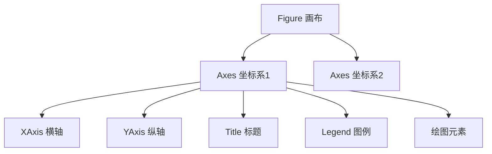
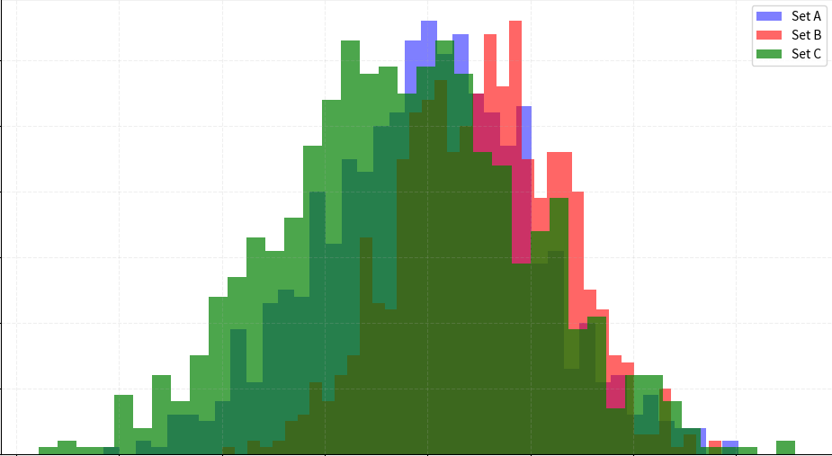

```python
import matplotlib.pyplot as plt
import seaborn as sns
```

# Matplotlib

基础绘图库，高度可定制

**核心模块：**pyplot模块

**两种接口：**MATLAB风格（pyplot模块）、面向对象风格（显示创建Figure和Axes对象）

**基本步骤：**

```python
# 创建画布和坐标轴
fig, ax = plt.subplots(figsize=(10, 6))

# 折线图
ax.plot(epochs, train_loss, label='Train Loss', color='blue', linestyle='-')

# 散点图
ax.scatter(feature1, feature2, alpha=0.5, c=labels, cmap='viridis')

# 配置项
ax.set_title('Training Progress')
ax.set_xlabel('Epochs')
ax.set_ylabel('Loss Value')
ax.legend()
ax.grid(True, linestyle='--', alpha=0.7)

# 保存图像
plt.savefig('trainint_plot.png', dpi=300, bbox_inches='tight')
```

## 核心容器操作

Matplotlib 采用分层对象模型：



- **Figure**: 顶层容器，代表整个图形窗口或画布
- **Axes**: **坐标系容器**（非坐标轴），是实际绘图区域
- **Axis**: 具体坐标轴对象，控制刻度和范围

### 容器创建

- 显式创建：先创建后添加

    ```python
    # 创建空画布
    fig = plt.figure(figsize=())	# 指定尺寸
    # 添加子图坐标系
    ax1 = fig.add_subplot(2, 2, 1)  # 指定2行2列的第1个位置
    ax2 = fig.add_axes()             # 自由定位坐标系
    ```

- 隐式创建：推荐，更灵活，一键创建全部子图，返回元组`(fig, Axes数组)`

    ```python
    fig, axs = plt.subplots()
    ```

    - `nrows`​**​ **和 `ncols`​：子图布局的**行数**和**列数**，索引从 `1`​ 开始，按从左到右、从上到下的**顺序排列**
    - **​`sharex`​**​ **和** **​`sharey`​**​：控制子图间坐标轴的共享，需要对比数据确保坐标轴范围一致时使用
    - **`squeeze`**：控制返回的 Axes 对象维度（**维度可动态变化**）
        - `squeeze=True`​（默认）：自动压缩单行/单列子图为 1D 数组，单子图时返回标量对象
        - `squeeze=False`​：始终返回 2D 数组，便于统一处理多子图
    - **​`facecolor`​**​：通过关键字参数设置子图属性，如背景颜色

- 按序创建：每次调用创建/激活**一个**子图，支持位置索引，语法简单但**管理能力弱**，返回**一个**axes对象

    ```python
    # 创建3×2网格中的第一个子图
    plt.subplot(3, 2, 1)  # 参数：行数、列数、位置索引
    plt.plot(x, y)
    
    # 在同一个Figure中创建下一个子图
    plt.subplot(3, 2, 2)  # 第二个位置
    plt.scatter(a, b)
    ```

- 删除子图：`fig.delaxes(ax[0])`删除指定子图

### 容器导航

- 获取容器：

    ```python
    # 当前对象
    current_fig = plt.gcf()  # 获取当前Figure
    current_ax = plt.gca()   # 获取当前Axes
    
    # 所有对象
    all_figures = plt.get_fignums()     # 所有图形窗口ID
    fig_obj = plt.figure(1)             # 通过ID获取Figure
    all_axes = fig_obj.axes()       # 画布中所有Axes
    ```

- 遍历容器：

    ```python
    # 遍历子图
    fig, axs = plt.subplots(2, 2)
    for ax in axs.flat:
        操作...
        
    # fig的属性
    axs = fig.axes
    ```

    - `ax.flat`：推荐，返回一个迭代器，可按行优先顺序**惰性**遍历所有元素，不会创建新数组，只提供遍历接口

    - `ax.flatten()`：返回一个按行优先展开的一维数组（副本）

- 访问容器：

    ```python
    # Axes内部组件
    x_axis = ax.xaxis        # XAxis对象
    y_axis = ax.yaxis        # YAxis对象
    title_obj = ax.title     # 标题文本对象
    fig = ax.figure		# axes所属画布
    
    spines = ax.spines  # 边界线字典 {'top','bottom','left','right'}
    spines['top'].set_visible(False)  # 隐藏顶部边界
    
    # 其他信息
    print(f"坐标系位置:  {ax.get_position()}")  # 返回Bbox对象
    print(f"坐标系宽度: 	{ax.bbox.width:.2f}英寸, "
          f"坐标系高度: 	{ax.bbox.height:.2f}英寸")
    print(ax.bbox_inches)	# 坐标系实际尺寸
    ```

### 容器生命周期

- 删除/清空容器：

    ```python
    ax.clear()  # 清空坐标系内容（保留框架）
    axes.cla() 	# 清除当前轴，保留坐标轴、标签、刻度线
    fig.clf()   # 清除画布所有内容（重置为空白画布）
    
    fig.delaxes(ax2)	# 删除指定坐标系
    plt.delaxes()	# 删除当前坐标系
    ```

- 内存管理：

    ```python
    # 显式释放内存
    plt.close(fig)  # 关闭图形窗口
    del fig        # 删除对象引用
    
    # 图像保存，支持png、svg、pdf
    fig.savefig('plot.png', dpi=300, bbox_inches='tight')
    ```

- 关系变更：

    ```python
    # 坐标系迁移
    new_fig = plt.figure()
    ax = fig.axes[0]  # 获取原画布上的Axes
    new_ax = new_fig.add_axes(ax.get_position())  # 复制位置到新画布
    
    # 坐标系克隆
    from copy import deepcopy
    ax_clone = deepcopy(ax)  # 深度复制坐标系
    ```

## 绘图函数

### 基础图表

- 折线图：

    ```python
    ax.plot(x, y, 
            linestyle='--', # 线型 ('-'实线, '--'虚线, '-.', ':')
            linewidth=2, 	# 线宽
            marker='o',     # 数据点标记，''无，'o'圆形，'s'方形，'^'三角
    		markersize=8	# 标记大小
            color='blue', 	
            label='Trend')	# 图例标签
    ```

- 阶梯图：离散数据

    ```python
    ax.step(x, y, 
            where='mid',  # 台阶位置: 'pre', 'post', 'mid'
            color='green')
    ```

- 散点图：

    ```python
    # 基本散点图
    ax.scatter(x, y, 
               s=50,          	# 点大小（标量或数组）
               c=values,      	# 点颜色（标量或数组）
               cmap='viridis', 	# 颜色映射
               alpha=0.8,     	# 透明度
               edgecolors='black')  # 边界颜色
    
    # 气泡图（尺寸映射）
    ax.scatter(x, y, 
               s=sizes, 
               c=z, 
               cmap='coolwarm')
    ```

- 柱状图：

    ```python
    # 垂直柱状图
    ax.bar(categories, values, # 类别和柱高度
           width=0.8,        # 柱宽
           color='skyblue', 
           edgecolor='black',
           label='Revenue',
           align='center')	# 对齐方式
    
    # 水平柱状图
    ax.barh(categories, values, 
            height=0.6, 	# 柱宽
            color='salmon')
    
    # 分组柱状图
    width = 0.35
    x = np.arange(len(categories))
    ax.bar(x - width/2, values1, width, label='Group 1')
    ax.bar(x + width/2, values2, width, label='Group 2')
    ```

- 饼图：

    ```python
    ax.pie(sizes, 
           labels=['A', 'B', 'C'], 
           autopct='%1.1f%%', 	# 百分比格式
           startangle=90,		# 起始角度
           explode=(0, 0.1, 0), # 突出某部分
           shadow=True)			# 阴影效果
    ```

### 统计分布图表

- 直方图：

    ```python
    ax.hist(data, 
            bins=30,          # 箱数
            density=True,     # 是否归一化
            color='steelblue',
            edgecolor='steelblue',
            alpha=0.7,
            histtype='stepfilled')  # 'bar', 'step', 'stepfilled'
    ```

- 箱线图：

    ```python
    ax.boxplot([data1, data2], 
               positions=[1, 2], 	# x位置
               widths=0.6,			# 箱体宽度
               showmeans=True,		# 显示均值
               notch=True,        	# 显示置信区间
               patch_artist=True) 	# 填充颜色
    ```

- 小提琴图（分布密度）：

    ```python
    ax.violinplot([data1, data2],
                  positions=[0, 1],
                  showmeans=True)  # 显示均值
    ```

- 误差图：

    ```python
    ax.errorbar(
        x, y, yerr=error,	# Y误差值
        fmt='o',			# 点标记格式
        capsize=5			# 误差条末端线长度
    )
    ```

### 高级图

- 热力图：

    ```python
    # 推荐用.imshow()方法实现
    im = ax.imshow(data, 
                   cmap='RdYlGn', 
                   aspect='auto',  # 自动宽高比
                   interpolation='bilinear')  # 插值方法
    fig.colorbar(im, ax=ax)  # 添加颜色条
    ```

    :warning: 注意：热力图处理二维数据，常规图标处理一维/离散数据，`.imshow()`是专为二维数据设计的图像渲染器，可高效处理矩阵结构

- 矢量场图/箭头图：

    ```python
    ax.quiver(x, y, u, v,  	# 位置(x,y)和方向(u,v)
              scale=50,     # 箭头缩放
              width=0.005,	# 箭杆宽度
              color='red')
    ```

- 面积图：

    ```python
    ax.fill_between(x, y1, y2=y2,		# X轴和两条曲线 
                    color='skyblue', 	
                    alpha=0.4, 		
                    where=(y1>y2))		# 填充条件
    ```

- 六边形箱图：

    ```python
    ax.hexbin(x, y, 
              gridsize=30, 	# 网格密度
              cmap='inferno')
    ```

### 绘图技巧

- 双Y轴：

    ```python
    ax1 = fig.add_subplot(111)
    ax2 = ax1.twinx()  # 共享X轴
    
    ax1.plot(x, y1, 'r-', label='Temp') 
    ax2.plot(x, y2, 'b--', label='Humidity') 
    
    # 合并图例
    lines1, labels1 = ax1.get_legend_handles_labels()
    lines2, labels2 = ax2.get_legend_handles_labels()
    ax1.legend(lines1 + lines2, labels1 + labels2)
    ```

- 嵌套图表：

    ```python
    # 主图
    ax_main = fig.add_axes([0.1, 0.1, 0.6, 0.8])
    ax_main.plot(x, y)
    
    # 右上角小图
    ax_inset = fig.add_axes([0.7, 0.7, 0.25, 0.25])
    ax_inset.plot(x_detail, y_detail, color='firebrick')
    ```

- 多数据层叠加：

    ```python
    ax.scatter(x1, y1, color='blue')
    ax.plot(x2, y2, color='red', linewidth=2)
    ax.bar(x3, height=y3, color='green', alpha=0.5)
    ```

- 多子图：

    ```python
    fig, axs = plt.subplots(2, 2)
    
    axs[0,0].hist(data1, bins=20)
    axs[0,1].scatter(data_x, data_y)
    axs[1,0].boxplot([dataA, dataB])
    axs[1,1].pie([35,25,40], labels=['A','B','C'])
    ```

## 配置项

### 文本

```python
# 全局标题
fig.suptitle(
    "Figure Title", 
    fontsize=16, 
    fontweight='bold', 
    y=0.95
)

# 子图标题
ax.set_title(
    "Title", 
    loc='left', 
    pad=20, 
    color='navy', 
    fontstyle='italic'
)

# 坐标轴标签
ax.set_xlabel(
    "X axis", 
    fontdict={'size': 14, 'color': '#333'}, 
    labelpad=15
)
ax.set_ylabel(
    "Y axis", 
    rotation=0, 
    ha='right'
)

# 添加文字
ax.text(5, 0.5, "Note", fontsize=12)

# 标注
ax.annotate("Peak", xy=(3, 1), xytext=(4, 1.5), arrowprops=dict(arrorwstyle="->"))
```


### fig相关

```python

# 背景色
fig.set_facecolor('lightblue')
# 修改尺寸
fig.set_size_inches(10,8)
# 分辨率
fig.set_dpi(150)
```

布局

```python
# 自动调整间距，紧凑布局
fig.tight_layout(pad=3.0)
# 手动调整间距
fig.subplots_adjust(
    wspace=0.5, 	# 水平间距
    hspace=0.3, 	# 垂直间距
    top=0.9, 		# 画布顶部边界
    bottom=0.1		# 画布底部边界
)
```


### ax相关

文本管理

```python

```

颜色管理

```python
ax.set_facecolor('whitesmoke')	# 坐标系背景色
```

布局管理

```python
ax.set_aspect('equal')	# 坐标比例设为1:1

ax.grid(True, linestyle='--')

# 显示图例
ax.legend(loc='upper right')
# 合并图例
lines1, labels1 = ax1.get_legend_handles_labels()
lines2, labels2 = ax2.get_legend_handles_labels()
ax1.legend(lines1 + lines2, labels1 + labels2)

# 多轴系统，是创建了新子图，而不是创建了新轴
ax2 = ax.twinx()	# 共享x轴
ax3 = ax.twiny() 	# 共享y轴
```

轴管理

```python
# 轴范围
ax.set_xlim()
ax.set_ylim()

ax.set_xscale('log')	# 对数坐标
# 刻度位置
ax.set_xticks([])
# 自定义刻度标签
ax.set_xticklabels([])
# 刻度旋转
ax.tick_params(axis='y', rotation=45)
```


## 绘图函数

### hist直方图

```python
plt.hist(
    data,
    bins=30,
    range=(-3, 3),
    density=True,
    histtype='stepfilled',
    color='blue',
    edgecolor='black',
    alpha=0.6,
    label='Normal Distribution'
 )
```

#### 基本参数

- **​`data`​**​：输入数据，需为一维数组或列表（数值型或类别型）

    > :warning: 绘制前需处理缺失值

- **​`bins`​**​：设置直方图的区间划分方式，默认10，支持以下形式：

    - **整数**：表示等宽区间数量（如 `bins=20`​ 分为 20 个区间）
    - **序列**：自定义区间边界（如 `bins=np.arange(0, 100, 5)`​ 每 5 个单位划分一个区间）
    - **字符串**：自动优化区间数量（如 `bins='auto'`​）

- **​`range`​**​：限制数据范围，超出范围的数据将被忽略

- **​`density`​**​：控制纵轴显示形式

    - `density=False`​：显示频数（默认）
    - `density=True`​：显示概率密度（归一化为总面积 1）

#### 布局与样式控制

- **​`histtype`​**​：
    - `'bar'`​：普通条形直方图（默认）
    - `'step'`​：仅绘制阶梯状边框
    - `'stepfilled'`​：填充阶梯状区域
    - `'barstacked'`​：堆叠式直方图（需配合 `stacked=True`​）
- **​`orientation`​**​：调整直方图方向：

    - `'vertical'`​：垂直方向（默认）
    - `'horizontal'`​：水平方向
- **​`color`​**​ **与** **​`edgecolor`​**​：设置填充色和边框颜色
- **​`alpha`​**​：调整透明度（0 为透明，1 为不透明）

#### 高级功能参数

- **​`weights`​**​：为数据点设置权重，用于绘制加权频数或概率
- **​`cumulative`​**​：`=True`​则绘制累积直方图，显示累计频数或概率
- **​`align`​**​：可选值：

    - `'mid'`​：区间中心对齐（默认）
    - `'left'`​ 或 `'right'`​：区间左/右边界对齐
- **​`rwidth`​**​：控制柱子的宽度比例（相对于区间宽度），为(0, 1)间浮点数

#### 技巧

可通过多次调用 `plt.hist`​ 叠加不同数据集，设置不同 `alpha`​ 增强可读性:



```python
plt.figure(figsize=(10, 6))

plt.hist(data_a, bins=40, alpha=0.5, color='blue', label='Set A')
plt.hist(data_b, bins=40, alpha=0.6, color='red', label='Set B')
plt.hist(data_c, bins=40, alpha=0.7, color='green', label='Set C')
```


## `plt.axis()`​

`plt.axis('off')`​等同于`plt.axis(False)`​，但off形式更常见和直观


### 颜色管理

`cmap`参数：colormap，颜色映射对象，用于将数据的数值映射到特定的颜色值，以便在图形中可视化数据的变化，常用`'viridis'`​、`'plasma'`​、`'RdYlBu'`​

`plt.cm.RdYlBu`​：`plt.cm`​模块提供了所有可用的 colormap，`RdYlBu`​全名Red-Yellow-Blue，表示从红色到黄色再到蓝色的渐变，常用于表示数据变化


```python
im = ax.imshow(data, cmap='viridis')
fig.colorbar(im, ax=ax, orientation='horizontal')  # 添加颜色条
```


## 显示与保存

### `plt.imshow()`​添加图像

将图像数据绘制到当前的绘图区域（axes）中，但**不会**立即显示该图像，必须调用 `plt.show()`​ 来实际渲染并显示图形

**参数**：

- `X`​：要显示的图像数据，可以是二维（灰度图）或三维（RGB图像）数组
- `cmap`​：指定颜色映射（colormap），如 `'gray'`​、`'hot'`​、`'jet'`​ 等，用于控制图像的颜色显示
- `interpolation`​：设置插值方法（如 `'nearest'`​、`'bilinear'`​ 等），控制图像显示的平滑度
- `aspect`​：控制图像的纵横比，常用参数包括 `'equal'`​（保持原始比例）和 `'auto'`​（自动调整）

### `plt.show()`​显示

一个阻塞函数，调用后会启动图形的事件循环，渲染并显示所有绘制的图形

`plt.colorbar()`​：添加颜色条，指示值的范围

`plt.scatter()`​

参数s：控制散点大小size，指点的面积而不是直径，可为一个数值（所有点同等大小）或一个数组（每个点一个大小）

```Python
 x = [1, 2, 3, 4]
 y = [10, 20, 30, 40]
 sizes = [20, 50, 80, 200]
 
 plt.scatter(x, y, s=sizes)
 plt.show()
```


# 配置项

- `%matplotlib inline`: 在notebook中绘制图形, 不再需要手动调用`plt.show()`​
- 堆叠: stacked\=True
- 透明度: alpha\=n
- 字体: `plt.rcParams['font.sans-serif'] = ['SimHei']`​
- 字体大小: fontsize=
- 拆分为多图: `.diff().hist/bar/……()`​
- 设置两个y轴: 

  ```python
  .plot(secondary_y=['A', 'B']) 
  .setylabel('CD')
  
  # 或
  ax1 = plt.gca() 
  ax2 = ax1.twinx()
  ```
- 单独配置大小: `plt.*(size=n)`​
- 图例位置: `plt.legend(loc=n)`​
- 网格: `grid=True`​
- 标题: title\=' '
- 轴标签: xlabel\=' ', ylabel\=' '
- 图片大小: figsize\=()
- 图片质量: `plt.rcParams['savefig.dpi'] = 100`​
- 解决坐标轴负数的负号显示问题: `plt.rcParams['axes.unicode_minus'] = False`​

- 折线图: 

  - `.plot()`​, subplots\=True每列一个子图
  - `.T.plot()`: 每一行一根线
- 柱状图: `.plot(kind='bar')`​或`.plot.bar()`​, bar换为barh: 水平, 条形图, stacked\=True: 堆叠
- 直方图: `.plot(kind='hist')`​, bins\=n箱数, density\=True把频数转换为概率
- 密度曲线图: 核密度估计, 弥补直方图精度缺失, `.plot(kind='kde')`​
- 饼图: `.plot(kind='pie')`​或`.plot.pie()`​, autopct\='%.1f%%', subplots\=True子图
- 散点图: `.plot.scatter()`​或`.plot(kind='scatter', x=, y=)`​

  - x\='', y\='': 使用指定列作为X、Y轴
  - s\=df[]\*200: 点大小由值决定; s\=n: 点大小固定
  - c\=' ': 点颜色由值决定
  - marker\='o'
  - linewidths\=n
  - edgecolors\='black': 点增加黑色边缘线
  - label\=: 分组
- 面积图: `.plot(kind='area')`​或`.plot.area()`​, stacked\=True: 堆叠
- 箱型图: `.plot(kind='box')`​或`.plot.box()`​

  - color\={'boxes': 'DarkGreen', 'whiskers': 'DarkOrange', 'medians': 'DarkBlue',  'caps': 'Gray'}
  - sym\='r+'
  - vert\=False: 水平格式, 默认竖直格式
- 六边形箱图: `.plot.hexbin()`​, x\=' ', y\=' ', gridsize\=n
- 统计图: 

  - 条形图: 

    - `.plot(kind='bar')`​
    - `.set_xlabel('')`​、`.set_ylabel('')`: 坐标轴标签
    - `.set_title('')`: 标题
  - 饼: 

    ```python
    fig, ax=plt.subplots(figsize=(5, 5))
    ax.pie(df, startangle=90, explode=[0.05, 0.05...], autopct\='%.1f%%', labels=df.index)
    ```
  - 直方图: 

    - `plt.hist(df[ ], bins, facecolor, edgecolor, alpha)`​
    - `plt.xlabel('')`​、`plt.ylabel('')`​、`plt.title('')`​
  - 线图:

    - 直线图:

      ```python
      ax = df.plot(kind='line', secondary_y=['频率']) 
      ax.set_xlabel('') 
      ax.set_ylabel('') 
      ax.right_ax.set_ylabel('频率') 
      ax.set_title('')
      ```
    - 曲线图:

      ```python
      import numpy as np 
      from scipy.interpolate import interpld 
      x = np.linspace(df.index.min(), df.index.max(), 300) 
      func = interpld(df.index, df['频数'], kind='cubic') 
      y = func(x) 
      func2 = interpld(df.index, df['频率'], kind='cubic') 
      y2 = func(x) 
      fig, ax = plt.subplots() 
      ax.set_title('') 
      ax.plot(x, y) 
      ax.set_xlabel('区间') 
      ax.set_ylabel('频数') 
      ax2 = ax.twinx() 
      ax2.plot(x, y2) 
      ax2.set_ylabel('频率')
      ```

# Seaborn

基于matplotlib的高级封装，与Pandas集成好，样式美观

- 配置项: 

  - 绘图主题`sns.set_palette()`​：`'pastel'`、`'Blues_r'`、`'magma'`
  - 绘图后端引擎: `pd.set_option("plotting.backend","plotly")`​, 修改引擎为`plotly`
  - 画布风格`sns.set_style()`​, 'white'、'whitegrid'、'dark'、'darkgrid'

    - {'sans-serif': ['SimHei': 'Arial']}
  - 图例: `plt.legend()`​

    - 图例位置: loc\=  

      ​
    - fontsize\=
    - frameon\=False: 去掉图例边框
    - edgecolor\=''
    - facecolor\='': 图例背景颜色
    - title\=: 标题
  - 获取当前对象:

    - `plt.gca()`: 当前坐标轴
    - `plt.gcf()`: 当前图表
- 柱状图: `sns.barplot()`​, x\='', y\='', color\=, ax\=plt.gca(), hue\=条件
- 箱图: `sns.boxplot()`​
- 小提琴图: `sns.violinplot()`​
- 海带图: `sns.stripplot()`​
- 蜂群图: `sns.swarmplot()`​
- 分面网格: `sns.catplot()`​, row\=分面依据, hue\=, x\=, y\=
- 散步图: `sns.scatterplot()`​, x\=, y\=, hue\=
- 散点矩阵图: `sns.pairplot()`​, hue\=
- 热力图: `sns.heatmap()`​, annot\=True显示数字, cmap\='Summer'颜色风格
