```python
import matplotlib.pyplot as plt
import seaborn as sns
```

# Matplotlib

基础绘图库，高度可定制

**两种接口：**避免混用

- 基于状态：隐式控制，`pyplot`模块提供函数并维持内部状态，自动作用于**当前的**figure和axes，无则自动创建一个，简单快捷，适合在交互式环境中进行快速绘图

    ```python
    plt.plot(...)
    ```

- 面向对象：显式控制，推荐，必须先有对象，更灵活，适用于多子图/需要精细控制的场景

    ```python
    ax1.plot(...)
    ```

**基本步骤：**

```python
# 创建画布和坐标轴
fig, ax = plt.subplots(figsize=(10, 6))

# 折线图
ax.plot(epochs, train_loss, label='Train Loss', color='blue', linestyle='-')

# 散点图
ax.scatter(feature1, feature2, alpha=0.5, c=labels, cmap='viridis')

# 配置项
ax.set_title('Training Progress')
ax.set_xlabel('Epochs')
ax.set_ylabel('Loss Value')
ax.legend()
ax.grid(True, linestyle='--', alpha=0.7)

# 保存图像
plt.savefig('trainint_plot.png', dpi=300, bbox_inches='tight')
```

## 核心容器操作

Matplotlib 采用分层对象模型：

```mermaid
graph TD
    Figure[Figure 画布] --> Axes1[Axes 坐标系1]
    Figure --> Axes2[Axes 坐标系2]
    Axes1 --> AxisX[XAxis 横轴]
    Axes1 --> AxisY[YAxis 纵轴]
    Axes1 --> Title[Title 标题]
    Axes1 --> Legend[Legend 图例]
    Axes1 --> Plot[绘图元素]
```



- **Figure**: 顶层容器，代表整个图形窗口或画布
- **Axes**: **坐标系容器**（非坐标轴），是实际绘图区域
- **Axis**: 具体坐标轴对象，控制刻度和范围

### 容器创建

- 显式创建：先创建后添加

    ```python
    # 创建空画布
    fig = plt.figure(figsize=())	# 指定尺寸
    
    # 添加子图坐标系
    ax1 = fig.add_subplot(2, 2, 1)  # 指定2行2列的第1个位置
    ax2 = fig.add_axes()             # 自由定位坐标系
    ```

- 隐式创建：推荐，更灵活，一键创建全部子图，返回元组`(fig, Axes数组)`

    ```python
    fig, axs = plt.subplots()
    ```

    - `nrows`​**​ **和 `ncols`​：子图布局的**行数**和**列数**，索引从 `1`​ 开始，按从左到右、从上到下的**顺序排列**
    - **​`sharex`​**​ **和** **​`sharey`​**​：控制子图间坐标轴的共享，需要对比数据确保坐标轴范围一致时使用
    - **`squeeze`**：控制返回的 Axes 对象维度（**维度可动态变化**）
        - `squeeze=True`​（默认）：自动压缩单行/单列子图为 1D 数组，单子图时返回标量对象
        - `squeeze=False`​：始终返回 2D 数组，便于统一处理多子图
    - **​`facecolor`​**​：通过关键字参数设置子图属性，如背景颜色

- 按序创建：每次调用创建/激活**一个**子图，支持位置索引，语法简单但**管理能力弱**，返回**一个**axes对象

    ```python
    # 创建3×2网格中的第一个子图
    plt.subplot(3, 2, 1)  # 参数：行数、列数、位置索引
    plt.plot(x, y)
    
    # 在同一个Figure中创建下一个子图
    plt.subplot(3, 2, 2)  # 第二个位置
    plt.scatter(a, b)
    ```

- 删除子图：`fig.delaxes(ax[0])`删除指定子图

### 容器导航

- 获取容器：

    ```python
    # 当前对象
    current_fig = plt.gcf()  # 获取当前Figure
    current_ax = plt.gca()   # 获取当前Axes
    
    # 所有对象
    all_figures = plt.get_fignums()     # 所有图形窗口ID
    fig_obj = plt.figure(1)             # 通过ID获取Figure
    all_axes = fig_obj.axes()       # 画布中所有Axes
    ```

- 遍历容器：

    ```python
    # 遍历子图
    fig, axs = plt.subplots(2, 2)
    for ax in axs.flat:
        操作...
        
    # fig的属性
    axs = fig.axes
    ```

    - `ax.flat`：推荐，返回一个迭代器，可按行优先顺序**惰性**遍历所有元素，不会创建新数组，只提供遍历接口

    - `ax.flatten()`：返回一个按行优先展开的一维数组（副本）

- 访问容器：

    ```python
    # Axes内部组件
    x_axis = ax.xaxis        # XAxis对象
    y_axis = ax.yaxis        # YAxis对象
    title_obj = ax.title     # 标题文本对象
    fig = ax.figure		# axes所属画布
    
    spines = ax.spines  # 边界线字典 {'top','bottom','left','right'}
    spines['top'].set_visible(False)  # 隐藏顶部边界
    
    # 其他信息
    print(f"坐标系位置:  {ax.get_position()}")  # 返回Bbox对象
    print(f"坐标系宽度: 	{ax.bbox.width:.2f}英寸, "
          f"坐标系高度: 	{ax.bbox.height:.2f}英寸")
    print(ax.bbox_inches)	# 坐标系实际尺寸
    ```

### 容器生命周期

- 删除/清空容器：

    ```python
    ax.clear()  # 删除坐标系图形内容，保留框架
    axes.cla()  # 仅清除图形元素 
    fig.clf()   # 清除画布所有内容（重置为空白画布）
    
    fig.delaxes(ax2)	# 删除指定坐标系
    plt.delaxes()	# 删除当前坐标系
    
    del fig        # 删除对象引用
    ```

    - `axes.cla()`：仅清除图形元素，保留坐标轴、标签、标题、刻度、图例，用于更新数据
    - `axes.clear()`：清除所有内容，包括配置，用于完全重置

- 关系变更：

    ```python
    # 坐标系迁移
    new_fig = plt.figure()
    ax = fig.axes[0]  # 获取原画布上的Axes
    new_ax = new_fig.add_axes(ax.get_position())  # 复制位置到新画布
    
    # 坐标系克隆
    from copy import deepcopy
    ax_clone = deepcopy(ax)  # 深度复制坐标系
    ```

## 绘图函数

### 基础图表

- 折线图：

    ```python
    ax.plot(
        x, y, 
        linestyle='--', # 线型 ('-'实线, '--'虚线, '-.', ':')
        linewidth=2, 	# 线宽
        marker='o',     # 数据点标记，''无，'o'圆形，'s'方形，'^'三角
        markersize=8	# 标记大小
        color='blue', 	
        label='Trend'	# 图例标签
    )
    ```

- 阶梯图：离散数据

    ```python
    ax.step(
        x, y, 
        where='mid',  # 台阶位置: 'pre', 'post', 'mid'
        color='green'
    )
    ```

- 散点图：

    ```python
    # 基本散点图
    ax.scatter(
        x, y, 
        s=50,          	# 点大小（标量或数组）
        c=values,      	# 点颜色（标量或数组）
        cmap='viridis', 	# 颜色映射
        alpha=0.8,     	# 透明度
        edgecolors='black'  # 边界颜色
    )
    
    # 气泡图（尺寸映射）
    sizes = np.random.uniform(50, 500, len(x))
    ax.scatter(
        x, y, 
        s=sizes, 
        c=z, 
        cmap='coolwarm'
    )
    ```

- 柱状图：

    ```python
    # 垂直柱状图
    ax.bar(
        categories, values, # 类别和柱高度
        width=0.8,        # 柱宽
        color='skyblue', 
        edgecolor='black',
        label='Revenue',
        align='center'	# 对齐方式
    )
    
    # 水平柱状图
    ax.barh(
        categories, values, 
        height=0.6, 	# 柱宽
        color='salmon'
    )
    
    # 分组柱状图
    width = 0.35
    x = np.arange(len(categories))
    ax.bar(x - width/2, values1, width, label='Group 1')
    ax.bar(x + width/2, values2, width, label='Group 2')
    ```

- 饼图：

    ```python
    ax.pie(
        sizes, 
        labels=['A', 'B', 'C'], 
        autopct='%1.1f%%', 	# 百分比格式
        startangle=90,		# 起始角度
        explode=(0, 0.1, 0), # 突出某部分
        shadow=True			# 阴影效果
    )
    ```

### 统计分布图表

- 直方图：

    ```python
    ax.hist(
        data, 			# 一维数组/列表，需提前处理缺失值
        bins=30, 
        range=(-3, 3),		# 限制数据范围，超出范围则忽略
        density=True,     # 是否归一化，显示概率密度，总面积为1，默认False显示频数
        color='steelblue',
        edgecolor='steelblue',
        alpha=0.7,			# 可见度，0为透明，1为不透明
        histtype='stepfilled', 
        label='Normal Distribution')
    ```

    - `bins`：箱数，默认10，支持多种形式
        - 整数：表示等宽区间数量（如 `bins=20`​ 分为 20 个区间）
        - 序列：自定义区间边界（如 `bins=np.arange(0, 100, 5)`​ 每 5 个单位划分一个区间）
        - `'auto'`：自动优化区间数量
    - `histtpye`：样式
        - `'bar'`​：普通条形直方图（默认）
        - `'step'`​：仅绘制阶梯状边框
        - `'stepfilled'`​：填充阶梯状区域
        - `'barstacked'`​：堆叠式直方图（需配合 `stacked=True`​）
    - `orientation`​​：调整直方图方向
        - `'vertical'`​：垂直方向（默认）
        - `'horizontal'`​：水平方向

    - `weights`​​：为数据点设置权重，用于绘制加权频数或概率
    - `cumulative`​：`True`​则绘制累积直方图，显示累计频数或概率
    - `align`​：
        - `'mid'`​：区间中心对齐（默认）
        - `'left'`​ 或 `'right'`​：区间左/右边界对齐
    - `rwidth`​​：控制柱子的宽度比例（相对于区间宽度），为(0, 1)间浮点数

- 箱线图：

    ```python
    ax.boxplot([data1, data2], 
               vert=True,			# 垂直/水平
               positions=[1, 2], 	# x位置
               widths=0.6,			# 箱体宽度
               showmeans=True,		# 显示均值
               showfliers=False, 	# 显示异常值
               notch=True,        	# 显示置信区间
               patch_artist=True) 	# 填充颜色
    ```

- 小提琴图（分布密度）：

    ```python
    ax.violinplot([data1, data2],
                  positions=[0, 1],
                  showmeans=True)  # 显示均值
    ```

- 误差图：

    ```python
    ax.errorbar(
        x, y, yerr=error,	# Y误差值
        fmt='o',			# 点标记格式
        capsize=5			# 误差条末端线长度
    )
    ```

### 高级图

- 二维图像：`imshow()`将二维图像数据绘制到当前axes，但**不会**立即显示该图像，必须调用 `plt.show()` 来实际渲染并显示图形

    ```python
    # 在指定ax显示图像
    im = ax.imshow(
        data,				# 二维/三维数组
        cmap='viridis',     # 颜色映射
        interpolation='nearest',  # 插值方法，控制平滑度，'bilinear'、'none'
        origin='upper',     # 原点位置
        vmin=0.2,           # 颜色最小值
        vmax=0.8,           # 颜色最大值
        aspect='auto',		# 图像高宽比，'equal'保持原始比例，'auto'自动调整
        alpha=0.8,
        extent=(0, 10, 0, 5),	# 坐标系扩展[xmin, xmax, ymin, ymax]
        filternorm=True, 	# 滤镜标准化
        filterrad=4.0,		# 滤镜半径
        rasterized=True		# 启用光栅化
    )
    
    # 添加颜色条并绑定到特定ax
    cbar = fig.colorbar(
        im,                 # 必须传递Image对象
        ax=ax,              # 指定关联的坐标轴
        orientation='horizontal',  # 水平方向
        fraction=0.05,       # 颜色条占坐标轴的比例
        pad=0.1             # 与坐标轴的间距
    )
    ```

- 热力图：

    ```python
    # 推荐用.imshow()方法实现
    im = ax.imshow(data, 
                   cmap='RdYlGn', 	# 红黄绿渐变
                   aspect='auto', 
                   interpolation='bilinear') 
    fig.colorbar(im, ax=ax)  # 添加颜色条
    ```

    :warning: 注意：热力图处理二维数据，常规图标处理一维/离散数据，`.imshow()`是专为二维数据设计的图像渲染器，可高效处理矩阵结构

- 矢量场图/箭头图：

    ```python
    ax.quiver(x, y, u, v,  	# 位置(x,y)和方向(u,v)
              scale=50,     # 箭头缩放
              width=0.005,	# 箭杆宽度
              color='red')
    ```

- 面积图：

    ```python
    # 基础面积图（单变量）
    ax.fill_between(x, y_low, y_high,		# X轴和两条曲线 
                    color='skyblue', 	
                    alpha=0.4, 		
                    hatch='/',		# 填充图案
                    interpolate=True, 
                    where=(y_low < high))		# 填充条件
    
    # 堆叠面积图（多变量）
    ax.stackplot(
        x, y1, y2, y3,
        labels=["Sine", "Cosine", "Linear"],
        colors=["#FF9999", "#66B2FF", "#99FF99"],
        alpha=0.7
    )
    # 添加基线
    ax.axhline(0, color="black", linestyle="--", alpha=0.3)
    ```

- 六边形箱图：

    ```python
    ax.hexbin(x, y, 
              gridsize=30, 	# 网格密度
              cmap='inferno')
    ```

### 绘图技巧

- 嵌套图表：

    ```python
    # 主图
    ax_main = fig.add_axes([0.1, 0.1, 0.6, 0.8])
    ax_main.plot(x, y)
    
    # 右上角小图
    ax_inset = fig.add_axes([0.7, 0.7, 0.25, 0.25])
    ax_inset.plot(x_detail, y_detail, color='firebrick')
    ```

- 多数据层叠加：

    ```python
    ax.scatter(x1, y1, color='blue')	# 多散点图时可用label参数控制分组
    ax.plot(x2, y2, color='red', linewidth=2)
    ax.bar(x3, height=y3, color='green', alpha=0.5)
    ```

- 多子图：

    ```python
    fig, axs = plt.subplots(2, 2)
    
    axs[0,0].hist(data1, bins=20)
    axs[0,1].scatter(data_x, data_y)
    axs[1,0].boxplot([dataA, dataB])
    axs[1,1].pie([35,25,40], labels=['A','B','C'])
    ```

### pandas接口

绘图两种接口：

- **Matplotlib**原生方法：`ax.hist(...)`，优先使用，更稳定，可复用
    - 完全控制所有参数（颜色/透明度/边框等）
    - 返回图数据，如直方图的统计结果元组（频数/箱子边界）
    - 不依赖 pandas
- **Pandas**绘图方法：`df.plot(kind='hist'...)`
    - 本质是高级语法糖，最终调用matplotlib底层函数
    - 语法简洁，自动适配数据标签
    - 定制化能力弱，返回`Axes`对象，而非图数据

#### 智能分图

`df.plot(subplots=True)`，自动识别df列创建并绑定子图，自动处理多行多列布局，自动设置`sharex`/`sharey`，返回`Axes`对象数组

matplotlib均需手动配置：

```python
# 手动实现 subplots=True
fig, axes = plt.subplots(
    nrows=len(df.columns),  # 自动确定行数=列数
    ncols=1,                # 单列布局
    figsize=(8, 10),
    sharex=True             # 统一x轴
)

# 遍历列和坐标轴，绑定绘制
for col, ax in zip(df.columns, axes):
    ax.hist(df[col], bins=20, alpha=0.7)
    ax.set_title(f'Column: {col}', fontsize=10)
    
plt.tight_layout()  # 自动调整间距
```

使用技巧：Pandas自动化布局，返回值用Matplotlib精细控制

```python
axes = df.plot(kind='hist', subplots=True, figsize=(10, 8))

for ax in axes:
    ax.grid(alpha=0.2)
    ax.set_xlabel('Value', fontsize=9)
    ax.tick_params(labelsize=8)
```

#### 链式调用

```python
# 统计计算
df['price']
.pct_change()       # 计算百分比变化
.mul(100)           # 转为百分比值
.hist(
    bins=50, 
    edgecolor='w',
    title='价格波动分布'
    
# 多列对比
df[['AAPL', 'MSFT']].diff().hist(
    bins=30, 
    alpha=0.6, 
    layout=(2, 1),  # 自动创建2个子图
    figsize=(10, 6)
)
    
# 筛选+差分+滚动统计+可视化
df.query('volume > 1000000')
['close']
.diff()
.rolling(20).std()
.plot(kind='area', alpha=0.4)
```

:warning: 注意：

- 方法顺序敏感：先diff后hist
- 需精细控制时建议用原生方法
- 返回值控制：**返回Axes对象**，可继续定制，`ax = df.diff.hist(...)`

#### 双轴

`.plot(secondary_y=['A', 'B'])`，专为双Y轴时间序列分析设计

封装了matplotlib的复杂配置流程，自动匹配折线颜色，智能放置左右标签，自动适配数据范围，自动对齐刻度线

返回主次坐标轴元组

```python
ax = df.plot(
    y=['sales'], 
    secondary_y=['discount_rate'],  # 👈 魔术参数
    figsize=(10, 6)
)
```

只能处理双轴，三轴需用原生

处理图例重叠：

```python
# pandas方案（图例分离）
ax = df.plot(secondary_y=['discount'], legend=False)  # 先关自动图例

# 手动构建组合图例
lines = ax.get_lines() + ax.right_ax.get_lines()  # 获取所有线对象
ax.legend(lines, [l.get_label() for l in lines])  # 合并图例
```

## 配置项

### 画布

```python
# 修改尺寸
fig.set_size_inches(10,8)
# 分辨率
fig.set_dpi(150)

# 手动精调布局
fig.subplots_adjust(
    left=0.1,   	# 画布左边界
    right=0.95,  	# 画布右边界
    top=0.9,     	# 顶部边界
    bottom=0.15, 	# 底部边界
    wspace=0.4,  	# 水平子图间距
    hspace=0.3  	# 垂直子图间距
)
    
# 自动调整间距，紧凑布局，推荐
fig.tight_layout(
    pad=3.0, 	# 边界填充
    h_pad=0.5, 	# 水平间距
    w_pad=0.5, 	# 垂直间距
    rect=[0, 0, 1, 0.95]	# 有效区域
)
```

### 文本

```python
# 字体
plt.rcParams['font.sans-serif'] = ['SimHei']

# 全局标题
fig.suptitle(
    "Figure Title", 
    fontsize=16, 
    fontweight='bold', 
    y=0.95
)

# 子图标题
ax.set_title(
    "Title", 
    loc='left', 
    pad=20, 
    color='navy', 
    fontstyle='italic'
)

# 坐标轴标签
ax.set_xlabel(
    "X axis", 
    fontdict={'size': 14, 'color': '#333'}, 
    labelpad=15
)
ax.set_ylabel(
    "Y axis", 
    rotation=0, 
    ha='right'
)

# 刻度标签
ax.set_xticks([0, 1, 2])	# 刻度位置
ax.set_xticklabels(
    ['Low', 'Medium', 'High'], 
    rotation=45, 
    fontdict={'family': 'monospace'}
)

# 添加自定义文字
ax.text(5, 0.5, "Important Note", 
        fontsize=12, 
        transform=ax.transAxes, 	# 使用坐标系比例
        bbox={'facecolor': 'yellow', 'alpha': 0.5, 'pad': 5})	# 文字框

# 标注
ax.annotate("Peak", xy=(3, 1), 
            xytext=(4, 1.5), 
            arrowprops=dict(arrorwstyle="->"))

# 科学计数法
ax.ticklabel_format(
    axis='y', style='sci', 
    scilimits=(0, 0), 
    useMathText=True
)
```

### 线条与标记

#### 线条样式

| 参数             | 值示例                                         | 说明       |
| ---------------- | ---------------------------------------------- | ---------- |
| `linestyle`      | `'-'`实线, `'--'`虚线, `'-.'`, `':'`, `'None'` | 线型风格   |
| `linewidth`      | 0.5, 1, 2, 3.5                                 | 线宽（点） |
| `alpha`          | 0.0 ~ 1.0                                      | 透明度     |
| `solid_capstyle` | `'butt'`, `'round'`, `'projecting'`            | 线段端点   |

#### 标记样式库

```python
marker_dict = {
    'point': '.',      'circle': 'o',     'square': 's',
    'triangle_up': '^','star': '*',      'diamond': 'D',
    'plus': '+',       'x': 'x',         'hexagon': 'h'
}
```

#### 线型快速设置

```python
ax.plot(x, y, 'ro--',   # 红色圆圈 + 虚线
        dashes=(5, 2, 1, 2),  # 自定义虚线: (实线长, 空格长, ...)
        markerfacecolor='white', 
        markeredgewidth=1.5)
```

#### 网格线

```python
ax.grid(True, 
        axis='y',             # 控制方向 ('x','y','both')
        linestyle=':', 
        linewidth=0.8,
        alpha=0.7,
        color='gray',
        which='major')        # 主/次刻度 ('major'/'minor'/both')

# 精细控制次要网格
ax.minorticks_on()
ax.grid(which='minor', alpha=0.2)
```

#### 参考线

- 普通参考线：

    ```python
    # 垂直
    ax.axvline(
        x=0,             # 在x轴的位置
        ymin=0,          # 垂直起点(0-1坐标系)
        ymax=1,          # 垂直终点(0-1坐标系)
        color='k',        
        linestyle='--',   
        linewidth=1.5,   
        alpha=0.8,       
        label='reference' 
    )
    
    # 水平
    ax.axhline(
        y=0,            # 在y轴的位置
        xmin=0,         # 水平起点(0-1坐标系)
        xmax=1          # 水平终点(0-1坐标系)
    )
    ```

- 参考区域：

    ```python
    # 垂直区域
    ax.axvspan(
        xmin,           # x轴起始位置
        xmax,           # x轴结束位置
        ymin=0,         # 垂直起点(0-1)
        ymax=1,         # 垂直终点(0-1)
        alpha=0.3,      # 透明度
        color='yellow', # 填充色
        edgecolor='red' # 边界色
    )
    
    # 水平区域
    ax.axhspan(       
        ymin, ymax, 
        xmin=0, xmax=1
    )
    ```

- 通用参考线：

    ```python
    # 通过两点定义
    ax.axline(
        (x1, y1), (x2, y2), 
        color='purple', 
        linestyle='-.'
    )
    
    # 通过点斜式定义
    ax.axline(
        (x0, y0), slope=m, 
        color='blue', 
        alpha=0.7
    )
    ```

### 颜色系统

#### 命名颜色

```python
ax.plot(x, y, color='royalblue')          # CSS4命名颜色（148种）
ax.scatter(..., c='#ff3399')              # HEX格式
ax.bar(..., color=(0.1, 0.5, 0.8))        # RGB元组（0-1范围）
```

#### 背景颜色

```python
fig.set_facecolor('lightblue')
ax.set_facecolor('whitesmoke')	# 坐标系背景色
```

#### 色彩映射

Colormaps，用于将数据的数值映射到特定的颜色值，以便在图形中可视化数据的变化，常用`'viridis'`、`'plasma'`、`'RdYlBu'`，一般用参数`cmap`控制

`plt.cm`模块：提供了所有可用的 colormap

`plt.cm.RdYlBu`：全名`Red-Yellow-Blue`，表示从红到黄到蓝渐变

```python
cmap_names = ['viridis', 'plasma', 'inferno', 'magma', 'cividis']  # 连续色图
cmap_names += ['PiYG', 'PRGn', 'BrBG', 'PuOr', 'RdGy']  # 发散色图
cmap_names += ['Pastel1', 'Set3', 'tab20']  # 分类色图

# 使用示例
im = ax.imshow(data, cmap='RdBu_r',       # 带后缀'_r'表示反向色图
               vmin=0, vmax=100)           # 值域范围
# 添加颜色条
fig.colorbar(im, ax=ax, orientation='horizontal')
```

### 坐标轴

```python
# 显示轴，三种方式
ax.axis('off')		# off形式可读性更好
ax.axis(False)
ax.set_axis_off()

# 轴范围
ax.set_xlim()
ax.set_ylim()

# 比例调整
ax.set_yscale('log')            # 对数坐标 ('linear'/'log'/'symlog'/'logit')
ax.set_aspect('equal')          # 固定比例（坐标轴等刻度）

# 位置调整
ax.spines['top'].set_visible(False)     # 隐藏上边界
ax.spines['left'].set_position('center') # Y轴居中

# 轴方向反转
ax.invert_xaxis()             # X轴方向反转
ax.set_ylim(10, 0)            # Y轴值域反转

# 刻度旋转
ax.tick_params(axis='y', rotation=45)
```

#### 多轴

```python
# 1.sharex、sharey参数控制
fig, axs = plt.subplots(2, sharex=True) 	# 创建多子图并自动共享x轴

# 2.sharex()方法手动设置
axs[0].sharex(axs[1])      # 后绑定/修改共享，主动轴(axs[0])会同步被动轴(axs[1])的范围

# 3.twinx()和twiny()，创建了新子图而不是新轴，共享一轴独立另一轴，适合展示不同量纲数据
ax1 = fig.add_subplot(111)
ax2 = ax1.twinx()	# 共享x轴
ax3 = ax.twiny() 	# 共享y轴

# 4.次要坐标轴，数值范围与主轴严格一致，用于刻度位置相同但单位不同，如摄氏度和华氏度
sec_ax = ax.secondary_xaxis('top')   # 顶部次要X轴（自动复制刻度）
sec_ax.set_xlabel('Top Axis')
```

**使用建议**：

- **多子图布局**：优先用 `plt.subplots(..., sharex=True/sharey=True)`
- **双Y轴图**：用 `ax.twinx()`
- **单位转换轴**：用 `secondary_xaxis()`
- **后期修改**：用 `ax1.sharex(ax2)` 手动绑定

### 图例

调用 `ax.legend()`时会自动收集所有带 `label`的图形元素

#### 位置预设

```python
ax.legend(loc='upper right')   # 预置位置代码 (0-10)/字符串

# 合并图例
lines1, labels1 = ax1.get_legend_handles_labels()
lines2, labels2 = ax2.get_legend_handles_labels()
ax1.legend(lines1 + lines2, labels1 + labels2)
```

|  **位置字符串**  | **位置代码** |     **说明**      |
| :--------------: | :----------: | :---------------: |
|     `'best'`     |      0       | 自动选择最佳位置  |
| `'upper right'`  |      1       | 右上角 (默认位置) |
|  `'upper left'`  |      2       |      左上角       |
|  `'lower left'`  |      3       |      左下角       |
| `'lower right'`  |      4       |      右下角       |
|    `'right'`     |      5       |     右侧居中      |
| `'center left'`  |      6       |     左侧居中      |
| `'center right'` |      7       |     右侧居中      |
| `'lower center'` |      8       |     底部居中      |
| `'upper center'` |      9       |     顶部居中      |
|    `'center'`    |      10      |      正中央       |

#### 高级布局

```python
ax.legend(title='Metrics', 
          ncol=2,            # 分列显示
          framealpha=0.8,    # 背景透明度
          frameon=False,	 # 图例边框
          facecolor='ivory',
          edgecolor='gray',
          shadow=True,
          bbox_to_anchor=(1.05, 1))  # 外置图例（使用坐标系比例）
```

### 配置优先级

配置冲突时遵循以下优先级（从高到低）：

1. 函数参数 (如 `plot(color='red')`)
2. Artist对象属性 (`line.set_linewidth(3)`)
3. Axes属性 (`ax.set_title(...)`)
4. Figure属性 (`fig.suptitle(...)`)
5. rcParams全局设置
6. 预设样式 (`plt.style.use()`)

## 显示、保存与关闭

```python
%matplotlib inline	# 在notebook中绘制图形，不再需要手动调用plt.show()

# 保存，支持png、svg、pdf、jpg等格式
# 保存前始终使用 fig.tight_layout() 避免元素重叠
fig.savefig(
    'plot.png', 
    dpi=300, 		# 分辨率，默认100
    bbox_inches='tight',	# 自动裁剪空白
    pad_inches=0.1,		# 填充边距
    transparent=True, 	# 透明背景
    quality=95	# jpg时控制质量
)

plt.show()	# 阻塞显示，调用后启动图形的事件循环，渲染并显示所有绘制的图形(程序暂停直到窗口关闭)
plt.show(block=False) 	# 非阻塞显示，继续执行后续代码

# 显式释放内存
plt.close(fig)  # 关闭图形窗口
plt.close('all')	# 关闭所有图形窗口

del fig        # 删除对象引用
```

## 常见问题与优化

```python
# 问题：保存的图片空白
plt.savefig('before_show.png')  # 在plt.show()前保存

# 问题：中文乱码
plt.rcParams['font.sans-serif'] = ['SimHei']  # Windows
plt.rcParams['font.sans-serif'] = ['WenQuanYi Micro Hei']  # Linux

# 问题：LaTeX数学公式异常
plt.rcParams['text.usetex'] = False  # 禁用LaTeX引擎

# 问题：坐标轴负号显示异常
plt.rcParams['axes.unicode_minus'] = False

# 大数据集优化
plt.plot(x, y, rasterized=True)  # 对部分元素使用位图

# 批量导出关闭交互
for i in range(100):
    fig = create_figure(i)
    fig.savefig(f'batch_{i}.png')
    plt.close(fig)  # 关键：释放内存
    
# 出版级输出设置
plt.rcParams.update({
    'text.usetex': True,          # 使用LaTeX文本渲染
    'font.family': 'serif',
    'pdf.fonttype': 42,           # 保留字体（非轮廓）
    'ps.fonttype': 42,
    'savefig.format': 'pdf',      # 矢量格式首选
    'savefig.dpi': 600,           # 位图格式的高分辨率
})
```


---


# Seaborn

## 概述

### 特点

- 完全基于Matplotlib的高级封装，最终均转化为Matplotblib容器对象
- 所有函数均设计为DataFrame-First，与Pandas集成好
- 样式美观
- 通过高级封装隐藏了Matplotlib的容器细节，提供了更简洁的接口

### 统一调用接口

`sns.xxxplot()`，输入DataFrame/dict/array，**返回`Axes`对象**

```python
# 1.快速绘图，自动创建fig和axes
sns.boxplot(data=df, x='A', y='B')

# 2.推荐，用ax参数精准控制
fig, ax = plt.subplots()
sns.boxplot(data=df, x='A', y='B', ax=ax)
```

`Seaborn`所有绘图函数均支持`ax`参数，不指定则自动创建新坐标轴

**最佳实践**：sns绘图+plt精细控制

```python
fig, axs = plt.subplots(2, 1, figsize=(10, 8))

# 子图1
sns.boxplot(data=df, x='type', y='price', ax=axs[0])
axs[0].set_yscale('log') 
# 子图2
sns.violinplot(data=df, x='type', y='sales', ax=axs[1], 
               inner='quartile', palette='viridis')
axs[1].grid(axis='y', ls=':')  

plt.tight_layout()
```

### 基础配置与环境

```python
# 主题风格
sns.set_style()		# 5种预设主题，darkgrid/whitegrid/dark/white/ticks
sns.set_context()	# 4种场景缩放，paper/notebook/talk/poster

# 颜色系统
sns.color_palette()	# 调色板，Seaborn灵魂，分类/连续/发散数据使用对应调色板
sns.set_palette()	# 全局配色设置，'pastel'、'Blues_r'、'magma'
# 或在绘图函数中用palette参数/cmap参数控制

# 图表修饰
sns.despine()		# 边框控制

# 一次性配置全部
sns.set_theme(
	style='whitegrid',
    context='paper'
    palette='muted',
    rc={'figure.figsize': (12, 8)}		# 支持完整rcParams
)

# 绘图后端引擎
pd.set_option("plotting.backend", "plotly")		# 修改为plotly
```

Seaborn会覆盖Matplotlib全局样式，若要配置，推荐放在sns配置后

## 分面机制

Faceting，一种**数据切割→分别绘图→组合布局**的可视化技术，用于展示多变量关系

```mermaid
graph LR
原始数据集 -->|按条件变量切割| 子数据集1
原始数据集 -->|按条件变量切割| 子数据集2
原始数据集 -->|按条件变量切割| 子数据集N
子数据集1 --> 子图1
子数据集2 --> 子图2
子数据集N --> 子图N
子图1 -->|组合排列| 分面网格
子图2 -->|组合排列| 分面网格
子图N -->|组合排列| 分面网格
```

**优势：**

- **揭示条件关系**：展示变量在不同条件下的差异
- **避免过度重叠**：解决多变量混合绘图的混乱问题
- **高效比较**：统一坐标系下直观对比不同分组
- **自动化**：自动按数据列切割并绘图，自动统一x/y轴范围与刻度，自动统一创建图例，自动添加分组标题，继承全局主题设置，而普通多子图均需手动设置

> 当需要展示条件关系时优先使用分面，需任意布局组合时使用plt.subplots()+ax参数

### 两种接口

| 容器类/底层控制                     | 高级接口                                                |
| ----------------------------------- | ------------------------------------------------------- |
| `sns.FacetGrid()`条件分面容器       | `sns.relplot()`关系型(散点/线图)，kind=scatter/line     |
|                                     | `sns.catplot()`分类型(箱线/柱状图)，kind=box/bar/violin |
|                                     | `sns.displot()`分布图                                   |
| `sns.PairGrid()`变量关系矩阵容器    | `sns.pairplot()`变量间关系矩阵                          |
| `sns.JointGrid()`双变量联合分布容器 | `sns.jointplot()`双变量联合分布                         |

- 高级接口：适合快速绘图，语法简洁，但定制化选项少
    - 实际内部创建了底层容器类，**返回`xxxGrid`对象**
- 底层接口：可分步控制绘图细节，自由组合定制，但需手动`map()`图表类型
    - 直接实例化底层容器类

```python
# 底层接口分面
g = sns.FacetGrid(tips, col="sex", hue="smoker")
g.map(sns.scatterplot, "total_bill", "tip")		# 指定绘图函数
g.add_legend()	# 控制细节

# 高级接口分面
sns.catplot(data=tips, x="day", y="total_bill", 
    		hue="sex", col="time", kind="scatter") 
```

### 配置方法

大体同Matplotlib，但用`g.`前缀

两个特殊：

- `g.add_legend(title="Category")`
- `g.fig.subplots_adjust()`

### 绘图映射方法

#### `FacetGrid`映射方法

- `g.map(func, *args)`：应用函数到每个子图，`func`任意绘图函数（需支持x/y参数接收数组），后面一般直接传递列名字符串，Seaborn自动从DataFrame中提取数据

- `g.map_dataframe(func, *args)`：绘图函数接收**当前分面子集**的DataFrame切片，可以使用hue、style等DataFrame参数，**优先使用**

| 特性                 | `map()`                         | `map_dataframe()`                       |
| -------------------- | ------------------------------- | --------------------------------------- |
| **数据传递方式**     | 直接传递数组                    | 传递DataFrame子集                       |
| **支持函数类型**     | Matplotlib函数、简单Seaborn函数 | 所有Seaborn函数                         |
| **参数语法**         | `plt.scatter, "x_col", "y_col"` | `sns.scatterplot, x="x_col", y="y_col"` |
| **DataFrame支持**    | 有限                            | 完全支持                                |
| **自定义函数兼容性** | 需手动处理数据                  | 自动处理分面数据                        |

**最佳实践：**用`map_dataframe`绘制主图，用`map`添加简单元素，访问DataFrame列时必须用`map_dataframe`

#### `PairGrid` 映射方法

| 方法          | 作用区域   |
| ------------- | ---------- |
| `map_upper()` | 上三角区域 |
| `map_lower()` | 下三角区域 |
| `map_diag()`  | 对角线区域 |

```python
iris = sns.load_dataset("iris")
g = sns.PairGrid(iris, hue="species")
g.map_upper(sns.scatterplot)      # 上三角散点图
g.map_lower(sns.kdeplot, fill=True) # 下三角密度图
g.map_diag(sns.histplot)           # 对角线直方图
```

#### `JointGrid` 映射方法

| 方法               | 作用区域     |
| ------------------ | ------------ |
| `plot_joint()`     | 主图区域     |
| `plot_marginals()` | 边缘分布区域 |

```python
g = sns.JointGrid(data=penguins, x="bill_length_mm", y="bill_depth_mm")
g.plot_joint(sns.scatterplot)     # 主图散点
g.plot_marginals(sns.boxplot)      # 边缘箱线图
```

## 关系型绘图

### `scatterplot()`散点关系分析

```python
# 基础散点
ax = sns.scatterplot(data=penguins, x="bill_length_mm", y="bill_depth_mm")

# 多语义散点
sns.scatterplot(
    data=None, *, 
    x=None, y=None, 
    hue=None,         # 颜色分组
    size=None,        # 大小分组
    style=None,       # 形状分组
    palette=None,     # 色彩方案
    hue_order=None,   # 分组顺序控制
    sizes=None,       # 尺寸范围 (min, max)
    markers=True,     # 形状映射，是否自动匹配形状
    # 或 markers={"Male": "s", "Female": "o"}
    alpha=0.8,        # 点透明度，默认0.8
    # 或 alpha={"Male": 0.5, "Female": 0.9}
    ax=None,
    edgecolor=None,
    legend="auto",		# 图例策略，"full"强制全部显示，"brief"简化
    linewidth=0			# 边界宽度
)
```

### `lineplot()`连续趋势分析

```python
# 多重语义折线
sns.lineplot(
    data=None, *,
    x=None, y=None, 
    hue=None,
    size=None,
    sizes=(1, 3),		# 线宽范围
    style="event",		# 事件类型线型
    estimator='mean',   # 聚合函数 (None表示不聚合)
    ci=95,              # 置信区间范围
    err_style='band',   # 误差带形式: 'band'、'bars'、None禁用误差带
    sort=True,          # 自动排序x轴
    dashes=True,        # 线型自动匹配
    units=None,         # 抽样单元标识
    palette="viridis",
    estimator=None,		# 原始数据点
    drawstyle="steps-post"	# 阶梯状折线
)

# 自定义误差带
ax.lines[0].set_linestyle("--")  # 第一条线改虚线
ax.collections[0].set_alpha(0.3) # 误差带透明度
```

### `relplot()`分面关系枢纽

```python
# 三维分面分析
g = sns.relplot(
    data=None, *,
    x=None, y=None,
    col=None,           # 列分面变量
    row=None,           # 行分面变量
    hue=None,
    col_wrap=None,      # 列换行数
    kind="scatter",     # 绘图类型: scatter/line
    palette=...,
    height=3,
    aspect=0.8,
    facet_kws={"sharey": False},		# 允许Y轴独立
    **kwargs 
)

# 全局定制
g.set_axis_labels("Age", "Fare Paid ($)")
g.set_titles("{row_name} Passengers | Class: {col_name}")
g.fig.suptitle("Titanic Survival Analysis", y=1.05)
```


### `FacetGrid()`高级矩阵分面

```python
# 交叉变量分面
grid = sns.FacetGrid(
    student_data,
    col="study_time", 
    row="test_prep", 
    height=2.5,
    margin_titles=True
)

# 映射不同图形类型
grid.map_dataframe(sns.scatterplot, x="gpa", y="score", color='purple')
grid.map_dataframe(sns.lineplot, x="gpa", y="score", ci=None, color='green', lw=1)
```

## 分布型绘图

用于理解单变量的分布特征或变量间的联合分布关系

```mermaid
graph TD
A[分布型绘图] --> B[单变量分布]
A --> C[双变量分布]
A --> D[多变量分布]
B --> B1[直方图 histplot]
B --> B2[核密度估计 kdeplot]
B --> B3[经验累积分布 ecdfplot]
C --> C1[双变量直方图]
C --> C2[双变量KDE]
C --> C3[等高线图]
D --> D1[JointGrid]
D --> D2[PairGrid]
```



### `histplot()`现代直方图

```python
# Signature
sns.histplot(
    data=None, *, 
    x=None, y=None,          # 可处理单变量或双变量
    hue=None,                # 分组变量
    weights=None,            # 数据点权重
    stat='count',            # 统计量：count, frequency, density, probability
    bins='auto',             # 分箱策略
    binwidth=None, 
    binrange=None, 
    discrete=None, 
    cumulative=False, 
    common_bins=True, 
    common_norm=True, 
    multiple='layer',        # 多组策略：layer, stack, dodge, fill
    element='bars',          # 元素类型：bars, step, poly
    fill=True, 
    shrink=1, 
    kde=False,               # 是否叠加KDE
    kde_kws=None, 
    line_kws=None, 
    thresh=0, 
    pthresh=None, 
    pmax=None, 
    cbar=False, 
    cbar_ax=None, 
    cbar_kws=None, 
    palette=None, 
    hue_order=None, 
    hue_norm=None, 
    color=None, 
    log_scale=None, 
    legend=True, 
    ax=None
)

# 基本单变量直方图
plt.figure(figsize=(10, 6))
sns.histplot(
    data=penguins,
    x="flipper_length_mm",
    bins=20, 
    kde=True,                # 叠加核密度曲线
    kde_kws={"bw_adjust": 0.7, "cut": 0},  # 核密度参数
    stat="density",          # 显示概率密度
    color="#4b7dbf"
)
plt.title("Penguin Flipper Length Distribution", fontsize=14)
plt.xlabel("Flipper Length (mm)")
plt.grid(axis="y", alpha=0.2)

# 分组比较分布（堆叠模式）
plt.figure(figsize=(10, 6))
ax = sns.histplot(
    data=penguins,
    x="body_mass_g",
    hue="species",           # 按物种分组
    multiple="stack",        # 堆叠显示
    element="step",          # 阶梯式直方图
    palette="viridis",
    alpha=0.8,
    kde=True,
    linewidth=1.2
)
```

### `kdeplot()`核密度估计

**核心特性**:

- 比直方图更平滑的分布展示
- 支持带宽调整优化平滑度
- 支持多维密度估计（2D KDE）
- 可添加置信区间阴影

```python
# 单变量KDE与分组比较
plt.figure(figsize=(10, 6))
sns.kdeplot(
    data=penguins,
    x="bill_length_mm",
    hue="island",            # 按岛屿分组
    common_norm=False,       # 各分布独立归一化
    fill=True,               # 填充曲线下方区域
    alpha=0.4,               # 填充透明度
    linewidth=1.5,           # 曲线粗细
    palette="crest",
    bw_adjust=0.7            # 带宽调整（值越大越平滑）
)

# 双变量KDE（密度等高线）
plt.figure(figsize=(10, 8))
sns.kdeplot(
    data=penguins.dropna(),
    x="flipper_length_mm",
    y="bill_depth_mm",
    hue="sex",                # 按性别分组
    levels=6,                 # 等高线层级
    thresh=0.05,              # 密度阈值（控制显示范围）
    linewidths=1.2,           # 等高线粗细
    palette="husl",
    alpha=0.7,                # 区域透明度
    fill=True                 # 填充等高区域
)
```

### `ecdfplot()`经验累积分布

**独特优势**:

- 不需要任何平滑参数
- 可直接比较多个分布
- 精确展示分位数位置

```python
# 多组比较ECDF图
plt.figure(figsize=(10, 6))
sns.ecdfplot(
    data=penguins,
    x="body_mass_g",
    hue="species",           # 按物种分组
    stat="proportion",        # 显示累计概率
    complementary=False,      # 标准累计分布（True为互补累积）
    palette="Set2",
    linewidth=2.5
)
```

### `displot()`分面分布图

**功能整合**:

- 可创建直方图/KDE/ECDF的分面网格
- 支持行列条件变量
- 允许不同子图使用不同分布图表类型

```python
# 多分面子图分布分析
g = sns.displot(
    data=penguins,
    x="flipper_length_mm",
    y="bill_length_mm", 
    col="species",            # 按物种分列
    row="sex",                # 按性别分行
    hue="island",             # 按岛屿着色
    kind="hist",              # 分布类型：hist, kde, ecdf
    bins=15,
    height=3.5,
    aspect=0.8,
    palette="rocket",
    facet_kws={"sharex": False, "sharey": False}  # 每个子图独立轴范围
)
```

### `jointplot()`联合分布图

**功能整合**：

- 主图表展示双变量关系（散点图/KDE/回归线）
- 边缘分布显示每个变量的分布
- 相关性统计值标注

```python
# 高级联合分布图
g = sns.jointplot(
    data=penguins,
    x="flipper_length_mm",
    y="bill_length_mm",
    hue="species",               # 按物种分组
    kind="kde",                  # 核心图类型：scatter, reg, resid, kde, hist, hex
    palette="Set1",
    height=8,
    ratio=4,                     # 中心图与边缘图高度比
    marginal_ticks=True,
    marginal_kws={"common_norm": False, "fill": True},  # 边缘图参数
    joint_kws={"alpha": 0.7}      # 核心图参数
)
```

### `JointGrid()`联合分布网格

**核心功能**：

- 主图显示双变量关系
- 边缘图显示单变量分布
- 支持多种绘图组合

```python
g = sns.JointGrid(
    data=tips,
    x="total_bill",
    y="tip",
    height=8,
    ratio=4,          # 主图与边缘图高度比
    space=0.1         # 主图与边缘图间距
)
```

### `pairplot()`多变量关系矩阵

**专业增强**：

- 对角线显示每个变量分布
- 非对角线显示双变量关系
- 支持多维分组与统计指标

```python
# 专业多变量分析
g = sns.pairplot(
    data=penguins[["species", "bill_length_mm", "bill_depth_mm", "flipper_length_mm", "body_mass_g"]].dropna(),
    hue="species",              # 按物种分组
    palette="husl",             
    kind="kde",                 # 非对角线图类型
    diag_kind="kde",             # 对角线图类型：auto, hist, kde, ecdf
    diag_kws={"fill": True},      # 对角线图参数
    corner=False,                # 只显示下三角
    markers=["o", "s", "D"],    # 每个组的标记符号
    plot_kws={"alpha": 0.5, "linewidth": 0.5, "size": 15},
    height=2.5
)
```

## 分类型绘图

适合展示离散数据的分布、比较和关联关系

```mermaid
graph TD
A[分类型绘图] --> B[基础比较]
A --> C[分布展示]
A --> D[关系展示]
A --> E[计数关系]
B --> B1[条形图 barplot]
B --> B2[点图 pointplot]
C --> C1[箱线图 boxplot]
C --> C2[小提琴图 violinplot]
C --> C3[增强箱线图 boxenplot]
D --> D1[蜂群图 swarmplot]
D --> D2[条带图 stripplot]
E --> E1[计数图 countplot]
E --> E2[分类散点图 catplot]
```



### `barplot()`分组条形图

**核心功能**：

- 显示分类变量下的数值聚合结果
- 自动计算置信区间（使用bootstrap方法）
- 支持嵌套分组比较

```python
# 分组条形图进阶示例
plt.figure(figsize=(10, 6))
ax = sns.barplot(
    data=tips,
    x="day",              # 主分类变量
    y="total_bill",       # 数值变量
    hue="time",           # 嵌套分类变量
    estimator=np.median,  # 使用中位数替代默认平均值
    ci=95,                # 95%置信区间
    palette="viridis",    # 颜色方案
    saturation=0.8,       # 颜色饱和度
    errwidth=1.5,         # 误差线宽度
    capsize=0.1,          # 误差线端帽大小
    dodge=True            # 嵌套分组是否分开显示
)
```

### `pointplot()`点线趋势图

**特殊优势**：

- 清晰展示趋势变化
- 高效比较多个类别序列
- 节省空间的多序列展示

```python
# 多变量点线图
plt.figure(figsize=(12, 8))
ax = sns.pointplot(
    data=tips,
    x="size",               # 主分类变量
    y="tip_percentage",     # 目标数值
    hue="sex",              # 分组变量
    dodge=0.3,              # 点位置偏移量
    linestyles=["-", "--"], # 不同组线条样式
    markers=["o", "s"],    # 不同组点样式
    scale=1.2,              # 点大小缩放
    errwidth=1.5,           # 误差线宽度
    capsize=0.1,            # 误差线端帽
    palette="rocket",
    estimator=np.mean,      # 计算平均值
    ci=95                   # 95%置信区间
)
```

### `boxplot()`箱线图

**统计信息展示**：

- 中位数（箱内线）
- 四分位数（箱体边界）
- 异常值（离散点）
- 数据分布范围（须线）

```python
# 高级箱线图分析
plt.figure(figsize=(12, 8))
ax = sns.boxplot(
    data=tips,
    x="day",                # 主分类变量
    y="total_bill",         # 数值变量
    hue="sex",              # 分组变量
    palette="Set2",         # 调色板
    whis=1.5,               # IQR倍数(确定异常值边界)
    showmeans=True,         # 显示均值点
    meanprops={"marker": "D", "markerfacecolor": "white", "markeredgecolor": "black", "markersize": "8"},
    flierprops={"marker": "x", "markeredgecolor": "red", "markersize": "6"}
)
```

### `violinplot()`小提琴图

**核心优势**：

- 直观展示数据分布形状
- 密度信息可视化
- 支持分布内部细节

```python
# 高级小提琴图
plt.figure(figsize=(12, 7))
ax = sns.violinplot(
    data=tips,
    x="time",             # 主分类变量
    y="tip",              # 数值变量
    hue="sex",            # 分组变量
    split=True,           # 分组是否拆分显示
    inner="stick",        # 内部显示方式：stick, point, box, quartile
    palette="muted",      # 颜色方案
    scale="count",        # 宽度缩放：area, count, width
    scale_hue=True,       # 不同组别独立缩放
    bw_adjust=0.5,        # 密度估计带宽
    density_norm="area",  # 密度归一化方式
    linewidth=1.2         # 线条宽度
)
```

### `boxenplot()`增强箱线图

**特殊价值**：

- 适用于大数据集
- 展示更多分位数
- 揭示更多分布细节

```python
# 增强箱线图分析
plt.figure(figsize=(12, 7))
ax = sns.boxenplot(
    data=tips,
    x="size",              # 主分类变量
    y="tip_percentage",    # 数值变量
    hue="day",             # 分组变量
    palette="Spectral",    # 颜色方案
    k_depth="proportion",  # 分位数深度计算方式：tukey, trusted, proportion
    showfliers=False,      # 不显示异常值
    saturation=0.75,       # 颜色饱和度
    width=0.8,             # 整体宽度
    scale="linear",        # 分位盒子比例：exponential, linear, area
    dodge=True             # 分组是否分开显示
)
```

### `swarmplot()`蜂群图

**应用场景**：

- 中小规模数据集
- 避免过度聚合
- 展示个体数据点分布

```python
sns.swarmplot(
    data=tips,
    x="day",
    y="total_bill",
    hue="sex",
    palette="coolwarm",
    dodge=True,
    size=6,
    marker="o",
    alpha=0.85,
    edgecolor="black",
    linewidth=0.5,
    ax=ax
)
```

### `sns.catplot()`**高级接口**

 分面绘图枢纽（8种`kind`类型：`box/violin/swarm`等），row分面依据

## 回归模型绘图

```mermaid
graph TD
A[回归绘图] --> B[基础回归]
A --> C[高级回归]
A --> D[残差分析]
B --> B1[线性回归 regplot]
B --> B2[分面回归 lmplot]
C --> C1[多项式回归]
C --> C2[逻辑回归]
C --> C3[稳健回归]
D --> D1[残差图 residplot]
D --> D2[模型诊断]
```



### `regplot()`基础回归图

**核心优势**：

- 灵活的单图回归分析
- 支持多种回归类型
- 高度可定制的视觉元素

```python
# 高级线性回归分析
plt.figure(figsize=(10, 7))
ax = sns.regplot(
    x="total_bill", 
    y="tip", 
    data=tips,
    scatter=True,             # 显示散点
    fit_reg=True,             # 显示回归线
    ci=95,                    # 95%置信区间
    n_boot=1000,              # 自助抽样次数
    scatter_kws={
        "s": 80,              # 点大小
        "alpha": 0.7,          # 透明度
        "edgecolor": "w",      # 边缘色
        "linewidth": 1,        # 边缘线宽
        "color": "#3498db"     # 点颜色
    },
    line_kws={
        "color": "#e74c3c",    # 回归线颜色
        "linewidth": 3,        # 线宽
        "linestyle": "--",     # 线型
        "label": "Linear Fit"  # 图例标签
    },
    truncate=True              # 回归线不超出数据范围
)
```

### `lmplot()`分面回归

**核心优势**：

- 基于FacetGrid的分面回归
- 多分组条件比较
- 支持多种回归模型

```python
# 多维度分面回归分析
g = sns.lmplot(
    x="total_bill", 
    y="tip", 
    data=tips,
    hue="time",               # 按用餐时间分组
    col="sex",                # 按性别分列
    row="smoker",             # 按是否吸烟分行
    palette="Set2",           # 颜色方案
    height=4,                 # 子图高度
    aspect=1.1,               # 宽高比
    scatter_kws={"s": 60, "alpha": 0.7},
    line_kws={"lw": 2.5},
    ci=90,                    # 90%置信区间
    robust=True,               # 使用稳健回归（抗异常值）
    truncate=True,
    markers=["o", "s"],       # 不同组点样式
    legend_out=True            # 图例在外
)
```

### `residplot()`残差分析

```python
# 残差vs拟合值图
sns.residplot(
    x=y_pred, 
    y=residuals, 
    lowess=True, 
    ax=axes[0, 0],
    scatter_kws={"s": 60, "alpha": 0.6},
    line_kws={"color": "red", "lw": 2}
)
axes[0, 0].axhline(0, color='gray', linestyle='--')
axes[0, 0].set_title("Residuals vs Fitted")
axes[0, 0].set_xlabel("Fitted values")
axes[0, 0].set_ylabel("Residuals")
```

## 矩阵型绘图

**核心应用场景：**

- **相关性分析**：变量间相关系数矩阵
- **聚类分析**：行/列层次聚类
- **模式识别**：数据矩阵中的热点区域
- **缺失值分析**：缺失数据分布模式
- **模型评估**：混淆矩阵可视化

```mermaid
graph TD
A[矩阵绘图] --> B[热力图]
A --> C[聚类图]
A --> D[配对图]
B --> B1[基础热力图 heatmap]
B --> B2[分面热力图 FacetGrid+heatmap]
C --> C1[聚类热力图 clustermap]
C --> C2[层次聚类树]
D --> D1[变量关系矩阵 pairplot]
D --> D2[条件矩阵 PairGrid]
```



### `heatmap()`热力图

**核心功能**：

- 二维数据矩阵可视化
- 颜色映射表示数值大小
- 支持行列注释和分割

```python
ax = sns.heatmap(
    corr, 
    mask=mask,                # 应用掩码
    annot=True,                # 显示数值
    fmt=".2f",                # 数值格式
    cmap="coolwarm",           # 颜色映射
    vmin=-1, vmax=1,          # 颜色范围
    center=0,                 # 中心值
    square=True,              # 单元格为正方形
    linewidths=0.5,           # 单元格边界线宽
    cbar_kws={"shrink": 0.8}, # 颜色条参数
    annot_kws={"size": 10}    # 注释文本参数
)
```

### `clustermap()`聚类热力图

**核心优势**：

- 结合热力图与层次聚类
- 自动行列重排序
- 支持多种聚类方法和距离度量

```python
g = sns.clustermap(
    df_z,
    method="ward",          # 聚类方法：ward, single, complete, average
    metric="euclidean",     # 距离度量：euclidean, correlation, cityblock
    z_score=None,           # 标准化方式：0(行), 1(列), None
    cmap="vlag",            # 颜色映射
    figsize=(12, 10),       # 图形尺寸
    dendrogram_ratio=0.15,  # 树状图比例
    colors_ratio=0.03,      # 颜色条比例
    cbar_pos=(0.02, 0.8, 0.03, 0.18),  # 颜色条位置
    tree_kws={"linewidth": 1.5},  # 树状图参数
    row_colors=species.map({"setosa": "red", "versicolor": "green", "virginica": "blue"}),  # 行颜色
    col_colors=df.columns.map({"sepal_length": "purple", "sepal_width": "orange", 
                               "petal_length": "cyan", "petal_width": "pink"}),  # 列颜色
    annot=True,             # 显示数值
    fmt=".1f",              # 数值格式
    annot_kws={"size": 8},  # 注释文本参数
    rasterized=True         # 栅格化加速渲染
)
```

### `pairplot()`多变量关系矩阵

**核心功能**：

- 自动创建变量对关系图
- 支持对角线分布图
- 分组着色与分面

```python
g = sns.pairplot(
    iris,
    hue="species",             # 分组着色
    palette="husl",            # 颜色方案
    diag_kind="kde",           # 对角线图类型：hist, kde, None
    markers=["o", "s", "D"],   # 不同组点样式
    height=2.5,                # 子图高度
    aspect=1,                 # 宽高比
    corner=True,               # 只显示下三角
    plot_kws={
        "s": 40,              # 点大小
        "alpha": 0.7,          # 透明度
        "edgecolor": "w",      # 边缘色
        "linewidth": 0.5       # 边缘线宽
    },
    diag_kws={
        "fill": True,          # 填充曲线
        "alpha": 0.3           # 填充透明度
    }
)
```

### `PairGrid()`自定义矩阵图

**核心优势**：

- 完全控制矩阵图的每个元素
- 灵活组合不同绘图类型
- 支持复杂定制需求

```python
# 高级自定义矩阵图
g = sns.PairGrid(
    iris,
    hue="species",
    palette="Set2",
    vars=["sepal_length", "sepal_width", "petal_length", "petal_width"],
    height=2.5,
    aspect=1
)
```


