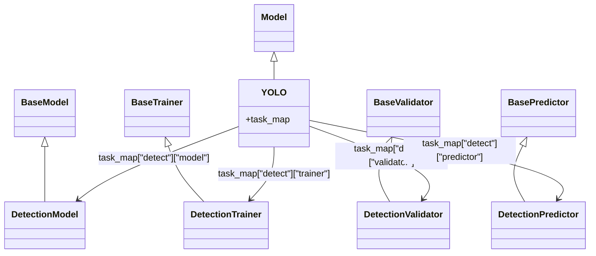

**本质上是一套“按 task 取类”的分发表机制**，可理解成一种**轻量级注册表/映射机制**，延迟决定具体类，

`self._smart_load()`，去找`task_map`，

父类定义流程，子类提供具体实现

ray tune：用于**大规模实验执行和超参数搜索**，理解成一个“**自动试参数的总调度器**”，

再具体一点，它主要做四件事：

1. **定义搜索空间**
    比如学习率从某个范围采样，或者 batch size 在几个值里选。Ray Tune 提供了专门的 search space API。
2. **并行跑很多组实验**
    Ray Tune 用 Ray actors 并行执行多个 trial。每个 trial 可以理解成“一组参数对应的一次训练/评估”。
3. **用搜索算法和调度器提高效率**
    它支持随机搜索、网格搜索，也支持 ASHA、HyperBand、PBT，还能集成 Optuna、Ax、Nevergrad 等优化工具。
4. **收集结果并挑最好的一组参数**
    现在官方推荐的入口是 `tune.Tuner`，跑完会返回结果对象，方便你分析哪组参数最好。

还会：

- 随机搜索
- 贝叶斯优化
- 早停
- 并行跑很多实验
- 分布式跑在多机多卡上
- 管理深度学习训练过程中的实验

比GridSearchCV更大更灵活，

