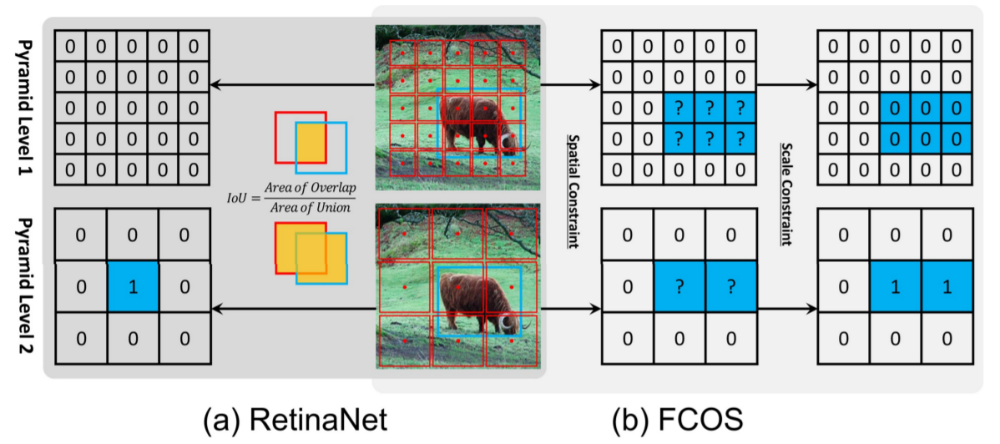
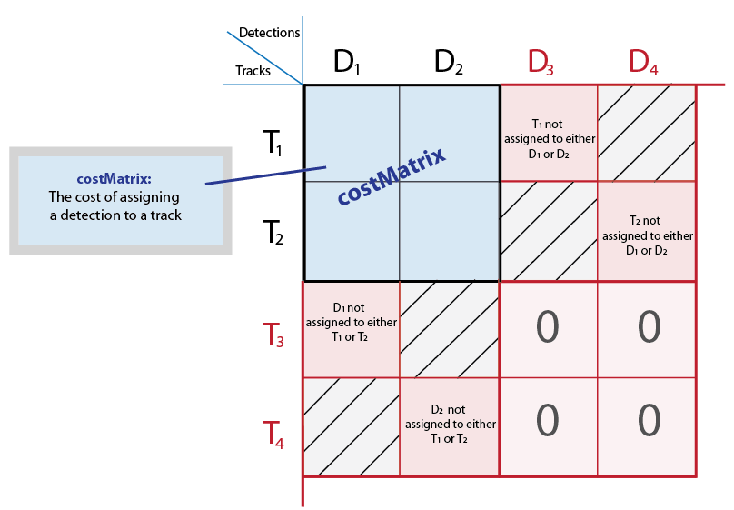
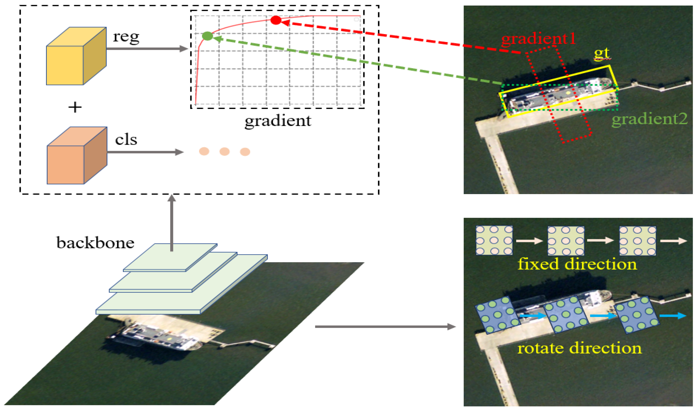
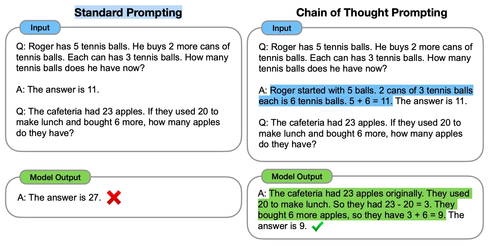
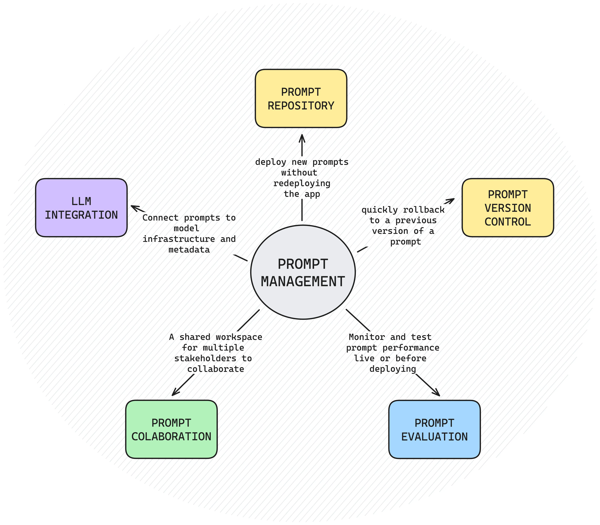

# OTA

Optimal Transport Assignment，把正负样本分配，建模成一个最优传输（Optimal Transport）问题，即GT 是“需求端”，预测框是“供给端”，代价 = 分类 + 回归，找一个 **全局最优匹配方案**

**直观示意：**





**优点：**不靠硬 IoU 阈值、分类 & 回归联合考虑、正样本数量**自适应**、对小目标更友好（能“抢救”一些低 IoU 但语义对的预测）

**问题：**计算复杂、需要解 OT / Sinkhorn、每个 iteration 都要算匹配，**慢**

## SimOTA

工程化但不低级的版本，保留 OTA 的“自适应 + 全局视角”，但把计算压到可实用，本质是只在局部候选集上做贪心最优匹配

**核心流程：**

- 候选筛选（缩小搜索空间）：对每个 GT，只考虑 **中心区域内的预测点**，top-k IoU 最大的预测
- 计算匹配代价：$cost = L_{cls} + \lambda L_{IoU}$，cls：BCE / focal，IoU：1 − IoU / GIoU / CIoU
- 动态正样本数（Dynamic-K）：$K = \sum_{i \in top\text{-}n} IoU_i$，小目标 → K 小，大目标 → K 大
- 贪心选择最小 cost 的 K 个预测：若冲突（一个预测被多个 GT 选中）→ 选择 cost 最小的那个 GT

**示意图：**





# CoT

Chain of Thought，思维链




让大模型在回答之前，把中间推理过程一步一步写出来，把 **隐含的逻辑显式化**，把 **复杂问题拆成若干小步骤**

**常见 CoT 形式：**

- 显式 CoT：请一步一步推理，并给出最终答案
- Few-shot CoT：例子1：问题 + 详细推理，现在请你解决下面的问题
- 隐式 CoT：请在内部完成推理，只输出最终结论


# Prompt Engineering




通过结构化语言，约束模型的行为空间，本质上 Prompt ≈ **条件概率的条件**

**标准 Prompt 结构：**

```text
【角色】
你是一名……

【任务】
你的目标是……

【约束】
- 不要……
- 必须……
- 风格为……

【示例】（可选）
输入 → 输出

【现在开始】
```

**常见技巧：**

| 技巧               | 说明         |
| ------------------ | ------------ |
| Role Prompt        | 设定模型身份 |
| Task Decomposition | 拆解任务     |
| Output Constraint  | 约束输出格式 |
| Few-shot           | 给示例       |
| CoT Prompting      | 强制推理     |
| Self-check         | 让模型自检   |


