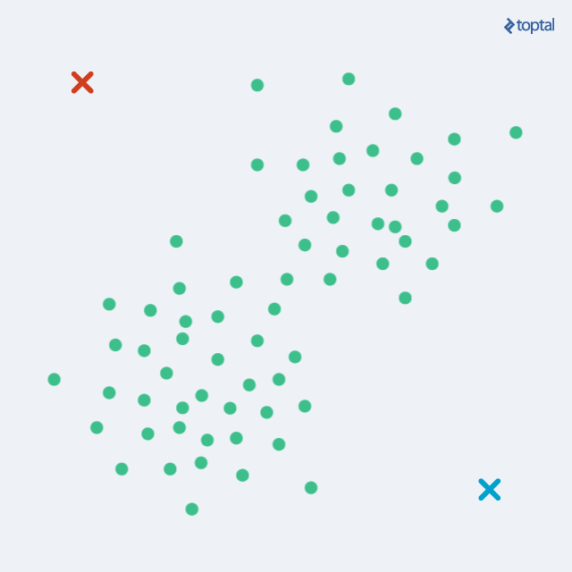
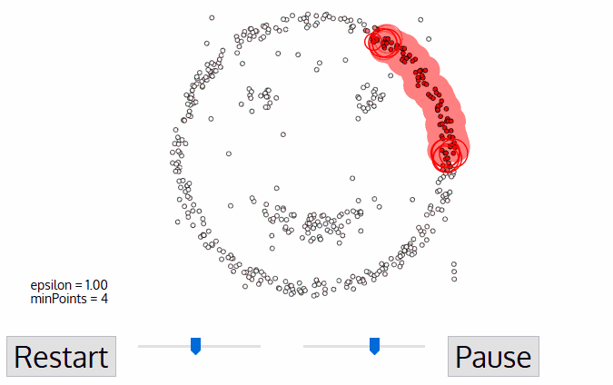

# 概述

人类学习: 记忆和归纳

机器学习: 通过历史数据掌握如何实现从特征到目标值的映射, 从数据中学习一种模式pattern, 不需要人类给出明确的规则, 即便数据本身存在噪声noisy data, 无法处理不存在任何关系的数据

## 问题分类

根据输入和输出的类型, 将计算机问题分类:


## 重点

- 数据质量, GIGO(Garbage In Garbage Out)
- 变量间关系
- 处理噪声

## 应用领域

- 图像识别与计算机视觉(Computer Vision): 人脸识别、自动驾驶、医疗影像分析、图像分类与标注
- 自然语言处理(NLP): 语音识别、机器翻译、情感分析、文本生成、聊天机器人
- 推荐系统: 电子商务、影视推荐、社交网络推荐
- 金融领域: 信用评分、欺诈检测、算法交易、投资组合管理
- 医疗健康: 疾病预测、个性化医疗、药物发现、健康监测
- 智能交通与自动驾驶: 自动驾驶汽车、交通预测、车联网(V2X)
- 智能家居与物联网: 智能家居、环境监控、智能安防
- 体育分析: 运动员表现分析、比赛结果预测、虚拟体育教练
- 制造与工业自动化: 预测性维护、质量控制、自动化生产

## 分类

- 按学习方式分类:

    - 监督学习(Supervised Learning): 数据有标记

        - 回归(Regression): 用于预测连续值的模型, 例如线性回归、Ridge回归、Lasso回归等
        - 分类(Classification): 用于预测离散类别的模型, 例如逻辑回归、支持向量机、决策树、随机森林、k近邻、朴素贝叶斯等
    - 无监督学习(Unsupervised Learning): 数据无标记

        - 聚类(Clustering): 用于将数据分组的模型, 例如K均值聚类、层次聚类、DBSCAN等
        - 降维(Dimensionality Reduction): 用于减少特征数量的模型, 例如主成分分析(PCA)、线性判别分析(LDA)、t分布随机近邻嵌入(t-SNE)等
        - 关联规则学习(Association Rule Learning): 用于发现数据集中项之间关系的模型, 例如 Apriori算法、Eclat算法等
    - 半监督学习(Semi-Supervised Learning)

        - 结合了监督学习和无监督学习的方法, 使用大量未标记的数据和少量标记的数据来构建模型
    - 强化学习(Reinforcement Learning)

        - 基于奖励机制的学习方法, 例如Q-Learning、深度Q网络(DQN)、策略梯度方法等
- 按模型复杂度分类:

    - 线性模型(Linear Models): 如线性回归、逻辑回归
    - 非线性模型(Non-linear Models): 如带核函数的支持向量机(SVM with Kernel)、神经网络
- 按模型的结构分类:

    - 生成模型(Generative Models): 可以生成新的数据点, 如朴素贝叶斯、隐马尔可夫模型(HMM)
    - 判别模型(Discriminative Models): 仅用于分类或回归, 如逻辑回归、支持向量机

## 步骤

1. 定义问题: 首先我们需要做业务理解, 明确问题的性质和类型, 这个会直接影响到后续的数据收集、特征工程、选择算法以及评估指标的确定

2. 数据收集: 机器学习模型的训练需要大量的数据, 这些数据可能包含结构化数据(数据库、Excel电子表格等)、非结构化数据(文本、图像、音频、视频等)、其他类型的数据集

3. 数据清洗: 数据清洗要确保数据质量高且适合模型训练, 具体包括: 缺失值和异常值处理、数据标准化和归一化、特殊编码、特征工程等

4. 数据划分: 为了评估机器学习模型的泛化能力, 需要将数据划分为训练集和测试集, 除此以外, 还可能使用交叉验证的方式将数据分成多个子集, 每个子集轮流作为验证集, 从而对模型的超参数进行调整

5. 模型选择: 针对分类问题、回归问题、聚类问题、深度学习, 我们选择的机器学习算法或模型是不一样的

6. 模型训练: 使用训练集对模型进行训练, 使模型能够学习到输入特征与目标之间的关系, 此外, 每个机器学习算法都有超参数, 这些参数需要根据数据和任务来调优

7. 模型评估: 模型评估主要的目标是确定模型在新数据(测试集)上的表现, 确保模型没有出现过拟合(overfitting)或欠拟合(underfitting), 如下图所示, 欠拟合会导致模型的预测效果糟糕, 而过拟合会导致模型缺乏泛化能力, 即在测试集和新数据上表现欠佳, 当然, 为了提高模型的性能或适应性, 可能还要通过正则化、集成学习、算法调整等方式进行调优

8. 模型部署: 当你对模型的性能感到满意时, 可以将模型部署到生产环境中, 进行实时预测或批量预测, 我们通过监控模型在实际应用中的表现, 确保其持续保持较好的预测效果, 如果模型性能下降, 可能需要重新训练或调整

9. 模型维护: 机器学习模型不是一成不变的, 随着时间的推移, 模型可能需要通过重新训练、增量学习等方式来维持其性能


---


# 模型评估

不能只看准确率，推荐用混淆矩阵：详细展示分类模型性能, 适用于二分类和多分类任务, 多分类的混淆矩阵为n*n方阵

## 二分类混淆矩阵

|                          | **预测为正类(Positive)** | **预测为负类(Negative)** |
| ------------------------ | ------------------------ | ------------------------ |
| **实际为正类(Positive)** | True Positive(TP)        | False Negative(FN)       |
| **实际为负类(Negative)** | False Positive(FP)       | True Negative(TN)        |

## 指标

1. 准确率(Accuracy):  $\text{准确率} = \frac{\text{TP} + \text{TN}}{\text{TP} + \text{FP} + \text{FN} + \text{TN}}$

2. 精确率/查准率(Precesion): $精确率 = \frac{\text{TP}}{\text{TP} + \text{FP}}$, 预测为正类的样本中实际上属于正类的比例

3. 召回率(Recall)/查全率或真正例率(True Positive Rate): $召回率 = \frac{\text{TP}}{\text{TP} + \text{FN}}$, 实际为正类的样本中被预测为正类的比例

4. F1分数(F1 Score): $\text{F1分数} = \frac{2}{\frac{1}{\text{精确率}} + \frac{1}{\text{召回率}}} = 2 \times \frac{\text{精确率} \times \text{召回率}}{\text{精确率} + \text{召回率}}$, 精确率和召回率的调和平均数, 适用于在两者之间有权衡的情况

5. 特异度(Specificity): $\text{特异度} = \frac{\text{TN}}{\text{TN} + \text{FP}}$, 实际为负类的样本中预测为负类的比例

6. 假正例率(False Positive Rate): $\text{假正例率} = 1 - \text{特异度}$

7. ROC(Receiver Operating Characteristic Curve): 绘制了召回率与假正例率的关系

    ​

8. AUC(Area Under the Curve): ROC曲线下的面积, 衡量模型区分正类和负类的能力, 范围[0, 1], 越靠近1表示模型区分正负类的能力越强

    1. 0.5 < AUC < 1: 模型优于随机猜测, 有预测价值
    2. AUC = 0.5: 模型类似随机猜测, 没有预测价值
    3. AUC < 0.5: 模型不如随机猜测, 反向预测则优于随机猜测


---


# 参数调优

超参数: 机器学习中模型的参数类型之一, 在训练过程之前设置, 控制模型的学习过程和结构特性, 不同于模型训练过程中由数据自动学习的参数

## 常见超参数

- 通用超参数: 学习率、正则化参数、批量大小(Batch Size)、迭代次数(Number of Epochs)
- 决策树与随机森林: 树的最大深度(Max Depth)、最小分裂样本数(Min Samples Split)、树的数量(Number of Trees):
- 支持向量机(SVM): 

    - 核函数(Kernel): 用于将数据映射到高维空间(如 `linear`​、`rbf`​)
    - 正则化参数(C): 控制模型的复杂度和平衡误差
    - 核的系数(Gamma): 控制高斯核的宽度
- 神经网络: 隐藏层的数量和大小、激活函数(Activation Function)、优化器(Optimizer)

## 优化超参数

1. 网格搜索(Grid Search): 通过穷举法遍历给定的超参数空间, 找到最优的超参数组合

2. 随机搜索(Random Search): 随机采样部分参数组合, 效率更高

3. 贝叶斯优化(Bayesian Optimization): 使用概率模型估计超参数性能

4. 进化算法(Evolutionary Algorithms): 使用遗传算法等进行优化

5. 自动机器学习(AutoML): 自动化选择模型、超参数和特征工程

6. 交叉验证Cross Validation: 将训练集分成多个子集, 通过在不同的训练集和验证集上进行多次训练和评估, 对模型的预测效果进行综合评判

    - **K-Fold交叉验证**: 最常用的交叉验证方法, 将数据集划分为K个子集, 每次选取其中一个子集作为验证集, 剩下的K-1个子集作为训练集, 对每个子集重复这个过程, 完成K次训练和评估并将平均值作为模型的最终性能评估

        


---


# k最近邻

kNN, 有监督, 用于分类和回归的非参数统计方法, 用历史数据中与新实例最近的k个数据进行分类或预测, 没有显式的学习训练过程, 不依赖于对数据分布的假设, 简单朴素, 适用于小数据集上的分类和回归, 可适应复杂的数据模式

缺点: 计算效率低, 噪声敏感, 结果依赖于k的取值(可导致过拟合或欠拟合)和样本均衡程度(可导致类别偏倚Class Imbalance Bias, A多B少时可能都预测为A)

两个关键问题: k值和度量距离

## 距离的度量

用距离衡量特征空间中两个实例的相似度

常用距离度量: 闵氏距离、马氏距离、余弦距离、编辑距离

### 闵氏距离

闵可夫斯基距离(Minkowski Distance), 对于两个$\small{n}$维向量$\small{\bold{x}=(x_{1}, x_{2}, \cdots, x_{n})}$和$\small{\bold{y}=(y_{1}, y_{2}, \cdots, y_{n})}$, 距离为: $d(\bold{x}, \bold{y}) = (\sum_{i=1}^{n}{|x_{i} - y_{i}|}^{p})^{\frac{1}{p}}$, 其中$\small{p \ge 1}$, 虽然$\small{p \lt 1}$可以计算, 但不再严格满足距离的定义, 通常不被视为真正的距离

​

当$\small{p = 1}$时, 闵氏距离退化为**曼哈顿距离**, 即

$$
d(\bold{x}, \bold{y}) = \sum_{i=1}^{n}|x_{i} - y_{i}|
$$

​

当$\small{p = 2}$时, 闵氏距离退化为**欧几里得距离**, 即

$$
d(\bold{x}, \bold{y}) = \sqrt{\sum_{i=1}^{n}(x_{i} - y_{i})^{2}}
$$

​

当$\small{p \to \infty}$时, 闵氏距离成为**切比雪夫距离**, 即

$$
d(\bold{x}, \bold{y}) = \underset{i}{max}(|x_{i} - y_{i}|)
$$

​

## 原生实现

```python
import heapq
import statistics


def predict_by_knn(history_data, param_in, k=5):
	"""用kNN做预测
    :param history_data: 历史数据
    :param param_in: 模型的输入
    :param k: 邻居数量(默认值为5)
    :return: 模型的输出(预测值)
    """
    neighbors = heapq.nsmallest(k, history_data, key=lambda x: (x - param_in) ** 2)
    return statistics.mean([history_data[neighbor] for neighbor in neighbors])
```

## Numpy实现

```python
import numpy as np
from scipy import stats


def euclidean_distance(u, v):
    """计算两个n维向量的欧式距离"""
    return np.sqrt(np.sum(np.abs(u - v) ** 2))


def make_label(X_train, y_train, X_one, k):
    """
    根据历史数据中k个最近邻为新数据生成标签
    :param X_train: 训练集中的特征
    :param y_train: 训练集中的标签
    :param X_one: 待预测的样本(新数据)特征
    :param k: 邻居的数量
    :return: 为待预测样本生成的标签(邻居标签的众数)
    """
    # 计算x跟每个训练样本的距离
    distes = [euclidean_distance(X_one, X_i) for X_i in X_train]
    # 通过一次划分找到k个最小距离对应的索引并获取到相应的标签
    labels = y_train[np.argpartition(distes, k - 1)[:k]]
    # 获取标签的众数
    return stats.mode(labels).mode


def predict_by_knn(X_train, y_train, X_new, k=5):
    """KNN算法
    :param X_train: 训练集中的特征
    :param y_train: 训练集中的标签
    :param X_new: 待预测的样本构成的数组
    :param k: 邻居的数量(默认值为5)
    :return: 保存预测结果(标签)的数组
    """
    return np.array([make_label(X_train, y_train, X, k) for X in X_new])


y_pred = predict_by_knn(X_train, y_train, X_test)
y_pred == y_test
```

`np.partition(list, k)`: 对数组进行一次划分, 将k个比较小的元素放在数组的左边

`np.argpartition(list, k)`: 是把k个较小元素的**索引**放在数组的左边

`stats.mode()`: 获得众数


---


# 决策树和随机森林

基于树结构的监督学习算法, 数据形式易理解, 用于分类和回归(分类解决离散问题, 回归解决连续问题), 决策树的构建可视为计算以特征空间为前提的条件概率的过程, 可能产生过度匹配

两类结点: 内部结点(表示一个特征属性上的测试)、叶结点(决策的结果: 分类标签/回归目标值)

核心三步骤: 特征选择、决策树构建、决策树剪枝

## 特征选择

筛选出跟分类结果相关性较高的特征, 即分类能力较强的特征, 放在决策树靠上的位置

**纯度purity:** 若一个特征能够使得分类后的分支结点尽可能属于同一类别, 则该结点有着较高的纯度

**信息熵:** 数据集不确定性的度量, 熵越大, 数据的不确定性越大, 要确定它所需获取的信息量就越大, 熵越低, 数据纯度越高, 不确定性越小

- 不确定性: $H(D) = -\sum_{i = 1}^{k} P(x_i)log_2P(x_i)$, 其中$\small{D}$代表数据集, $\small{k}$代表类别的总数, $\small{P(x_i)}$表示数据集中第$\small{i}$类样本的比例(概率), 用$\small{x_1}$和$\small{x_2}$来分别表示甲获胜和乙获胜, 显然当$\small{P(x_1)=0.5}$, $\small{P(x_2)=0.5}$时, $\small{H=1}$, 不确定性最大, 当$\small{P(x_1)=1}$, $\small{P(x_2)=0}$时, $\small{H=0}$, 不确定性最小, 当$\small{P(x_1)=0.8}$, $\small{P(x_2)=0.2}$时, $\small{H \approx 0.72}$

    - 知道的信息越多, 数据集的不确定性越小

- 条件熵: $H(D|A) = \sum_{v \in A}\frac{|D_{v}|}{|D|}H(D_{v})$, 表示在给定特征$\small{A}$的条件下数据集$\small{D}$的不确定性, 让$\small{v}$取得特征$\small{A}$所有可能的取值, 其中$\small{D_{v}}$代表特征$\small{A}$取值为$\small{v}$的样本子集, $\small{\frac{|D_{v}|}{|D|}}$代表权重, 即特征取值为$\small{v}$的样本比例

    - 可证明$\small{H(D) \ge H(D|A)}$, 即多了特征$\small{A}$的信息, $\small{D}$的不确定性下降了(等号成立时, 我们获取的信息与要研究的内容没有关系)
    - 相关的信息也能够降低/消除不确定性

- 信息增益information gain: $g(D, A) = E(D) - E(D|A)$, 得到特征$\small{A}$的信息后数据集$\small{D}$的不确定性减少的程度，但是当某个特征取值较多时, 该特征的信息增益计算结果就会比较大, 所以使用信息增益选择特征时, 会偏向于取值较多的特征

    ```python
    def entropy(y):
        """
        计算信息熵
        :param y: 数据集的目标值
        :return: 信息熵
        """
        _, counts = np.unique(y, return_counts=True)
        prob = counts / y.size
        return -np.sum(prob * np.log2(prob))
    
    def info_gain(x, y):
          """
          计算信息增益
          :param x: 给定的特征
          :param y: 数据集的目标值
          :return: 信息增益
          """
          values, counts = np.unique(x, return_counts=True)
          new_entropy = 0
          for i, value in enumerate(values):
              prob = counts[i] / x.size
              new_entropy += prob * entropy(y[x == value])
          return entropy(y) - new_entropy
    ```

- 信息增益比gain ratio: $R(D, A) = \frac{g(D, A)}{E_{A}(D)}$, 其中$\small{E_{A}(D) = -\sum_{i=1}^{n}{\frac{|D_{i}|}{|D|}log_{2}\frac{|D_{i}|}{|D|}}}$, $\small{n}$表示特征$\small{A}$的取值个数, $\small{E_{A}(D)}$就是特征$\small{A}$的信息熵, 信息增益比就是特征$\small{A}$的信息增益和特征$\small{A}$的信息熵的比值

    ```python
    def info_gain_ratio(x, y):
        """
        计算信息增益比
        :param x: 给定的特征
        :param y: 数据集的目标值
        :return: 信息增益比
        """
        return info_gain(x, y) / entropy(x)
    ```

- 基尼指数Gini index/基尼不纯度Gini impurity: $G(D) = 1 - \sum_{k=1}^{n}{p_{k}}^{2}$, 范围(0, 1), 纯度越高指数越小, 其中数据集有$\small{n}$个类别, 样本属于第$\small{k}$个类别的概率为$\small{p_{k}}$

    ```python
    def gini_index(y):
        """
        计算基尼指数
        :param y: 数据集的目标值
        :return: 基尼指数
        """
        _, counts = np.unique(y, return_counts=True)
        return 1 - np.sum((counts / y.size) ** 2)
    ```

    如果数据集$\small{D}$根据特征$\small{A}$划分为$\small{k}$个部分, 则在给定特征$\small{A}$的前提条件下, 数据集的基尼指数可以定义为: $G(D, A) = \sum_{i=1}^{k}\frac{|D_{i}|}{|D|}G(D_{i})$

    ```python
    def gini_with_feature(x, y):
        """
        计算给定特征后的基尼指数
        :param x: 给定的特征
        :param y: 数据集的目标值
        :return: 给定特征后的基尼指数
        """
        values, counts = np.unique(x, return_counts=True)
        gini = 0
        for value in values:
            prob = x[x == value].size / x.size
            gini += prob * gini_index(y[x == value]) 
        return gini
    ```

**三种算法：**

- ID3算法: 基于信息增益进行特征选择的算法, 步骤: 计算整体熵, 分别计算交叉熵, 求出信息增益, 最大的为决策优先分类的特征, 递归使用, 若有某一类熵为0则停止分裂


- C4.5算法: ID3算法的延伸和优化, 选择信息增益率最大的特征

- CART算法: 基于基尼指数进行特征选择, 二叉树特征取值为是/否, 既能分类, 也能回归

## 决策树构建

一个递归过程, 选定特征后进行**数据分裂**, 即根据该特征将数据集分成两个或多个子集(两个子集对应二叉树, 多个子集对应多叉树), 每个子集对应于特征的不同取值, 对每个自己重复特征选择和数据分裂的动作, 直到满足停止条件

- 常见停止条件: 

    - 树达到预设的深度
    - 当前结点的样本数量少于预设的阈值
    - 结点上所有样本属于同一个类别
    - 信息增益或Gini指数的变动低于某个阈值
- 特征连续值的处理: 遍历特征所有可能的取值, 找到切分点$\small{x}$让切分后的子集在信息增益比或基尼指数方面达到最优, 在数据分裂时以$\small{x}$将数据划分为$\small{D_{1}}$和$\small{D_{2}}$两个子集, 其中$\small{D_{1}}$包含特征值小于等于$\small{x}$的样本, $\small{D_{2}}$包含特征值大于$\small{x}$的样本
- 特征缺失值的处理: 

    - C4.5算法: 加权分配, 该特征缺失的样本被分配到每个子集, 但是不同的子集中该样本被赋予的权重是不一样的, 这个权重会根据该特征在各个类别中的比例进行计算
    - CART算法: 为每个特征创建一个默认分支, 将存在缺失值的样本引导到默认分支进行处理, 在计算基尼指数时, 可以选择是否将缺失值的样本纳入计算

## 决策树剪枝

减少树的复杂性, 避免过拟合风险

- 后剪枝(post-pruning): 在决策树构建完成后, 通过评估和移除一些不必要的分支来简化树结构

    - 通常从叶结点开始, 至底向上评估每个结点, 测试将其替换为叶结点(将该结点及其子树剪掉)是否能提高模型的性能(在验证集上的预测效果)
    - 减少过拟合风险的同时, 能较好保留对数据的拟合能力, 但计算量较大, 若无合适的验证集, 会影响剪枝效果
- 预剪枝(pre-pruning): 在构建决策树的过程中动态决定是否停止分裂某个结点, 分裂前评估当前结点是否应该继续分裂, 可以避免生成过于复杂的树

    - 在决策树构建阶段就减少了不必要的分裂, 降低了模型的复杂性, 但存在欠拟合风险, 因过早停止分裂可能遗漏潜在的重要决策规则

## 随机森林

基于决策树的集成学习算法, 构建多个决策树并将其预测结果进行投票(分类)或平均(回归), 来提高模型的准确性和鲁棒性

集成学习: 组合多模型预测结果提高整体模型性能, 核心思想是多个模型的组合往往比单个模型更有效, 通过不同的模型捕捉到数据的不同特征, 从而降低模型的过拟合风险, 提升模型的泛化能力


### 基本工作流程

1. Bootstrap抽样: 从原始训练数据集中随机抽取若干个样本(有放回抽样), 形成多个不同的子集, 每个子集用于训练一棵决策树
2. 构建决策树: 对于每棵树在进行结点分裂时, 不必考虑所有特征, 而是随机选择一部分特征实现数据分裂, 增加了模型的多样性, 减少了树之间的相关性
3. 集成学习: 分类任务用投票即多数表决决定最终分类结果, 回归任务对每棵树的预测结果求均值作为最终的预测结果

### 优点

- 通过集成多个决策树, 能够有效提高模型的准确性
- 由于引入了随机性, 随机森林通常比单棵决策树更不容易过拟合
- 随机森林可以提供特征的重要性评分, 帮助理解模型
- 能够处理大规模数据集和高维数据

| **属性**         | **决策树**           | **随机森林**       |
| ---------------- | -------------------- | ------------------ |
| **模型复杂度**   | 简单                 | 较复杂             |
| **抗过拟合能力** | 差                   | 强                 |
| **计算效率**     | 高                   | 较低               |
| **结果稳定性**   | 易受单一数据变化影响 | 稳定               |
| **适用场景**     | 数据较少、简单问题   | 数据较多、复杂问题 |


---


# 朴素贝叶斯

缺点: 特征间相关性大时分类效果差

解决: 半朴素贝叶斯、AODE、K依赖朴素贝叶斯、朴素贝叶斯网络、高斯混合朴素贝叶斯

应用场景: 文本分类、推荐系统、医药诊断

## 原理

贝叶斯定理: $P(A|B) = \frac{P(B|A)}{P(B)} \cdot P(A)$, 其中$\small{P(A)}$是事件$\small{A}$发生的先验概率, $\small{P(B|A)}$是在事件$\small{A}$发生的条件下事件$\small{B}$发生的条件概率(似然性), $\small{P(B)}$是事件$\small{B}$发生的全概率, $\small{P(A|B)}$是在事件$\small{B}$发生的条件下事件$\small{A}$发生的条件概率, 即后验概率

贝叶斯分类器: 一类分类算法的总称, 解决分类任务, 均以贝叶斯定理为基础

条件独立性假设: 用于分类的特征在类确定的条件下都是独立的

朴素贝叶斯算法: 基于贝叶斯定理和特征条件独立性假设的分类算法, 假设我们有一个特征集合$\small{X = {x_1, x_2, \ldots, x_n}}$和一个类别$\small{C}$, 朴素贝叶斯算法假设: $P(X|C) = P(x_1|C) \cdot P(x_2|C) \cdot...\cdot P(x_n|C)$, 大大简化了计算复杂性, 允许只计算每个特征在给定类别下的概率, 而不需要考虑特征之间的相互作用

## 流程

- 训练阶段: 计算每个类别的先验概率和每个特征在各个类别下的条件概率

    - 计算先验概率: $P(C_{i}) = \frac{n_{i}}{n}$, 其中$\small{C_{i}}$表示类别, $\small{n_{i}}$是类别$\small{C_{i}}$的样本数量, $\small{n}$是总样本容量
    - 计算条件概率: $P(x_{j}|C_{i}) = \frac{n_{i,j}}{n_{i}}$, 其中$\small{n_{i,j}}$是在类别$\small{C_{i}}$中, 特征$\small{x_{j}}$出现的次数
- 预测阶段: 给定一个待分类样本$\small{X}$, 朴素贝叶斯算法通过以下步骤来计算其属于每个类别的后验概率: $P(C_{i}|X) = \frac{P(X|C_{i})}{P(X)} \cdot P(C_{i})$, 其中$\small{P(X)}$对应到每个类别都是一个常量, 可忽略, 再结合独立性假设有: $P(C_{i}|X) \propto P(C_{i}) \cdot P(x_1|C_{i}) \cdot P(x_2|C_{i}) \cdot \ldots \cdot P(x_n|C_{i})$, 可选择具有最高后验概率的类别作为预测结果

## 优点

- 逻辑简单容易实现, 适合大规模数据集
- 运算开销较小: 预测需要用到的概率在训练阶段都已经准好了, 新数据到来后只需获取对应的概率值并进行简单的运算就能获得预测的结果
- 受噪声和无关属性影响小

## numpy实现

```python
from sklearn.datasets import load_iris
from sklearn.model_selection import train_test_split
import numpy as np
import pandas as pd

iris = load_iris()
X, y = iris.data, iris.target
X_train, X_test, y_train, y_test = train_test_split(X, y, train_size=0.8, random_state=3)


def naive_bayes_fit(X, y):
    """
    :param X: 样本特征
    :param Y: 样本标签
    :returns: 二元组 - (先验概率, 似然性)
    """
    # 计算先验概率
    clazz_labels, clazz_counts = np.unique(y, return_counts=True)
    prior_probs = pd.Series({k: v / y.size for k, v in zip(clazz_labels, clazz_counts)})
    # 拷贝数组创建副本
    X = np.copy(X)
    # 保存似然性计算结果的字典
    likelihoods = {}
    for j in range(X.shape[1]):  # 对特征的循环
        # 对特征进行等宽分箱(简单地离散化处理)
        X[:, j] = pd.cut(X[:, j], bins=5, labels=np.arange(1, 6))
        for i in prior_probs.index: 	# 对每一个类别i, 每一列特征j
            # 按标签类别拆分数据并统计每个特征值出现的频次
            x_prime = X[y == i, j]
            x_values, x_counts = np.unique(x_prime, return_counts=True)
            for k, value in enumerate(x_values):  # 对不同特征值的循环
                # 计算似然性并保存在字典中(字典的键是一个三元组 - (标签, 特征序号, 特征值))
                likelihoods[(i, j, value)] = x_counts[k] / x_prime.size
    return prior_probs, likelihoods


p_ci, p_x_ci = naive_bayes_fit(X_train, y_train)
print('先验概率: ', p_ci, sep='\n')
print('似然性: ', p_x_ci, sep='\n')


def naive_bayes_predict(X, p_ci, p_x_ci):
    """
    朴素贝叶斯分类器预测
    :param X: 样本特征
    :param p_ci: 先验概率
    :param p_x_ci: 似然性
    :return: 预测的标签
    """
    # 对特征进行等宽分箱(离散化处理)
    X = np.copy(X)
    for j in range(X.shape[1]):
        X[:, j] = pd.cut(X[:, j], bins=5, labels=np.arange(1, 6))
    # 保存每个样本对应每个类别后验概率的二维数组
    results = np.zeros((X.shape[0], p_ci.size))
    clazz_labels = p_ci.index.values
    for k in range(X.shape[0]):
        for i, label in enumerate(clazz_labels):
            # 获得先验概率(训练的结果)
            prob = p_ci.loc[label]
            # 计算获得特征数据后的后验概率
            for j in range(X.shape[1]):
                # 如果没有对应的似然性就取值为0
                prob *= p_x_ci.get((i, j, X[k, j]), 0)
            results[k, i] = prob
    # 根据每个样本对应类别最大的概率选择预测标签
    return clazz_labels[results.argmax(axis=1)]


y_pred = naive_bayes_predict(X_test, p_ci, p_x_ci)
y_pred == y_test
```


---


# 回归模型

用于预测连续型输出变量, 旨在找到输入变量和输出变量之间的映射关系, 包含机器学习最主要的建模思想

目标: 描述数据之间的关系、对未知数据做出预测

应用: 零售业、汽车电池、房产估价

## 分类

- 线性回归: 有监督, 默认目标值为高斯分布, e为均值为0的高斯分布

    - 一元线性回归: $y = \beta_0 + \beta_1 x + \varepsilon$, 其中$\small{y}$是目标变量(因变量), $\small{x}$是输入变量(自变量), $\small{\beta_{0}}$是截距, 表示$\small{x=0}$时的预测值, $\small{\beta_{1}}$是回归系数(斜率), 表示输入变量对输出变量影响的大小, $\small{\varepsilon}$是误差项, 用于表示数据中的随机噪声或无法解释的部分
    - 多元线性回归: $y = \beta_{0} + \beta_{1} x_{1} + \beta_{2} x_{2} + \cdots + \beta_{n} x_{n} + \varepsilon$, 也可以用向量的形式简化表示为$y = \mathbf{x}^{T} \mathbf{\beta} + \varepsilon$, 其中$\small{\mathbf{x} = [1, x_{1}, x_{2}, \dots, x_{n}]^{T}}$ 是包含截距的输入向量, $\small{\mathbf{\beta} = [\beta_{0}, \beta_{1}, \beta_{2}, \dots, \beta_{n}]^{T}}$是模型参数, $\small{\varepsilon}$是误差项
- 多项式回归: $y = \beta_{0} + \beta_{1} x + \beta_{2} x^{2} + \varepsilon$, 属于线性模型的扩展(因其对参数β的求解仍然是线性形式)
- 非线形回归: 完全放弃了线性假设, 模型形式可以是任意非线性函数
- 引入正则化项的回归: 岭回归、套索回归、弹性网络回归, 在线性回归基础上加入正则化项, 用于处理过拟合、多重共线性和特征筛选问题
- 逻辑回归: 用于分类

    - 二分类问题: 通过Sigmoid函数将线性组合的输入值映射到区间$\small{(0, 1)}$, 表示分类概率
    - 多分类问题: 扩展为softmax回归, $P(y=1|x) = \frac{1}{1 + e^{-(\beta_{0} + \beta_{1} x_{1} + \cdots + \beta_{n} x_{n})}}$

## 回归系数的计算

关键: 找到最佳的回归系数$\beta$, 能够最小化损失函数

### 最小二乘法

损失函数: $L(\mathbf{\beta}) = \sum_{i=1}^{m}(y_{i} - \hat{y}_{i})^{2}$, 其中, $\small{m}$表示样本容量, 带入回归模型, 有:

$$
L(\mathbf{\beta}) = \sum_{i=1}^{m}(y_{i} - \mathbf{x}_{i}^{T}\mathbf{\beta})^{2}
$$

矩阵形式表示为:

$$
L(\mathbf{\beta}) = (\mathbf{y} - \mathbf{X\beta})^{T}(\mathbf{y} - \mathbf{X\beta})
$$

其中, $\mathbf{y}$是目标值的向量, 大小为m×1, $\mathbf{X}$是特征矩阵, 大小为m×n, $\small{\mathbf{\beta}}$是回归系数的向量, 大小为n×1

对$L(\mathbf{\beta})$求导并令其为0, 有$\frac{\partial{L(\mathbf{\beta})}}{\partial{\mathbf{\beta}}} = -2\mathbf{X}^{T}(\mathbf{y} - \mathbf{X\beta}) = 0$, 整理后得到$\mathbf{\beta} = (\mathbf{X}^{T}\mathbf{X})^{-1}\mathbf{X}^{T}\mathbf{y}$, 对于矩阵XTX不满秩的情况, 可通过添加正则化项的方式使得矩阵可逆, 即可得线性回归的解析解:

$$
\mathbf{\beta} = (\mathbf{X}^{T} \mathbf{X} + \lambda \mathbf{I})^{-1} \mathbf{X}^{T} \mathbf{y}
$$

适合小规模数据集, 样本和特征数量少

### 梯度下降法

计算梯度方向进行参数迭代更新, 逐步逼近最小损失函数

梯度: 一个向量, 包含了目标函数在各个参数方向上的偏导数, $\nabla L(\mathbf{\beta}) = \left[ \frac{\partial{L}}{\partial{\beta_{1}}}, \frac{\partial{L}}{\partial{\beta_{2}}}, \cdots, \frac{\partial{L}}{\partial{\beta_{n}}} \right]$, 通过:

$$
\mathbf{\beta}^{\prime} = \mathbf{\beta} - \alpha \nabla L(\mathbf{\beta}) \\\mathbf{\beta} = \mathbf{\beta^{\prime}}
$$

更新参数$\beta $, 其中$\small{\alpha}$是学习率step size, 一般为较小正数, 用于控制每次更新的幅度, 过大可导致震荡不收敛, 过小则收敛缓慢

全梯度下降FGD(时空成本高)、随机平均梯度下降SAGD(每轮梯度更新结合上一轮梯度值)、小批量梯度下降(最常用)

SGD: 随机梯度下降, 每次迭代只使用一个随机样本计算梯度, 对特征尺度敏感, 需对特征标准化/归一化, 速度快, 适合大数据集, 可跳出局部最优解, 通常使用**学习率衰减策略**来促进收敛

## 回归模型的评估

指标:

1. 均方误差(MSE): $\text{MSE} = \frac{1}{m} \sum_{i=1}^{m}(y_{i} - \hat{y}_{i})^{2}$, 预测值与真实值误差的平方平均值

2. 均方根误差(RMSE): $\text{RMSE} = \sqrt{\text{MSE}} = \sqrt{\frac{1}{m} \sum_{i=1}^{m}(y_{i} - \hat{y}_{i})^{2}}$, 更直观地衡量误差的实际尺度(单位与目标变量一致)

3. 平均绝对误差(MAE): $\text{MAE} = \frac{1}{m} \sum_{i=1}^{m}|y_{i} - \hat{y}_{i}|$, 预测值与真实值误差的绝对值平均值

4. 决定系数($\small{R^2}$): $R^{2} = 1 - \frac{\text{SS}{\text{res}}}{\text{SS}{\text{tot}}}$, 其中$\small{\text{SS}{\text{res}} = \sum_{i=1}^{m}(y_{i} - \hat{y}_{i})^2}$为残差平方和, $\small{\text{SS}{\text{tot}} = \sum_{i=1}^{m} (y_{i} - \bar{y})^{2}}$为总平方和, 相对指标, 用于衡量模型对数据的拟合程度, 越接近1越好

    

    红色正方形面积和为总平方和, 蓝色正方形面积和为残差平方和

## 引入正则化项的回归

### 岭回归

在线性回归基础上引入L2正则化项, 防止模型过拟合

损失函数: $L(\mathbf{\beta}) = \sum_{i=1}^{m}(y_{i} - \hat{y}_{i})^{2} + \lambda \sum_{j=1}^{n}\beta_{j}^{2}$, 其中$\small{L2}$正则化项$\lambda \sum_{j=1}^{n}\beta_{j}^{2}$会惩罚较大的回归系数, 相当于缩小了回归系数的大小, 但不会使系数为0

### 套索回归

引入L1正则化项, 防止过拟合, 有特征选择功能, 适合高维数据

损失函数: $L(\mathbf{\beta}) = \sum_{i=1}^{m}(y_{i} - \hat{y}_{i})^{2} + \lambda \sum_{j=1}^{n}|\beta_{j}|$, 其中$\small{L1}$正则化项$\lambda \sum_{j=1}^{n}|\beta_{j}|$会将某些不重要的回归系数缩减为0, 从而实现特征选择

### 弹性网络回归

结合岭回归和套索回归的优点, 同时引入L1和L2正则化项, 适用于高维数据且特征之间存在相关

损失函数: $L(\mathbf{\beta}) = \sum_{i=1}^{m}(y_{i} - \hat{y}_{i})^{2} + \alpha \lambda \sum_{j=1}^{n}|\beta_{j}| + (1 - \alpha) \lambda \sum_{j=1}^{n}\beta_{j}^{2}$, 其中$\small{\alpha}$是控制L1和L2正则化的权重比例

## 多项式回归

自变量和因变量不是线性关系

## 逻辑回归

二分类算法, 可分类可回归, 基于梯度下降线性回归

核心思想: 通过Sigmoid函数将线性回归的输出映射到$\small{(0, 1)}$区间, 作为对分类概率的预测


---


# K-Means聚类

聚类Clustering: 通过度量特征相似度或者距离把数据分成若干类别, 无监督, 目标是发现数据内在的结构

聚类算法的分类: 基于距离的聚类、基于密度的聚类、层次聚类、谱聚类

K-Means: 基于原型的分区聚类方法, 目标是将数据集划分为K个簇, 并使每个簇内的数据点尽可能相似, 结果不稳定, 随K的初始值而变化, 实现简单, 收敛速度快, 无法解决样本不均衡问题, 易收敛到局部最优解, 受噪声影响大

## 步骤

1. 初始化簇中心: 随机选择K个样本(种子点)作为初始簇中心(质心)
2. 分配样本到最近的质心: 计算每个样本与所有质心的距离, 将样本分配到最近的簇
3. 更新质心: 计算每个簇的所有样本的均值, 并将其作为新的质心
4. 重复步骤2和步骤3, 直到质心收敛或达到预设的迭代次数

​

## 数学描述

K-Means算法的目标是最小化目标函数(总误差平方和):

$$
J = \sum_{i=1}^{K} \sum_{x \in C_{i}} {\lVert x - \mu_{i} \rVert}^{2}
$$

其中$\small{K}$是簇的数量, $\small{C_{i}}$表示第$\small{i}$个簇中的样本集合, $\small{\mu_{i}}$是第$\small{i}$个簇的中心, $\small{x}$是数据点, 属于NP困难组合优化问题, 实际求解时采用迭代方式寻求满意解: 首先随机选择$\small{K}$个点作为初始质心μ1, μ2, ⋯, μK, 对于每个数据点$\small{x_{j}}$, 计算到每个质心的距离, 选择距离最近的质心, 即: 

$$
C_{i} = \lbrace {x_{j} \ | \ {\lVert x_{j} - \mu_{i} \rVert}^{2} \le {\lVert x_{j} - \mu_{k} \rVert}^{2} \ \text{for all} \ k \ne i} \rbrace
$$

更新质心为簇中所有点的均值, 即: 

$$
\mu_{i} = \frac{1}{|C_{i}|}\sum_{x \in C_{i}} x
$$

重复上面两个动作, 直到质心不再变化或变化小于某个阈值, 这就确保了算法的收敛性

## 原生实现

```python
import numpy as np


def distance(u, v, p=2):
    """计算两个向量的距离"""
    return np.sum(np.abs(u - v) ** p) ** (1 / p)


def init_centroids(X, k):
    """随机选择k个质心"""
    index = np.random.choice(np.arange(len(X)), k, replace=False)
    return X[index]


def closest_centroid(sample, centroids):
    """找到跟样本最近的质心"""
    distances = [distance(sample, centroid) for i, centroid in enumerate(centroids)]
    return np.argmin(distances)


def build_clusters(X, centroids):
    """根据质心将数据分成簇"""
    clusters = [[] for _ in range(len(centroids))]
    for i, sample in enumerate(X):
        centroid_index = closest_centroid(sample, centroids)
        clusters[centroid_index].append(i)
    return clusters


def update_centroids(X, clusters):
    """更新质心的位置"""
    return np.array([np.mean(X[cluster], axis=0) for cluster in clusters])


def make_label(X, clusters):
    """生成标签"""
    labels = np.zeros(len(X))
    for i, cluster in enumerate(clusters):
        for j in cluster:
            labels[j] = i
    return labels


def kmeans(X, *, k, max_iter=1000, tol=1e-4):
    """KMeans聚类"""
    # 随机选择k个质心
    centroids = init_centroids(X, k)
    # 通过不断的迭代对数据进行划分
    for _ in range(max_iter):
        # 通过质心将数据划分到不同的簇
        clusters = build_clusters(X, centroids)
        # 重新计算新的质心的位置
        new_centroids = update_centroids(X, clusters)
        # 如果质心几乎没有变化就提前终止迭代
        if np.allclose(new_centroids, centroids, rtol=tol):
            break
        # 记录新的质心的位置
        centroids = new_centroids
    # 给数据生成标签
    return make_label(X, clusters), centroids
```


---


# DBSCAN聚类算法

基于密度去除噪音聚类算法

步骤: 

- 设定半径、最小聚类个数
- 随机挑选样本点, 半径内为同一个类别
- 若样本点周围没有大于最小聚类个数的样本则设置为异常值




---


# 集成学习算法

ensemble learning, 将多个单模型组合成一个综合模型的方式, 目标是通过多个弱学习器(分类效果略优于随机猜测的模型, 如果太强容易导致过拟合)的组合来构建强学习器, 从而克服单一模型可能存在的局限性, 获得比单一模型**更好的泛化能力**, 通常用于**需要高精度预测的场景**

计算开销大, 模型可解释性差, 超参数调优复杂

## 算法分类

- Bagging: 从训练数据中随机抽样生成多个数据子集, 在这些子集上训练多个模型, 并将它们的结果进行结合, 典例: 随机森林

    

- Boosting: 通过迭代训练多个模型, 在每一轮训练时, 重点关注前一轮预测**错误**的样本, 每个新模型的训练目标是弥补前一轮模型的不足

    - 分为AdaBoost、Gradient Boosting、XGBoost、CatBoost
    - 基本原理: 初始时对所有样本赋予相同的权重, 训练第一个模型时, 错误分类的样本权重会增加, 训练下一个模型时, 重点关注之前模型错误分类的样本, 最终将所有模型的结果**加权组合**(表现好的模型会有更高的权重), 得到最终的输出

    

- Stacking: 通过训练多个模型, 将它们的预测结果作为新特征输入到另一个模型(二级模型)中, 用二级模型来做最终的预测

    

## AdaBoost

Adaptive Boosting, 自适应提升算法, **提高前一轮被弱分类器分类错误的样本的权重**, 对多个弱分类器进行线性组合, **提高分类效果好的弱分类器的权重**

步骤：

1. **初始化样本权重**: 给每个训练样本分配一个相等的初始权重, 对于N个样本, 初始权重为$w_{i}^{(1)} = \frac{1}{N}, \ i = 1, 2, \cdots, N$, 其中$\small{w_{i}^{(1)}}$ 表示第i个样本的权重, 初始时权重相等
2. **训练弱学习器**: 在每一轮迭代中, AdaBoost会根据当前样本的权重训练一个弱分类器(例如决策树桩, 即深度为1的决策树), 弱分类器的目标是最小化加权误差, 对于第t轮训练得到的分类器模型(弱学习器)$h_t$, 计算其加权误差: $\varepsilon_{t} = \sum_{i=1}^{N} w_{i}^{(t)} \cdot I(y_{i} \neq h_{t}(x_{i}))$, 其中, $y_i$是第i个样本的真实标签, $\small{h_{t}(x_{i})}$是第t轮模型$h_t$对第i个样本$x_i$给出的预测结果(取值为1或-1), $\small{I(y_{i} \neq h_{t}(x_{i}))}$是指示函数, 当样本$x_i$被错误分类时函数取值为1, 否则函数取值为0
3. **更新分类器权重**: 计算第t轮分类器模型的权重$\alpha_t$, 并用它来更新每个样本的权重, 分类器权重$\alpha_t$的计算公式为: $\alpha_{t} = \frac{1}{2} ln \left( \frac{1 - \varepsilon_{t}}{\varepsilon_{t}} \right)$, 当分类器的误差较低时, $\small{\alpha_{t}}$的值较大, 说明该分类器的权重较大
4. **更新样本权重**: 根据当前分类器的表现, 更新样本的权重, 误分类样本的权重会增加, 正确分类样本的权重会减少, 样本权重的更新公式为: $w_{i}^{(t + 1)} = w_{i}^{(t)} \cdot e^{-\alpha_{t} y_{i} h_{t}(x_{i})}$
5. **归一化权重**: 对所有样本的权重进行归一化, 使得所有样本的权重和为1
6. **最终分类器**: AdaBoost的最终分类器是所有弱学习器的加权组合, 预测时通过**加权投票**来决定最终类别: $H(x) = \text{sign} \left( \sum_{t=1}^{T} \alpha_{t} h_{t}(x) \right)$, 其中$\small{\text{sign}}$是符号函数, 其定义为: $\text{sign}(z) = \begin{cases} +1 \ (z \ge 0) \ -1 \ (z \lt 0) \end{cases}$, 例如有3个弱学习器$\small{h_{1}(x)}$、$\small{h_{2}(x)}$、$\small{h_{3}(x)}$, 它们的输出分别是`+1`​、`-1`​和`+1`​, 对应的权重是$\small{\alpha_{1} = 0.5}$、$\small{\alpha_{2} = 0.3}$、$\small{\alpha_{3} = 0.2}$, 那么加权和为: $\sum_{t=1}^{3} \alpha_{t} h_{t}(x) = 0.5 \times 1 + 0.3 \times -1 + 0.2 \times 1 = 0.4$ 由于加权和`0.4`​为正, 符号函数会输出`+1`​, 表示最终预测类别为正类

## GBDT

Gradient Boosting Decision Trees, 基于梯度提升, 结合决策树优势, 通过一系列的弱分类器(决策树)逐步改进模型, 每次训练时通过减少前一个模型的误差(拟合残差)来提高模型的预测性能

使用梯度下降来最小化损失函数

- 损失函数: 

    - 回归任务: 损失函数为均方误差MSE
    - 分类任务: 损失函数为对数损失Log Loss

        - 二分类: $L(y, F(x)) = -y\log(p(x)) - (1 - y)\log(1 - p(x))$, 其中$\small{y}$是实际标签($\small{y \in \lbrace 0, 1 \rbrace}$, 表示类别0或1), $\small{p(x)}$是模型预测的样本x属于类别1的概率
        - 多分类: 需扩展损失函数和梯度计算, 多项式对数损失: 对每个类别k, $L(y, F(x)) = -\sum_{k=1}^{K} y_{k} \log(p_{k}(x))$, 其中$\small{K}$是类别总数, $\small{y_{k}}$是目标类别k的指示函数, $\small{p_k(x)}$是样本x属于类别k的预测概率

- 计算梯度: $\small{p(x)}$是通过模型输出F(x)转换得到的概率, 通常使用Sigmoid函数, 有: $p(x) = \frac{1}{1 + e^{-F(x)}}$, $\frac{\partial{L(y, F(x))}}{\partial{F(x)}} = p(x) - y$, 即梯度为p(x)−y

- 模型更新: 每一轮的更新都包括两步: 

    - 计算残差: 每轮迭代中, 计算当前模型的残差, 即$\delta_i=p(x_i)-y_i$, 表示每个样本的误差
    - 拟合残差: 使用新的基学习器(通常是决策树)来拟合这些残差, 分类任务中, 我们训练的决策树并不是拟合真实标签, 而是拟合残差, 即拟合当前模型的预测误差

    更新规则: $F_{m + 1}(x) = F_{m}(x) + \eta h_{m}(x)$, 其中$\small{F_{m}(x)}$是第m轮模型的输出, $\small{h_{m}(x)}$是第m轮训练出的弱学习器(通常是决策树), 它预测当前模型的残差, $\small{\eta}$是学习率, 控制每棵树的贡献大小, 这样逐步拟合残差最终生成的模型F(x)就是一个由多棵决策树组成的强学习器

## XGBoost

基于GBDT的顶级梯度提升模型: 

- 算法精度: 将损失函数展开到二阶导数使得梯度提升树模型更能逼近其真实损失
- 算法速度: 使用加权分位数sketch和稀疏感知算法, 通过缓存优化和模型并行来提高算法速度
- 算法泛化能力: 通过对损失函数加入正则化项、加性模型中设置缩减率和列抽样等方法, 防止模型过拟合

## LightGBM

Light Gradient Boosting Machine, 顶级Boosting算法框架, 本质仍然是GBDT算法, 被设计用于大规模数据集的处理, 特别是在需要高效率和低内存消耗的场景下, 在较小的数据集上优势并不明显, 可解释性差, 超参数调优难度大

针对XGBoost缺陷的改进版本, 更轻便、更高效, 又快又准: 

- 直方图算法: 通过将连续特征分箱
- 单边梯度抽样: GOSS, 通过采样方法在训练过程中保留梯度较大的样本, 减少计算量
- 互斥特征捆绑: EFB, 将一些互斥特征做组合, 减少特征空间的维度
- leaf-wise生长策略: 优先对当前叶子节点进行分裂来扩展树的深度


---


# 神经网络模型

通过多层神经元连接来完成复杂的非线性映射, 由多个层组成, 通常包括输入层、隐藏层和输出层, 通过权重调整和激活函数逐层传递和处理数据, 最终完成复杂数据的特征提取和学习, 深度学习的核心技术之一

可不断扩展模型边界, 对内部运行不需太多干涉, 能学习和拟合非常复杂的映射关系, 能根据输入自动调整其结构和参数, 适应性强, 可解释性差, 需要强大硬件支持, 超参数调优困难

训练过程: 通过**反向传播**算法和**梯度下降**法来优化权重, 以减少预测误差, 通过多层非线性转换能够学习到更加复杂的特征表示

## 基本构成

- **输入层**: 输入层神经元接收输入数据, 每个神经元通常对应一个输入特征, 输入层的任务是将输入数据传递给下一层的神经元
- **隐藏层**: 网络的核心部分, 负责对数据进行特征提取和处理, 每层的神经元通过权重和激活函数来进行数据处理, 多层隐藏层能提取数据中的高阶特征
- **输出层**: 输出层负责将隐藏层的结果转换为最终输出, 激活函数通常与问题类型有关
- **神经元**: 每个神经元都接收来自前一层神经元的输入, 进行加权求和, 再通过激活函数计算输出


## 工作原理

每个神经元的计算过程: $y = f \left( \sum_{i=1}^{n}w_{i}x_{i} + b \right)$, 其中$\small{x_{1}, x_{2}, \dots, x_{n}}$是输入特征, $\small{w_1, w_2, \dots, w_n}$是与输入对应的权重, $\small{b}$是偏置项, $\small{f}$是激活函数, 通常是非线性函数

前向传播: $\mathbf{a}^{[l]} = f \left( \mathbf{W}^{[l]} \mathbf{a}^{[l-1]} + \mathbf{b}^{[l]} \right)$, 其中, $\small{\mathbf{W}^{[l]}}$是第$l $层的权重矩阵, $\small{\mathbf{a}^{[l-1]}}$是是第$l $−1层的输出, $\small{\mathbf{b}^{[l]}}$是第$l $层的偏置项, $\small{f}$是激活函数

反向传播: 损失函数+梯度下降更新参数

$$
\theta^{\prime} = \theta - \eta \nabla L(\theta) \\ \theta = \theta^{\prime}
$$

其中$\small{\eta}$是学习率, $\small{\nabla L(\theta)}$是损失函数相对于参数的梯度

## 常用激活函数

- `Sigmoid`​函数: $f(x) = \frac{1}{1+e^{-x}}$, 将输入值映射到$\small{(0, 1)}$的范围内, 呈现出平滑的S型曲线, 适用于概率预测, 对于较大的正值或负值, 梯度会变得很小导致梯度消失问题从而影响深层网络的训练, 输出非零中心导致梯度更新不对称从而导致收敛变慢

- `Tanh`​函数(双曲正切函数): $f(x) = tanh(x) = \frac{e^{x} - e^{-x}}{e^{x} + e^{-x}}$, 将输入映射到$\small{(-1, 1)}$的范围内, S型曲线, 中心对称, 使梯度更新更对称更适合用于深层网络, 在极值附近梯度仍会趋向于零, 导致梯度消失问题

    

- `ReLU`​函数: $f(x) = max(0, x)$, 计算简单, 有效避免了梯度消失问题, 广泛应用于深层网络, 能够保持稀疏性, 许多神经元的输出为零, 有利于网络简化计算, 当输入为负数时ReLU的梯度为零, 若输入长期为负数, 神经元可能"死亡"并停止更新

- `Leaky ReLU`​函数: $f(x) = \begin{cases} x & (x \gt 0) \\ {\alpha}x & (x \le 0)\end{cases}$, 改进ReLU, 为输入小于零的部分引入了一个小的负斜率, 通常取值$\small{\alpha = 0.01}$, 使梯度不为零, 避免了死神经元问题, 网络更健壮, 负值斜率的选择对网络性能会有一些影响, 对模型的非线性表示能力没有显著提升


---


# 自然语言处理

Natural Language Processing, NLP, 依赖数据驱动和自动特征学习

## 词袋模型

Bag of Words, BoW, NLP中最简单的文本表示方法, 将文本中的每个单词看作一个'词袋', 忽略单词的顺序和语法, 只考虑每个单词出现的频率, 即词袋模型将文本转换为词频向量(TF)来表示文本, 最早期的文本表示方法, 无法捕捉词语的语义

**构造：**

- 构建词汇表: 首先扫描**所有文档**, 列出文本中所有的单词(重复的单词只保留一项), 形成一个词汇表
- 文本向量化: 将每个文档中的单词映射到词汇表中, 并统计每个单词的出现次数, 形成文档的向量表示

词汇表中没有`I`, 被停用

停用词: 特定语言中高频出现但对文本分析任务贡献较小的词

## 词向量

Word Embedding, 将每个单词映射到一个稠密的向量空间中, 从而使计算机能够理解和处理文本数据, 这些向量通过捕捉单词之间的语义和上下文关系, 让模型更好地进行词义匹配和语义分析

词向量的维度: 通常为超参数, 较低的维度可能无法捕捉到词汇的丰富语义信息, 但会减少计算复杂度, 适用于训练数据比较少或对精度要求不高的场景, 较高的维度可以捕捉更多的语义特征, 适用于大规模数据集, 但计算成本也会增加

一旦词向量被训练出来, 它们就能捕捉到词汇之间的多种关系, 可通过计算词向量之间的距离或相似度来理解它们的关系

余弦相似度: $\text{Cosine Similarity}(\bold{A}, \bold{B}) = \frac{\bold{A} \cdot \bold{B}}{\lVert \bold{A} \rVert \lVert \bold{B} \rVert}$, 其中$\small{\bold{A}}$和$\small{\bold{B}}$是两个词的词向量, $\small{\cdot}$是向量的点积运算, $\small{\lVert \bold{A} \rVert}$和‖$\small{\bold{B}}$‖是它们的模长, 值介于-1到1之间, 值越大表示两个词越相似, 越小则表示越不相似

### 常用词向量模型

- Word2Vec: 通过浅层神经网络训练来学习词向量, 无法捕捉长距离依赖(超出上下文窗口的词汇), 无法处理未知词(训练中未出现的词汇)

    - CBOW模型: 给定一个上下文词汇, 预测中心词, 即通过上下文中的词汇来预测目标词汇, 上下文的顺序不重要, 因为词袋是一个集合, 没有顺序的概念, CBOW学习到的是词汇的上下文相关的表示
    - Skip-Gram模型: 给定一个目标词, 预测该词的上下文词汇, 即通过一个中心词来预测其周围的词汇, 通过训练, 使目标词向量能最大化其在训练数据中与上下文词的关联度
- GloVe: 基于词频矩阵的分解, 能捕捉词汇的全局统计信息, 为后续的深度学习模型提供有效输入特征

### 三个核心要素

- 输入和目标: 使用Word2Vec模型时, 目标是通过一个单词(中心词)或上下文词来学习词向量

    - Skip-Gram: 给定一个单词, 目标是预测其上下文中的单词
    - CBOW: 给定上下文单词, 目标是预测中心词

- 神经网络模型: Word2Vec通过一个简单的神经网络来学习词向量, 输入层是每个单词对应的独热编码, 隐藏层是一个低维的稠密向量(即词向量), 它在训练过程中通过反向传播逐渐优化, 输出层是目标单词的概率分布

    

- 训练过程: 通过上下文和目标单词的共现信息, 模型根据每个单词的上下文调整词向量, 使得语义上相似的词向量距离更近, 训练时神经网络通过最小化误差(即预测的词与实际词之间的差距)来调整词向量, 使得能够准确预测词汇之间的联系

## NPLM

神经网络语言模型, 将神经网络引入语言建模的早期尝试, 改进了基于统计的模型, 通过神经网络来处理整个单词序列, 而不仅仅是局部的上下文信息, 从而能够建模更为复杂的语言结构

无法有效捕捉长期依赖关系


## RNN

循环神经网络, 能处理序列数据的基础模型, 能捕捉时序信息, 能将前一时刻的隐藏状态传递到下一时刻, 从而在时间维度上建立联系, 训练时能够捕捉文本中的时序依赖关系, 并且不局限于固定长度的上下文窗口, RNN在每个时间步依赖于当前输入和上一时刻的隐藏状态, 能够有效捕捉序列数据中的时间依赖性, 通过反向传播算法更新权重


有梯度消失和梯度爆炸问题, 改进: 长短期记忆LSTM、门控循环单元GRU, 引入门控机制, 允许模型控制信息的流动和遗忘, 从而有效防止了梯度消失问题, 可以捕捉长时间序列的依赖关系, 但存在计算效率低、训练速度慢的问题, 且无法进行并行化训练的问题

## Seq2Seq

基于RNN, 学习输入与输出序列之间的映射关系实现序列到序列的转换

### 构成

- 编码器: 由RNN或其变体(LSTM、GRU等)构成, 读取输入序列并将其转换成上下文向量(包含整个输入序列的语义信息, 并作为解码器生成输出的基础)
- 解码器: 由RNN或其变体构成, 根据上下文向量生成目标序列


简单模型将整个输入序列的信息压缩到一个固定大小的上下文向量中, 可导致信息丢失(尤其处理长序列时)

**注意力机制: ** 在每个解码步骤中动态的对编码器输出的不同部分进行加权求和, 允许解码器在生成每个词时能够关注输入序列中的相关部分, 模型能够根据当前的解码需求, 自动'聚焦'在输入的某个子部分, 而不是依赖于一个固定大小的上下文向量

## Transformer

核心: 自注意力机制(Self-Attention), 为输入序列中的每个元素分配不同的权重, 从而更好的捕捉序列内部的依赖关系

全新的编码器-解码器架构: 摒弃了RNN和LSTM中的循环结构, 使得模型可以并行处理输入数据, 进一步加速训练的过程


- 编码器: 红框中为堆叠的N组编码器, 负责处理输入序列并将其转化为一个上下文相关的表示, 每个编码器都包括多头注意力机制、前馈神经网络、残差连接和层归一化
- 解码器: 蓝框中为堆叠的N组解码器, 根据编码器的输出生成目标序列(例如翻译任务中的目标语言), 结构类似编码器, 但在自注意力层和编码器-解码器注意力层之间引入了额外的层, 以便处理编码器输出的上下文信息

### 核心组件

- 嵌入层(输入嵌入和输出嵌入): Transformer的输入首先需通过词嵌入层将离散的单词映射为稠密的向量
- 位置编码: Transformer不像RNN或LSTM那样处理序列中的时序信息, 因此需要通过位置编码注入词序信息, 位置编码的形式通常是一个与词嵌入大小相同的向量, 每个维度编码了该词在序列中的位置信息, 常使用正弦和余弦函数来构造位置编码
- 自注意力机制: 允许模型在每个时间步根据输入序列中的所有其他词来计算每个词的表示, 每个词都能关注到序列中其他位置的信息, 而不依赖于输入的顺序, 原理: 对每个输入的词, 通过嵌入层计算查询向量(Q)、键向量(K)、值向量(V)

    - 查询向量: 用来查询其他词信息的向量, 代表我们关注的内容, 每个输入词都会有一个对应的查询向量
    - 键向量: 根据输入序列中每个元素生成的一个向量, 与查询向量进行对比, 计算每个词与其他词的注意力分数, 决定了当前词和其他词的相关性, $\text{Attention Score}(Q, K) = \frac{Q \cdot K^{T}}{\sqrt{d_{k}}}$, 其中$\small{d_{k}}$是键向量的维度, 除以dk的操作是为了防止点积值过大
    - 值向量: 实际的信息载体, 在计算出注意力分数后, 通过加权和运算得到每个词的最终表示, 即该词的上下文相关的向量, 反映该词在上下文中的重要性, $\text{Output} = \sum_{i} \text{softmax} \left( \frac{Q \cdot K^{T}}{\sqrt{d_{k}}} \right) \cdot V_{i}$
- 多头注意力: 在标准的自注意力机制中, Q、K、V向量都是通过同一个线性变换得到的, 可能限制信息的捕获, 多头注意力通过使用多个并行的注意力头来解决这个问题, 每个头使用不同的线性变换来捕捉不同的特征或关系
- 前馈神经网络: 为每个词提供非线性的变换, 提取更高级别的特征, 增强模型的能力
- 残差连接和层归一化: Transformer中广泛使用了残差连接(将输入直接加到输出上)和层归一化(对每个样本的各个特征进行标准化), 有助于避免训练过程中梯度消失并加速训练

‍

‍