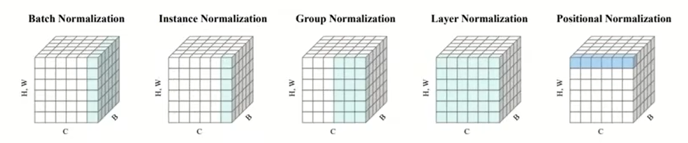
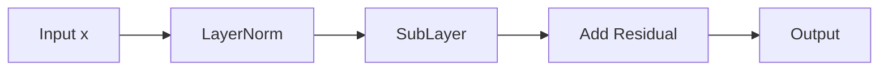

# Tricks

## **Regularization（正则化）**

**目的**：防止过拟合，提高模型泛化能力
**原理**：通过限制模型复杂度或引入噪声，避免模型过度依赖训练数据中的噪声

- **L1/L2正则化**：通过惩罚权重绝对值（L1）或平方值（L2）约束模型复杂度
- **Dropout**：随机丢弃神经元，减少神经元间的共适应性
- **数据增强**：通过变换输入数据扩充训练集。
- **早停（Early Stopping）**：监控验证集误差，提前终止训练

## **Normalization（归一化）**

**目的**：加速训练、稳定梯度、缓解梯度消失/爆炸问题
**原理**：调整数据分布，使每层输入保持稳定，允许使用更大的学习率

- **BatchNorm（BN）**：对每个Batch的激活值归一化，适用于CNN等固定结构
- **LayerNorm（LN）**：对单个样本的所有通道归一化，适用于RNN/Transformer
- **GroupNorm（GN）**：折中BN和LN，对小BatchSize更鲁棒

## **Initialization（初始化）**

**目的**：为模型参数提供合理的初始值，避免训练初期梯度消失/爆炸

**原理**：影响模型收敛速度和最终性能，不当初始化可能导致训练失败

- **Xavier/Glorot初始化**：适用于tanh/sigmoid激活函数，保持输入输出方差一致
- **He初始化**：专为ReLU设计，通过调整方差适应非线性激活
- **预训练初始化**：迁移学习中，用预训练模型参数初始化新任务

> 互补性：初始化决定训练起点，归一化稳定中间过程，正则化控制最终复杂度

## **优化算法（Optimization Tricks）**

- **自适应学习率优化器**：如Adam、RMSprop、Adagrad等，动态调整学习率以加速收敛
- **动量（Momentum）**：通过累积历史梯度方向减少震荡，加速训练（如Nesterov加速梯度）
- **学习率调度**：如余弦退火（Cosine Annealing）、线性衰减等，动态调整学习率以提高收敛性

## **模型结构**

- **数据增强（Data Augmentation）**：通过旋转、翻转、裁剪等操作扩充数据，提升泛化能力
- **标签平滑（Label Smoothing）**：软化标签的one-hot编码，减少模型对标签的过度自信
- **混合精度训练（Mixed Precision）**：结合FP16和FP32计算，加速训练并减少显存占用

## **模型压缩与加速**

- **剪枝（Pruning）**：移除冗余权重或神经元，减少模型参数量
- **量化（Quantization）**：将模型参数从FP32转为INT8，降低存储和计算需求
- **知识蒸馏（Knowledge Distillation）**：用大模型（教师模型）指导小模型（学生模型）训练

## **损失函数设计**

- **自定义损失函数**：如Focal Loss（解决类别不平衡）、Triplet Loss（用于度量学习）
- **Sobolev训练**：在损失函数中加入导数约束，提升输出函数的几何特性

## **部署与推理优化**

- **模型转换与轻量化**：如ONNX格式转换、TensorRT加速推理
- **硬件适配**：针对GPU/CPU/边缘设备（如TensorFlow Lite、OpenVINO）优化部署

## **其他前沿技巧**

- **Gumbel-Softmax**：解决离散采样问题，适用于生成模型和强化学习
- **CoordConv**：在CNN中引入坐标通道，增强空间位置感知能力
- **Neural ODEs**：用常微分方程建模连续时间动态，适用于时序数据


## Soft-label训练策略

软标签训练，一种 **标签平滑**（label smoothing）技术，用于缓解过拟合，提高泛化能力

- **硬标签（Hard label）** ：每个样本的标签是一个 **one-hot 编码** 的向量，其中正确类别为 1，其他类别为 0
- **软标签（Soft label）** ：标签值是连续的概率分布，而不是严格的 0 和 1，从而使得模型在预测时更加平稳，不会过于自信地预测某个类别，缓解类别不平衡问题，如对于三分类问题，类别 2 的软标签可以是 `[0.1, 0.8, 0.1]`​，表示模型在学习时认为类别 2 的概率是 0.8，而其他类别的概率较小，但仍然存在一定概率
- **标签平滑（Label Smoothing）** ：给 **非正确类别** 分配一个小的概率（而不是 0），使得目标标签分布更加平滑

  - 标签平滑公式：𝑦𝑖′\=(1−𝜖)⋅𝑦𝑖+𝜖𝐾，𝑦𝑖为标签原始值，𝑦𝑖′为平滑后的值，𝜖为平滑因子(一般很小)，K为类别总数

使用label\_smoothing参数，可直接在交叉熵损失函数`nn.CrossEntropyLoss`​中使用标签平滑

‍

## Initialization

权重初始化方法

- 随机初始化：没有考虑网络的结构（比如层的输入输出维度），非自适应（manual），可能会出现梯度消失/爆炸问题（尤其是深层网络）
- Xavier初始化：默认，发明者Xavier Glorot，自动根据层的输入输出节点数决定采样范围，避免梯度消失或爆炸，分两种：

  - 均匀分布，推荐用于 ReLU 前的层（也可用于 sigmoid/tanh），默认初始化方式之一
  - 正态分布：𝑛𝑖𝑛输入特征数，𝑛𝑜𝑢𝑡输出特征数

    $$
    W \sim \large u[-\sqrt {\frac {6}{n_{in}+n_{out}}}, \sqrt {\frac {6}{n_{in}+n_{out}}}]
    $$
- 何恺明初始化：专门为ReLU 及其变种激活函数设计

  $$
  weight \sim \large u(-\sqrt{\frac{6}{fan}}, \sqrt{\frac{6}{fan}})
  $$

  fan通常是$fan_{in}$，即输入通道数$\times$卷积核大小（对全连接层就是输入维度）

  `init.kaiming_uniform_()`​参数：

  - `mode`​：`fan_in`​保持输入的方差，`fan_out`​保持输出的方差
  - `nonlinearity`​：对应激活函数名称，如relu、leaky\_relu，用于确定缩放因子
- 截断初始化：从分布中采样，但只保留范围内的值，其余的被丢弃或重新采样，比较保守，适合稳定且分布紧凑的权重初始化

## `torch.nn.init`​中常见初始化函数

|函数名|作用|特点 / 使用场景|
| --------------------------------| ---------------------------------------| ----------------------------------------|
|**1. 随机分布初始化（Uniform / Normal）**|||
|​`uniform_()`​|从均匀分布 U(a,b) 初始化|你手动指定范围，通用随机初始化|
|​`normal_()`​|从正态分布 N(μ,σ) 初始化|适合需要高斯分布初始化的情况|
|​`trunc_normal_()`​|从截断正态分布中采样|避免极端值，更稳定，常用于 Transformer|
|​`dirac_()`​|初始化为单位映射（卷积核为单位）|特殊用途，残差连接中可能用到|
|**2. 常数初始化（Constant）**|||
|​`constant_()`​|所有元素初始化为指定常数|通常用于初始化偏置为 0|
|​`zeros_()`​|所有元素为 0|常见于偏置初始化|
|​`ones_()`​|所有元素为 1|特殊情况，如 BN 初始化 gamma 为 1|
|**3. Xavier（Glorot）初始化**（适用于 Sigmoid / Tanh 网络）|||
|​`xavier_uniform_()`​|均匀分布，基于输入输出 fan 的平均值|防止梯度消失 / 爆炸|
|​`xavier_normal_()`​|正态分布，同上|适用于 sigmoid / tanh 层|
|**4. Kaiming（He）初始化**（适用于 ReLU 激活）|||
|​`kaiming_uniform_()`​|均匀分布，考虑 fan\_in，适合 ReLU|ReLU / LeakyReLU 推荐使用|
|​`kaiming_normal_()`​|正态分布，考虑 fan\_in，适合 ReLU|适用于卷积、全连接层|
|**5. 稀疏初始化**|||
|​`sparse_()`​|随机稀疏连接初始化（正态分布+稀疏率）|稀疏网络或压缩神经网络时用|
|**6. Orthogonal / Eye（正交/单位）初始化**|||
|​`orthogonal_()`​|正交矩阵初始化（只适用于2D）|保持特征方向不变，RNN 常用|
|​`eye_()`​|单位矩阵（对角线为 1）|比较少用，特殊结构中可能使用|
|**7. 梯度裁剪辅助函数（不是初始化）**|||
|​`calculate_gain()`​|返回适合非线性激活函数的增益值|通常与`kaiming_*`​一起使用|

## 自定义初始化

```python
def my_init(m):
    if type(m) == nn.Linear:
        print("Init", *[(name, param.shape) for name, param in m.named_parameters()][0])
        nn.init.uniform_(m.weight, -10, 10)
        m.weight.data *= m.weight.data.abs() >= 5
        
net.apply(my_init)
```

配合`.apply()`​函数使用

`.apply(fn)`​：会遍历模型中所有子模块（包括嵌套层），对每个模块调用一次fn，fn必须是接收一个`nn.Module`​对象作为参数的函数

‍

# Normalization

归一化，加速训练并提高模型的稳定性和性能



- Batch Normalization (BN)：在每个小批量中对输入进行归一化，在每个特征维度上计算均值和方差，并使用这些统计量来标准化输入，减少对初始化的敏感性，并使得模型更稳定，通常用于卷积神经网络（CNN）和全连接神经网络（FCN）
- Layer Normalization (LN)：在每个样本的特征维度上进行归一化，而不是在批次维度上，它计算当前样本的均值和方差，并使用这些值进行归一化，对批次大小不敏感，适用于小批量或递归神经网络（RNN）等任务
- Instance Normalization (IN)：在每个样本的每个通道上进行归一化，通常用于图像生成任务，与 Layer Normalization 类似，但它在每个通道上单独进行，能够更好地捕捉样本间的风格差异，常用于风格迁移网络（如 CycleGAN）
- Group Normalization (GN)：将通道分成若干组，然后在每组内进行归一化，不依赖于批次大小，适用于小批次训练，适用于各种任务，包括物体检测和分割
- Layer-wise Adaptive Rate Scaling (LARS)：用于大规模训练的优化算法，结合了归一化的思想，根据参数的幅度调整学习率，严格来说不是传统意义上的归一化方法
- Weight Normalization：直接对权重进行归一化，确保权重的方向不变而只改变其幅度，可加速收敛，能够更好地处理小批量样本，适用于各种深度学习模型
- Spectral Normalization：通过对权重的谱范数进行归一化来控制网络的稳定性，常用于对抗生成网络（GANs）
- Batch Renormalization: 是 Batch Normalization 的一种改进，旨在减少对小批量统计的依赖
- Apply Adaptive Batch Normalization: 针对不同的任务或域自适应调整 Batch Normalization 的参数
- Contextual Normalization: 结合上下文信息进行归一化，用于特定任务

‍

## Batch Normalization

批归一化，BatchNorm，用于加速深度神经网络的训练过程，提升模型的泛化能力和稳定性

核心思想：通过规范化/归一化每一层的输入数据（通常是特征数据），来降低数据的偏向，从而减少训练时的波动和提高收敛速度

**数据的偏向**：Internal Covariate Shift，指输入数据在网络中传递时，其分布发生变化，尤其是在每一层之间的输入数据分布，这种分布的变化会导致每一层的输入分布不稳定，使得网络训练变得更加困难，需要不断调整每一层的学习率来应对这些分布的变化，导致训练过程更慢

1. **计算均值和方差**： 对于每个 mini-batch，BatchNorm 计算该批次数据的均值和方差：𝑥𝑖是批次中的每个样本，𝜇𝐵是该批次的均值，𝜎𝐵2是方差，m 是批次的样本数

    $$
    \mu_B = \frac{1}{m}\sum^m_{i=1}x_i \\
    \sigma^2_B=\frac{1}{m}\sum^m_{i=1}(x_i-\mu_B)^2
    $$
2. **标准化**： 使用均值和方差对每个输入进行标准化处理，使得每一层的输入数据的**均值为 0，方差为 1**：

    $$
    \hat x_i = \frac{x_i - \mu_B}{\sqrt{\sigma^2_B+\epsilon}}
    $$
3. **缩放和平移**： 为了保留模型的表达能力，BatchNorm 会对标准化后的数据进行一个线性变换，γ 和 β 是 **可学习的参数**，它们帮助网络恢复到任意的分布，以适应不同的任务

    $$
    y_i = \gamma \hat x_i +\beta
    $$

由于每一层的输入数据都被标准化，数据的分布变得更加稳定，网络对于学习率的选择变得不那么敏感，**可以使用更大的学习率**，加速了训练过程

‍

# Batch Normalization

流行且有效，可持续加速深层网络的收敛速度，一般不改变模型精度，不与Dropout混合使用

均值、方差为向量，不是标量

问题挑战：

- 深层网络复杂，容易过拟合
- 数据预处理方式对结果影响巨大
- 训练中间层变量变化范围广
- 底部的层（数据所在层）梯度小，收敛慢，需多次学习，而顶部的层收敛快

步骤：

- 计算小批量的均值和方差：对每个通道计算时得到长度为通道数C的向量

  $$
  \mu_B = \frac{1}{|B|}\sum_{i \in B}x_i \quad and \quad \sigma^2_B = \frac{1}{|B|}\sum_{i \in B}(x_i - \mu_B)^2 + \epsilon
  $$
- 线性变换：𝛾缩放因子，𝛽偏移因子，均为可学习的参数，**保证网络在归一化后仍具备足够的表达能力**

  $$
  x_{i+1} = \gamma \frac{x_i-\mu_B}{\sigma_B}+\beta
  $$

对全连接层作用在特征维，对卷积层作用在通道维

作用在：全连接层和卷积层输出上、输入上，激活函数前

本意是减少内部协变量转移，实际上可能是通过在每个小批量中加入噪音来控制模型复杂度

```python
def batch_norm(X, gamma, beta, moving_mean, moving_var, eps, momentum):
    if not torch.is_grad_enabled():
        X_hat = (X - moving_mean) / torch.sqrt(moving_var + eps)
    else:
        assert len(X.shape) in (2, 4)
        if len(X.shape) == 2:
            mean = X.mean(dim=0)
            var = ((X - mean)**2).mean(dim=0)
        else:
            mean = X.mean(dim=(0, 2, 3), keepdim=True)
            var = ((X - mean)**2).mean(dim=(0, 2, 3), keepdim-True)
        X_hat = (X - mean) / torch.sqrt(var + eps)
        moving_mean = momentum * moving_mean + (1.0 - momentum) * mean
        moving_var = momentum * moving_var + (1.0 - momentum) * var
    Y = gamma * X_hat + beta
    return Y, moving_mean.data, moving_var.data

class BatchNorm(nn.Module):
    def __init__(self, num_features, num_dims):
        super().__init__()
        if num_dims == 2:
            shape = (1, num_features)
        else:
            shape = (1, num_features, 1, 1)
        self.gamma = nn.Parameter(torch.ones(shape))
        self.beta = nn.Parameter(torch.zeros(shape))
        self.moving_mean = torch.zeros(shape)
        self.moving_var = torch.ones(shape)
        
    def forward(self, X):
        if self.moving_mean.device != X.device:
            self.moving_mean = self.moving_mean.to(X.device)
            self.moving_var = self.moving_var.to(X.device)
        Y, self.moving_mean, self.moving_var = batch_norm(
        	X, self.gamma, 
            self.beta, 
            self.moving_mean, 
            self.moving_var, 
            eps=1e-5, 
            momentum=0.9
        )
        return Y
    
net = nn.Sequential(
	nn.Conv2d(1, 6, kernel_size=5), BatchNorm(6, num_dims=4), nn.Sigmoid(),
    nn.MaxPool2d(kernel_size=2, stride=2),
    nn.Conv2d(6, 16, kernel_size=5), BatchNorm(16, num_dims=4), nn.Sigmoid(),
    nn.MaxPool2d(kernel_size=2, stride=2), 
    nn.Flatten(), 
    nn.Linear(16 * 4 * 4, 120), BatchNorm(120, num_dims=2), nn.Sigmoid(),
    nn.Linear(120, 84), BatchNorm(84, num_dims=2), nn.Sigmoid(), 
    nn.Linear(84, 10)
)
```

Batch size决定了训练的效率、梯度的稳定性、内存的使用和模型的泛化能力

‍

## 层归一化

Layer Normalization，对单个样本的每一层的神经元输出做归一化处理（而不是对整个 batch）, 是**对一个样本的特征维度**做的，提高收敛速度

$$
LayerNorm(x) = \frac {x-\mu} {\sigma} \cdot \gamma + \beta
$$

- 𝜇、𝜎：该样本所有特征的均值和标准差
- 𝛾、𝛽：可学习的缩放和平移参数（与 BatchNorm 相似）

Transformer中的经典结构：输入x



1. 先做 LayerNorm（标准化）
2. 经过某个子层（比如 self-attention 或 FFN）
3. 加上原始输入 x（残差连接）

‍

## AutoAugment

一种 **自动数据增强策略**，通过搜索算法自动发现对模型训练最有效的图像增强操作组合，无需手动选择增强方法

可用策略：`AutoAugmentPolicy.IMAGENET`​、`AutoAugmentPolicy.CIFAR10`​、`AutoAugmentPolicy.SVHN`​

AutoAugment 做了两件事：

1. **构建增强操作的搜索空间**：包括常见操作如：旋转（Rotate）、平移（Translate）、剪切（Shear）、对比度（Contrast）、颜色（Color）、亮度（Brightness）等
2. **使用强化学习（或其他搜索方法）搜索最优的**：操作序列（比如：先旋转、再加噪声）、每个操作的参数（强度）、每个操作的概率（是否执行）

```python
# 策略通常包含多个子策略，训练时随机选一个执行
Policy = [
    (Rotate, 0.6, 30),        # 概率 0.6，旋转角度 ±30°
    (Color, 0.8, 0.4),        # 概率 0.8，颜色调整强度 0.4
    ...
]
```

示例：

```python
from torchvision.transforms import AutoAugment, AutoAugmentPolicy

transform = transforms.Compose([
    transforms.Resize(256),
    transforms.CenterCrop(224),
    transforms.AutoAugment(policy=AutoAugmentPolicy.IMAGENET),
    transforms.ToTensor()
])
```

与 RandAugment、TrivialAugment 的区别：

|方法|是否搜索策略|速度|可调性|简单度|
| ----------------| --------------| -----------| ---------------| -----------|
|AutoAugment|✅ 是|❌ 慢|✅ 高|❌ 复杂|
|RandAugment|❌ 否|✅ 快|✅ 一两个参数|✅ 简单|
|TrivialAugment|❌ 否|✅✅ 更快|❌ 无需调参|✅ 最简单|

# 上采样

Upsampling，核心目的是**增加数据的分辨率或样本数量**，可能引入噪声或伪影，需结合抗混叠滤波或正则化

定义：

- **信号处理**：上采样指将采样频率提高到高于原始信号的最高频率（奈奎斯特频率），通过插值或内插生成新数据点，也称为增取样（Oversampling）
- **图像处理**：通过插值算法（如双线性插值、转置卷积）将低分辨率图像放大，恢复细节或匹配目标尺寸
- **机器学习**：解决类别不平衡问题，通过复制少数类样本或合成新样本（如SMOTE算法）平衡数据集

主要方法：

- 插值技术：

  - **最近邻插值**：简单复制相邻像素，速度快但边缘锯齿明显
  - **双线性/双三次插值**：基于周围像素加权计算，平滑但计算量较大
- 深度学习：

  - **转置卷积（反卷积）** ：可学习的上采样方式，用于生成高分辨率特征图
  - **PixelShuffle**：通道重组提升分辨率，常用于超分辨率任务
- 数据合成：

  - **SMOTE**：在少数类样本间插值生成新样本，避免简单复制的过拟合

‍

## 学习率

### **Cosine学习率**

**余弦退火学习率，** 一种动态调整学习率的策略，通过**余弦函数**让学习率从初始值平滑衰减到最小值，帮助模型在训练初期快速收敛，后期精细调参：

$$
\eta_t = \eta_{\text{min}} + \frac{1}{2}(\eta_{\text{max}} - \eta_{\text{min}})\left(1 + \cos\left(\frac{\pi t}{T}\right)\right)
$$

- $\eta_t$：第$t$步的学习率
- $\eta_{\text{max}}$：初始学习率
- $\eta_{\text{min}}$：最小学习率（通常接近0）
- $T$：总训练步数或周期长度

**优势**：

1. **平滑衰减**：避免学习率骤降导致的训练不稳定
2. **跳出局部最优**：周期性调整可能帮助模型逃离局部极小值

**代码实现：**

- 基础实现：

  ```python
  import torch
  import matplotlib.pyplot as plt
  
  # 定义模型和优化器
  model = torch.nn.Linear(10, 2)
  optimizer = torch.optim.SGD(model.parameters(), lr=0.1)
  
  # Cosine学习率调度器
  scheduler = torch.optim.lr_scheduler.CosineAnnealingLR(
      optimizer, T_max=100, eta_min=1e-5
  )
  
  # 记录学习率变化
  lr_history = []
  for epoch in range(100):
      lr_history.append(optimizer.param_groups[0]['lr'])
      scheduler.step()
  
  # 可视化
  plt.plot(lr_history)
  plt.xlabel('Epoch')
  plt.ylabel('Learning Rate')
  plt.title('Cosine Annealing LR Schedule')
  plt.show()
  ```
- 带Warmup的Cosine学习率（更稳定）：

  ```python
  from torch.optim.lr_scheduler import _LRScheduler
  import math
  
  class CosineAnnealingWarmup(_LRScheduler):
      def __init__(self, optimizer, T_max, eta_min=0, warmup_epochs=5, last_epoch=-1):
          self.T_max = T_max
          self.eta_min = eta_min
          self.warmup_epochs = warmup_epochs
          super().__init__(optimizer, last_epoch)
  
      def get_lr(self):
          if self.last_epoch < self.warmup_epochs:
              return [base_lr * (self.last_epoch / self.warmup_epochs) for base_lr in self.base_lrs]
          else:
              return [self.eta_min + (base_lr - self.eta_min) * 
                      (1 + math.cos(math.pi * (self.last_epoch - self.warmup_epochs) / 
                      (self.T_max - self.warmup_epochs))) / 2 
                      for base_lr in self.base_lrs]
  ```

**参数**：

- `T_max`​：周期长度（如总epoch数）
- `warmup_epochs`​：前N轮线性增加学习率，避免初始震荡

**对比其他学习率策略：**

|策略|特点|适用场景|
| --------| --------------------------| ----------------------|
|Cosine|平滑衰减，周期性调整|大多数深度学习任务|
|Linear|线性下降，简单但不够灵活|简单模型或短训练周期|
|StepLR|阶梯式下降，可能不稳定|需要手动调参的场景|

‍
