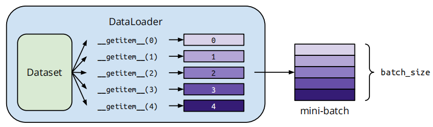

# 五. **数据处理 (**​**​`torch.utils.data`​**​ **)与保存**

数据集加载与批处理

## **核心类**：

- `.Dataset`: 自定义数据集基类，继承需实现**`__getitem__`​和`__len__`**​方法

    - 自定义数据集示例：

        ```python
        from torch.utils.data import Dataset
        class CustomDataset(Dataset):
            def __init__(self, data, labels, transform=None):
                self.data = data
                self.labels = labels
                self.transform = transform
        
            def __getitem__(self, index):
                x = self.data[index]
                if self.transform:
                    x = self.transform(x)
                return x, self.labels[index]
        
            def __len__(self):
                return len(self.data)
        ```

    - 常用派生类：

        - `TensorDataset`: 直接包装张量数据
        - `IterableDataset`: 流式数据支持

    - 与`torchvision.datasets`​：

        - 区别：

            | **特性**       | **torchvision.datasets**                             | **torch.utils.data.Dataset**(基础类)                       |
            | -------------- | ---------------------------------------------------- | ---------------------------------------------------------- |
            | **定位**       | 专门用于计算机视觉任务（如图像分类、目标检测）       | 通用数据加载抽象类，适用于任何领域（NLP、音频等）          |
            | **内置数据集** | 提供常见视觉数据集（如MNIST、CIFAR、ImageNet等）     | 无内置数据集，需用户自定义或继承实现                       |
            | **数据预处理** | 通常配合`torchvision.transforms`​进行图像增强和归一化 | 需用户手动实现预处理逻辑                                   |
            | **功能扩展**   | 封装了数据下载、解压、标准化等流程                   | 仅提供数据加载的抽象接口（需实现`__getitem__`​和`__len__`​） |

        - 协作互补：`torchvision.datasets`​继承自`torch.utils.data.Dataset`​，可无缝结合

            ```python
            from torch.utils.data import DataLoader
            loader = DataLoader(dataset, batch_size=32, shuffle=True)  # 通用数据加载器
            ```

            - `DataLoader`​ 的参数（如 `batch_size`​, `shuffle`​, `num_workers`​）适用于任何 `Dataset`​ 子类

            - **互补性**：`torchvision`​ 在 `Dataset`​ 基础上添加了视觉专用功能，两者通过 `DataLoader`​ 统一调度

- `.DataLoader`: 批量加载、多线程支持

    

    - 参数：

        - `dataset`​：必须传入继承自`torch.utils.data.Dataset`​的对象，定义数据来源及单个样本的获取方式
        - `batch_size`​：每批次的样本数（默认1），需根据显存调整，过大可能导致溢出，过小影响效率
        - `shuffle`​：是否在每个epoch开始时打乱数据顺序（默认`False`​），训练集通常设为`True`​以增强泛化能力
        - `num_workers`​：子进程数（默认0，即主进程加载），增加可加速数据加载，但需避免超过CPU核心数

‍

```python
from torch.utils.data import DataLoader

train_loader = DataLoader(
    dataset=train_dataset,  # 数据集对象
    batch_size=32,         # 批次大小
    shuffle=True,          # 训练时打乱数据
    num_workers=4,         # 4个子进程加载
    pin_memory=True,       # 加速GPU传输
    drop_last=True         # 丢弃不完整批次
)
```

### 注意事项

- **GPU训练**：启用`pin_memory`​可提升性能
- **动态数据**：使用`collate_fn`​处理变长数据
- **资源平衡**：`num_workers`​过多可能导致竞争，建议根据CPU核心数调整

## 常用方法：

- `.random_split(dataset, [train_size, test_size])`​：划分数据集

## 模型的保存和加载：

- 保存：`torch.save(model.state_dict(), 'model.pth')`​，只保存模型的参数，加载时需要先定义模型的架构
- 加载：`model.load_state_dict(torch.load('model.pth'))`​，`torch.load()`​只加载模型参数，需用`.load_state_dict()`​将模型参数加载到模型实例中
    - 加载前必须复刻相同的网络架构


‍
