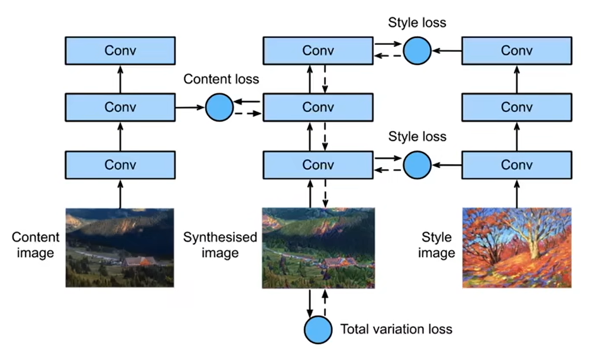

# 基础算法

# 支持向量机

Support Vector Machine, SVM ，常用的监督学习模型，广泛应用于分类和回归问题中

基于**统计学习理论和**结构风险最小化原理的机器学习算法。

基本概念：通过寻找一个最优的超平面（hyperplane）使得不同类别的样本点在这个超平面的两侧，并且具有最大的**间隔**（margin）。这个最大间隔的超平面被称为**最优超平面**。

#### 支持向量

离最优超平面最近的那些数据点，决定了分类的决策边界

支持向量机的目标是通过最大化这些支持向量到超平面的距离（间隔）来找到最优的超平面

#### 线性支持向量机（Linear SVM）

**线性可分 SVM 的目标**是最大化两类之间的间隔。通过对样本进行线性分割，SVM 可以得到如下形式的超平面：𝑤⋅𝑥+𝑏\=0

其中：

- w 是法向量（超平面的法线），它决定了超平面的方向
- x 是数据点
- b 是偏置项，它决定了超平面与原点之间的距离

#### 非线性支持向量机（Nonlinear SVM）

对于无法通过一个线性超平面分割的数据，SVM 通过引入核函数来将数据映射到高维空间。在高维空间中，数据点可能变得线性可分，这样就可以使用线性超平面进行分类。

**常见的核函数**：

- **线性核**：当数据本身是线性可分时，使用线性核。
- **多项式核**：适用于特征之间存在多项式关系的情况。
- **径向基函数核（RBF 核）** ：适用于大部分情况，尤其是数据分布复杂时，它通过一个高斯函数映射数据。
- **Sigmoid 核**：与神经网络中的激活函数类似。

#### SVM 的优化目标

SVM 的目标是优化以下目标函数（最大化间隔，最小化分类错误）：

1. **间隔最大化**：尽量增加支持向量和超平面之间的距离。
2. **分类误差最小化**：对于每个数据点，确保它正确地被分到对应的类别。

# 联邦学习

Federated Learning, FL，**分布式机器学习框架**，允许多个数据持有方（客户端）**在不共享原始数据**的情况下协作训练模型

核心思想：通过加密参数交换（而非数据本身）构建全局模型

**核心特点**：

1. **数据隐私保护**：数据始终保留在本地，仅上传模型参数（如梯度或权重）
2. **去中心化训练**：客户端本地训练模型，服务器聚合参数（如FedAvg算法）
3. **应用场景**：适用于医疗、金融、物联网等需隐私保护的领域

**工作流程**：

1. **初始化**：服务器下发初始全局模型
2. **本地训练**：各客户端用本地数据更新模型
3. **参数聚合**：服务器收集客户端参数，加权平均生成新全局模型
4. **迭代优化**：重复步骤2-3直至模型收敛

**类型**：

- **横向联邦学习**：客户端数据特征相同但样本不同（如不同医院的相同疾病数据）
- **纵向联邦学习**：客户端样本相同但特征不同（如银行与电商共享同一批用户的金融与购物数据）

**挑战**：

- **Non-IID数据**：六类

  - **特征分布偏斜（Feature Skew）** ：不同客户端的特征空间不同（如手写字体笔画差异）
  - **标签分布偏斜（Label Skew）** ：客户端数据标签比例差异（如某些地区用户偏好特定商品）
  - **数量偏斜（Quantity Skew）** ：客户端数据量不均衡
  - **概念漂移（Concept Drift）** ：相同标签在不同客户端对应不同特征（如不同文化下的“家庭”图像）
  - **相同标签不同特征（Same Label, Different Features）** ：标签相同但特征分布因客户端而异（如不同地区的“猫”图像因环境差异呈现不同特征）
  - **相同特征不同标签（Same Features, Different Label）** ：相同特征对应不同标签（如客户端A的“苹果”图像标注为水果，客户端B标注为公司标志）
- **通信开销**：需平衡参数传输效率与模型性能

**解决方案**：

- **算法改进**：

  - **FedProx：** 添加正则项

    - 改进点：在本地目标函数中增加近端项（Proximal Term），限制局部模型与全局模型的偏离：

      $$
      h_k(w)=F_k(w)+\frac{\mu}{2}\| w - w^t \|^2
      $$

      其中*μ*控制正则化强度
    - **优势**：缓解统计异构性，支持可变本地训练轮数以应对系统异构性
    - **局限**：需手动调参*μ*，IID场景下可能不如FedAvg高效
  - **SCAFFOLD**：控制变量减少方差

    - 改进点：引入控制变量（Control Variates）校正客户端更新方向，减少局部漂移
    - **优势**：显著提升Non-IID数据下的收敛速度
    - **局限**：通信开销翻倍（需传输额外控制变量）
  - **FedNova**：归一化局部更新

    - 改进点：根据本地迭代次数归一化客户端更新，消除数量偏斜的影响
    - **优势**：适用于计算能力异构的客户端
- **数据增强**：通过合成数据（如SMOTE）或共享少量全局数据缓解分布差异
- **个性化联邦学习**（如LG-FedAvg）：为不同客户端训练定制化模型，兼顾全局共享与本地适配

# Distillation

蒸馏，也称**知识蒸馏（Knowledge Distillation, KD）** ，**模型压缩基础方法**，旨在将一个大型、复杂的模型（**教师模型**）的知识迁移到一个更小、更高效的模型（**学生模型**）中，使其在保持较高性能的同时降低计算成本和存储需求，提升小模型的健壮性，但依赖教师模型的预测质量，且对非分类人物适应性有限

核心概念：

1. **教师模型（Teacher Model）** ：通常是一个高性能但计算成本高的大模型（如BERT、GPT-4等）
2. **学生模型（Student Model）** ：一个更轻量级的模型，通过学习教师模型的输出或中间特征来提升性能
3. **软标签（Soft Labels）** ：教师模型输出的概率分布（如分类任务中的类别概率），相比硬标签（one-hot编码）包含更多信息，如类别间的相似性

蒸馏过程：

1. **训练教师模型**：在大规模数据上训练一个高性能的复杂模型
2. **生成软标签**：教师模型对训练数据预测，输出概率分布（如调整温度参数TTT使分布更平滑）
3. **训练学生模型**：学生模型通过最小化与教师模型输出的差异（如KL散度）和真实标签的交叉熵进行训练

典型方法：

- **基于响应的蒸馏**：Response-based Distillation，核心目标是对齐学生模型和教师模型的输出结果

  - 对齐机制：

    - **Logits对齐**：学生模型的原始输出（softmax前的logits）与教师模型的logits通过损失函数，如

      $L_{ResD} = KL(p(z_t,T)||p(z_s, T))$强制对齐
    - **概率分布对齐**：使用温度缩放（Temperature Scaling）的softmax生成软标签（soft targets），传递类别间的关系信息，如$p(z_i,T)= \frac{\exp(z_i/T)}{\sum_j \exp(z_j/T)}$
  - **知识类型**：仅利用教师模型的最终输出层信息（如分类概率），不涉及中间层特征或样本间关系，其优势在于实现简单，适合分类任务，但可能忽略教师模型的深层表征知识
- **基于特征的蒸馏**：Feature-based Distillation，核心思想是对齐教师模型和学生模型的中间层特征表示

  - 核心原理：

    - **特征提取**：教师模型在中间层（如卷积层、Transformer块）生成多维特征图（Feature Maps），包含输入数据的多层次抽象信息（如边缘、纹理、语义等），学生模型通过映射函数（如线性变换或1x1卷积）将自身特征调整到与教师模型特征对齐的维度
    - **特征对齐**：通过损失函数（如均方误差MSE或余弦相似度）最小化教师和学生特征的差异：

      $$
      L_{Feat} = \|f_{teacher(x)-g(f_{student(x)})}\|^2
      $$

      其中g(⋅)为适配层，用于解决特征维度不匹配问题
    - **多层特征融合**：对多个层级的特征加权求和，增强知识传递的全面性：$w_l$为第$l$层的权重

      $$
      L_{total} = \sum_{l=1}Lw_l \cdot L_{Feat}^{(l)}
      $$
  - **优势**

    - **更丰富的知识传递**：相比基于响应的蒸馏，中间层特征包含更多结构化和语义信息。
    - **适用复杂任务**：在目标检测、语义分割等任务中表现优异。
    - **提升小模型性能**：学生模型可达到接近甚至超越教师模型的精度（如微软AI的Swin Transformer案例）
  - **挑战**

    - **特征空间差异**：需设计适配层解决教师与学生模型结构差异问题
    - **计算开销**：需存储和计算中间特征，增加训练成本
  - 改进方法：

    - **白化操作**：归一化教师特征，避免量级差异影响损失计算。
    - **共享位置编码**：在Transformer中共享相对位置编码，提升特征对齐效果。
    - **自监督融合**：结合对比学习增强特征表示
- **自蒸馏**：Self-Distillation，同一模型的不同部分相互学习，核心在于**模型通过自身的学习过程指导自身的优化**，无需依赖外部预训练的教师模型

  - **自我指导机制**：学生模型与教师模型为同一模型，通过自身的中间层特征或输出（如logits、注意力图）作为“软目标”，设计损失函数实现自我知识迁移
  - 知识类型：

    - **基于响应**：对齐模型不同训练阶段的输出概率（如前一epoch指导当前epoch）
    - **基于特征**：利用中间层特征（如CNN的激活图或Transformer的注意力）作为监督信号
  - |与传统蒸馏的区别：|||
    |**对比维度**|**传统知识蒸馏**|**自蒸馏**|
    | --------------------| ----------------------| ------------------------------|
    |教师模型来源|预训练的大型独立模型|自身模型的不同阶段或子模块|
    |计算成本|需额外训练教师模型|无额外模型，资源消耗低|
    |适用场景|模型压缩|性能提升、正则化、难样本学习|
  - 训练方法：

    - **同步蒸馏**：同一模型的不同分支相互蒸馏（如伪孪生网络）
    - **时序蒸馏**：用前一训练阶段的模型参数指导当前阶段（如Self-Distillation-Averaged）
    - **深度监督**：在模型内部添加辅助分类器，深层子网络指导浅层（如ICCV 2019的“Be Your Own Teacher”）
  - 优势：

    - **正则化效果**：通过软目标平滑标签噪声，缓解过拟合
    - **性能提升**：在细粒度分类、抗噪训练等任务中表现优于普通小模型
    - **灵活性**：适用于CV、NLP、推荐系统等多领域
  - 挑战：

    - **知识局限性**：自我迭代可能无法突破模型固有容量
    - **适配设计**：需合理选择特征层和损失函数（如MSE、KL散度）

# 迁移学习

广义概念，指将源任务学到的知识迁移到目标任务

实现迁移学习有以下三种手段：

1. Transfer Learning：冻结预训练模型的全部卷积层，只训练自己定制的全连接层
2. Extract Feature Vector：先计算出预训练模型的卷积层对所有训练和测试数据的特征向量，然后抛开预训练模型，只训练自己定制的简配版全连接网络
3. Fine-tuning：冻结预训练模型的部分卷积层（通常是靠近输入的多数卷积层，因为这些层保留了大量底层信息）甚至不冻结任何网络层，训练剩下的卷积层（通常是靠近输出的部分卷积层）和全连接层


两种实现方式：

- 微调：Fine-tuning，指在**预训练模型**的基础上，通过**少量特定任务的数据**对模型参数进行进一步调整，使其适应新任务的需求

    - fine：精细的，细致的，指高精度调整；tune：调节，调校
    - 通常**复制**预训练模型的参数作为初始值，但会根据新任务的数据更新部分或全部参数。例如：

        - **全参数微调**：更新所有参数（计算成本高）
        - **高效微调（如LoRA）** ：仅更新少量新增参数（如低秩矩阵），冻结大部分原始参数
    - 迁移学习可能仅复用模型的部分结构（如特征提取层），而微调通常涉及参数更新
    - 优势：

        - **高效性**：避免从头训练，节省计算资源
        - **小数据适配**：在目标数据较少时仍能提升性能
        - **领域适配**：使通用模型（如GPT）专业化（如医疗文本生成）
- 特征提取：**固定预训练模型的前几层（如卷积层、嵌入层）作为通用特征提取器**，仅训练新添加的分类层（如全连接层）以适应目标任务

    - 核心逻辑是：

        - **底层特征通用性**：预训练模型的浅层（如CNN的卷积层）通常学习边缘、纹理等基础特征，这些特征在不同任务间具有普适性
        - **高层特征特异性**：深层网络学到的特征更偏向源任务，因此可能需要调整或替换
    - **实现步骤**

        - **选择预训练模型**：使用在大型数据集上预训练的模型作为特征提取器
        - **冻结特征提取层**：固定预训练模型的参数，仅保留其输出特征（如CNN的Flatten层输出或BERT的CLS向量）
        - **构建新分类器**：在提取的特征上添加新的可训练层（如全连接层、SVM）以适应目标任务
        - **训练与微调**：仅训练新添加的层，或对部分高层进行微调以提升性能
    - **注意事项**

        - **领域差异**：若源域与目标域差异过大（如自然图像→文本），特征提取可能失效，需结合领域自适应技术
        - **负迁移风险**：若特征无关，可能导致性能下降，需通过特征选择或对齐缓解

应用：

样式迁移：用两个pretrained模型提取图像的内容和风格特征，并将其迁移到新图像生成任务中



```python
import torch
import torch.nn as nn
import torchvision
from d2l import torch as d2l
%matplotlib inline

d2l.set_figsize()

content_img = d2l.Image.open('img/flower.jpg')
d2l.plt.imshow(content_img)

style_img = d2l.Image.open('img/light.jpg')
d2l.plt.imshow(style_img)

rgb_mean = [0.485, 0.456, 0.406]
rgb_std = [0.229, 0.224, 0.225]

def preprocess(img, image_shape):  
    transforms = torchvision.transforms.Compose([
        torchvision.transforms.Resize(image_shape),  
        torchvision.transforms.ToTensor(),  
        torchvision.transforms.Normalize(mean=rgb_mean, std=rgb_std)
    ])  
    return transforms(img).unsqueeze(0)     # 添加了批次维度，为了兼容torch模型通常接受的输入格式


def postprocess(img):  
    img = img[0].to(rgb_std.device)     # 提取第一个（也是唯一一个）样本，还原形状
    img = torch.clamp(img.permute(1, 2, 0) * rgb_std + rgb_mean, 0, 1)  
    return torchvision.transforms.ToPILImage()(img.permute(2, 0, 1))


pretrained_net = torchvision.models.vgg19(pretrained=True)

style_layers, content_layers = [0, 5, 10, 19, 28], [25]

net = nn.Sequential(*[
    pretrained_net.features[i] for i in range(max(content_layers + style_layers) + 1)
])

def extract_features(X, content_layers, style_layers):
    contents = []
    styles = []
    for i in range(len(net)):
        X = net[i](X)
        if i in style_layers:
            styles.append(X)
        if i in content_layers:
            contents.append(X)

def get_contents(img_shape, device):
    content_X = preprocess(content_img, img_shape).to(device)
    contents_Y = extract_features(  )
```

‍

# 转置卷积

Transposed Convolution，用于上采样，核心目的是通过特定的计算方式将输入特征图的尺寸放大，同时保留或重建空间信息

数学本质：并非卷积的逆运算，而是通过反向传播卷积的矩阵运算关系实现的结果的含义：

- **形状恢复**：转置卷积的输出尺寸通常大于输入，例如在语义分割中用于将压缩的特征图恢复到原始图像大小
- **数值关系**：输出值与输入通过卷积核的加权组合相关，但并非精确还原原始数据（仅形状相似）
- **可学习性**：转置卷积的核参数可通过训练优化，相比插值上采样能更好地适应任务需求

注意事项：

- **棋盘效应**：转置卷积可能导致输出出现网格状伪影，可通过后续卷积层缓解
- **效率问题**：因需填充大量零值，计算成本较高

# 双线性插值

Bilinear Interpolation，在二维规则网格上对双变量函数（如x和y）进行插值，其核心思想是通过在两个方向上分别执行一次线性插值，利用邻近的四个已知点的值计算未知点的值

插值步骤：

- **第一步（X方向插值）** ：在x方向对相邻的两个点进行线性插值，得到中间点R\_1和R\_2的值：

    $$
    f(R_1) = (1-u) \cdot f(Q_{11}) + u \cdot f(Q_{21}) \\
     f(R_2) = (1-u) \cdot f(Q_{12}) + u \cdot f(Q_{22})
    $$

    其中u为x方向的小数部分（u\=x−⌊x⌋），用于计算的四个点（*Q*11,*Q*12,*Q*21,*Q*22）**必须是相邻的四个像素点**，且构成一个规则的2×2网格，这是双线性插值算法的核心前提

- **第二步（Y方向插值）** ：在y方向对R\_1和R\_2插值，得到目标点P的值：

    $$
    f(P) = (1-v) \cdot f(R_1) + v \cdot f(R_2)
    $$

    其中v为y方向的小数部分（v\=y−⌊y⌋）

特点：

- **非线性特性**：双线性插值的结果是两个线性函数的乘积，整体呈二次特性，而非严格线性
- **图像处理**：在图像缩放、旋转等操作中，通过加权平均周围4个像素值生成新像素，避免锯齿但可能导致边缘模糊
- **计算效率**：相比高阶插值（如双三次插值），计算量较小，适合实时处理

局限性：

- **平滑效应**：高频信息可能受损，放大图像时细节变模糊
- **边缘处理**：对非连续区域（如锐利边缘）可能产生伪影

‍

# 当前SOTA

截止2025年5月

- **RF-DETR**：在COCO数据集上mAP突破60%，推理速度达实时（30+ FPS），支持多分辨率动态调整
- **YOLOv5_mamba**：通过Mamba架构增强小目标检测，在无人机航拍等场景中表现优异
- **D-FINE**：细粒度分布细化技术使COCO mAP达55.8%，适用于高精度需求场景

‍
