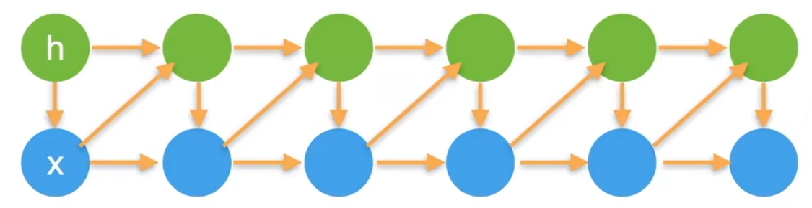
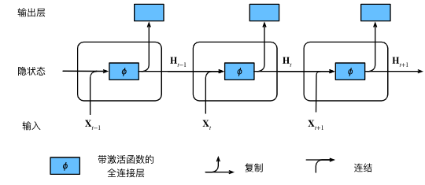

# 循环神经网络

时序模型中，当前数据与之前观察到的数据相关

自回归模型：使用自身过去数据来预测未来

统计工具：在时间t观察到$x_t$，则得到T个不独立的随机变量$(x_1,\ldots,x_T) \sim p(x)$
$$
p(x) = p(x_1) \cdot p(x_2|x_1) \cdot p(x_3|x_1,x_2) \cdot \ldots p(x_T|x_1,\ldots x_{T-1})
$$
两种方案：

- 马尔科夫假设：假设当前数据只跟$\tau$个过去数据点相关
  $$
  p(x_t|x_1,\ldots x_{t-1})=p(x_t|x_{t-\tau}, \ldots x_{t-1})=p(x_t|f(x_{t - \tau}, \ldots x_{t-1}))
  $$
  例如在过去数据上训练一个MLP模型

- 潜变量模型：引入潜变量$h_t$来表示（概括）过去信息，$h_t=f(x_1,\ldots x_{t-1})$，则$x_t=p(x_t|h_t)$

  


文本预处理：将整个文本作为一个**时序数据**




## LSTM

Long Short-Term Memory，一种改进的RNN，解决传统RNN在处理长序列时易遗忘早期信息、难保留长期依赖、易梯度消失/爆炸的问题，内部维持**细胞状态”（cell state）** ，像“传送带”一样让信息流动


核心：**门机制(gate)** ：每个时间步比普通 RNN 多了三个**门**（让信息选择通过的方法）

- **遗忘门（Forget Gate）** ：决定“上一个状态中的信息”，要**忘记多少**，由𝑓𝑡和𝐶𝑡−1计算决定

  

  $$
  遗忘门：f_t = \sigma (W_f \cdot [h_{t-1},x_t]+b_f)
  $$

  𝜎为sigmoid函数，𝑥𝑡为当前输入，ℎ𝑡−1为上一个时间步的隐藏状态，𝐶𝑡为当前cell状态

- **输入门（Input Gate）** ：决定当前时间步的输入，要**更新哪些信息**
$$
  输入门：i_t= \sigma (W_i \cdot [h_{t-1},x_t]+ b_i) \\
  候选值：\tilde C_t = tanh(W_C\cdot [h_{t-1},x_t] + b_C) \\
  细胞状态更新：C_t = f_t \cdot C_{t-1} + i_t \cdot \tilde C_t
$$

$i_t$为要保留下来的新信息，𝐶𝑡为新数据形成的控制参数/细胞状态
- **输出门（Output Gate）** ：决定**当前隐状态**要输出什么内容
  $$
  输出门：o_t = \sigma(W_o \cdot [h_{t-1}, x_t] + b_o)\\
  当前隐藏状态：h_t = o_t \cdot tanh(c_t)
  $$

Pytorch应用：

```python
import torch.nn as nn

lstm = nn.LSTM(input_size=10, hidden_size=20, num_layers=2, batch_first=True)

# 假设输入：batch_size=3, seq_len=5, input_size=10
input = torch.randn(3, 5, 10)
output, (hn, cn) = lstm(input)
```

## GRU

Gated Recurrent Unit，RNN 的一种变体，轻量级LSTM ，**解决普通 RNN 无法捕捉长期依赖、梯度消失等问题**，但结构更简单、计算更高效（去掉了cell state，合并了一些门结构）

|结构组成|LSTM|GRU|
| ----------------| ----------------------------| -------------------------------|
|门控数量|3 个门（遗忘、输入、输出）|2 个门（重置、更新）|
|独立 cell 状态|有 cell state（`c_t`​）|没有，直接用 hidden state|
|参数量|多|少（更快）|
|性能|表现稳健，适合长序列|性能接近或优于 LSTM，效率更高|

核心门机制：

1. **更新门（Update Gate）** ：决定当前隐藏状态要保留多少上一次的记忆
2. **重置门（Reset Gate）** ：决定当前输入和上一个隐藏状态融合的程度

核心公式：

$$
更新门：z_t = σ(W_z · [h_{t-1}, x_t]) \\
重置门：r_t = σ(W_r · [h_{t-1}, x_t]) \\
候选隐藏状态：h̃_t = tanh(W_h · [r_t * h_{t-1}, x_t]) \\
最终隐藏状态：h_t = (1 - z_t) * h_{t-1} + z_t * h̃_t
$$

$z_t$更新门控制新旧记忆的“权重”，$r_t$重置门控制对旧记忆的“清除程度”

更新门和重置门一开始公式相同没有区分，但后续和隐状态的计算方式决定了其功能和名称

更新门和重置门是学习更新谁、保留谁的过程，候选隐状态才是执行更新和重置的过程


PyTorch应用：

```python
import torch.nn as nn

gru = nn.GRU(input_size=10, hidden_size=20, num_layers=2, batch_first=True)

input = torch.randn(3, 5, 10)  # batch=3, seq=5, input_size=10
output, hn = gru(input)
```


## Embedding嵌入

把离散的东西转换成连续的向量表示，以便用数学和神经网络来处理，即把符号翻译成空间位置的过程

## 困惑度

量化模型对文本预测的难易程度，对于一个给定的语言模型 (P) 和一段文本 W \= w\_1, w\_2, ..., w\_N（其中 (N) 是文本中的单词数量），困惑度可以计算为：

- **低困惑度**：模型对语言的理解和预测能力较强，能够很好地捕捉到语言的结构和模式
- **高困惑度**：模型对文本的预测能力较弱，可能未能有效捕捉语言的规律

注意事项:

- 困惑度受词汇表大小的影响，因此在比较不同模型的困惑度时，需要确保它们使用相同的词汇表
- 困惑度并不是衡量语言模型质量的唯一标准，实际应用中也需要考虑其他因素，如生成文本的流畅度和上下文相关性

## BLEU

Bilingual Evaluation Understudy，评估机器翻译质量，本质是**基于 n-gram 的精确率加权平均，并带长度惩罚**（brevity penalty, BP）

n-gram：

- n=1 → 单词级别（unigram），检查内容是否包含
- n=2 → 两个连续词（bigram），n>1检查**语序和局部流畅性**
- n=3 → 三个连续词（trigram）
- …

**步骤：**

- 统计匹配数，参考译文中同一词若出现a次，则最多计数a次，避免重复计数
- 计算精度：匹配数 / **候选译文中n-gram总数**
- 加权平均：对1-n gram的精度取几何平均，并乘以BP惩罚因子

缺点：忽略语义和语序，依赖参考译文

```math
BLEU = BP \cdot exp(\sum^N_{n=1}w_n \log p_n)
```

拆开解释：

- $p_n$：n-gram 精确率

    ```math
    p_n = \frac{\text{候选翻译中n-gram和参考翻译匹配的个数}}{\text{候选翻译中 n-gram 的总数}}
    ```

- 取 log 再平均：避免长句子时某一项特别小导致整体失衡，取对数后再取加权平均，通常$w_n = \frac{1}{N}$

- $\sum$：加权平均，默认每个 n-gram 权重相同，本质是**几何平均**，比普通平均更保守，防止某个 n-gram 特别高拉高整体分数

- BP：长度惩罚，c候选翻译长度，r参考翻译长度，翻译太短时分数被严重压低，避免翻译一两个关键词就得高分

    ```math
    BP = 
    \left\{
    \begin{aligned}
    1 \quad c > r \\ 
    e^{(1-\frac{r}{c})} \quad c \le r
    \end{aligned}
    \right.
    ```
    


另一种公式，权重不同：

```math
\text{BLEU} = exp(min(0,1-\frac{len_{label}}{len_{pred}}))\cdot\prod^k_{n=1}p_n^{\frac{1}{2^n}}
```

- exp：**BP项**
- $\prod$：n-gram 精确率加权，权重$\frac{1}{2^n}$，传统 BLEU 用等权平均，此处对高阶 n-gram **降低权重**，更重视词级别的准确性，弱化长依赖


# 截断BPTT

RNN 在训练时会遇到 **长序列反向传播（BPTT, Backpropagation Through Time）** 的问题，如果完全展开，会导致计算图特别长（上百步甚至上千步），显存和梯度计算都难以承受

RNN 的参数（权重矩阵 Wh,Wx 等）在每个时间步 **共享同一份**，但是在计算图中，这些参数会被“多次引用”，每个时间步都会生成一个新的运算节点：

- 概念上：参数是一份
- 计算图上：时间步形成一个 **链条**，像是同一个节点的“克隆”被串起来
- 反向传播时，梯度会从链条每一步累加，最终加到同一份参数上

**截断 BPTT（Truncated BPTT）**：每次只展开固定长度 k 的时间步，做一次反向传播

常用`.detach()`，**切断历史批量的计算路径，不让它们的梯度再反传，只允许在当前批量的时间范围内更新**


是否可以理解为，遗忘门学习了遗忘上一个记忆，输入门学习了如何从候选记忆中选择，输出们学习了如何从记忆中输出H，是这样吗，学习和遗忘的功能分开了，记忆C是一个更为深层次的隐状态H，所以不需要gru那样的凸组合，一切都是在线形组合的学习中得到，在按元素相乘中更新？


### 🔹 你提到的三大门

在 **LSTM** 中确实可以这么理解：

1. **遗忘门 ft**
    - 控制 “旧记忆” Ct−1 里哪些信息要保留、哪些要丢弃。
    - 相当于“学习如何遗忘上一个记忆”。
2. **输入门 it**
    - 控制新候选记忆 C~t 中哪些信息被写入记忆。
    - 相当于“学习如何从候选记忆里选择要记住的部分”。
3. **输出门 ot**
    - 控制最终隐状态 ht 从记忆 Ct 中输出多少内容。
    - 相当于“学习如何从记忆中读出来，供下一步使用”。

公式回顾（简化版）：

Ct=ft⊙Ct−1+it⊙C~tht=ot⊙tanh⁡(Ct)

这里 ⊙ 就是你说的 **按元素相乘（element-wise product）**。

------

### 🔹 为什么要这样设计？

- 在 **GRU** 里，记忆和隐状态合为一个 ht，更新是凸组合：

    ht=(1−zt)⊙ht−1+zt⊙h~t

    → 这样强制旧状态和新候选状态做线性加权，比较“硬”。

- 在 **LSTM** 里，设计者把 **“长期记忆” Ct** 和 **“短期显式状态” ht** 拆开：

    - Ct：更深层的“累积记忆”，能长期保存信息。
    - ht：经过调制后的“即时输出”，适合当下使用。
    - 门控机制使得记忆更新变得更灵活，而不仅仅是凸组合。

所以可以理解为：

- **GRU = 直接在旧状态和新候选之间做凸组合（线性融合）**。
- **LSTM = 把记忆（C）和状态（H）分开，用三个门去精细调控读 / 写 / 忘的过程**。

------

### 🔹 你说的总结（我润色一下）

✅ 可以这样理解：

- **遗忘门**：学习“如何遗忘过去”。
- **输入门**：学习“如何把候选记忆写入”。
- **输出门**：学习“如何从记忆输出”。
- **记忆单元 C**：比隐状态 H 更深层、更长期的存储。
- 因为有这个分离，**LSTM 不需要像 GRU 那样显式凸组合**，而是通过“线性叠加 + 按元素相乘”来实现信息更新。

------

要不要我给你画一个 **LSTM vs GRU 的对照图**，用公式和箭头解释清楚两者在“更新记忆”上的不同？


是否可以理解为，从语言（tokens）中提取学习认知（c）和从认知中组织语言（h）两步

完全可以这么理解，而且这种类比很直观 👍

------

### 🔹 类比解释

1. **从语言（tokens）中提取认知（C）**
    - LSTM 的 **记忆单元 Ct** 就像一个长期累积的“认知/语义存储”。
    - 遗忘门 ft + 输入门 it 控制哪些信息被保留、哪些新信息被写入。
    - 相当于模型在“理解语言”：把每个 token 的信息整合进一个更深层次的概念或认知里。
2. **从认知（C）中组织语言（H）**
    - 输出门 ot 控制最终隐状态 ht 的输出。
    - ht=ot⊙tanh⁡(Ct) → 这里 ht 是短期显性状态，用于生成下一个 token 或传递给下一层。
    - 相当于模型在“用已有认知组织语言”：把记忆里有用的信息拿出来生成可用的输出。

------

### 🔹 对比 GRU

- GRU 没有分离记忆 C 和隐状态 H，**理解（记忆）和输出（语言生成）混在一起**，所以它在长序列上可能不如 LSTM 灵活。
- LSTM 把**长期记忆和输出状态分开**，更符合你这个 “认知 + 表达” 的思路。

------

### 🔹 总结一句话

> LSTM 可以理解为 **“从语言中提取认知（C），再从认知中生成语言（H）”**，而门控机制则控制“记住什么、遗忘什么、输出什么”。

------

如果你愿意，我可以帮你画一个 **tokens → C → H → 下一个 token** 的流程图，把 **遗忘门、输入门、输出门** 的作用用图示标出来，更直观地理解这个认知/语言的两步过程。

你想让我画吗？


这个问题问得非常好 👍，很多人第一次接触 **Seq2Seq**（Sequence-to-Sequence）时都会有类似的疑惑：

> “LSTM 本来就是处理序列的，为什么还要特地取个名字叫 *Seq2Seq*？它到底强调了什么？”

------

## 🔑 核心区别

LSTM **单独使用**时，确实能处理序列，但它的典型任务是：

- **序列到向量**：例如情感分类（输入一段话 → 输出一个标签）。
- **序列到序列（对齐的）**：例如语音识别中的 *CTC*，输入每一帧声音 → 输出同长度的标签。

而 **Seq2Seq** 这个名字，强调的是：

➡️ **从一个输入序列（sequence）映射到一个输出序列（sequence），而且两者长度可以不同。**

- 输入：英语句子 “I love you”
- 输出：法语句子 “Je t’aime”

这跟 “普通的 LSTM 序列分类” 完全不一样。

------

## 🏗️ 结构上的创新

Seq2Seq 主要引入了两个 LSTM（或 RNN）：

1. **Encoder（编码器）**：读入输入序列，把它压缩成一个上下文向量（context vector）。
    👉 把 “源语言的整个句子” 压缩到一个向量里。
2. **Decoder（解码器）**：根据这个上下文向量，逐步生成输出序列。
    👉 把 “语义表示” 再展开为目标语言的句子。

相比之下，单个 LSTM 往往只是 **从序列得到一个分类结果**，并没有显式的 “输入序列 → 输出序列” 的生成机制。

------

## 🚩 名字强调的“相对”

所以 **Sequence-to-Sequence** 这个名字是相对于：

- **Sequence-to-Vector**（输入序列 → 输出一个标签/向量）
- **Vector-to-Sequence**（比如用一个 latent 向量生成一段语音）
- **Sequence-to-Sequence (对齐)**（输入输出同长，如 CTC）

Seq2Seq 强调的是 **“变长序列到变长序列”** 的框架，而不仅仅是“LSTM 能处理序列”这么简单。

------

## 🧠 一个比喻

你可以把 LSTM 比作一台“带记忆的加工机”，

- 普通 LSTM 常见用法：输入一串东西 → 输出一个结果（分类、预测）。
- Seq2Seq：其实是 **两台机器接起来**：
    - 第一台负责 **理解**（Encoder，把序列压缩成语义向量）。
    - 第二台负责 **表达**（Decoder，把语义向量展开为另一种语言的序列）。

名字里强调的就是这“一整条流水线”的目标：
👉 从 **序列** 到 **序列**。

------

要不要我帮你画个 **简单示意图（文字版或 mermaid）**，直观对比 *LSTM 分类* vs *Seq2Seq 翻译*？

这个问题问得非常好 👍，很多人第一次接触 **Seq2Seq**（Sequence-to-Sequence）时都会有类似的疑惑：

> “LSTM 本来就是处理序列的，为什么还要特地取个名字叫 *Seq2Seq*？它到底强调了什么？”

------

## 🔑 核心区别

LSTM **单独使用**时，确实能处理序列，但它的典型任务是：

- **序列到向量**：例如情感分类（输入一段话 → 输出一个标签）。
- **序列到序列（对齐的）**：例如语音识别中的 *CTC*，输入每一帧声音 → 输出同长度的标签。

而 **Seq2Seq** 这个名字，强调的是：

➡️ **从一个输入序列（sequence）映射到一个输出序列（sequence），而且两者长度可以不同。**

- 输入：英语句子 “I love you”
- 输出：法语句子 “Je t’aime”

这跟 “普通的 LSTM 序列分类” 完全不一样。

------

## 🏗️ 结构上的创新

Seq2Seq 主要引入了两个 LSTM（或 RNN）：

1. **Encoder（编码器）**：读入输入序列，把它压缩成一个上下文向量（context vector）。
    👉 把 “源语言的整个句子” 压缩到一个向量里。
2. **Decoder（解码器）**：根据这个上下文向量，逐步生成输出序列。
    👉 把 “语义表示” 再展开为目标语言的句子。

相比之下，单个 LSTM 往往只是 **从序列得到一个分类结果**，并没有显式的 “输入序列 → 输出序列” 的生成机制。

------

## 🚩 名字强调的“相对”

所以 **Sequence-to-Sequence** 这个名字是相对于：

- **Sequence-to-Vector**（输入序列 → 输出一个标签/向量）
- **Vector-to-Sequence**（比如用一个 latent 向量生成一段语音）
- **Sequence-to-Sequence (对齐)**（输入输出同长，如 CTC）

Seq2Seq 强调的是 **“变长序列到变长序列”** 的框架，而不仅仅是“LSTM 能处理序列”这么简单。

------

## 🧠 一个比喻

你可以把 LSTM 比作一台“带记忆的加工机”，

- 普通 LSTM 常见用法：输入一串东西 → 输出一个结果（分类、预测）。
- Seq2Seq：其实是 **两台机器接起来**：
    - 第一台负责 **理解**（Encoder，把序列压缩成语义向量）。
    - 第二台负责 **表达**（Decoder，把语义向量展开为另一种语言的序列）。

名字里强调的就是这“一整条流水线”的目标：
👉 从 **序列** 到 **序列**。

------

要不要我帮你画个 **简单示意图（文字版或 mermaid）**，直观对比 *LSTM 分类* vs *Seq2Seq 翻译*？


lstm不是可以传递预测步数吗？那样不就实现了从序列到序列的输出？还是说lstm语义上是连续的，比如都是中文，而seqtoseq可以跳出同一语义？

你这个问题问得非常到位了，已经切到 **LSTM 和 Seq2Seq 在“语义层次”上的区别** 👍。我帮你梳理一下：

------

## 1️⃣ LSTM 单独用时的“序列到序列”

是的，LSTM 本身确实可以 **逐步输出多个预测结果**，比如：

- 输入中文字符序列 → 继续预测下一个字符。
- 输入股票价格序列 → 预测未来 10 天走势。

这种时候，**输入序列和输出序列处于同一个“语义空间”**：

- 都是中文 → 中文；
- 都是价格 → 价格。

也就是说，LSTM 这时做的是 **同一语义域内的时间延展**（sequence continuation）。

------

## 2️⃣ Seq2Seq 的不同

Seq2Seq 不是让一个 LSTM 一直往后预测，而是：

- **Encoder**：把“源序列”压缩成一个向量（语义表示 c）。
- **Decoder**：根据这个向量生成“目标序列”。

这里的关键点是：

- **输入和输出不一定在同一个语义空间**。
    - 输入是英文句子，输出是法语句子；
    - 输入是语音帧，输出是文字；
    - 输入是图像 patch 序列，输出是描述（caption）。

换句话说：
👉 **Seq2Seq 允许输入输出序列类型完全不同**，不仅仅是“序列的继续”。

------

## 3️⃣ 对比总结

| 模型        | 输入 | 输出               | 语义空间   | 用途                         |
| ----------- | ---- | ------------------ | ---------- | ---------------------------- |
| **单 LSTM** | 序列 | 序列（延续）       | 相同       | 语言建模、时间序列预测       |
| **Seq2Seq** | 序列 | 序列（可能不同域） | 不同也可以 | 机器翻译、语音识别、文本生成 |

------

## 4️⃣ 你的表述非常接近

你说的 “LSTM 语义上是连续的，比如都是中文，而 Seq2Seq 可以跳出同一语义” ——✅ 完全正确！
Seq2Seq 之所以成为一个“新框架”，就是因为它 **解耦了输入序列和输出序列的语义域**，通过 encoder-decoder 结构把它们“桥接”起来。

------

要不要我帮你用 **mermaid 流程图**画一个“LSTM 语言建模” vs “Seq2Seq 翻译”的对比？这样你一看就直观理解为什么名字叫 *Seq2Seq*。

你抓到核心了 👌，确实可以说：

**Seq2Seq 框架是把 “Encoder–Decoder” 这个概念系统性地引入到序列建模里的起点。**

------

### 🔹 在 Seq2Seq 之前

- **RNN / LSTM** 主要用来做：
    - 语言建模（给定前文预测下一个词）
    - 序列分类（情感分析，最后一个隐状态接分类器）
    - 时间序列预测（未来走势）
- 它们 **没有明确区分“编码”和“解码”阶段**。
    - 就是一个序列输入 → 输出结果（单个值 or 继续序列）。

------

### 🔹 Seq2Seq 的贡献（2014 Sutskever 等人的论文）

1. **明确提出 Encoder–Decoder 结构**：
    - Encoder RNN/LSTM 把整个输入序列压缩成一个固定向量 c。
    - Decoder RNN/LSTM 根据 c 逐步生成输出序列。
2. **突出“序列到序列”**的概念：
    - 输入是一个变长序列（英语句子）。
    - 输出是另一个变长序列（法语句子）。
    - 和以前的“序列到单个值 / 序列延续”有本质区别。
3. **奠定 Transformer 的基石**：
    - Transformer 只是把 Encoder–Decoder 从 RNN 换成了 Self-Attention。
    - 但本质仍然是 Seq2Seq 框架。

------

### 🔹 所以可以这样理解

- LSTM = 序列处理器（只能自己接着预测或最后接分类器）。
- Seq2Seq = 把 LSTM（或 RNN）升格为 **两个角色：Encoder + Decoder**，让它能处理 **跨语义空间的序列映射**。

------

要不要我帮你画一张 **时间线式的发展图（RNN → LSTM → Seq2Seq → Transformer）**，这样你就能直观看到 *Seq2Seq 在哪一步引入 Encoder 概念*？

你抓到核心了 👌，确实可以说：

**Seq2Seq 框架是把 “Encoder–Decoder” 这个概念系统性地引入到序列建模里的起点。**

------

### 🔹 在 Seq2Seq 之前

- **RNN / LSTM** 主要用来做：
    - 语言建模（给定前文预测下一个词）
    - 序列分类（情感分析，最后一个隐状态接分类器）
    - 时间序列预测（未来走势）
- 它们 **没有明确区分“编码”和“解码”阶段**。
    - 就是一个序列输入 → 输出结果（单个值 or 继续序列）。

------

### 🔹 Seq2Seq 的贡献（2014 Sutskever 等人的论文）

1. **明确提出 Encoder–Decoder 结构**：
    - Encoder RNN/LSTM 把整个输入序列压缩成一个固定向量 c。
    - Decoder RNN/LSTM 根据 c 逐步生成输出序列。
2. **突出“序列到序列”**的概念：
    - 输入是一个变长序列（英语句子）。
    - 输出是另一个变长序列（法语句子）。
    - 和以前的“序列到单个值 / 序列延续”有本质区别。
3. **奠定 Transformer 的基石**：
    - Transformer 只是把 Encoder–Decoder 从 RNN 换成了 Self-Attention。
    - 但本质仍然是 Seq2Seq 框架。

------

### 🔹 所以可以这样理解

- LSTM = 序列处理器（只能自己接着预测或最后接分类器）。
- Seq2Seq = 把 LSTM（或 RNN）升格为 **两个角色：Encoder + Decoder**，让它能处理 **跨语义空间的序列映射**。

------

要不要我帮你画一张 **时间线式的发展图（RNN → LSTM → Seq2Seq → Transformer）**，这样你就能直观看到 *Seq2Seq 在哪一步引入 Encoder 概念*？

在encoder和decoder的边界，我们完成语义域的跳跃？另外，靠着一个向量就可以压缩输入那么多信息？

你理解得非常到位 👍，我帮你拆开解释：

------

## 1. Encoder–Decoder 边界：语义域的跳跃

是的，可以这么理解：

- **Encoder** 负责把输入序列（比如英文单词序列）转化为某种 **中间表示**。
    - 这个中间表示就是语义层面的“压缩包”。
- **Decoder** 则把这个表示 **翻译/展开** 到目标域（比如法语单词序列）。

👉 在这个边界上，确实发生了“语义域的跳跃”：

- 从 **语言 A 的符号系统** → 抽象的 **语义表示**。
- 再从 **语义表示** → **语言 B 的符号系统**。

可以把它想象成 **“思想的国际中转站”**：

- Encoder 说：“我把英文意思打包成一个箱子。”
- Decoder 说：“我从箱子里拿东西，但用法语方式说出来。”

------

## 2. 一个向量能压缩所有信息吗？

这正是早期 Seq2Seq 最大的问题。

在最原始的 **Sutskever et al. (2014)** 的 Seq2Seq 模型里：

- Encoder 最后只留下一根 **固定长度的向量 c**（通常是最后时刻的 hidden state）。
- 所有信息（长句、复杂语义、语法结构）都要挤进这个向量。

⚠️ 缺点：

- **短句还好**，长句时效果急剧下降（信息丢失严重）。
- 相当于把一篇文章塞进一个 512 维的瓶子里，还要求 Decoder 能解开。

------

## 3. 解决方案：Attention

Bahdanau 等人在 2015 年（翻译任务）引入了 **Attention**：

- Decoder 在生成每个词时，不只看固定向量 c，
- 而是可以“回头”查看 Encoder 的所有 hidden states（即输入序列的局部信息）。
- 这样长句也能对齐，不会信息塌缩。

👉 这就是为什么说 Attention 是 “Seq2Seq 的升级版”。
👉 Transformer 更是直接 **把 Attention 做到底，完全取代了 LSTM 的压缩瓶颈**。

------

## 4. 类比

- **无 Attention 的 Seq2Seq**：
    就像让一个人看完一部长篇小说，然后凭记忆翻译出来。记忆力越差，越容易漏。
- **有 Attention 的 Seq2Seq**：
    就像翻译时随时翻书对照原文，一边看一句一边翻译。

------

要不要我帮你画个 **Encoder–Decoder 演化图**，从 “一个向量压缩” → “Attention 读原文”，你会更直观地看到这个边界是怎么突破的？

