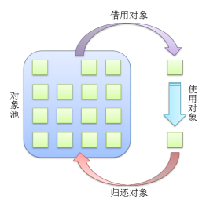

# 生活中的设计模式

# GoF经典设计模式

23种

## 中介模式

用一个中介对象来封装一系列的对象交互，中介者使各对象不需要显式地相互引用，从而使其耦合松散，而且可以独立地改变它们之间的交互


Mediator：中介类，协调对象间的交互，可有多个具体实现类

```python
 from abc import ABC, abstractmethod
 from enum import Enum
 
 # 框架
 class InteractiveObject:
     """进行交互的对象"""
     pass
 
 
 class InteractiveObjectImplA:
     """实现类A"""
     pass
 
 
 class InteractiveObjectImplB:
     """实现类B"""
     pass
 
 class Meditor:
     """中介类"""
 
     def __init__(self):
         self.__interactiveObjA = InteractiveObjectImplA()
         self.__interactiveObjB = InteractiveObjectImplB()
 
     def interactive(self):
         """进行交互的操作"""
         # 通过self.__interactiveObjA和self.__interactiveObjB完成相应的交互操作
         pass
 
 
 # 实现
 class DeviceType(Enum):
     """设备类型"""
 
     TypeSpeaker = 1
     TypeMicrophone = 2
     TypeCamera = 3
 
 
 class DeviceItem:
     """设备项"""
 
     def __init__(self, id, name, type, isDefault = False):
         self.__id = id
         self.__name = name
         self.__type = type
         self.__isDefault = isDefault
 
     def __str__(self):
         return (f"type:{str(self.__type)} "
                 f"id:{str(self.__id)} "
                 f"name:{str(self.__name)} "
                 f"isDefault:{str(self.__isDefault)}")
 
     def getId(self):
         return self.__id
 
     def getName(self):
         return self.__name
 
     def getType(self):
         return self.__type
 
     def isDefault(self):
         return self.__isDefault
 
 
 class DeviceList:
     """设备列表"""
 
     def __init__(self):
         self.__devices = []
 
     def add(self, deviceItem):
         self.__devices.append(deviceItem)
 
     def getCount(self):
         return len(self.__devices)
 
     def getByIdx(self, idx):
         if idx < 0 or idx >= self.getCount():
             return None
         return self.__devices[idx]
 
     def getById(self, id):
         for item in self.__devices:
             if item.getId() == id:
                 return item
         return None
 
 
 class DeviceMgr(ABC):
 
     @abstractmethod
     def enumerate(self):
         """枚举设备列表(在程序初始化时，有设备插拔时都要重新获取设备列表)"""
 
         pass
 
     @abstractmethod
     def active(self, deviceId):
         """选择要使用的设备"""
 
         pass
 
     @abstractmethod
     def getCurDeviceId(self):
         """获取当前正在使用的设备ID"""
 
         pass
 
 
 class SpeakerMgr(DeviceMgr):
     """扬声器设备管理类"""
 
     def __init__(self):
         self.__curDeviceId = None
 
     def enumerate(self):
         """枚举设备列表(真实的项目应该通过驱动程序去读取设备信息，这里只用初始化来模拟)"""
 
         devices = DeviceList()
         devices.add(
             DeviceItem(
                 "369dd760-893b-4fe0-89b1-671eca0f0224",
                 "Realtek High Definition Audio",
                 DeviceType.TypeSpeaker
             )
         )
         devices.add(
             DeviceItem(
                 "59357639-6a43-4b79-8184-f79aed9a0dfc",
                 "NVIDIA High Definition Audio",
                 DeviceType.TypeSpeaker,
                 True
             )
         )
         return devices
 
     def active(self, deviceId):
         """激活指定的设备作为当前要用的设备"""
 
         self.__curDeviceId = deviceId
 
     def getCurDeviceId(self):
         return self.__curDeviceId
 
 
 class DeviceUtil:
     """设备工具类"""
 
     def __init__(self):
         self.__mgrs = {DeviceType.TypeSpeaker: SpeakerMgr()}
         # 为节省篇幅，MicrophoneMgr和CameraMgr不再实现
         # self.__microphoneMgr = MicrophoneMgr()
         # self.__cameraMgr = CameraMgr
 
     def __getDeviceMgr(self, type):
         return self.__mgrs[type]
 
     def getDeviceList(self, type):
         return self.__getDeviceMgr(type).enumerate()
 
     def active(self, type, deviceId):
         self.__getDeviceMgr(type).active(deviceId)
 
     def getCurDeviceId(self, type):
         return self.__getDeviceMgr(type).getCurDeviceId()
 
 
 def testDevices():
     deviceUtil = DeviceUtil()
     deviceList = deviceUtil.getDeviceList(DeviceType.TypeSpeaker)
     print("麦克风设备列表：")
     if deviceList.getCount() > 0:
         # 设置第一个设备为要用的设备
         deviceUtil.active(DeviceType.TypeSpeaker, deviceList.getByIdx(0).getId())
     for idx in range(0, deviceList.getCount()):
         device = deviceList.getByIdx(idx)
         print(device)
     print("当前使用的设备：", deviceList.getById(deviceUtil.getCurDeviceId(DeviceType.TypeSpeaker)).getName())
 
 
 if __name__ == "__main__":
     testDevices()
```

## 代理模式

为其他对象提供一种代理以控制对这个对象的访问

一个对象完成某项动作或任务，是通过对另一个对象的引用来完成的

核心：使用一个额外的间接层来支持分散的、可控的、智能的访问；增加一个包装和委托来保护真实的组件，以避免过度复杂


三个角色：

- 主题（Subject）：定义操作、活动、任务的接口类
- 真实主题（RealSubject）：真正完成操作、活动、任务的具体类
- 代理主题（ProxySubject）：代替真实主题完成操作、活动、任务的代理类

```python
from abc import ABCMeta, abstractmethod

# 框架

class Subject(metaclass=ABCMeta):
    """主题类"""

    def __init__(self, name):
        self.__name = name

    def getName(self):
        return self.__name

    @abstractmethod
    def request(self, content=''):
        pass


class RealSubject(Subject):
    """真实主题类"""

    def request(self, content=''):
        print("RealSubject todo something...")


class ProxySubject(Subject):
    """代理主题类"""

    def __init__(self, name, subject):
        super().__init__(name)
        self._realSubject = subject

    def request(self, content=''):
        self.preRequest()
        if self._realSubject is not None:
            self._realSubject.request(content)
        self.afterRequest()

    def preRequest(self):
        print("preRequest")

    def afterRequest(self):
        print("afterRequest")


def testProxy():
    realObj = RealSubject('RealSubject')
    proxyObj = ProxySubject('ProxySubject', realObj)
    proxyObj.request()


# 实现
class TonyReception(Subject):
    """Tony接收"""

    def __init__(self, name, phoneNum):
        super().__init__(name)
        self.__phoneNum = phoneNum

    def getPhoneNum(self):
        return self.__phoneNum

    def request(self, content=''):
        print(f"货物主人：{self.getName()}，手机号：{self.getPhoneNum()}")
        print(f"接收到一个包裹，包裹内容：{str(content)}")


class WendyReception(ProxySubject):
    """Wendy代收"""

    def __init__(self, name, receiver):
        super().__init__(name, receiver)

    def preRequest(self):
        print(f"我是{self._realSubject.getName()}的朋友，我来帮他代收快递！")

    def afterRequest(self):
        print(f"代收人：{self.getName()}")


def testReceiveParcel():
    tony = TonyReception("Tony", "18512345678")
    print("Tony接收：")
    tony.request("雪地靴")
    print()

    print("Wendy代收：")
    wendy = WendyReception("Wendy", tony)
    wendy.request("雪地靴")


if __name__ == '__main__':
    testProxy()
    print()
    testReceiveParcel()
```

## 克隆模式

又称原型模式，用原型实例指定要创建对象的种类，并通过拷贝这些原型的属性来创建新的对象


```python
from copy import copy, deepcopy

class Clone:
    """克隆的基类"""

    def clone(self):
        """浅拷贝的方式克隆对象"""
        return copy(self)

    def deepClone(self):
        """深拷贝的方式克隆对象"""
        return deepcopy(self)


class PetStore(Clone):
    """宠物店"""

    def __init__(self, name):
        self.__name = name
        self.__petList = []

    def setName(self, name):
        self.__name = name

    def showMyself(self):
        print("%s 宠物店有以下宠物：" % self.__name)
        for pet in self.__petList:
            print(pet + "\t", end="")
        print()

    def addPet(self, pet):
        self.__petList.append(pet)


def testPetStore():
    petter = PetStore("Petter")
    petter.addPet("小狗Coco")
    print("父本petter：", end="")
    petter.showMyself()
    print()

    petter1 = deepcopy(petter)
    petter1.addPet("小猫Amy")
    print("副本petter1：", end="")
    petter1.showMyself()
    print("父本petter：", end="")
    petter.showMyself()
    print()

    petter2 = copy(petter)
    petter2.addPet("小兔Ricky")
    print("副本petter2：", end="")
    petter2.showMyself()
    print("父本petter：", end="")
    petter.showMyself()


if __name__ == "__main__":
    testPetStore()
```

## 单例模式

确保一个类只有一个实例，并且提供一个访问它的全局方法


```python
# 方法一：重写__new__和__init__方法
class Singleton1(object):
    """单例实现方式一"""
    __instance = None
    __isFirstInit = False

    def __new__(cls, name):
        if not cls.__instance:
            Singleton1.__instance = super().__new__(cls)
        return cls.__instance

    def __init__(self, name):
        if not self.__isFirstInit:
            self.__name = name
            Singleton1.__isFirstInit = True

    def getName(self):
        return self.__name


def test1():
    tony = Singleton1("Tony")
    karry = Singleton1("Karry")
    print(tony.getName(), karry.getName())
    print("id(tony):", id(tony), "id(karry):", id(karry))
    print("tony == karry:", tony == karry)


# 方法二：自定义metaclass方法
class Singleton2(type):
    """单例实现方式二"""

    def __init__(cls, what, bases=None, dict=None):
        super().__init__(what, bases, dict)
        cls._instance = None # 初始化全局变量cls._instance为None

    def __call__(cls, *args, **kwargs):
        # 控制对象的创建过程，如果cls._instance为None，则创建，否则直接返回
        if cls._instance is None:
            cls._instance = super().__call__(*args, **kwargs)
        return cls._instance


class CustomClass(metaclass=Singleton2):
    """用户自定义的类"""

    def __init__(self, name):
        self.__name = name

    def getName(self):
        return self.__name


def test2():
    tony = CustomClass("Tony")
    karry = CustomClass("Karry")
    print(tony.getName(), karry.getName())
    print("id(tony):", id(tony), "id(karry):", id(karry))
    print("tony == karry:", tony == karry)

# 方法三：装饰器方法实现单例模式
def singletonDecorator(cls, *args, **kwargs):
    """定义一个单例装饰器"""

    instance = {}

    def wrapperSingleton(*args, **kwargs):
        if cls not in instance:
            instance[cls] = cls(*args, **kwargs)
        return instance[cls]

    return wrapperSingleton


@singletonDecorator
class Singleton3:
    """使用单例装饰器修饰一个类"""

    def __init__(self, name):
        self.__name = name

    def getName(self):
        return self.__name


def test3():
    tony = Singleton3("Tony")
    karry = Singleton3("Karry")
    print(tony.getName(), karry.getName())
    print("id(tony):", id(tony), "id(karry):", id(karry))
    print("tony == karry:", tony == karry)


@singletonDecorator
class MyBeautifulGirl(object):
    """我的漂亮女神"""

    def __init__(self, name):
        self.__name = name
        if self.__name == name:
            print("遇见" + name + "，我一见钟情！")
        else:
            print("遇见" + name + "，我置若罔闻！")

    def showMyHeart(self):
        print(self.__name + "就是我心中的唯一！")


def TestLove():
    jenny = MyBeautifulGirl("Jenny")
    jenny.showMyHeart()
    kimi = MyBeautifulGirl("Kimi")
    kimi.showMyHeart()
    print("id(jenny):", id(jenny), " id(kimi):", id(kimi))

if __name__ == "__main__":
    TestLove()
```

## 外观模式

为子系统中的一组接口提供一个一致的界面称为外观模式，外观模式定义了一个高层接口，这个接口使得这一子系统更容易使用，让用户不用关心内部复杂的运行机制


在层次化结构中，可以使用外观模式定义系统中每一层的入口，层与层之间不直接产生联系，而通过外观类建立联系，降低层之间的耦合度

```python
class Register:
    """报到登记"""

    def register(self, name):
        print(f"活动中心:{name}同学报到成功！")


class Payment:
    """缴费中心"""

    def pay(self, name, money):
        print(f"缴费中心:收到{name}同学{money}元付款，缴费成功！")


class DormitoryManagementCenter:
    """生活中心(宿舍管理中心)"""

    def provideLivingGoods(self, name):
        print(f"生活中心:{name}同学的生活用品已发放。")


class Dormitory:
    """宿舍"""

    def meetRoommate(self, name):
        print(f"宿舍: 大家好！这是刚来的{name}同学，是你们未来需要共度四年的室友！相互认识一下……")


class Volunteer:
    """迎新志愿者"""

    def __init__(self, name):
        self.__name = name
        self.__register = Register()
        self.__payment = Payment()
        self.__lifeCenter = DormitoryManagementCenter()
        self.__dormitory = Dormitory()

    def welcomeFreshmen(self, name):
        print("你好,%s同学! 我是新生报到的志愿者%s，我将带你完成整个报到流程。" % (name, self.__name))
        self.__register.register(name)
        self.__payment.pay(name, 10000)
        self.__lifeCenter.provideLivingGoods(name)
        self.__dormitory.meetRoommate(name)


def testRegister():
    volunteer = Volunteer("Frank")
    volunteer.welcomeFreshmen("Tony")


if __name__ == '__main__':
    testRegister()
```

## 状态模式

允许一个对象在其内部状态发生改变时改变其行为，使这个对象看上去就像改变了它的类型一样


State：抽象状态类，负责状态的定义和接口的统一

Context：上下文环境类，负责具体状态的切换

```python
from abc import ABCMeta, abstractmethod

# 框架
class Context(metaclass=ABCMeta):
    """状态模式的上下文环境类"""

    def __init__(self):
        self.__states = []
        self.__curState = None
        # 状态发生变化依赖的属性, 当这一变量由多个变量共同决定时可以将其单独定义成一个类
        self.__stateInfo = 0

    def addState(self, state):
        if state not in self.__states:
            self.__states.append(state)

    def changeState(self, state):
        if state is None:
            return False
        if self.__curState is None:
            print("初始化为", state.getName())
        else:
            print("由", self.__curState.getName(), "变为", state.getName())
        self.__curState = state
        self.addState(state)
        return True

    def getState(self):
        return self.__curState

    def _setStateInfo(self, stateInfo):
        self.__stateInfo = stateInfo
        for state in self.__states:
            if state.isMatch(stateInfo):
                self.changeState(state)

    def _getStateInfo(self):
        return self.__stateInfo


class State:
    """状态的基类"""

    def __init__(self, name):
        self.__name = name

    def getName(self):
        return self.__name

    def isMatch(self, stateInfo):
        """状态的属性stateInfo是否在当前的状态范围内"""
        return False

    @abstractmethod
    def behavior(self, context):
        pass


# 实现
class Water(Context):
    """水(H2O)"""

    def __init__(self):
        super().__init__()
        self.addState(SolidState("固态"))
        self.addState(LiquidState("液态"))
        self.addState(GaseousState("气态"))
        self.setTemperature(25)

    def getTemperature(self):
        return self._getStateInfo()

    def setTemperature(self, temperature):
        self._setStateInfo(temperature)

    def riseTemperature(self, step):
        self.setTemperature(self.getTemperature() + step)

    def reduceTemperature(self, step):
        self.setTemperature(self.getTemperature() - step)

    def behavior(self):
        state = self.getState()
        if isinstance(state, State):
            state.behavior(self)


# 单例的装饰器
def singleton(cls, *args, **kwargs):
    """构造一个单例的装饰器"""

    instance = {}

    def __singleton(*args, **kwargs):
        if cls not in instance:
            instance[cls] = cls(*args, **kwargs)
        return instance[cls]

    return __singleton


@singleton
class SolidState(State):
    """固态"""

    def __init__(self, name):
        super().__init__(name)

    def isMatch(self, stateInfo):
        return stateInfo < 0

    def behavior(self, context):
        print("我性格高冷，当前体温", context._getStateInfo(), "℃，我坚如钢铁，仿如一冷血动物，请用我砸人，嘿嘿……")


@singleton
class LiquidState(State):
    """液态"""

    def __init__(self, name):
        super().__init__(name)

    def isMatch(self, stateInfo):
        return 0 <= stateInfo < 100

    def behavior(self, context):
        print("我性格温和，当前体温", context._getStateInfo(), "℃，我可滋润万物，饮用我可让你活力倍增……")


@singleton
class GaseousState(State):
    """气态"""

    def __init__(self, name):
        super().__init__(name)

    def isMatch(self, stateInfo):
        return stateInfo >= 100

    def behavior(self, context):
        print("我性格热烈，当前体温", context._getStateInfo(), "℃，飞向天空是我毕生的梦想，在这你将看不到我的存在，我将达到无我的境界……")


def testState():
    water = Water()
    water.behavior()
    water.setTemperature(-4)
    water.behavior()
    water.riseTemperature(18)
    water.behavior()
    water.riseTemperature(110)
    water.behavior()


if __name__ == '__main__':
    testState()
```

## 监听模式

又称观察者模式、发布/订阅模式、模型/视图模式，在对象间定义一种**一对多**的依赖关系，当这个对象状态发生改变时，所有依赖它的对象都会被通知并自动更新

核心：自动触发


```python
from abc import ABCMeta, abstractmethod

# 框架
class Observer(metaclass=ABCMeta):
    """观察者的基类"""

    @abstractmethod
    def update(self, observable, obj):
        pass


class Observable:
    """被观察者的基类"""

    def __init__(self):
        self.__observers = []

    def addObserver(self, observer):
        self.__observers.append(observer)

    def removeObserver(self, observer):
        self.__observers.remove(observer)

    def notifyObservers(self, obj=0):
        for o in self.__observers:
            o.update(self, obj)


# 实现
class WaterHeater(Observable):
    """热水器"""

    def __init__(self):
        super().__init__()
        self.__temperature = 25

    def getTemperature(self):
        return self.__temperature

    def setTemperature(self, temperature):
        self.__temperature = temperature
        print("当前温度是：" + str(self.__temperature) + "℃")
        self.notifyObservers()


class WashingMode(Observer):
    """该模式用于洗澡"""

    def update(self, observable, obj):
        if isinstance(observable, WaterHeater) and 50 <= observable.getTemperature() < 70:
            print("水已烧好！温度正好，可以用来洗澡了。")


class DrinkingMode(Observer):
    """该模式用于饮用"""

    def update(self, observable, obj):
        if isinstance(observable, WaterHeater) and observable.getTemperature() >= 100:
            print("水已烧开！可以用来饮用了。")


def testWaterHeater():
    heater = WaterHeater()
    washingObser = WashingMode()
    drinkingObser = DrinkingMode()
    heater.addObserver(washingObser)
    heater.addObserver(drinkingObser)
    heater.setTemperature(40)
    heater.setTemperature(60)
    heater.setTemperature(100)


if __name__ == '__main__':
    testWaterHeater()
```

## 组合模式

将对象组合成树形结构以表示“整体-部分”的层次结构关系。组合使得用户对单个对象和复合对象的使用具有一致性，使用组合对象就像使用一般对象一样，不用关心内部的组织结构


Component：组件的基类，定义统一的方法feature()

Composite：复合组件（组合对象），可以添加或删除组件，本身是一个组件

```python
from abc import ABC, abstractmethod
import os

# 框架
class Component(ABC):
    """组件"""

    def __init__(self, name):
        self._name = name

    def getName(self):
        return self._name

    def isComposite(self):
        return False

    @abstractmethod
    def feature(self, indent):
        # indent 仅用于内容输出时的缩进
        pass


class Composite(Component):
    """复合组件"""

    def __init__(self, name):
        super().__init__(name)
        self._components = []

    def addComponent(self, component):
        self._components.append(component)

    def removeComponent(self, component):
        self._components.remove(component)

    def isComposite(self):
        return True

    def feature(self, indent):
        indent += "\t"
        for component in self._components:
            print(indent, end="")
            component.feature(indent)


# 实现
class FileDetail(Component):
    """文件详情"""

    def __init__(self, name):
        super().__init__(name)
        self._size = 0

    def setSize(self, size):
        self._size = size

    def getFileSize(self):
        return self._size

    def feature(self, indent):
        # 文件大小，单位：KB，精确度：2位小数
        fileSize = round(self._size / float(1024), 2)
        print(f"文件名称：{self._name}， 文件大小：{fileSize}KB")


class FolderDetail(Composite):
    """文件夹详情"""

    def __init__(self, name):
        super().__init__(name)
        self._count = 0

    def setCount(self, fileNum):
        self._count = fileNum

    def getCount(self):
        return self._count

    def feature(self, indent):
        print(f"文件夹名：{self._name}， 文件数量：{self._count}。包含的文件：")
        super().feature(indent)


def scanDir(rootPath, folderDetail):
    """扫描某一文件夹下的所有目录"""

    if not os.path.isdir(rootPath):
        raise ValueError(f"rootPath不是有效的路径：{rootPath}")

    if folderDetail is None:
        raise ValueError("folderDetail不能为空!")

    fileNames = os.listdir(rootPath)
    for fileName in fileNames:
        filePath = os.path.join(rootPath, fileName)
        if os.path.isdir(filePath):
            folder = FolderDetail(fileName)
            scanDir(filePath, folder)
            folderDetail.addComponent(folder)
        else:
            fileDetail = FileDetail(fileName)
            fileDetail.setSize(os.path.getsize(filePath))
            folderDetail.addComponent(fileDetail)
            folderDetail.setCount(folderDetail.getCount() + 1)


def testDir():
    folder = FolderDetail("生活中的设计模式")
    scanDir("E:\学院派", folder)
    folder.feature("")

if __name__ == "__main__":
    testDir()
```

## 职责模式

又称责任链模式，为避免请求发送者与接收者耦合在一起，让多个对象都有可能接收请求。将这些接收对象连接成一条链，并且沿着这条链传递请求，直到有对象处理它为止

客户端不需要知道请求处理者的明确信息和处理的具体逻辑，甚至不需要知道链的结构，它只需要将请求进行发送即可


责任链形成的关键：Responsible中有一个**指向自身的引用**，即下一个责任人

```python
from abc import ABCMeta, abstractmethod

class Request:
    """请求(内容)"""

    def __init__(self, name, dayoff, reason):
        self.__name = name
        self.__dayoff = dayoff
        self.__reason = reason
        self.__leader = None

    def getName(self):
        return self.__name

    def getDayOff(self):
        return self.__dayoff

    def getReason(self):
        return self.__reason


class Responsible(metaclass=ABCMeta):
    """责任人抽象类"""

    def __init__(self, name, title):
        self.__name = name
        self.__title = title
        self._nextHandler = None

    def getName(self):
        return self.__name

    def getTitle(self):
        return self.__title

    def setNextHandler(self, nextHandler):
        self._nextHandler = nextHandler

    def getNextHandler(self):
        return self._nextHandler

    def handleRequest(self, request):
        """请求处理"""
        # 当前责任人处理请求
        self._handleRequestImpl(request)
        # 如果存在下一个责任人，则将请求传递(提交)给下一个责任人
        if self._nextHandler is not None:
            self._nextHandler.handleRequest(request)

    @abstractmethod
    def _handleRequestImpl(self, request):
        """真正处理请求的方法"""
        pass


class Person:
    """请假申请人"""

    def __init__(self, name):
        self.__name = name
        self.__leader = None

    def getName(self):
        return self.__name

    def setName(self, name):
        self.__name = name

    def getLeader(self):
        return self.__leader

    def setLeader(self, leader):
        self.__leader = leader

    def sendRequest(self, request):
        print(f'{self.__name}申请请假{request.getDayOff()}天，请假事由：{request.getReason()}')
        if self.__leader is not None:
            self.__leader.handleRequest(request)


class Supervisor(Responsible):
    """主管"""

    def __init__(self, name, tittle):
        super().__init__(name, tittle)

    def _handleRequestImpl(self, request):
        if request.getDayOff() <= 2:
            print(f'同意{request.getName()}请假，签字人：{self.getName()}({self.getTitle()})')


class DepartmentManager(Responsible):
    """部门总监"""

    def __init__(self, name, title):
        super().__init__(name, title)

    def _handleRequestImpl(self, request):
        if 2 < request.getDayOff() <= 5:
            print(f'同意{request.getName()}请假，签字人：{self.getName()}({self.getTitle()})')


class CEO(Responsible):
    """CEO"""

    def __init__(self, name, title):
        super().__init__(name, title)

    def _handleRequestImpl(self, request):
        if 5 < request.getDayOff() <= 22:
            print(f'同意{request.getName()}请假，签字人：{self.getName()}({self.getTitle()})')


class Administrator(Responsible):
    """行政人员"""

    def __init__(self, name, tittle):
        super().__init__(name, tittle)

    def _handleRequestImpl(self, request):
        print(f'{request.getName()}的请假申请已审核，情况属实！已备案处理。处理人：{self.getName()}({self.getTitle()})')
        print()

def testChainOfResponsibility():
    directLeader = Supervisor("Eren", "客户端研发部经理")
    departmentLeader = DepartmentManager("Eric", "技术研发中心总监")
    ceo = CEO("Helen", "创新文化公司CEO")
    administrator = Administrator("Nina", "行政中心总监")
    directLeader.setNextHandler(departmentLeader)
    departmentLeader.setNextHandler(ceo)
    ceo.setNextHandler(administrator)

    sunny = Person("Sunny")
    sunny.setLeader(directLeader)
    sunny.sendRequest(Request(sunny.getName(), 1, "参加MDCC大会。"))

    tony = Person("Tony")
    tony.setLeader(directLeader)
    tony.sendRequest(Request(tony.getName(), 5, "家里有紧急事情！"))

    pony = Person("Pony")
    pony.setLeader(directLeader)
    pony.sendRequest(Request(pony.getName(), 15, "出国深造。"))

if __name__ == '__main__':
    testChainOfResponsibility()
```

## 装饰模式

动态地给一个对象增加一些额外的职责，就拓展对象功能来说，装饰模式比生成子类的方式更为灵活


装饰的顺序不同，效果不同

```python
from abc import ABCMeta, abstractmethod


class Person(metaclass=ABCMeta):
    """人"""

    def __init__(self, name):
        self._name = name

    @abstractmethod
    def wear(self):
        print("着装：")


class Engineer(Person):
    """工程师"""

    def __init__(self, name, skill):
        super().__init__(name)
        self.__skill = skill

    def getSkill(self):
        return self.__skill

    def wear(self):
        print("我是", self.getSkill(), "工程师", self._name, end="， ")
        super().wear()


class Teacher(Person):
    """教师"""

    def __init__(self, name, title):
        super().__init__(name)
        self.__title = title

    def getTitle(self):
        return self.__title

    def wear(self):
        print("我是", self._name, self.getTitle(), end="， ")
        super().wear()


class ClothingDecorator(Person):
    """服装装饰器的基类"""

    def __init__(self, person):
        self._decorated = person

    def wear(self):
        self._decorated.wear()
        self.decorate()

    @abstractmethod
    def decorate(self):
        pass


class CasualPantDecorator(ClothingDecorator):
    """休闲裤装饰器"""

    def __init__(self, person):
        super().__init__(person)

    def decorate(self):
        print("一条卡其色休闲裤")


class BeltDecorator(ClothingDecorator):
    """腰带装饰器"""

    def __init__(self, person):
        super().__init__(person)

    def decorate(self):
        print("一条银色针扣头的黑色腰带")


class LeatherShoesDecorator(ClothingDecorator):
    """皮鞋装饰器"""

    def __init__(self, person):
        super().__init__(person)

    def decorate(self):
        print("一双深色休闲皮鞋")


class KnittedSweaterDecorator(ClothingDecorator):
    """针织毛衣装饰器"""

    def __init__(self, person):
        super().__init__(person)

    def decorate(self):
        print("一件紫红色针织毛衣")


class WhiteShirtDecorator(ClothingDecorator):
    """白色衬衫装饰器"""

    def __init__(self, person):
        super().__init__(person)

    def decorate(self):
        print("一件白色衬衫")


class GlassesDecorator(ClothingDecorator):
    """眼镜装饰器"""

    def __init__(self, person):
        super().__init__(person)

    def decorate(self):
        print("一副方形黑框眼镜")


def testDecorator():
    tony = Engineer("Tony", "客户端")
    pant = CasualPantDecorator(tony)
    belt = BeltDecorator(pant)
    shoes = LeatherShoesDecorator(belt)
    shirt = WhiteShirtDecorator(shoes)
    sweater = KnittedSweaterDecorator(shirt)
    glasses = GlassesDecorator(sweater)
    glasses.wear()

    print()
    decorateTeacher = GlassesDecorator(WhiteShirtDecorator(LeatherShoesDecorator (Teacher("wells", "教授"))))
    decorateTeacher.wear()


if __name__ == '__main__':
    testDecorator()
```

## 迭代模式

提供一种方法顺序地访问一组聚合对象（一个容器）中的各个元素，而又不需要暴露该对象的内部细节


具有层级结构的容器的迭代器实现：


```python
class Customer:
    """客户"""

    def __init__(self, name):
        self.__name = name
        self.__num = 0
        self.__clinics = None

    def getName(self):
        return self.__name

    def register(self, system):
        system.pushCustomer(self)

    def setNum(self, num):
        self.__num = num

    def getNum(self):
        return self.__num

    def setClinic(self, clinic):
        self.__clinics = clinic

    def getClinic(self):
        return self.__clinics


class NumeralIterator:
    """迭代器"""

    def __init__(self, data):
        self.__data = data
        self.__curIdx = -1

    def next(self):
        """移动至下一个元素"""
        if self.__curIdx < len(self.__data) - 1:
            self.__curIdx += 1
            return True
        else:
            return False

    def current(self):
        """获取当前的元素"""
        return self.__data[self.__curIdx] if (len(self.__data) > self.__curIdx >= 0) else None


class NumeralSystem:
    """排号系统"""

    __clinics = ("1号诊室", "2号诊室", "3号诊室")

    def __init__(self, name):
        self.__customers = []
        self.__curNum = 0
        self.__name = name

    def pushCustomer(self, customer):
        customer.setNum(self.__curNum + 1)
        click = NumeralSystem.__clinics[self.__curNum % len(NumeralSystem.__clinics)]
        customer.setClinic(click)
        self.__curNum += 1
        self.__customers.append(customer)
        print(f"{customer.getName()} 您好！您已在{self.__name}成功挂号，序号：{customer.getNum():0>4d}，请耐心等待！")

    def getIterator(self):
        return NumeralIterator(self.__customers)


def testHospital():
    numeralSystem = NumeralSystem("挂号台")
    lily = Customer("Lily")
    lily.register(numeralSystem)
    pony = Customer("Pony")
    pony.register(numeralSystem)
    nick = Customer("Nick")
    nick.register(numeralSystem)
    tony = Customer("Tony")
    tony.register(numeralSystem)
    print()

    iterator = numeralSystem.getIterator()
    while iterator.next():
        customer = iterator.current()
        print(f"下一位病人 {customer.getNum():0>4d}({customer.getName()}) 请到 {customer.getClinic()} 就诊。")


if __name__ == "__main__":
    testHospital()
```

## 构建模式

将一复杂对象的构建过程和它的表现分离，使得同样的构建过程可以获取（创建）不同的表现

**与工厂模式、组合模式的区别**：

- **工厂模式**关注的是整个产品（整体对象）的生成，即成品的生成
- **组合模式**关注的是对象内部的组成结构，强调的是部分与整体的关系
- **构建模式**关注的是产品的创建过程和细节，一步一步地由各个子部件构建为一个成品

精简构建模式：


和组合模式一起使用：


升级版构建模式：


三个角色：

- **产品**（Product）：即你要构建的对象
- **构建者**（Builder）：构建模式的核心类，负责产品的构建过程
- **指挥者**（BuilderManager）：构建的管理类/导演类，负责管理每一种产品的创建数量和创建顺序

```python
from abc import ABC, abstractmethod


class Toy(ABC):
    """玩具"""

    def __init__(self, name):
        self._name = name
        self.__components = []

    def getName(self):
        return self._name

    def addComponent(self, component, count = 1, unit = "个"):
        self.__components.append([component, count, unit])

    @abstractmethod
    def feature(self):
        pass


class Car(Toy):
    """小车"""

    def feature(self):
        print(f"我是{self._name}，我可以快速奔跑……")


class Manor(Toy):
    """庄园"""

    def feature(self):
        print(f"我是{self._name}，我可供观赏，也可用来游玩！")


class ToyBuilder(ABC):
    """玩具构建者"""

    @abstractmethod
    def buildProduct(self):
        pass


class CarBuilder(ToyBuilder):
    """车的构建类"""

    def buildProduct(self):
        car = Car("迷你小车")
        print(f"正在构建{car.getName()}……")
        car.addComponent("轮子", 4)
        car.addComponent("车身", 1)
        car.addComponent("发动机", 1)
        car.addComponent("方向盘")
        return car


class ManorBuilder(ToyBuilder):
    """庄园的构建类"""

    def buildProduct(self):
        manor = Manor("淘淘小庄园")
        print(f"正在构建{manor.getName()}……")
        manor.addComponent('客厅', 1, "间")
        manor.addComponent('卧室', 2, "间")
        manor.addComponent("书房", 1, "间")
        manor.addComponent("厨房", 1, "间")
        manor.addComponent("花园", 1, "个")
        manor.addComponent("围墙", 1, "堵")
        return manor


class BuilderMgr:
    """建构类的管理类"""

    def __init__(self):
        self.__carBuilder = CarBuilder()
        self.__manorBuilder = ManorBuilder()

    def buildCar(self, num):
        count = 0
        products = []
        while count < num:
            car = self.__carBuilder.buildProduct()
            products.append(car)
            count += 1
            print(f"建造完成第{count}辆{car.getName()}")
        return products

    def buildManor(self, num):
        count = 0
        products = []
        while count < num:
            manor = self.__manorBuilder.buildProduct()
            products.append(manor)
            count += 1
            print(f"建造完成第{count}个{manor.getName()}")
        return products


def testAdvancedBuilder():
    builderMgr = BuilderMgr()
    builderMgr.buildManor(2)
    print()
    builderMgr.buildCar(4)


if __name__ == "__main__":
    testAdvancedBuilder()
```

## 适配模式

又称包装模式，将一个类的接口变成客户端所期望的另一种接口，从而使原本因接口不匹配而无法一起工作的两个类能够在一起工作

两种方式实现：

- 组合方式（推荐，可避免多继承）：
- 继承方式：

三个角色：

- **目标**（Target）：期望的目标接口，要转换成的接口
- **源对象**（Adaptee）：要被转换的角色，要把谁转换成目标角色
- **适配器**（Adapter）：适配模式的核心角色，负责把源对象转换和包装成目标对象

```python
from abc import ABCMeta, abstractmethod
import os


class Page:
    """电子书一页的内容"""

    def __init__(self, pageNum):
        self.__pageNum = pageNum

    def getContent(self):
        return "第 " + str(self.__pageNum) + " 页的内容..."


class Catalogue:
    """目录结构"""

    def __init__(self, title):
        self.__title = title
        self.__chapters = []

    def addChapter(self, title):
        self.__chapters.append(title)

    def showInfo(self):
        print("书名：" + self.__title)
        print("目录:")
        for chapter in self.__chapters:
            print(" " + chapter)


class IBook(metaclass=ABCMeta):
    """电子书文档的接口类"""

    @abstractmethod
    def parseFile(self, filePath):
        """解析文档"""

        pass

    @abstractmethod
    def getCatalogue(self):
        """获取目录"""

        pass


    @abstractmethod
    def getPageCount(self):
        """获取页数"""

        pass


    @abstractmethod
    def getPage(self, pageNum):
        """获取第 pageNum 页的内容"""

        pass


class TxtBook(IBook):
    """TXT 解析类"""

    def parseFile(self, filePath):
        # 模拟文档的解析
        print(filePath + " 文件解析成功")
        self.__title = os.path.splitext(filePath)[0]
        self.__pageCount = 500
        return True

    def getCatalogue(self):
        catalogue = Catalogue(self.__title)
        catalogue.addChapter("第一章 标题")
        catalogue.addChapter("第二章 标题")
        return catalogue

    def getPageCount(self):
        return self.__pageCount

    def getPage(self, pageNum):
        return Page(pageNum)


class EpubBook(IBook):
    """Epub 解析类"""

    def parseFile(self, filePath):
        # 模拟文档的解析
        print(filePath + " 文件解析成功")
        self.__title = os.path.splitext(filePath)[0]
        self.__pageCount = 800
        return True

    def getCatalogue(self):
        catalogue = Catalogue(self.__title)
        catalogue.addChapter("第一章 标题")
        catalogue.addChapter("第二章 标题")
        return catalogue

    def getPageCount(self):
        return self.__pageCount

    def getPage(self, pageNum):
        return Page(pageNum)


class Outline:
    """第三方 PDF 解析库的目录类"""

    def __init__(self):
        self.__outlines = []

    def addOutline(self, title):
        self.__outlines.append(title)

    def getOutlines(self):
        return self.__outlines


class PdfPage:
    """PDF页"""

    def __init__(self, pageNum):
        self.__pageNum = pageNum

    def getPageNum(self):
        return self.__pageNum


class ThirdPdf:
    """"第三方 PDF 解析库"""

    def __init__(self):
        self.__pageSize = 0
        self.__title = ""

    def open(self, filePath):
        print("第三方库解析 PDF 文件：" + filePath)
        self.__title = os.path.splitext(filePath)[0]
        self.__pageSize = 1000
        return True

    def getTitle(self):
        return self.__title

    def getOutline(self):
        outline = Outline()
        outline.addOutline("第一章 PDF 电子书标题")
        outline.addOutline("第二章 PDF 电子书标题")
        return outline

    def pageSize(self):
        return self.__pageSize

    def page(self, index):
        return PdfPage(index)


class PdfAdapterBook(ThirdPdf, IBook):
    """对第三方的 PDF 解析库重新进行包装"""

    def __init__(self, thirdPdf):
        self.__thirdPdf = thirdPdf

    def parseFile(self, filePath):
        # 模拟文档的解析
        rtn = self.__thirdPdf.open(filePath)
        if rtn:
            print(filePath + "文件解析成功")
        return rtn

    def getCatalogue(self):
        outline = self.getOutline()
        print("将 Outline 结构的目录转换成 Catalogue 结构的目录")
        catalogue = Catalogue(self.__thirdPdf.getTitle())
        for title in outline.getOutlines():
            catalogue.addChapter(title)
        return catalogue

    def getPageCount(self):
        return self.__thirdPdf.pageSize()

    def getPage(self, pageNum):
        page = self.page(pageNum)
        print("将 PdfPage 的面对象转换成 Page 的对象")
        return Page(page.getPageNum())


class Reader:
    """阅读器"""

    def __init__(self, name):
        self.__name = name
        self.__filePath = ""
        self.__curBook = None
        self.__curPageNum = -1

    def __initBook(self, filePath):
        self.__filePath = filePath
        extName = os.path.splitext(filePath)[1]
        if extName.lower() == ".epub":
            self.__curBook = EpubBook()
        elif extName.lower() == ".txt":
            self.__curBook = TxtBook()
        elif extName.lower() == ".pdf":
            self.__curBook = PdfAdapterBook(ThirdPdf())
        else:
            self.__curBook = None

    def openFile(self, filePath):
        self.__initBook(filePath)
        if self.__curBook is not None:
            rtn = self.__curBook.parseFile(filePath)
            if rtn:
                self.__curPageNum = 1
            return rtn
        return False

    def closeFile(self):
        print("关闭 " + self.__filePath + " 文件")
        return True

    def showCatalogue(self):
        catalogue = self.__curBook.getCatalogue()
        catalogue.showInfo()

    def prePage(self):
        print("往前翻一页：", end="")
        return self.gotoPage(self.__curPageNum - 1)

    def nextPage(self):
        print("往后翻一页：", end="")
        return self.gotoPage(self.__curPageNum + 1)

    def gotoPage(self, pageNum):
        if 1 < pageNum < self.__curBook.getPageCount() - 1:
            self.__curPageNum = pageNum
        print("显示第" + str(self.__curPageNum) + "页")
        page = self.__curBook.getPage(self.__curPageNum)
        page.getContent()
        return page


def testReader():
    reader = Reader("阅读器")
    if not reader.openFile("平凡的世界.txt"):
        return
    reader.showCatalogue()
    reader.prePage()
    reader.nextPage()
    reader.nextPage()
    reader.closeFile()
    print()

    if not reader.openFile("追风筝的人.epub"):
        return
    reader.showCatalogue()
    reader.nextPage()
    reader.nextPage()
    reader.prePage()
    reader.closeFile()
    print()

    if not reader.openFile("如何从生活中领悟设计模式.pdf"):
        return
    reader.showCatalogue()
    reader.nextPage()
    reader.nextPage()
    reader.closeFile()


if __name__ == "__main__":
    testReader()
```

## 策略模式

定义一系列算法，将每个算法都封装起来，并且使它们之间可以相互替换。策略模式使算法可以独立于使用它的用户而变化


Context：上下文环境类，负责提供对外的接口，与用户交互，屏蔽上层对策略（算法）的直接访问

Strategy： 策略（算法）的抽象类，定义统一的接口

三个角色：

- **上下文环境**（Context）：起着承上启下的封装作用，屏蔽上层应用对策略（算法）的直接访问，封装可能存在的变化
- **策略的抽象**（Strategy）：策略（算法）的抽象类，定义统一的接口，规定每个子类必须实现的方法
- **具备的策略**：策略的具体实现者，可以有多个不同的（算法或规则）实现

```python
from abc import ABC, abstractmethod

class Person:
    """人类"""

    def __init__(self, name, age, weight, height):
        self.name = name
        self.age = age
        self.weight = weight
        self.height = height

    def showMyself(self):
        print(f"{self.name} 年龄：{self.age} 岁，体重：{self.weight:.2f}kg，身高：{self.height:.2f}m")


class ICompare(ABC):
    """比较算法"""

    @abstractmethod
    def comparable(self, person1, person2):
        """person1 > person2 返回值>0，person1 == person2 返回 0,
        person1 < person2 返回值小于 0"""
        pass


class CompareByAge(ICompare):
    """通过年龄排序"""

    def comparable(self, person1, person2):
        return person1.age - person2.age


class CompareByHeight(ICompare):
    """通过身高排序"""

    def comparable(self, person1, person2):
        return person1.height - person2.height

class SortPerson:
    """Person 的排序类"""

    def __init__(self, compare):
        self.__compare = compare

    def sort(self, personList):
        """排序算法, 这里采用最简单的冒泡排序"""
        n = len(personList)
        for i in range(0, n - 1):
            for j in range(0, n - i - 1):
                if self.__compare.comparable(personList[j], personList[j + 1]) > 0:
                    tmp = personList[j]
                    personList[j] = personList[j + 1]
                    personList[j + 1] = tmp


def testtSortPerson():
    personList = [
        Person("Tony", 2, 54.5, 0.82),
        Person("Jack", 31, 74.5, 1.80),
        Person("Nick", 54, 44.5, 1.59),
        Person("Eric", 23, 62.0, 1.78),
        Person("Helen", 16, 45.7, 1.60)
    ]
    ageSorter = SortPerson(CompareByAge())
    ageSorter.sort(personList)
    print("根据年龄进行排序后的结果：")
    for person in personList:
        person.showMyself()
    print()

    heightSorter = SortPerson(CompareByHeight())
    heightSorter.sort(personList)
    print("根据身高进行排序后的结果：")
    for person in personList:
        person.showMyself()
    print()


if __name__ == "__main__":
    testtSortPerson()
```

## 工厂模式

### 工厂三姐妹：

- 简单工厂模式：又称静态工厂方法模式，定义一个创建对象（实例化对象）的接口，通过参数来决定创建哪个类的实例，被创建的实例通常具有共同的父类，方法通常定义为一个静态方法；不符合“**开放-封闭”原则**  
  ​
- 工厂方法模式：定义一个创建对象（实例化对象）的接口，让子类来决定创建哪个类的实例（使一个类的实例化延迟到其子类），解决了简单工厂模式不符合`开放-封闭原则`​问题  
  ​
- 抽象工厂模式：提供一个创建一系列相关或相互依赖的对象的接口，而无须指定它们的具体类，解决了工厂方法模式不能解决具有二级分类产品的创建问题，适用于有多个系列且每个系列有相同子分类的产品， AbstractFactory 中定义生产每个系列产品的方法，两个具体的工厂实现分别生产子分类 1 的每一系列产品和子分类 2 的每一系列产品，若产品类差别太大，可无父类  
  ​

若产品分类层级过多，不适用工厂模式

```python
from abc import abstractmethod, ABC

class Coffee(ABC):
    """咖啡"""

    def __init__(self, name):
        self.__name = name

    def getName(self):
        return self.__name

    @abstractmethod

    def getTaste(self):
        pass


class LatteCaffe(Coffee):
    """拿铁咖啡"""

    def __init__(self, name):
        super().__init__(name)

    def getTaste(self):
        return "轻柔而香醇"


class MochaCoffee(Coffee):
    """摩卡咖啡"""

    def __init__(self, name):
        super().__init__(name)

    def getTaste(self):
        return "丝滑与醇厚"

class Coffeemaker:
    """咖啡机"""

    @staticmethod
    def makeCoffee(coffeeBean):
        """通过 staticmethod 装饰器修饰来定义一个静态方法"""

        if coffeeBean == "拿铁咖啡豆":
            coffee = LatteCaffe("拿铁咖啡")
        elif coffeeBean == "摩卡咖啡豆":
            coffee = MochaCoffee("摩卡咖啡")
        else:
            raise ValueError("不支持的参数：%s" % coffeeBean)
        return coffee


def testCoffeeMaker():
    latte = Coffeemaker.makeCoffee("拿铁咖啡豆")
    print(f"{latte.getName()} 已为您准备好了，口感：{latte.getTaste()}。请慢慢享用！")
    mocha = Coffeemaker.makeCoffee("摩卡咖啡豆")
    print(f"{mocha.getName()} 已为您准备好了，口感：{mocha.getTaste()}。请慢慢享用！")


if __name__ == "__main__":
    testCoffeeMaker()
```

## 命令模式

将一个请求封装成一个对象，从而让你使用不同的请求把客户端参数化，对请求排队或者记录请求日志，可以提供命令的撤销和恢复功能

特点：高内聚，将具体的命令与对应的接收者相关联（捆绑），请求者与接受者分离，使调用方不用关心具体的行动执行者及如何执行，只要发送正确的命令，就能准确无误地完成相应的任务


四个角色：

- **命令**（Command）：要完成的任务，或要执行的动作，命令模式的核心角色
- **接收者**（Receiver）：任务的具体实施方，行动的真实执行者
- **调度者**（Invoker）：接收任务并发送命令，对接用户的需求并执行内部的命令，负责外部用户与内部命令的交互
- **用户**（Client）：命令的使用者，真正的用户

```python
# 命令模式的框架
from abc import ABCMeta, abstractmethod


class Command(metaclass=ABCMeta):
    """命令的抽象类"""

    @abstractmethod
    def execute(self):
        pass


class CommandImpl(Command):
    """命令的具体实现类"""

    def __init__(self, receiver):
        self.__receiver = receiver

    def execute(self):
        self.__receiver.doSomething()


class Receiver:
    """命令的接收者"""

    def doSomething(self):
        print("do something...")


class Invoker:
    """调度者"""

    def __init__(self):
        self.__command = None

    def setCommand(self, command):
        self.__command = command

    def action(self):
        if self.__command is not None:
            self.__command.execute()
```

## 备忘模式

在不破坏内部结构的前提下捕获一个对象的内部状态，这样便可在以后将该对象恢复到原先保存的状态

功能：**备份**


三个角色：

- **发起人**（Originator）： 要进行备份的对象的发起类
- **备忘录**（Memento）： 备份的状态
- **备忘录管理者**（Caretaker）： 备份的管理类

Originator 依赖 Memento，但不直接与 Memento 进行交互，而是与管理类 Caretaker进行交互。即上层应用不关心具体怎么备份和备份什么内容，只需要创建一个备份点，并能从备份点中还原即可

### 升级版：


Memento 能备份一组（多个）属性，Caretaker 能备份多个状态，Originator 可选任一状态进行恢复

```python
# 备忘模式的框架
from copy import deepcopy


class Memento:
    """备忘录"""

    def setAttributes(self, dict):
        """深度拷贝字典 dict 中的所有属性"""
        self.__dict__ = deepcopy(dict)

    def getAttributes(self):
        """获取属性字典"""
        return self.__dict__


class Caretaker:
    """备忘录管理类"""

    def __init__(self):
        self._mementos = {}

    def addMemento(self, name, memento):
        self._mementos[name] = memento

    def getMemento(self, name):
        return self._mementos[name]


class Originator:
    """备份发起人"""

    def createMemento(self):
        memento = Memento()
        memento.setAttributes(self.__dict__)
        return memento

    def restoreFromMemento(self, memento):
        self.__dict__.update(memento.getAttributes())
```

## 享元模式

又称轻量级模式，运用共享技术有效地支持大量细粒度对象的复用

做到共享的关键：区分内部状态和外部状态

- **内部状态**（Intrinsic State）：存储在享元对象内部，不随环境改变而改变，可共享
- **外部状态**（Extrinsic State）：随环境改变而改变，不可共享，必须由客户端保存，并在享元对象被创建之后，在需要使用的时候再传入享元对象内部


两个角色：

- **享元对象**（Flyweight）：期望用来共享的对象，必须是细粒度对象
- **享元工厂**（FlyweightFactory）：享元模式的核心角色，负责创建和管理享元对象，提供一个用于存储享元对象的享元池，用户需要对象时，首先从享元池中获取，如果享元池中不存在，则创建一个新的享元对象返回给用户，并在享元池中保存该新增对象

四个设计要点：

- 享元对象必须是轻量级、细粒度的对象
- 区分享元对象的内部状态和外部状态
- 享元对象的内部状态和属性一经创建不会被随意改变
- 使用对象时通过享元工厂获取，使得传入相同的 key 时获得相同的对象

```python
## 享元模式的框架
from abc import ABC, abstractmethod


class Flyweight(ABC):
    """享元类"""

    @abstractmethod
    def operation(self, extrinsicState):
        pass


class FlyweightImpl(Flyweight):
    """享元类的具体实现类"""

    def __init__(self, color):
        self.__color = color

    def operation(self, extrinsicState):
        print("%s 取得 %s 色颜料" % (extrinsicState, self.__color))


class FlyweightFactory:
    """享元工厂"""

    def __init__(self):
        self.__flyweights = {}

    def getFlyweight(self, key):
        pigment = self.__flyweights.get(key)
        if pigment is None:
            pigment = FlyweightImpl(key)
        return pigment
```

## 访问模式

又称访问者模式，封装一些作用于某种数据结构中各元素的操作，它可以在不改变数据结构的前提下定义作用于这些元素的新的操作，将数据结构和算法解耦，且方便拓展新操作

对一个对象结构中的对象进行很多不同的并且不相关的操作，需要避免让这些操作“污染”这些对象的类

将相关访问操作集中到访问者类中，对象本身与对象的访问操作分离

违反`开闭原则`​，破坏数据对象的封装性


三个角色：

- **访问者**（Visitor）：负责对数据节点进行访问和操作
- **数据节点**（DataNode）：要被操作的数据对象
- **对象结构**（ObjectStructure）：数据结构的管理类，也是数据对象的一个容器，可遍历  
  容器内的所有元素

```python
# 访问模式的框架
from abc import ABC, abstractmethod


class DataNode(ABC):
    """数据结构类"""

    def accept(self, visitor):
        """接受访问者的访问"""
        visitor.visit(self)


class Visitor(ABC):
    """访问者"""

    @abstractmethod
    def visit(self, data):
        """对数据对象的访问操作"""
        pass


class ObjectStructure:
    """数据结构的管理类，也是数据对象的一个容器，可遍历容器内的所有元素"""

    def __init__(self):
        self.__datas = []

    def add(self, dataElement):
        self.__datas.append(dataElement)

    def action(self, visitor):
        """进行数据访问的操作"""

        for data in self.__datas:
            data.accept(visitor)


# 应用
class Animal(DataNode):
    """动物类"""

    def __init__(self, name, isMale, age, weight):
        self.__name = name
        self.__isMale = isMale
        self.__age = age
        self.__weight = weight

    def getName(self):
        return self.__name

    def isMale(self):
        return self.__isMale

    def getAge(self):
        return self.__age

    def getWeight(self):
        return self.__weight


class Cat(Animal):
    """猫"""

    def __init__(self, name, isMale, age, weight):
        super().__init__(name, isMale, age, weight)

    def speak(self):
        print("miao~")


class Dog(Animal):
    """狗"""

    def __init__(self, name, isMale, age, weight):
        super().__init__( name, isMale, age, weight)

    def speak(self):
        print("wang~")


class GenderCounter(Visitor):
    """性别统计"""

    def __init__(self):
        self.__maleCat = 0
        self.__femaleCat = 0
        self.__maleDog = 0
        self.__femalDog = 0

    def visit(self, data):
        if isinstance(data, Cat):
            if data.isMale():
                self.__maleCat += 1
            else:
                self.__femaleCat += 1
        elif isinstance(data, Dog):
            if data.isMale():
                self.__maleDog += 1
            else:
                self.__femalDog += 1
        else:
            print("Not support this type")

    def getInfo(self):
        print(f"{self.__maleCat} 只雄猫，{self.__femaleCat} 只雌猫，"
              f"{self.__maleDog} 只雄狗，{self.__femalDog} 只雌狗。")


class WeightCounter(Visitor):
    """体重的统计"""

    def __init__(self):
        self.__catNum = 0
        self.__catWeight = 0
        self.__dogNum = 0
        self.__dogWeight = 0

    def visit(self, data):
        if isinstance(data, Cat):
            self.__catNum += 1
            self.__catWeight += data.getWeight()
        elif isinstance(data, Dog):
            self.__dogNum += 1
            self.__dogWeight += data.getWeight()
        else:
            print("Not support this type")

    def getInfo(self):
        print(f"猫的平均体重是：{self.__catWeight / self.__catNum:.2f}kg， "
              f"狗的平均体重是：{self.__dogWeight / self.__dogNum:.2f}kg")


class AgeCounter(Visitor):
    """年龄统计"""

    def __init__(self):
        self.__catMaxAge = 0
        self.__dogMaxAge = 0

    def visit(self, data):
        if isinstance(data, Cat):
            if self.__catMaxAge < data.getAge():
                self.__catMaxAge = data.getAge()
        elif isinstance(data, Dog):
            if self.__dogMaxAge < data.getAge():
                self.__dogMaxAge = data.getAge()
        else:
            print("Not support this type")

    def getInfo(self):
        print(f"猫的最大年龄是：{self.__catMaxAge}，"
              f"狗的最大年龄是：{self.__dogMaxAge}")


def testAnimal():
    animals = ObjectStructure()
    animals.add(Cat("Cat1", True, 1, 5))
    animals.add(Cat("Cat2", False, 0.5, 3))
    animals.add(Cat("Cat3", False, 1.2, 4.2))
    animals.add(Dog("Dog1", True, 0.5, 8))
    animals.add(Dog("Dog2", True, 3, 52))
    animals.add(Dog("Dog3", False, 1, 21))
    animals.add(Dog("Dog4", False, 2, 25))

    genderCounter = GenderCounter()
    animals.action(genderCounter)
    genderCounter.getInfo()
    print()

    weightCounter = WeightCounter()
    animals.action(weightCounter)
    weightCounter.getInfo()
    print()

    ageCounter = AgeCounter()
    animals.action(ageCounter)
    ageCounter.getInfo()


if __name__ == '__main__':
    testAnimal()
```

## 模板模式

定义一个操作中的算法的框（骨）架，而将算法中用到的某些具体的步骤放到子类中实现，使得子类可以在不改变算法结构的情况下重新定义该算法的某些特定步骤

只是用了面向对象的继承机制，对一些复杂的算法进行分割，将其算法中固定不变的部分设计为模板方法和父类具体方法


```python
from abc import ABC, abstractmethod


# 框架
class Template(ABC):
    """模板类(抽象类)"""

    @abstractmethod
    def stepOne(self):
        pass

    @abstractmethod
    def stepTwo(self):
        pass

    @abstractmethod
    def stepThree(self):
        pass

    def templateMethod(self):
        """模板方法"""
        self.stepOne()
        self.stepTwo()
        self.stepThree()


class TemplateImplA(Template):
    """模板实现类 A"""

    def stepOne(self):
        print("步骤一")

    def stepTwo(self):
        print("步骤二")

    def stepThree(self):
        print("步骤三")


class TemplateImplB(Template):
    """模板实现类 B"""

    def stepOne(self):
        print("Step one")

    def stepTwo(self):
        print("Step two")

    def stepThree(self):
        print("Step three")


# 应用
class ReaderView(ABC):
    """阅读器视图"""

    def __init__(self):
        self.__curPageNum = 1

    def getPage(self, pageNum):
        self.__curPageNum = pageNum
        return f"第{str(pageNum)}页的内容"

    def prePage(self):
        """模板方法，往前翻一页"""
        content = self.getPage(self.__curPageNum - 1)
        self._displayPage(content)

    def nextPage(self):
        """模板方法，往后翻一页"""
        content = self.getPage(self.__curPageNum + 1)
        self._displayPage(content)

    @abstractmethod
    def _displayPage(self, content):
        """翻页效果"""

        pass


class SmoothView(ReaderView):
    """左右平滑的视图"""

    def _displayPage(self, content):
        print(f"左右平滑: {content}")


class SimulationView(ReaderView):
    """仿真翻页的视图"""

    def _displayPage(self, content):
        print(f"仿真翻页:{content}")


def testReader():
    smoothView = SmoothView()
    smoothView.nextPage()
    smoothView.prePage()

    simulationView = SimulationView()
    simulationView.nextPage()
    simulationView.prePage()


if __name__ == "__main__":
    testReader()
```

## 桥接模式

将抽象和实现解耦，使得它们可以独立地变化

适用于因多层继承导致类剧增的系统，使产品的每个维度可独立扩展

与策略模式区别：策略模式侧重对象行为，桥接模式侧重软件结构


Implementor ：实现化角色，定义必要的行为和属性

Abstraction ：抽象化角色，对实现化角色 Implementor 进行一些行为的抽象

RefinedAbstraction ：抽象化角色的具体实现类，对抽象化角色进行修改

```python
from abc import ABC, abstractmethod


class Shape(ABC):
    """形状"""

    def __init__(self, color):
        self._color = color

    @abstractmethod
    def getShapeType(self):
        pass

    def getShapeInfo(self):
        return f"{self._color.getColor()}的{self.getShapeType()}"


class Rectangle(Shape):
    """矩形"""

    def __init__(self, color):
        super().__init__(color)

    def getShapeType(self):
        return "矩形"


class Ellipse(Shape):
    """椭圆"""

    def __init__(self, color):
        super().__init__(color)

    def getShapeType(self):
        return "椭圆"


class Color(ABC):
    """颜色"""

    @abstractmethod
    def getColor(self):
        pass


class Red(Color):
    """红色"""

    def getColor(self):
        return "红色"


class Green(Color):
    """绿色"""

    def getColor(self):
        return "绿色"


def testShap():
    redRect = Rectangle(Red())
    print(redRect.getShapeInfo())
    greenRect = Rectangle(Green())
    print(greenRect.getShapeInfo())

    redEllipse = Ellipse(Red())
    print(redEllipse.getShapeInfo())
    greenEllipse = Ellipse(Green())
    print(greenEllipse.getShapeInfo())


if __name__ == '__main__':
    testShap()
```

## 解释模式

又称解释器模式，定义一个语言，定义它的文法的一种表示；并定义一个解释器，该解释器使用该文法来解释语言中的句子

拓展性好，应用少，实现复杂，难维护


AbstractExpression ：解释器的抽象类，定义统一的解析方法

TerminalExpression ：终结符表达式，语法中的最小单元逻辑，不可再拆分

NonTerminalExpression ：非终结符表达式，语法中每一条规则对应一个非终结符表达式

Context ：上下文环境类，包含解析器之外的一些全局信息

```python
from abc import ABC, abstractmethod


class Expression(ABC):
    """抽象表达式"""

    @abstractmethod
    def interpreter(self, var):
        pass


class VarExpression(Expression):
    """变量解析器"""

    def __init__(self, key):
        self.__key = key

    def interpreter(self, var):
        return var.get(self.__key)


class SymbolExpression(Expression):
    """运算符解析器，运算符的抽象类"""

    def __init__(self, left, right):
        self._left = left
        self._right = right


class AddExpression(SymbolExpression):
    """加法解析器"""

    def __init__(self, left, right):
        super().__init__(left, right)

    def interpreter(self, var):
        return self._left.interpreter(var) + self._right.interpreter(var)


class SubExpression(SymbolExpression):
    """减法解析器"""

    def __init__(self, left, right):
        super().__init__(left, right)

    def interpreter(self, var):
        return self._left.interpreter(var) - self._right.interpreter(var)


class Stack:
    """封装一个堆栈类"""

    def __init__(self):
        self.items = []

    def isEmpty(self):
        return len(self.items) == 0

    def push(self, item):
        self.items.append(item)

    def pop(self):
        return self.items.pop()

    def peek(self):
        if not self.isEmpty():
            return self.items[len(self.items) - 1]

    def size(self):
        return len(self.items)


class Calculator:
    """计算器类"""

    def __init__(self, text):
        self.__expression = self.parserText(text)

    def parserText(self, expText):
        # 定义一个栈，处理运算的先后顺序
        stack = Stack()
        left = right = None  # 左右表达式
        idx = 0
        while idx < len(expText):
            if expText[idx] == '+':
                left = stack.pop()
                idx += 1
                right = VarExpression(expText[idx])
                stack.push(AddExpression(left, right))
            elif expText[idx] == '-':
                left = stack.pop()
                idx += 1
                right = VarExpression(expText[idx])
                stack.push(SubExpression(left, right))
            else:
                stack.push(VarExpression(expText[idx]))
            idx += 1
        return stack.pop()

    def run(self, var):
        return self.__expression.interpreter(var)


def getMapValue(expStr):
    preIdx = 0
    expressionMap = {}
    newExp = []
    for i in range(0, len(expStr)):
        if expStr[i] == '+' or expStr[i] == '-':
            key = expStr[preIdx:i]
            key = key.strip() # 去除前后空字符
            newExp.append(key)
            newExp.append(expStr[i])
            var = input("请输入参数" + key + "的值：")
            var = var.strip()
            expressionMap[key] = float(var)
            preIdx = i + 1

    # 处理最后一个参数
    key = expStr[preIdx:len(expStr)]
    key = key.strip() # 去除前后空字符
    newExp.append(key)
    var = input("请输入参数" + key + "的值：")
    var = var.strip()
    expressionMap[key] = float(var)
    return newExp, expressionMap


def testCalculator():
    # 获取表达式
    expStr = input("请输入表达式：")
    # 获取各参数的键值对
    newExp, expressionMap = getMapValue(expStr)
    calculator = Calculator(newExp)
    result = calculator.run(expressionMap)
    print("运算结果为:" + expStr + " = " + str(result))


if __name__ == "__main__":
    testCalculator()
```

‍

# 设计原则

### SOLID原则

最广为人知

#### 单一职责原则

Single Responsibility Principle，一个类应该有且仅有一个原因引起它的变更，即一个类只负责尽可能独立的一项功能或一类相似的功能，尽可能少的职责

#### 开放封闭原则

Open Close Principle，软件实体（如类、模块、函数等）应该对拓展开放，对修改封闭，在增加一个功能时，应当尽可能地不去改动已有的代码；当修改一个模块时不应该影响到其他模块

#### 里氏替换原则

Liskov Substitution Principle，所有能引用基类的地方必须能透明地使用其子类的对象

#### 接口隔离原则

Interface Segregation Principle，客户端不应该依赖它不需要的接口。用多个细粒度的接口来替代由多个方法组成的复杂接口，每一个接口服务于一个子模块

建立单一接口，不要建立庞大臃肿的接口，尽量细化接口，接口中的方法尽量少，要为不同类别的类建立专用的接口，而不要试图建立一个很庞大的接口供所有依赖它的类调用

#### 依赖倒置原则

Dependence Inversion Principle，高层模块不应该依赖低层模块，二者都该依赖其抽象，抽象不应该依赖细节，细节应该依赖抽象，即只依赖抽象编程、面向接口编程，高层模块就是调用端，低层模块就是具体实现类，抽象就是指接口或抽象类，细节是指具体的实现类

把具有相同特征或相似功能的类，抽象成接口或抽象类，让具体的实现类继承这个抽象类（或实现对应的接口）。抽象类（接口）负责定义统一的方法，实现类负责具体功能的实现

### 其他原则

#### LoD原则

Law of Demeter，迪米特法则，每一个逻辑单元应该对其他逻辑单元有最少的了解，一个类对自己依赖的类知道的越少越好，这个类只需要和直接的对象进行交互，而不用在乎这个对象的内部组成结构

#### KISS原则

Keep It Simple and Stupid，保持简单和愚蠢，让程序简单、快速地被实现

#### DRY原则

Don't repeat yourself，不要重复自己，应该抽象出一个共同的解决方法

实现方式：函数级封装、类级抽象、泛型设计

#### YAGNI原则

You aren't gonna need it，不要给类实现过多的功能，直到需要时再实现，只考虑和设计必需的功能，避免过度设计

#### Rule Of Three原则

三次法则，是当某个功能第三次出现时，再进行抽象化，即**事不过三，三则重构**

#### CQS原则

Command-Query Separation，查询功能和命令功能的系统分离

**查询**（Query）：当一个方法返回一个值来回应一个问题的时候，它就具有查询的性质

**命令**（Command）：当一个方法要改变对象的状态的时候，它就具有命令的性质

尽量使接口单一化，保证方法的行为严格的是命令或者查询，查询方法不会改变对象的状态，会改变对象的状态的方法不可能有返回值

‍

# 进阶

## 过滤器模式

根据某种规则，从一组对象中过滤掉一些不符合要求的对象


与职责模式区别：过滤器没有责任链的顺序（尽管可实现这种顺序）


三个角色：

- **Target** ：要过滤的目标对象，一般是一个对象数组
- **Filter** ：所有过滤器的抽象类，定义了统一的过滤接口 doFilter()，每个具体过滤器类定义一个过滤规则
- **FilterChain** ：过滤器链（集合），管理/维护过滤器，非必须，在过滤对象元素时，包含的每一个过滤器都会进行一次过滤

多次过滤，性能较低

```python
 # 框架
 from abc import ABC, abstractmethod
 import re
 
 
 class Filter(ABC):
     """过滤器"""
 
     @abstractmethod
     def doFilter(self, elements):
         """过滤方法"""
         pass
 
 
 class FilterChain(Filter):
     """过滤器链"""
 
     def __init__(self):
         self._filters = []
 
     def addFilter(self, filter):
         self._filters.append(filter)
 
     def removeFilter(self, filter):
         self._filters.remove(filter)
 
     def doFilter(self, elements):
         for filter in self._filters:
             elements = filter.doFilter(elements)
         return elements
 
 
 # 应用
 class SensitiveFilter(Filter):
     """敏感词过滤"""
 
     def __init__(self):
         self.__sensitives = ["黄色", "反动", "贪污"]
 
     def doFilter(self, elements):
         # 敏感词列表转换成正则表达式
         regex = ""
         for word in self.__sensitives:
             regex += word + "|"
         regex = regex[0: len(regex) - 1]
 
         # 对每个元素进行过滤
         newElements = []
         for element in elements:
             item, num = re.subn(regex, "", element)
             newElements.append(item)
         return newElements
 
 
 class HtmlFilter(Filter):
     """HTML 特殊字符转换"""
 
     def __init__(self):
         self.__wordMap = {
             "&": "&amp;",
             "'": " &apos;",
             ">": "&gt;",
             "<": "&lt;",
             "\"": " &quot;",
         }
 
     def doFilter(self, elements):
         newElements = []
         for element in elements:
             for key, value in self.__wordMap.items():
                 element = element.replace(key, value)
             newElements.append(element)
         return newElements
 
 
 def testFiltercontent():
     contents = [
         '有人出售黄色书：<黄情味道>',
         '有人企图搞反动活动, —"造谣资讯"',
     ]
     print("过滤前的内容：", contents)
     filterChain = FilterChain()
     filterChain.addFilter(SensitiveFilter())
     filterChain.addFilter(HtmlFilter())
     newContents = filterChain.doFilter(contents)
     print("过滤后的内容：", newContents)
 
 
 if __name__ == '__main__':
     testFiltercontent()
```

## 对象池技术

**对象池**:一个集合，包含已初始化且可使用的对象。这些对象称为**被池化**，即被对象池所管理

单例模式的延展——多例模式，**对象实例有限，用完必须归还**

享元模式的延伸——独占期间使用者可修改对象内部状态




PooledObject ：对真实对象的包装类，用于控制其是否被占用的状态

两个核心对象：

- **要进行池化的对象**：通常是一些创建和销毁时会非常耗时，或对象本身非常占内存的对象
- **对象池**（Object Pool）：对象的集合，其实就是对象的管理器，管理对象的借用、归还

三个关键动作对象：

- **借用对象**（borrow object）：从对象池中获取对象
- **使用对象**（using object）：使用对象进行业务逻辑的处理
- **归还对象**（return、give back）：将对象归还对象池，归还后这个对象的引用不能再用于其他对象，除非重新获取对象

借用和归还必须成对出现

改进：引用计数，只有对象池指向该对象时（引用数为1）自动归还

```python
 # 框架
 from abc import ABC, abstractmethod
 import logging
 import time
 logging.basicConfig(level=logging.INFO)
 
 
 class PooledObject:
     """池对象,也称池化对象"""
 
     def __init__(self, obj):
         self.__obj = obj
         self.__busy = False
 
     def getObject(self):
         return self.__obj
 
     def setObject(self, obj):
         self.__obj = obj
 
     def isBusy(self):
         return self.__busy
 
     def setBusy(self, busy):
         self.__busy = busy
 
 
 class ObjectPool(ABC):
     """对象池"""
 
     # 对象池初始化大小
     InitialNumOfObjects = 10
     # 对象池最大的大小
     MaxNumOfObjects = 50
 
     def __init__(self):
         self.__pools = []
         for i in range(0, ObjectPool.InitialNumOfObjects):
             obj = self.createPooledObject()
             self.__pools.append(obj)
 
     @abstractmethod
     def createPooledObject(self):
         """创建池对象, 由子类实现该方法"""
 
         pass
 
     def borrowObject(self):
         """借用对象"""
 
         # 如果找到空闲对象，直接返回
         obj = self._findFreeObject()
         if obj is not None:
             logging.info(f"{id(obj)} 对象被借用, "
                          f"time:{time.strftime("%Y-%m-%d %H:%M:%S", 
                                                time.localtime(time.time()))}")
             return obj
 
         # 无空闲对象，但对象池未满，则添加新的对象
         if len(self.__pools) < ObjectPool.MaxNumOfObjects:
             pooledObj = self.addObject()
             if pooledObj is not None:
                 pooledObj.setBusy(True)
                 logging.info(f"{id(obj)} 对象被借用, "
                              f"time:{time.strftime("%Y-%m-%d %H:%M:%S", 
                                                    time.localtime(time.time()))}")
                 return pooledObj.getObject()
 
         # 对象池已满且没有空闲对象，则返回 None
         return None
 
     def returnObject(self, obj):
         """归还对象"""
 
         for pooledObj in self.__pools:
             if pooledObj.getObject() == obj:
                 pooledObj.setBusy(False)
                 logging.info(f"{id(obj)} 对象已归还, "
                              f"time:{time.strftime("%Y-%m-%d %H:%M:%S", 
                                                    time.localtime(time.time()))}")
                 break
 
     def addObject(self):
         """添加新对象"""
 
         obj = None
         if len(self.__pools) < ObjectPool.MaxNumOfObjects:
             obj = self.createPooledObject()
             self.__pools.append(obj)
             logging.info(f"添加新对象{id(obj)}, "
                          f"time:{time.strftime("%Y-%m-%d %H:%M:%S", 
                                                time.localtime(time.time()))}")
         return obj
 
     def clear(self):
         """清空对象池"""
 
         self.__pools.clear()
 
     def _findFreeObject(self):
         """查找空闲的对象"""
 
         obj = None
         for pooledObj in self.__pools:
             if not pooledObj.isBusy():
                 obj = pooledObj.getObject()
                 pooledObj.setBusy(True)
                 break
         return obj
 
 
 # 应用
 class PowerBank:
     """移动电源"""
 
     def __init__(self, serialNum, electricQuantity):
         self.__serialNum = serialNum
         self.__electricQuantity = electricQuantity
         self.__user = ""
 
     def getSerialNum(self):
         return self.__serialNum
 
     def getElectricQuantity(self):
         return self.__electricQuantity
 
     def setUser(self, user):
         self.__user = user
 
     def getUser(self):
         return self.__user
 
     def showInfo(self):
         print(f"序列号:{self.__serialNum:0>3d} "
               f"电量:{self.__electricQuantity}% "
               f"使用者:{self.__user}")
 
 
 class PowerBankPool(ObjectPool):
     """存放移动电源的智能箱盒"""
 
     __serialNum = 0
 
     @classmethod
     def getSerialNum(cls):
         cls.__serialNum += 1
         return cls.__serialNum
 
     def createPooledObject(self):
         powerBank = PowerBank(PowerBankPool.getSerialNum(), 100)
         return PooledObject(powerBank)
 
 
 def testObjectPool():
     powerBankPool = PowerBankPool()
     powerBank1 = powerBankPool.borrowObject()
     if powerBank1 is not None:
         powerBank1.setUser("Tony")
         powerBank1.showInfo()
 
     powerBank2 = powerBankPool.borrowObject()
     if powerBank2 is not None:
         powerBank2.setUser("Sam")
         powerBank2.showInfo()
         
     powerBankPool.returnObject(powerBank1)
     # powerBank1 归还后，不能再对其进行相关操作
 
     powerBank3 = powerBankPool.borrowObject()
     if powerBank3 is not None:
         powerBank3.setUser("Aimee")
         powerBank3.showInfo()
 
     powerBankPool.returnObject(powerBank2)
     powerBankPool.returnObject(powerBank3)
     powerBankPool.clear()
 
 
 if __name__ == '__main__':
     testObjectPool()
```

## 回调机制

将一个函数作为参数传递给另一个函数，延迟到另一个函数的某个时刻执行的过程叫**回调**

```python
# 框架
def callback(*args, **kwargs):
	"""回调函数"""
    # todo 函数体的实现


def otherFun(fun, *args, **kwargs):
    """高阶函数/包含函数"""
    # todo 函数体的实现


# 函数的调用方式
otherFun(callable)
```

回调地狱：多重回调函数调用，可读性差，难维护

```python
# 面向对象实现回调机制：策略模式
from abc import ABC, abstractmethod


class Strategy(ABC):
    """算法的抽象类"""

    @abstractmethod
    def algorithm(self, *args, **kwargs):
        """定义算法"""

        pass


class StrategyA(Strategy):
    """策略 A"""

    def algorithm(self, *args, **kwargs):
        print("算法 A 的实现...")


class StrategyB(Strategy):
    """策略 B"""

    def algorithm(self, *args, **kwargs):
        print("算法 B 的实现...")


class Context:
    """上下文环境类"""

    def interface(self, strategy, *args, **kwargs):
        """交互接口"""

        print("回调执行前的操作")
        strategy.algorithm()
        print("回调执行后的操作")


# 调用方式
context = Context()
context.interface(StrategyA())
context.interface(StrategyB())
```

## MVC模式

MVC 将程序的各个模块进行分层：

- **模型M**（Model）：负责数据的存储
- **视图V**（View）：负责数据的输入/显示，直接和用户交互
- **控制器C**（Controller）：负责与用户的交互逻辑

对中介模式的延伸，提升到系统架构层次

是外观模式的极致

低耦合，高重用，快速开发，核心是软件分层


### MVP模式

MVC的变种，应用更广泛

- Presenter相当于Controller，负责业务逻辑的处理
- Model 和 View 不能直接通信，只能通过 Presenter 间接地通信
- Presenter 与 Model、Presenter 与 View 是双向通信
- Presenter 协调和控制 Model 与 View 的工作


### MVVM模式

MVC的变种，Model-View-ViewModel，将 View 的状态和行为抽象化，可将 UI 和业务逻辑分开

ViewModel 把 View 和Model 的同步逻辑自动化，不再需要手动操作，而是交给框架所提供的数据绑定功能来负责


双向数据绑定：可理解为模板引擎，当视图改变时更新模型，当模型改变时更新视图


最佳实践：Vue.js，使用数据劫持和发布-订阅模式

‍

# 代码重构与整洁之道

## 代码重构方法

### 重命名

### 函数重构

- 提炼函数：拆分大函数，相似代码提炼为函数
- 去除不必要的参数，尽量不为未来预留参数
- 用对象取代参数
- 查询函数与修改函数分离
- 隐藏函数：不希望被其他类使用的声明为private

### 重新组织数据

- 用常量名替换常量值
- 用Getter和Setter方法代替直接方法，尽量避免直接访问类的成员属性
- 用对象取代数组

### 用设计模式改善代码设计

## 代码整洁之道

### 命名的学问

- 语意相反的词汇要成对出现  
  ​
- 计算限定符作为前缀/后缀，如Avg、Sum、Total、Max等作为前后缀
- 变量名要能准确地表示事物的含义  
  ​
- 用动名词命名函数名，面向对象编程时函数名不加类名
- 变量名的缩写：

  - 习惯性缩写始终使用相同的缩写，如使用num，就不再使用no
  - 使用的缩写要可以发音
  - 避免罕见的缩写，常见的：msg、min、err等
- 常见命名规则：驼峰命名法、帕斯卡命名法、匈牙利命名法、下画线命名法

### 技巧

- 提炼出一个通用的方法
- 判断放入循环内，减少循环代码
- 枚举类型的判断用switch...case
- 减少嵌套的层次，如果有if判断，对否定条件提前退出

‍
