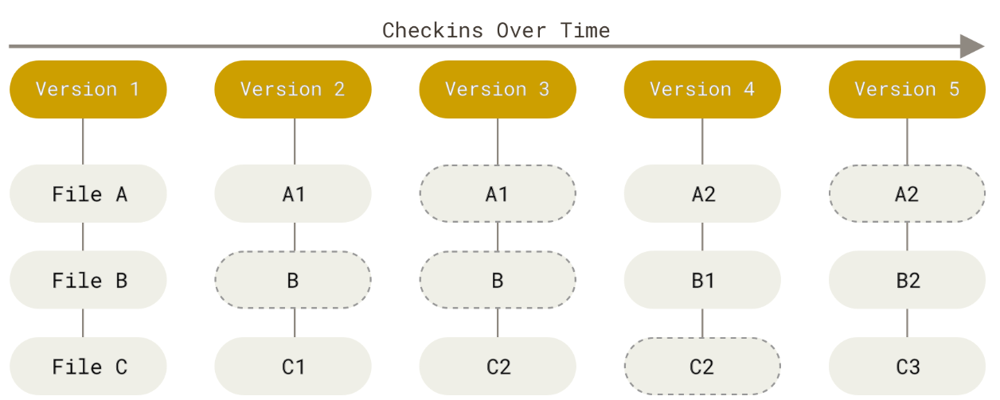
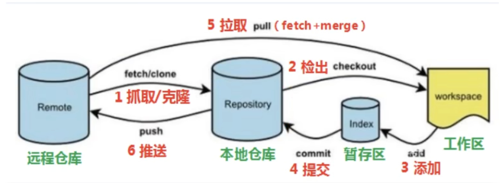
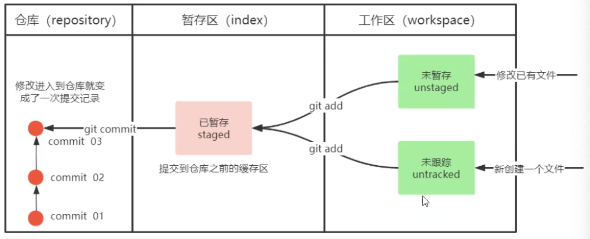
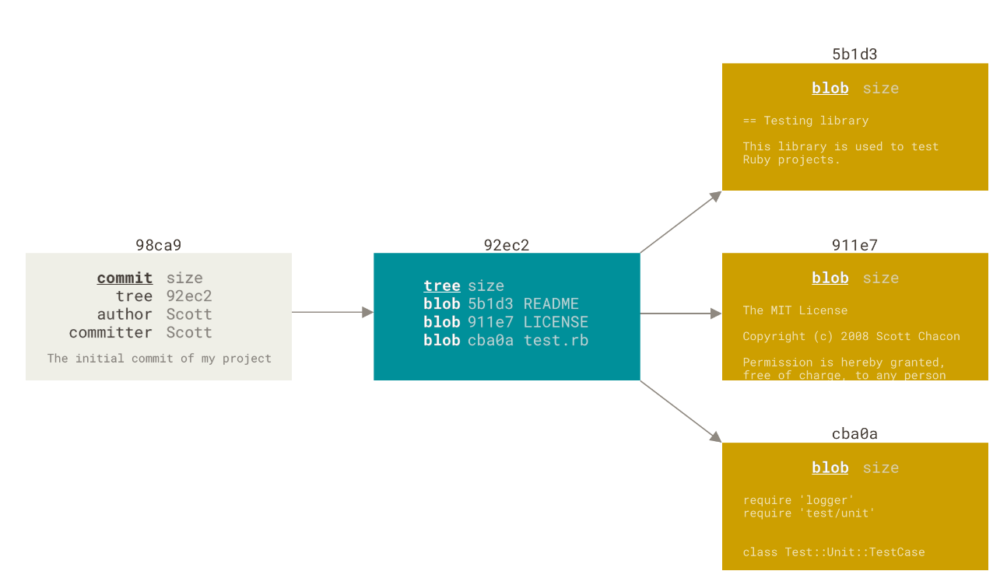
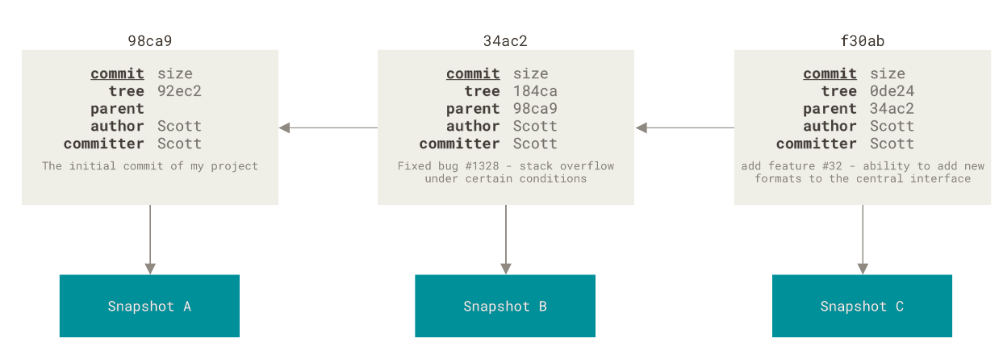
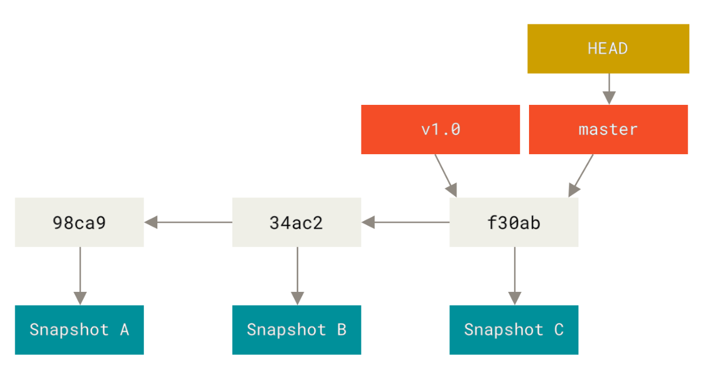
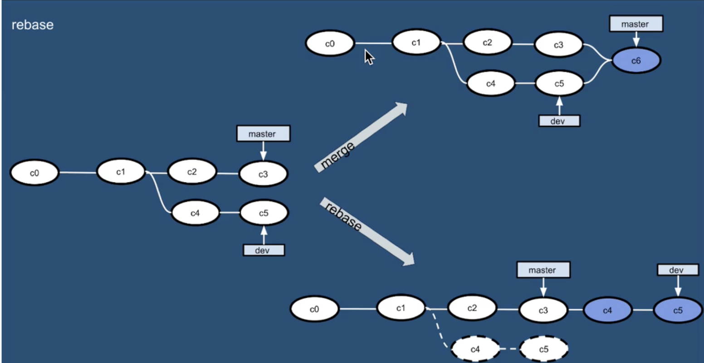
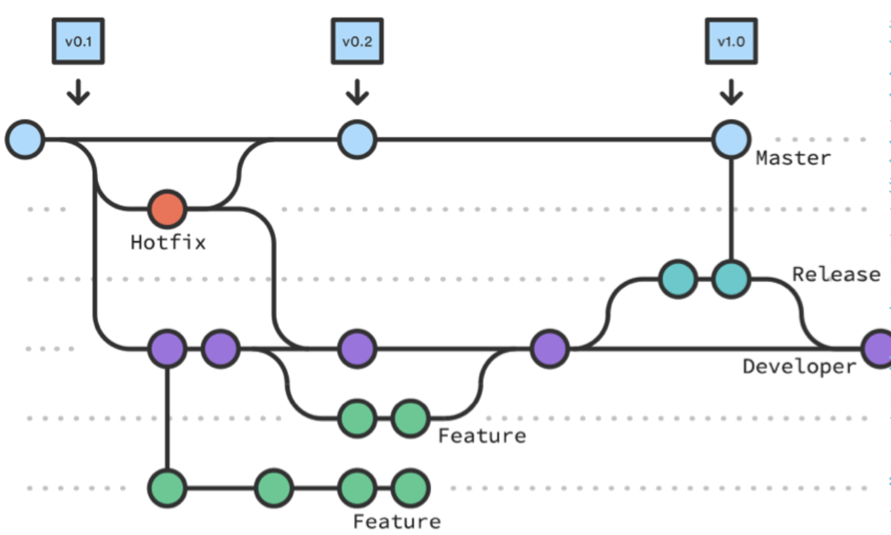

# 一、 概述

## 版本控制方式：

- 集中式版本控制工具: 版本库存放在中央服务器, 每个人从中央服务器中下载代码, 必须联网, 个人修改后提交到中央版本库, 如SVN和CVS
- 分布式版本控制工具: 无中央服务器, 每台电脑都有完整的版本库, 无需联网, 多人各自将个人修改推送给对方, 如Git

## 基本原理：

- 快照流：直接记录快照，而非比较差异，每次提交/保存时会对当时的全部文件创建快照并保存快照索引，若文件未修改则Git 不再重新存储该文件,而是只保留一个链接指向之前存储的文件
- 完整性：所有数据在存储前都计算校验和（用SHA-1散列机制），不可能在Git 不知情时更改任何内容
- 难删改：Git 操作几乎只往 Git 数据库中 **添加** 数据，几乎不会执行任何可能导致文件不可恢复的操作



## Git工作流程图






------


# 二、配置与帮助

## `git config`：设置控制Git外观和行为

git配置优先级：**local > globla > system**，局部配置会覆盖全局配置

`git config <key>`：检查某一配置

- `git config --show-origin <key>`：显示最终配置文件及变量

- `git config --global <key>`：指定操作**全局级别**的配置（.gitconfig文件），省略则默认为当前仓库的本地配置（.git/config文件）

- `git config --list`：列出**所有配置项**

- `git config --get <key>`：精确获得**单个配置项**的值，默认返回当前生效的配置（根据优先级）

  - 省略`--get`时行为等同于`--get`，但加上`--get`可读性高

- 用户信息：设置用户名和邮件，写入每一次提交中，不可更改，若使用`--global`则该命令只需运行一次，成为默认，不使用则只用于特定项目

  ```shell
  # 查看
  git config --global user.name
  git config --global usre.email
  
  # 设置
  git config --global user.name "NewName"
  git config --global usre.email "newEmail@server.com"
  ```

- 设置git命令别名：`git config --global alias.别名 实际执行的操作(无git前缀)`

  ```shell
  # eg.
  git config --global alias.co checkout
  git config --global alias.br branch
  git config --global alias.ci commit 	# 以后只需输入git ci
  git config --global alias.last 'log -1 HEAD'
  ```

- 其他常用配置：

  ```shell
  # git命令输出显示在终端
  git config --global core.pager cat
  
  # 文本编辑器
  git config --global core.editor
  
  # 解决输入汉字乱码问题
  git config --global i18n.commitEncoding utf-8
  git config --global i18n.logOutputEncoding utf-8
  ```

## 帮助：三种方式

```shell
git help <verb>
git <verb> --help # 或-h
man git-<verb>
```

## 系统配置

为常用指令及参数配置别名，在`vim ~/.zshrc` 添加如下内容后执行`source ~/.zshrc`

```shell
#用于输出git提交日志
alias git-log='git log --pretty=oneline --all --graph --abbrev-commit'
#用于输出当前目录所有文件及基本信息
alias ll='ls -al'
```


------


# 三、基础命令

## 获取本地仓库

- 本地目录转仓库：cd到空目录/项目目录, 执行`git init`，完成后生成一个`.git`子目录
- 从远端clone：`git clone <url>`，自动在当前目录初始化`.git`目录，默认与远端仓库同名，可用`git clone <url> myName`指定新目录名

## 检查文件状态：`git status`

`git status --short`或`-s`：以简洁方式输出，新增未add文件标记为`??`，新增add文件标记为`A`，修改过的文件标记为`M`

## 跟踪文件：`git add`

`git add 单文件/通配符`，文件从**工作区-->暂存区**，为文件计算校验和并将当前版本文件快照保存到git仓库，将校验和加入暂存区等待提交

- 常用`git add .`或`git add -A`将所有修改加入暂存区

- 配置**忽略列表**`.gitignore`：无需纳入Git管理且不希望出现在未跟踪文件列表的文件；在工作目录中创建.gitignore文件(名称固定), 列出要忽略的文件模式，一开始就要设置好

  - [专门生成.gitignore文件的网站](http://gitignore.io)
  - 格式规范：
    - 所有空行或者以 `#` 开头的行都会被 Git 忽略
    - 可以使用标准的 glob 模式匹配，它会递归地应用在整个工作区中
    - 匹配模式可以以`/`开头防止递归
    - 匹配模式可以以`/`结尾指定目录
    - 要忽略指定模式以外的文件或目录，可以在模式前加上叹号`!`取反

  ```plaintext
  # 忽略所有的 .a 文件 
  *.a  
  # 但跟踪所有的 lib.a,即便你在前面忽略了 .a 文件 
  !lib.a  
  # 只忽略当前目录下的 TODO 文件,而不忽略 subdir/TODO 
  /TODO  
  # 忽略任何目录下名为 build 的文件夹 
  build/  
  # 忽略 doc/notes.txt,但不忽略 doc/server/arch.txt 
  doc/*.txt  
  # 忽略 doc/ 目录及其所有子目录下的 .pdf 文件 
  doc/**/*.pdf
  ```

## 查看文件修改：`git diff`

以文件补丁的格式显示**行级**差异，输出:  +: 新增的行 -: 删除的行

`git diff --word-diff`

1. 查看**工作区与暂存区**的差异：`git diff`，默认

2. 查看暂存区与上次提交之间的差异：`git diff --cached/--staged`，staged和cached功能完全相同，但staged可读性好，符合现代习惯

3. 查看工作目录与最后一次提交之间的差异：`git diff HEAD`，包括已暂存和未暂存与HEAD间差异

4. 查看两个提交之间的差异：`git diff <commit1> <commit2>`

5. 查看两个分支之间的差异：`git diff <branch1> <branch2>`

选项`--word-diff`：显示**单词级**差异，新增单词用 `{+ +}` 包裹，删除单词用 `[- -]` 包裹

## 提交文件：`git commit [-m "注释内容"]`

文件从暂存区-->本地仓库

- 跳过使用暂存区：`git commit -a`/--all，自动把所有**已跟踪过的文件**(被git add过)暂存起来一并提交从而跳过`git add`，但不会提交未被git add过的文件
- 可使用`git aadd . && git commit`一次性提交所有变更（包括新文件）

原理：提交时git先计算每个子目录的校验和，将其保存为树对象，然后创造一个提交对象，包含指向树对象的指针、指向暂存内容快照的指针、指向父对象的指针、作者姓名邮箱、提交信息

首次提交对象及其树结构：



修改后提交，有了父对象：



## 移除文件：`git rm`

从Git中移除文件必须从已跟踪文件清单中移除，即从暂存区移除，然后**提交**

- `git rm <file>`：文件被完全删除，从git的跟踪列表（暂存区）和磁盘中移除，不可逆，只能通过`git checkout`或文件恢复工具找回
- `git rm --cached <file>`：仅停止跟踪，文件仍在磁盘中
- `git rm -f <file>`：文件已暂存且被修改时，需加-f强制删除；仅看**工作区与暂存区是否一致**
- `rm <file>`：系统命令，仅物理删除，需手动`git add/rm`更新 git状态
- 可使用`glob`模式：`git rm /*~`

## 移动/重命名文件：`git mv`

`git mv <from_path>/<file_name> <to_path>/<new_name>`

- 省略path时为只重命名：`git mv <name> <new_name>`

## 查看日志：`git log`

按时间先后顺序列出所有提交，单独页面中按q退出日志

- 限制格式参数：

  - `-p/--patch`：按补丁格式显示每个提交引入的差异

  - `--stat`：显示每次提交的文件修改**统计信息**

    - `--shortstat`：只显示`--stat`中最后的行数修改添加移除统计

  - `--name-only`：仅在提交信息后显示已修改的文件清单

  - `--name-status`：显示新增、修改、删除的文件清单

  - `--abbrev-commit`：仅显示 SHA-1 校验和所有 40 个字符中的前几个字符

  - `--relative-date`：使用较短的相对时间而不是完整格式显示日期(比如“2 weeks ago”)

  - `--decorate`：查看各个分支当前所指的对象

  - `--graph`：在日志旁以 ASCII 图形显示分支与合并历史

  - `--pretty`：使用其他格式显示历史提交信息

    - `--pretty=oneline`：每个提交一行，暗含了`--abbrev-commit`

    - `--pretty=short/full/fuller`：详略程度不一

    - `--pretty=format:""`：定义自己的格式，常和`--graph`结合使用，如`git log --pretty=format:"%h - %an, %ar : %s" --graph`

      | 占位符    | 说明                                       | 示例值或备注                    |
      | --------- | ------------------------------------------ | ------------------------------- |
      | `%H`      | 提交的完整哈希值（40位）                   | `e2d3a4b1c5d6...`               |
      | `%h`      | 提交的简写哈希值（前7位）                  | `a1b2c3d`                       |
      | `%T`      | 树的完整哈希值                             | `8e7d6f5g4h3...`                |
      | `%t`      | 树的简写哈希值                             | `1k2j3i4h`                      |
      | `%P`      | 父提交的完整哈希值（多个父提交用空格分隔） | `c3d4e5f6... d7e8f9g0...`       |
      | `%p`      | 父提交的简写哈希值                         | `b2c3d4e f5g6h7i`               |
      | `%an`     | 作者名字                                   | `John Doe`                      |
      | `%ae`     | 作者的电子邮件地址                         | `john@example.com`              |
      | `%ad`     | 作者修订日期（可通过 `--date=` 定制格式）  | `Thu Aug 3 10:33:01 2023 +0800` |
      | `%ar`     | 作者修订日期（相对时间格式）               | `2 weeks ago`                   |
      | `%cn`     | 提交者的名字                               | `Jane Smith`                    |
      | `%ce`     | 提交者的电子邮件地址                       | `jane@example.com`              |
      | `%cd`     | 提交日期（格式同 `%ad`）                   | `Thu Aug 3 10:33:01 2023 +0800` |
      | `%cr`     | 提交日期（相对时间格式）                   | `3 days ago`                    |
      | `%s`      | 提交说明（单行）                           | `Fix login bug`                 |
      | `%b`      | 提交说明的正文（多行）                     | 包含换行的详细描述              |
      | `%C(...)` | 设置颜色（如 `%C(red)text%Creset`）        | 需配合 `%Creset` 重置颜色       |
      | `%d`      | 引用名称（分支、标签，带括号）             | `(HEAD -> main)`                |
      | `%D`      | 引用名称（不带括号）                       | `HEAD -> main`                  |

- 限制长度参数：

  - `--all` : 显示所有分支
  - `-<n>`：n表示想要展示的提交数量
  - `--since`，`--after`：仅显示指定时间之后的提交
  - `--until`，`--before`：仅显示指定时间之前的提交
  - `--author`：仅显示作者匹配指定字符串的提交
  - `--committer`：仅显示提交者匹配指定字符串的提交
  - `--grep`：仅显示提交说明中包含指定字符串的提交
  - `-S`：仅显示添加或删除内容匹配指定字符串的提交
  - `--no-merges`：不显示合并提交

## 撤销操作

任何 **已提交** 的东西几乎总是可以恢复的（甚至那些被删除的分支中的提交或使用 --amend 选项覆盖的提交） 

任何未提交的东西丢失后很可能再也找不到了

### 修改提交：`git commit --amend`

**将暂存区的文件提交**，覆盖上一次的提交（最终只有一次提交），若两次提交之间无修改则只修改提交信息，本质是用新的提交替换旧的，旧的提交不会出现在仓库历史中

### `git reset`

移动分支指针并控制暂存区/工作区的状态，会重写本地历史，误用`--hard`后可用`git reflog`找回丢失的提交

若已推送到远程仓库，需强制推送`git push -f`（可能影响团队协作），建议使用`git revert`

**三功能**：

- 取消暂存（默认--mixed模式）：`git reset HEAD <file>`，将`<file>`从暂存区移出，但保留工作区的修改，即取消`git add`的效果，若省略`<file>`则取消所有文件的暂存
- 撤销提交：三种模式撤销本地提交，并决定是否保留修改
  - `--soft`：仅移动HEAD指针，保留暂存区和工作区的修改
  - `-- mixed`：默认，移动HEAD并重置暂存区，但保留工作区修改
  - `--hard`：丢弃提交和所有未提交的修改，慎用`git reset --hard <commit-hash>`
- 版本回退：将分支指针移动到任意历史提交，可选择保留/丢弃更改

### 生成反向提交，不修改历史：`git revert`

## 用暂存区恢复工作区：`git restore`

## 标签

与特定提交绑定, 需先提交

- 创：

  - 轻量标签: lightweight，只是对某提交的引用, 无附加信息, 类似书签，本质是只将校验和存储到一个文件中

    ```shell
    git commit -m "add ..."
    git tag <tag_name> [<commit-hash>] 	// 创建一个轻量标签并指向当前提交
    # eg.
    git tag v1.0
    ```

  - 附注标签: annotated，存储在git数据库中的完整对象，可被校验, 包含标签名、时间、标签者、邮件地址、标签说明，`-m`指定了存储在标签中的信息，必须有

    ```shell
    git commit -m "add ..."
    git tag -a <tag_name> [<commit-hash>] -m "Tag message"
    # eg.
    git tag -a v1.0 -m "Release version 1.0"
    ```

- 查：

  - `git tag`：列出所有标签，或`git tag -l/--list`
  - `git show <tag_name>`：查看指定标签的详细信息
  - 通配符查找：`git tag -l "pattern"`，此时的`-l`/`--list`不可省略，如只查看v1.8.5可用`git tag -l "v1.8.5*"`

- 改：

  - `git push origin <tag_name>`：推送单个标签，`git push`**默认不推送标签到远端**，必须显式推送标签
  - `git push origin --tags`：推送所有标签（所有不在远端的标签，不区分标签种类）
  - `git checkout <tag_name>`：检出特定标签对应的提交，进入HEAD分离状态
    - 常用`git checkout -b version2 v2.0.0`开创新分支修复旧版本的错误

- 删：`git tag -d <tag_name>`，不会从远端移除，需手动更新远端:

  - `git push <remote> :refs/tags/<tag_name>`，将冒号前的空值推送到远端标签名，达到删除效果
  - `git push origin --delete <tag_name>`，更直观


------


# 四、Remote

## 配置SSH公钥

SSH公钥理解为设备识别码，让设备有权限更改remote仓库

```bash
ssh-keygen -t rsa 		// 使用rsa算法，不断回车即可, 若已存在公钥, 则覆盖
```

显示公钥:

```bash
cat ~/.ssh/id_rsa.pub
```

复制公钥内容到网站, 添加成功后:

```bash
ssh -T git@gitee.com
```

输入yes, 连接成功

## 基础操作

- 增：`git remote add <别名> <URL>`，建立别名和远程的关联，使用别名即可操作远程仓库
- 删：`git remote remove <别名>`或`git remote rm <别名>`
- 改：
  - `git remote set-url <别名> <new_url>`
  - `git remote rename <old_name> <new_name>`，重命名
- 查：
  - `git remote show <别名>`，显示远程仓库的分支和跟踪关系
  - `git remote`：列出远程仓库的简写，origin是远程仓库的默认名称
  - `git remote -v`：列出远程仓库的别名/名称、URL、对应的操作类型（fetch/push）
  - `git ls-remote <remote>`：显式获得远程引用的完整列表

## 克隆

`git clone <url> [locla_path]`：若本地目录省略则自动生成一个新目录

选项`--depth=1`：克隆深度为1，只克隆最新的版本

## 抓取&拉取

- `git fetch`：`git fetch [remote] [local_branch]`，将仓库里的更新都抓取到本地, 但**不合并**，若不指定远端名和分支名, 则抓取所有分支（的引用）
  - 使用`git clone`时，自动将其添加为远程仓库并默认名为origin，使本地master分支跟踪远端的master分支
- `git pull`：查找当前分支所跟踪的远端分支，抓取数据后尝试合并
  - `git pull [remote] [local_branch]`，将远端的修改拉到本地并**自动合并**, 等同于`git fetch + git merge`，但自动merge会污染分支
  - `git pull --rebase [remote] [local_branch]`，更推荐，本地提交被搁置, 先将远程更新合并到本地, 再提交本地更新, 不会产生合并提交
    - 配置默认的`git pull`策略为`rebase`：`git config --global pull.rebase true`

## 推送

`git push`：

- `git push <remote> <branch>`，常用`git push origin master`，简写为`git push`
- `git push [-f] [--set-upstream] [<remote> [<local_br>]:[<remote_br>]]`
  - `-f`：强制覆盖
  - `--set-upstream`或`-u`，推送到远端, 同时建立与远端分支的关联关系, 让本地分支"跟踪"远端分支, 若当前分支已经和远端分支关联, 则可省略, 只有git push即可
  - 省略remote和local分支名则推送所有分支，只省略local_br则删除remote_br分支，只省略remote_br则在远端新建local_br分支
- 打标签推送：`git push --tags`推送所有本地标签，`git push origin <tag_name>`推送单个标签
- `git push --delete <branch>`：删除远端分支


---


# 五、分支

**分支**：本质是一个指向提交对象的可移动指针, 创建一个新分支实际上是在创建新指针, 它指向当前的提交, 在这个分支上进行新的提交, 这个指针会向前移动到最新的提交



**HEAD指针**: `HEAD`指向**当前分支**

- HEAD^n表示当前节点的第n个父节点，只有一个父节点时可省略n
- HEAD~n表示当前节点的第n代祖先节点
- `^`和`~`可组合使用，如`HEAD^2~3`

**HEAD分离状态**：HEAD分离状态下，修改提交不会使标签发生变化，新提交不属于任何分支且无法访问（除非通过commit-hash）

## 分支基本操作

- 创：`git branch <br_name> [base_br]`：基于base分支创建分支，但不会自动切换
- 查：
  - `git branch`或`git branch -a`：查看所有分支，带`*`前缀的为HEAD分支
  - `git branch -v`：查看每个分支的最后一次提交
  - `git branch -vv`：显示所有分支、跟踪分支及详细信息，ahead指本地提交未推送的数量，behind指远端有多少个提交未合并到本地，注意该命令统计值来自本地缓存的远端数据，未必最新，可在显示前更新数据：`git fetch --all; git branch -vv`
  - `git branch --merged [<br_name>]`：查看已经合并到指定分支的分支，省略指定分支时默认当前分支
  - `git branch --no-merged [<br_name>]`：查看所有包含未合并工作的分支，默认指当前分支
- 切换：分支切换会改变工作目录
  - `git checkout <br_name>`
  - `git switch <br_name>`
- 删：
  - `git branch -d <br_name>`：删除分支, 删前做各种检查
  - `git branch -D <br_name>`：强制删除, 不做任何检查

## 合并：`git merge`

`git merge <br_name>`：合并分支, 将分支中所有提交合并**到**当前分支中，自动合并不同行, 若同时修改了同一文件的同一行, 则需要手动解决冲突，然后再commit

- **快进模式**: `Fast Forward`, 一种合并策略, 如果顺着一个分支走下去能够到达另一个分支,那么合并两者的时候只会简单的将指针向前推进 (指针右移)，而不需要创建一个新的合并提交（因为没有需要解决的分歧）
- 强制创建一个合并提交, 不使用快进模式：`git merge --no-ff feature`，保留了分支的历史结构

合并后建议删除特性分支

`git mergetool`：启动一个合适的可视化合并工具

## 变基：`git rebase`

merge可使合并树变得混乱复杂, 变基使其更清晰



`git rebase <br_name>`：git计算当前分支和指定分支的差集, 将其应用到当前分支，之后当前分支的结点自动被清除

`git rebase <base_br> <topic_br>`：指定变基基准分支和目标分支，省去先检出到目标分支的步骤

`git rebase --onto <新父提交> <旧父提交> [目标分支]`：将变基应用到指定分支

- 新父提交为变基的基准点，可为分支名/提交/标签
- 旧父提交为变基的起始点，左开区间，不包含该提交本身，若为分支名则找出最新的共同祖先为起点
- 目标分支指定操作的分支，省略则默认对当前分支操作

变基的本质：丢弃现有提交，新建内容相同但实际上不同的提交（因此有风险）

**遵循准则**：若提交存在于本地仓库之外（即已推送），他人可能基于该提交进行开发，则不要变基

解决方式：不执行合并，而是用变基解决变基（执行`git rebase <remote>/<branch>`或`git pull --rebase`）


## 分支比较：`git cherry`

找出哪些提交在一个分支中存在但在另一个分支中不存在，重点在于比较提交的**存在性**, 而不是具体的文件差异(与git diff区别)

```bash
# upstream为要比较的基准分支, branch为要检查的分支
git cherry <upstream> <branch> 		 // 列出在branch中存在, 不在upstream中的提交
```

## 提交复制：`git cherry-pick`

从一个分支**选择性复制**特定的改动到另一个分支, 而无需合并整个分支的历史，可用于修复紧急问题（从另一分支挑出某修复提交快速应用到当前分支）或从废弃分支拯救有用的提交

```bash
git cherry-pick <commit-hash> 	// 挑选一个提交
git cherry-pick <commit1-hash> <commit2-hash> <commit3-hash> // 挑选多个, 枚举
git cherry-pick <commit1-hash>..<commit2-hash> 		// 挑选多个, 范围: 从1到2

// 若有冲突, 解决冲突后, 运行: 
git cherry-pick --continue

// 放弃当前的挑选
git cherry-pick --abort
```

会**创建一个新提交**, 为当前分支的最新提交，不会自动去重, 需避免重复挑选，不建议用于大量提交

## 远程分支

远程引用：对远程仓库的引用（指针），包括分支、标签等

远程跟踪分支：远程分支状态的引用，是无法移动的本地引用，可视为书签，标记远程仓库中该分支的位置，命名形式`<remote>/<branch>`

跟踪分支：与远程分支有直接关系的本地分支，git pull时可自动识别去哪个服务器抓取哪个分支

- `git checkout -b <br_name> <remote>/<remote_br>`：创建并切换分支，可同时设置跟踪分支
- `git checkout --track <remote>/<remote_br>`：更快捷，自动创建远程分支的**同名**本地分支**并切换**
- `git checkout <remote_br>`：两个条件：尝试检出的分支不存在&&有且只有一个同名远端分支，会创建同名跟踪分支并切换
- `git branch -u/--set-upstream-to <remote>/<remote_br>`：设置/修改跟踪的上游分支

简写方式引用上游分支：先设置好跟踪分支，用`@{upstream}`或`@{u}`引用，如可用`git merge @{u}`替代`git merge origin/master`

删除远端分支：`git push <remote> --delete <remote_br>`

------


# 六、分支管理策略

## github-flow/PR流程

1. 克隆代码或者更新代码到本地
   ​`git clone --depth=1 <路径>​`或者`git pull​`

2. 基于master分支创建并切换到自己的分支
   `​git branch -a​  git branch mybranch master​`

   `git checkout mybranch`或者`git switch mybranch`

3. 在自己的分支上做开发并实施版本控制: `git add`/ `git commit`

4. 把自己的工作成果同步到服务器上: `git push -u origin mybranch`

5. 在线发起合并请求, 将自己的工作成果合并到master分支, 如果Pull Request(Merge Request)(即PR流程)被接受那么工作成果就会出现在master分支上

   若合并代码时出现冲突无法自动合并, 应该先通过`git pull`将冲突代码拉到本地, 使用`git diff`查看哪些地方发生了冲突, 解决冲突一定不能凭主观臆断, 而是要当面沟通, 手动解决冲突以后重新提交代码, 将自己的分支push到服务器, 再次发起合并请求

## git-flow

两个长线分支: master、develop

三个短线分支: feature、release、hotfix



### 1. Production/master

生产分支/主分支, 最稳定的正式版本, 只能从其他分支合并, 不能直接修改, 每次更新都要打上版本号

> master分支只存放历史release版本的源代码, 即稳定的发布版本

### 2. develop

开发分支/集成分支, 从master创建, 包含所有要发布到下一个release的新功能, 主要合并其他分支内容, 到达一个稳定点准备好发布时, 从该点拉取一个预发分支并附上版本号

> develop分支用来整合feature分支, 存放最新开发版本的源代码

### 3. release/xxxx

预发分支/发布分支, 理解为"待发布"分支, 从develop创建, 专为测试、发布新版本开辟, 发布后合并到develop和Production分支中, 需要提交到服务器, 由测试工程师测试, 一个团队在做release分支时, 另一个团队可以接着开发下一版本

> release分支只做和发布有关的事, 如测试、修复bug、编写发布文档, 不会添加新特性

### 4. feature/xxxx

新功能分支, 从develop创建, 开发新功能, 同期并行开发但不同期上线, 开发完毕后合并至develop分支, 或效果不好直接丢弃

> feature分支只存在于开发者本地, 永远不会和master有接触

### 5. hotfix/xxxx

修复分支, 只能基于master创建, 从指定tag版本拉取hotfix分支进行紧急bug修复, 并附上版本号, 修复并测试后合并到develop和production分支, 不会打断开发分支, 使开发和修复并行、独立工作

### 其他分支

如test测试分支、pre预上线分支

```bash
// 应用
brew install git-flow 		// 安装git-flow
git flow init 		// 初始化

git flow feature start MyFeature 	// 从develop开启一个新分支
git flow feature publish MyFeature 	// push到远程
git flow feature pull origin MyFeature 
git flow feature finish MyFeature 	// 合并到develop, 删除feature, 切换回develop

git flow release start Release [Base]	// 创建一个release分支
git flow release publish Release
git flow release finish Release // 合并到master、develop, 打tag, 删除release
git push --tags 	// push到服务器

git flow hotfix start VERSION [BASENAME] 	// 开启一个hotfix分支
git flow hotfix finish VERSION 		// 结束一个hotfix分支, 合并到develop、master
```

APP推荐: Sourcetree

中文

---


# 七、GitHub

HTTP格式：`https://github.com/<user>/<project_name>`

SSH格式：`git@github.com:<user>/<project_name>`

“Merge” 按钮会做一个 “non-fast-forward” 合并( 即使可以快进合并)，并产生一个合并提交记录