# Mermaid 学习笔记

一种基于文本的图表和流程图绘制工具，使用简单的语法在 Markdown 文件中生成图表，支持多种图表类型，如流程图、时序图、甘特图等

------

## 📌 基本用法

```text
graph TD
  A[开始] --> B{判断}
  B -->|是| C[操作1]
  B -->|否| D[操作2]
```

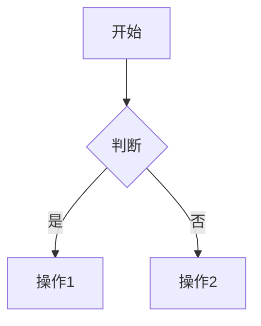

- `graph TD` 表示流程图，方向是 Top → Down（上 → 下）
- `graph LR` 表示方向是 Left → Right（左 → 右）

------

## 🧱 常用图类型

### 1. 流程图（Flowchart）

```text
graph TD
  A[节点A] --> B(节点B)
  B --> C{条件}
  C -->|选项1| D[结果1]
  C -->|选项2| E[结果2]
```

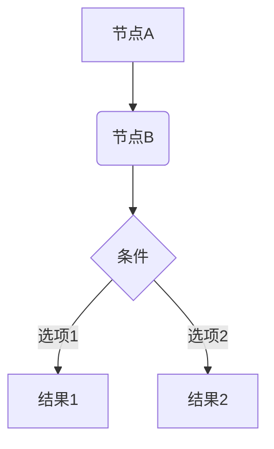

**节点形状**

| 语法       | 渲染含义            |
| ---------- | ------------------- |
| `[文本]`   | 矩形节点            |
| `(文本)`   | 圆角矩形            |
| `{文本}`   | 判断/分支节点       |
| `((文本))` | 圆形（终止/子流程） |

------

### 2. 时序图（Sequence Diagram）

```text
sequenceDiagram
  participant A as 用户
  participant B as 系统
  A->>B: 请求
  B-->>A: 响应
```

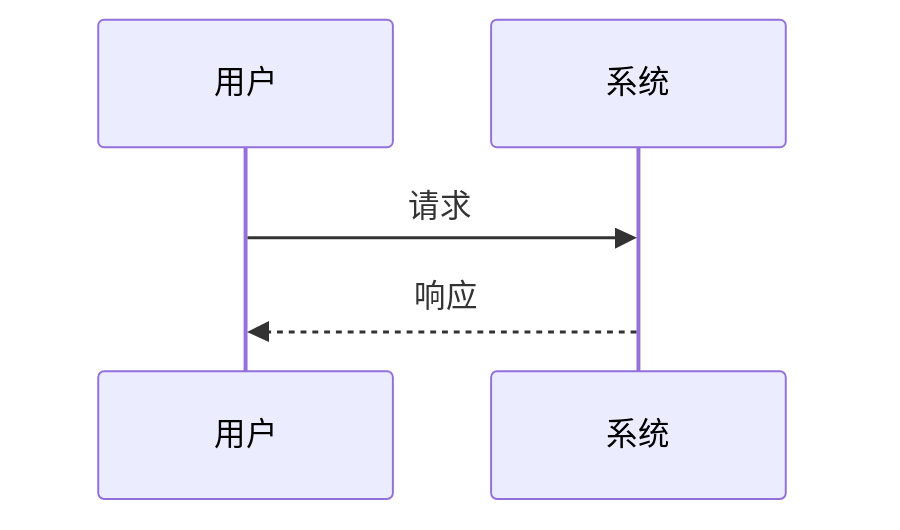

**常用语法**

| 语法           | 含义            |
| -------------- | --------------- |
| `participant`  | 定义角色/参与者 |
| `->>`实线箭头  | 同步消息        |
| `-->>`虚线箭头 | 异步/返回       |

---

### 3. 类图（Class Diagram）

```text
classDiagram
  class Animal {
    +String name
    +eat()
  }
  class Dog {
    +bark()
  }
  Animal <|-- Dog
```

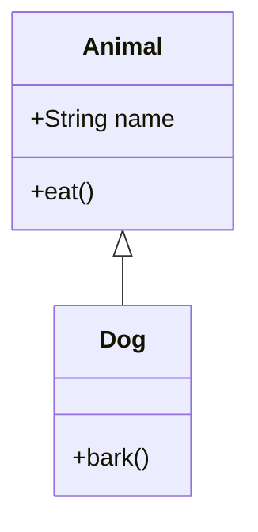

**关系说明**

| 语法   | 含义 |
| ------ | ---- |
| `<|--` | 继承 |
| `*--`  | 组合 |
| `o--`  | 聚合 |
| `--`   | 关联 |
| `<..`  | 实现 |

------

### 4. 状态图（State Diagram）

```text
stateDiagram-v2
  [*] --> 关闭
  关闭 --> 打开
  打开 --> 关闭
```

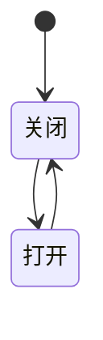

**说明**

- `[*]`：初始或结束状态
- `-->`：状态转移箭头

------

### 5. 甘特图（Gantt Chart）

```text
gantt
  title 项目计划
  dateFormat  YYYY-MM-DD
  section 任务
  设计       :a1, 2024-01-01, 7d
  开发       :a2, after a1, 10d
  测试       :a3, after a2, 5d
```


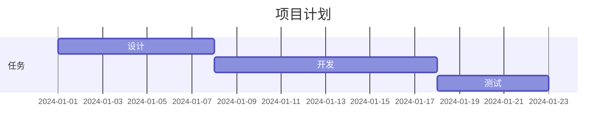

**关键语法**

- `section`：任务分类标题
- `dateFormat`：日期格式设定
- `after a1`：任务依赖顺序

------

## 6. 实体关系图（ER Diagram）

Mermaid 目前支持基本的 ER 图建模语法，用于描述实体（Entity）、属性（Attributes）与实体间关系

```text
erDiagram
  CUSTOMER ||--o{ ORDER : places
  ORDER ||--|{ LINE_ITEM : contains
  CUSTOMER {
    string name
    string address
  }
  ORDER {
    int id
    date orderDate
  }
  LINE_ITEM {
    int quantity
    float price
  }
```

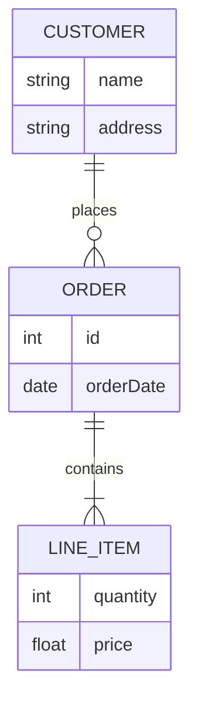

**关系符号说明**

| 语法               | 含义   |
| ------------------ | ------ |
| `||--||`           | 一对一 |
| `||--o{`或`||--|{` | 一对多 |
| `|{--||`           | 多对一 |
| `|{--o{`           | 多对多 |

------

## 7. 饼图（Pie Chart）

适合用于展示简单占比数据

```text
pie
  title 用户设备分布
  "桌面端" : 45
  "移动端" : 40
  "平板" : 15
```


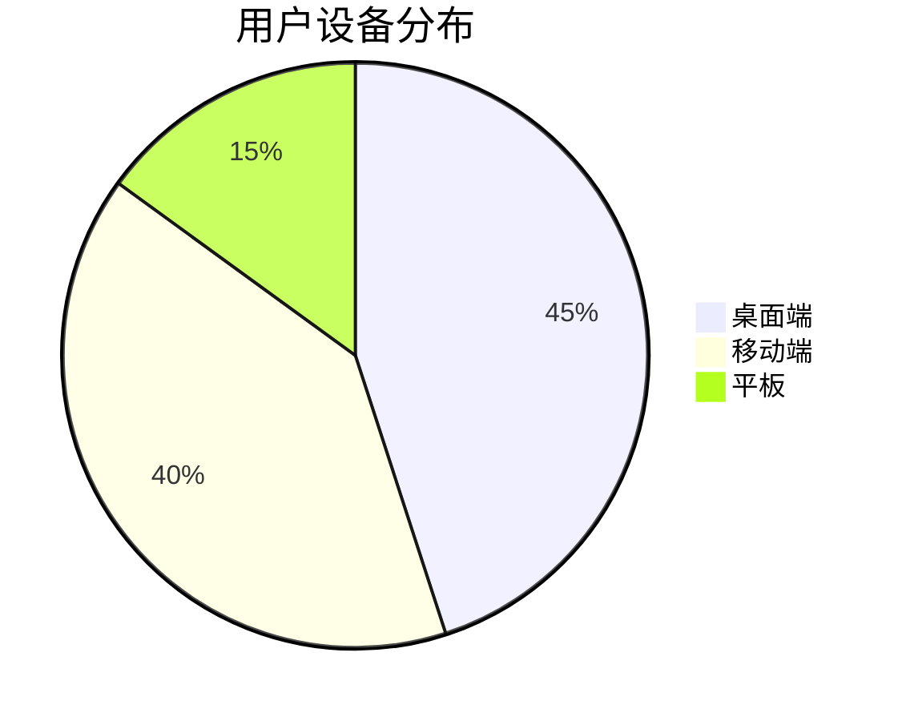

------

## 8. 样式技巧（Class/Style）

### 节点样式（`classDef + :::class`）

```text
graph TD
  A[开始]:::Start
  B{判断}:::condition
  C[结束]:::End

classDef Start fill:#cfc,stroke:#0c0,stroke-width:2px;
classDef condition fill:#ffc,stroke:#aa0,stroke-width:2px;
classDef End fill:#fcc,stroke:#c00,stroke-width:2px;
```

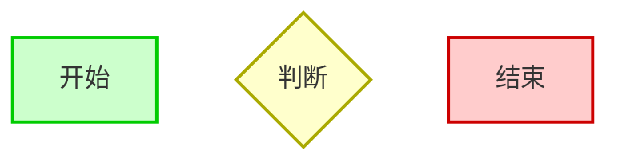

------

### 内联样式（不推荐但可用）

```text
graph TD
  A[绿色节点] --> B[红色节点]
  style A fill:#cfc,stroke:#0c0,stroke-width:2px
  style B fill:#fcc,stroke:#c00,stroke-width:2px
```

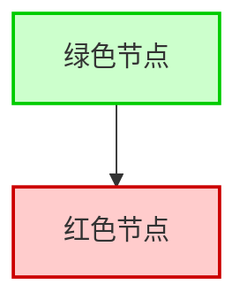

------

### 布局调整（方向）

```plaintext
graph TD      ← Top-Down（默认）
graph LR      ← Left-Right
graph BT      ← Bottom-Top
graph RL      ← Right-Left
```

------

### 子图结构（Subgraph）

```text
graph LR
  subgraph 集群1
    A --> B
  end
  B --> C
```

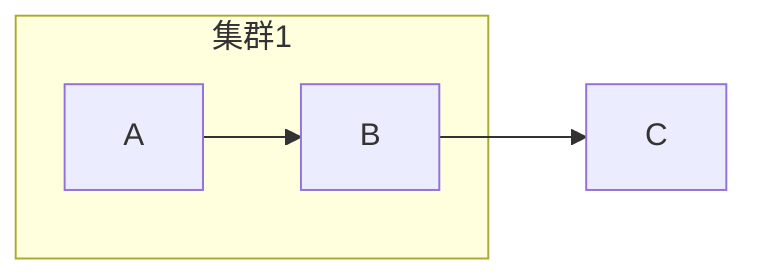

## 可组合技巧

### 使用子图+样式

```text
graph TD
  subgraph 模块A
    A1[输入]:::input --> A2[处理]:::process
  end
  subgraph 模块B
    B1[处理]:::process --> B2[输出]:::output
  end
  A2 --> B1

classDef input fill:#e0f7fa,stroke:#00acc1
classDef process fill:#fff9c4,stroke:#fbc02d
classDef output fill:#fce4ec,stroke:#ec407a
```

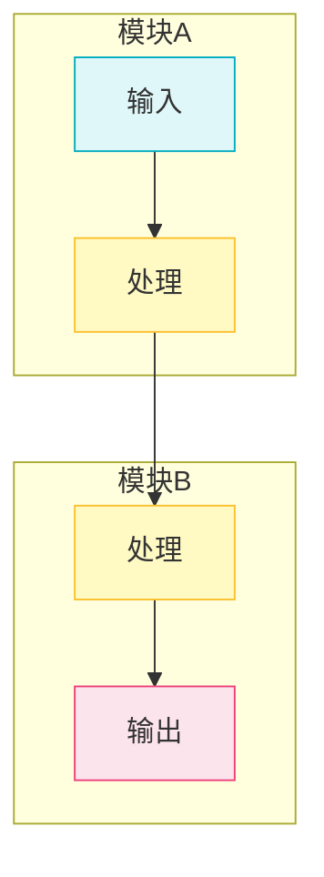